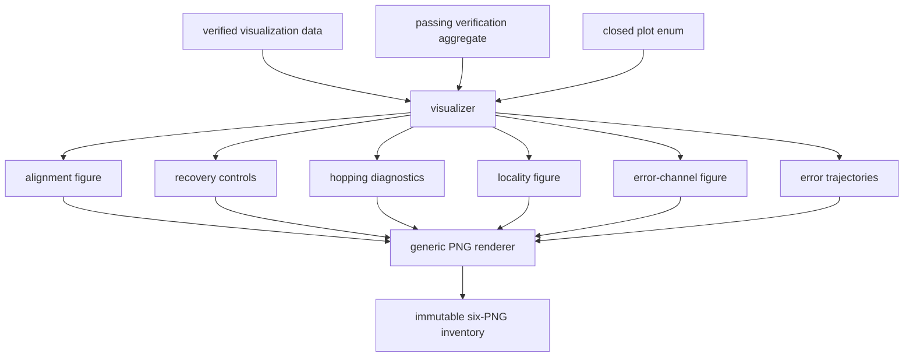

# Schematic

```mermaid
flowchart TD
    P[verified visualization data] --> V[visualizer]
    Q[passing verification aggregate] --> V
    E[closed plot enum] --> V
    V --> A[alignment figure]
    V --> X[recovery controls]
    V --> H[hopping diagnostics]
    V --> L[locality figure]
    V --> C[error-channel figure]
    V --> T[error trajectories]
    A --> R[generic PNG renderer]
    X --> R
    H --> R
    L --> R
    C --> R
    T --> R
    R --> I[immutable six-PNG inventory]
```
