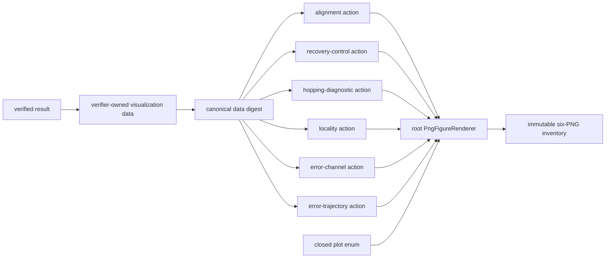

# Visualization schematic

```mermaid
flowchart LR
    R[verified result] --> P[verifier-owned visualization data]
    P --> D[canonical data digest]
    D --> A[alignment action]
    D --> X[recovery-control action]
    D --> H[hopping-diagnostic action]
    D --> L[locality action]
    D --> C[error-channel action]
    D --> T[error-trajectory action]
    A --> G[root PngFigureRenderer]
    X --> G
    H --> G
    L --> G
    C --> G
    T --> G
    E[closed plot enum] --> G
    G --> I[immutable six-PNG inventory]
```
