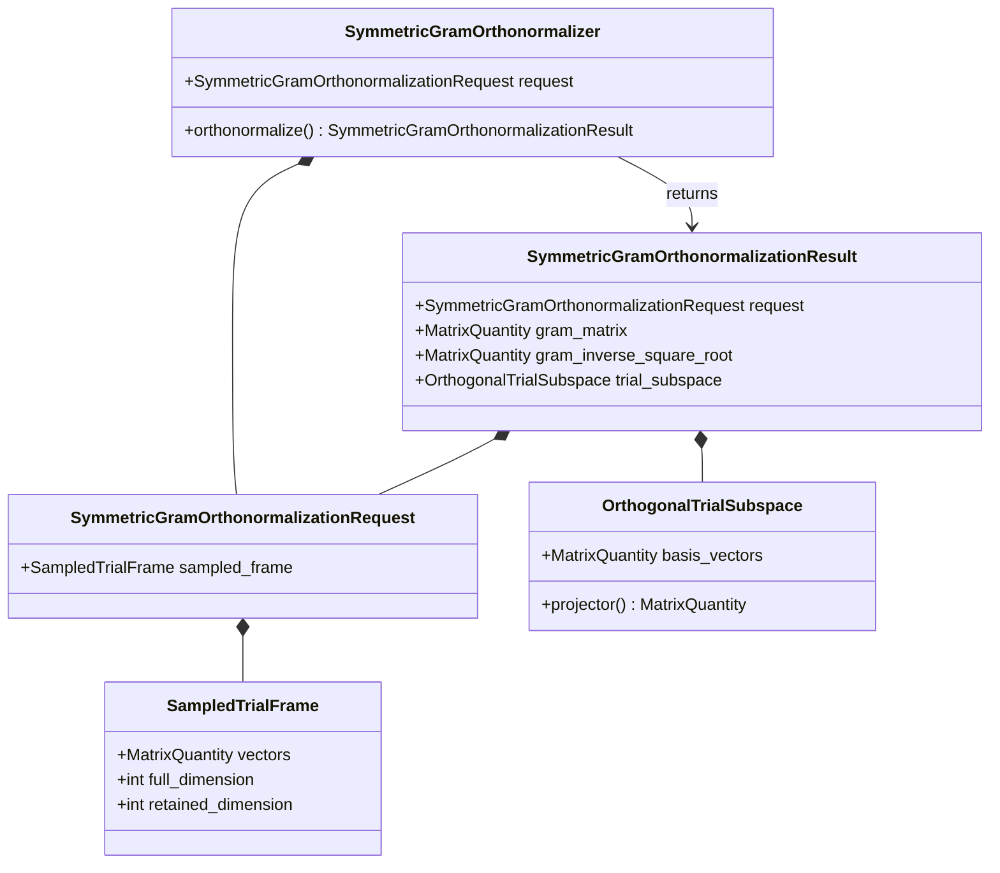
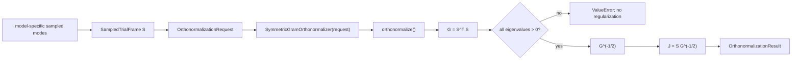
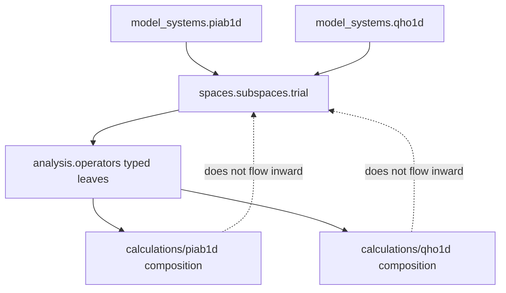

# Schematics

## Class relationships

```mermaid
classDiagram
    class SampledTrialFrame {
        +MatrixQuantity vectors
        +int full_dimension
        +int retained_dimension
    }
    class OrthogonalTrialSubspace {
        +MatrixQuantity basis_vectors
        +projector() MatrixQuantity
    }
    class SymmetricGramOrthonormalizationRequest {
        +SampledTrialFrame sampled_frame
    }
    class SymmetricGramOrthonormalizationResult {
        +SymmetricGramOrthonormalizationRequest request
        +MatrixQuantity gram_matrix
        +MatrixQuantity gram_inverse_square_root
        +OrthogonalTrialSubspace trial_subspace
    }
    class SymmetricGramOrthonormalizer {
        +SymmetricGramOrthonormalizationRequest request
        +orthonormalize() SymmetricGramOrthonormalizationResult
    }

    SymmetricGramOrthonormalizationRequest *-- SampledTrialFrame
    SymmetricGramOrthonormalizer *-- SymmetricGramOrthonormalizationRequest
    SymmetricGramOrthonormalizer --> SymmetricGramOrthonormalizationResult : returns
    SymmetricGramOrthonormalizationResult *-- SymmetricGramOrthonormalizationRequest
    SymmetricGramOrthonormalizationResult *-- OrthogonalTrialSubspace
```

## Request-bound numerical flow

```mermaid
flowchart LR
    producer["model-specific sampled modes"] --> frame["SampledTrialFrame S"]
    frame --> request["OrthonormalizationRequest"]
    request --> action["SymmetricGramOrthonormalizer(request)"]
    action --> method["orthonormalize()"]
    method --> gram["G = S^T S"]
    gram --> gate{"all eigenvalues > 0?"}
    gate -- no --> reject["ValueError; no regularization"]
    gate -- yes --> invsqrt["G^(-1/2)"]
    invsqrt --> injection["J = S G^(-1/2)"]
    injection --> result["OrthonormalizationResult"]
```

## Ownership flow

```mermaid
flowchart TB
    piab["model_systems.piab1d"] --> leaf["spaces.subspaces.trial"]
    qho["model_systems.qho1d"] --> leaf
    leaf --> analysis["analysis.operators typed leaves"]
    analysis --> piabcalc["calculations/piab1d composition"]
    analysis --> qhocalc["calculations/qho1d composition"]

    piabcalc -. "does not flow inward" .-> leaf
    qhocalc -. "does not flow inward" .-> leaf
```
