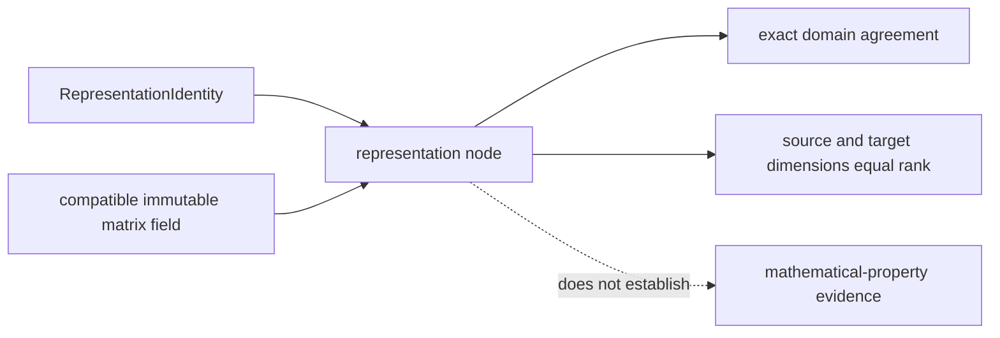
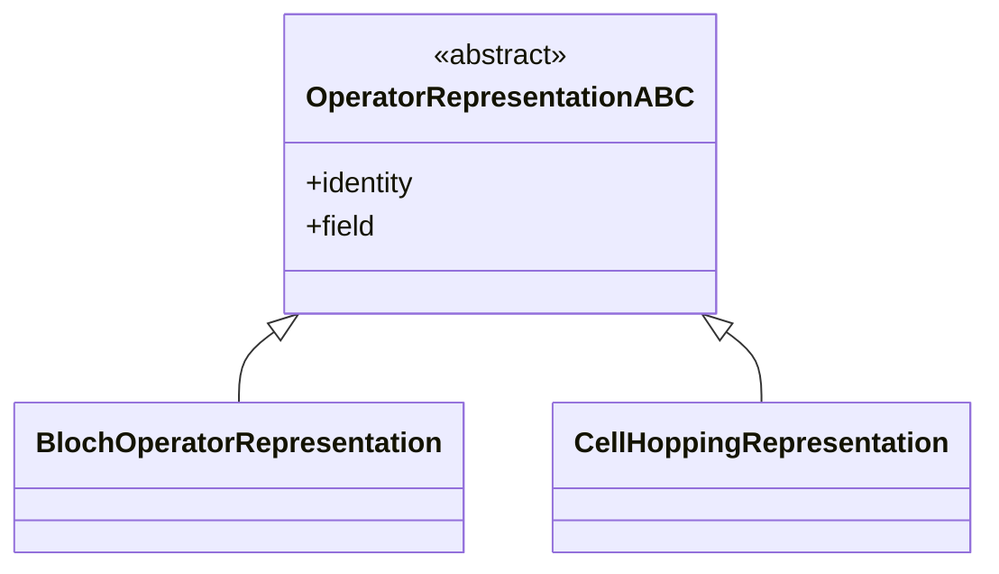
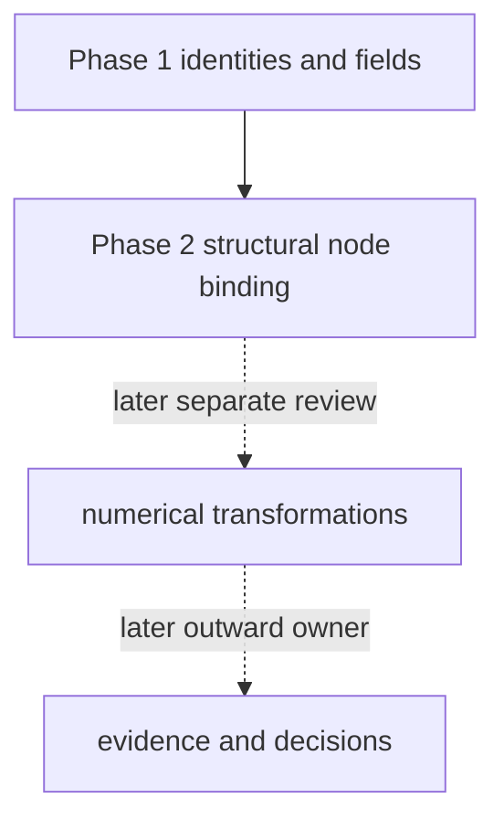

# Phase 2 schematics

## Proposed node binding

```mermaid
flowchart LR
    identity["RepresentationIdentity"] --> node["representation node"]
    field["compatible immutable matrix field"] --> node
    node --> domainCheck["exact domain agreement"]
    node --> rankCheck["source and target dimensions equal rank"]
    node -. "does not establish" .-> evidence["mathematical-property evidence"]
```

## Proposed type structure

```mermaid
classDiagram
    class OperatorRepresentationABC {
        <<abstract>>
        +identity
        +field
    }
    OperatorRepresentationABC <|-- BlochOperatorRepresentation
    OperatorRepresentationABC <|-- CellHoppingRepresentation
```

## Phase boundary

```mermaid
flowchart TD
    phase1["Phase 1 identities and fields"] --> phase2["Phase 2 structural node binding"]
    phase2 -. "later separate review" .-> operations["numerical transformations"]
    operations -. "later outward owner" .-> evidence["evidence and decisions"]
```
