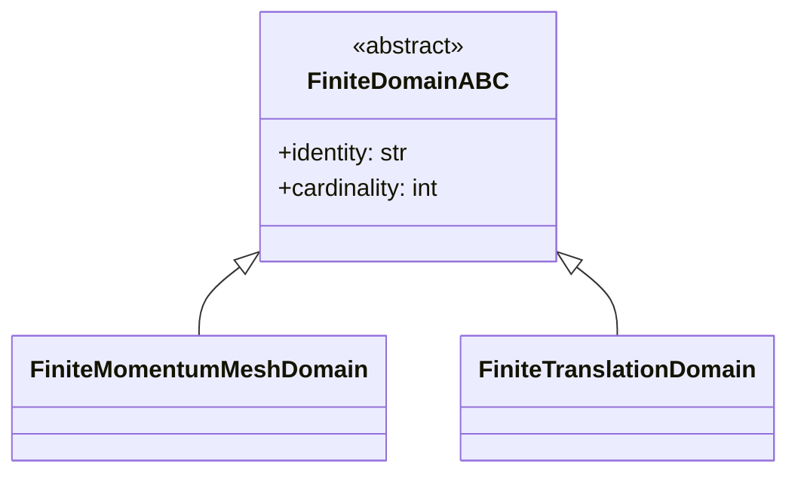

# Schematic

```mermaid
classDiagram
    class FiniteDomainABC {
        <<abstract>>
        +identity: str
        +cardinality: int
    }
    FiniteDomainABC <|-- FiniteMomentumMeshDomain
    FiniteDomainABC <|-- FiniteTranslationDomain
```
