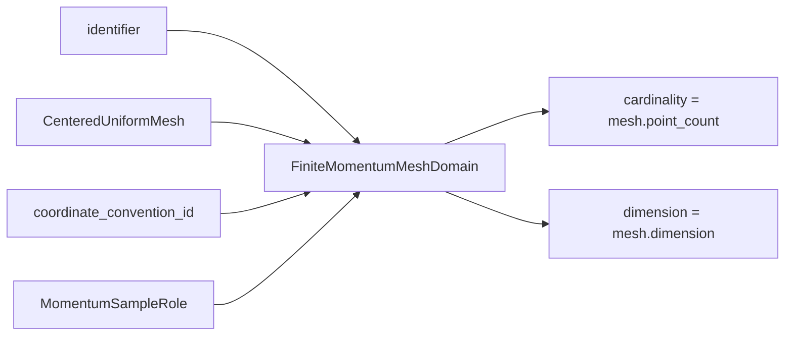

# Schematic

```mermaid
flowchart LR
    id["identifier"] --> domain["FiniteMomentumMeshDomain"]
    mesh["CenteredUniformMesh"] --> domain
    convention["coordinate_convention_id"] --> domain
    role["MomentumSampleRole"] --> domain
    domain --> count["cardinality = mesh.point_count"]
    domain --> dimension["dimension = mesh.dimension"]
```
