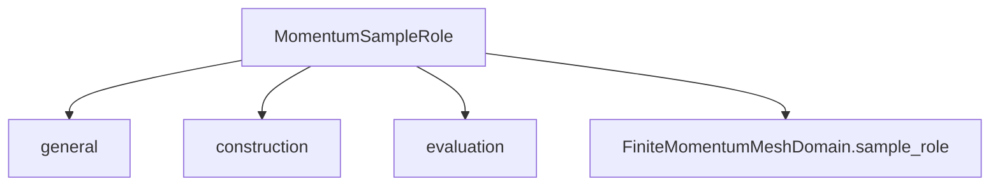

# Schematic

```mermaid
flowchart TD
    role["MomentumSampleRole"] --> general["general"]
    role --> construction["construction"]
    role --> evaluation["evaluation"]
    role --> domain["FiniteMomentumMeshDomain.sample_role"]
```
