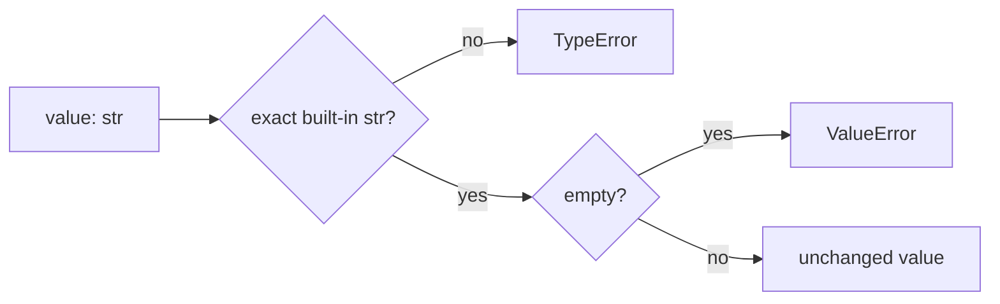

# Schematic

```mermaid
flowchart LR
    value["value: str"] --> exact{"exact built-in str?"}
    exact -->|no| typeError["TypeError"]
    exact -->|yes| empty{"empty?"}
    empty -->|yes| valueError["ValueError"]
    empty -->|no| retained["unchanged value"]
```
