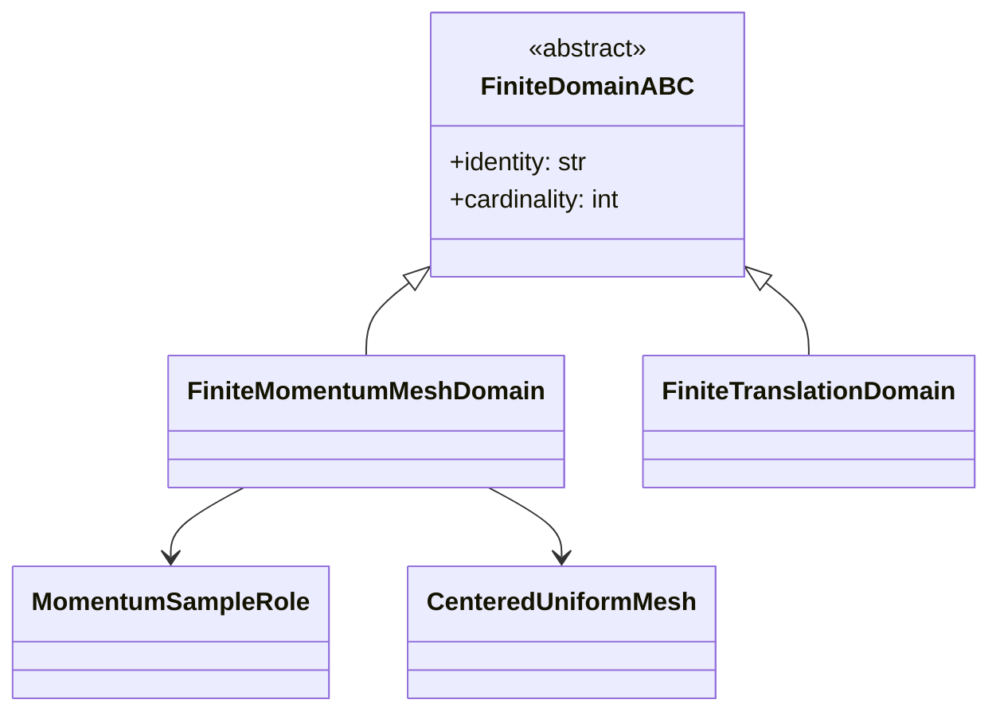

# Schematic

```mermaid
classDiagram
    class FiniteDomainABC {
        <<abstract>>
        +identity: str
        +cardinality: int
    }
    class FiniteMomentumMeshDomain
    class FiniteTranslationDomain
    class MomentumSampleRole
    FiniteDomainABC <|-- FiniteMomentumMeshDomain
    FiniteDomainABC <|-- FiniteTranslationDomain
    FiniteMomentumMeshDomain --> MomentumSampleRole
    FiniteMomentumMeshDomain --> CenteredUniformMesh
```
