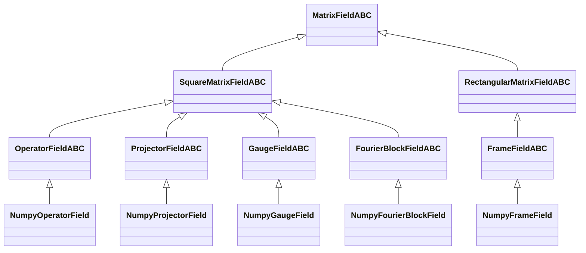

# Schematic

```mermaid
classDiagram
    MatrixFieldABC <|-- SquareMatrixFieldABC
    MatrixFieldABC <|-- RectangularMatrixFieldABC
    SquareMatrixFieldABC <|-- OperatorFieldABC
    SquareMatrixFieldABC <|-- ProjectorFieldABC
    SquareMatrixFieldABC <|-- GaugeFieldABC
    SquareMatrixFieldABC <|-- FourierBlockFieldABC
    RectangularMatrixFieldABC <|-- FrameFieldABC
    OperatorFieldABC <|-- NumpyOperatorField
    ProjectorFieldABC <|-- NumpyProjectorField
    GaugeFieldABC <|-- NumpyGaugeField
    FrameFieldABC <|-- NumpyFrameField
    FourierBlockFieldABC <|-- NumpyFourierBlockField
```
