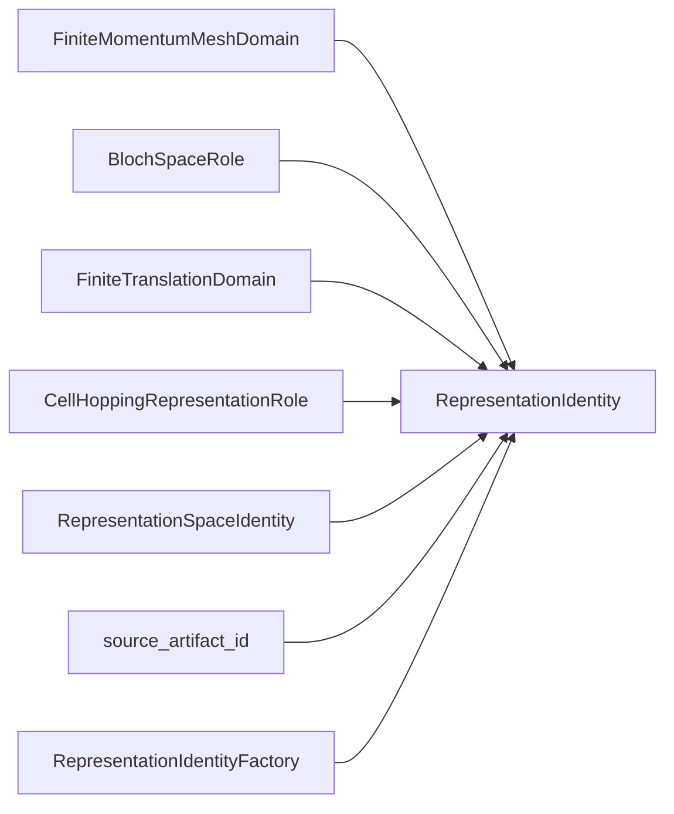

# Schematic

```mermaid
flowchart LR
    momentum["FiniteMomentumMeshDomain"] --> identity["RepresentationIdentity"]
    bloch["BlochSpaceRole"] --> identity
    translation["FiniteTranslationDomain"] --> identity
    hopping["CellHoppingRepresentationRole"] --> identity
    space["RepresentationSpaceIdentity"] --> identity
    source["source_artifact_id"] --> identity
    factory["RepresentationIdentityFactory"] --> identity
```
