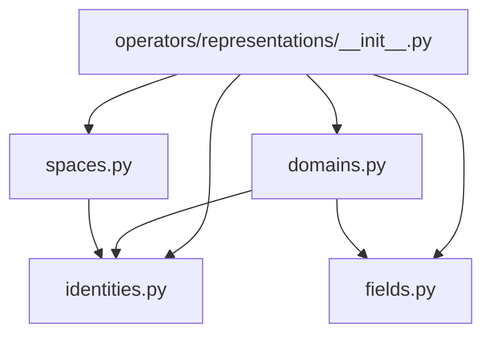
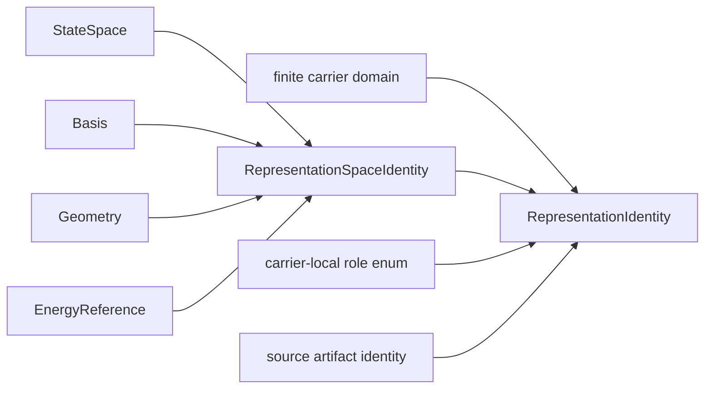
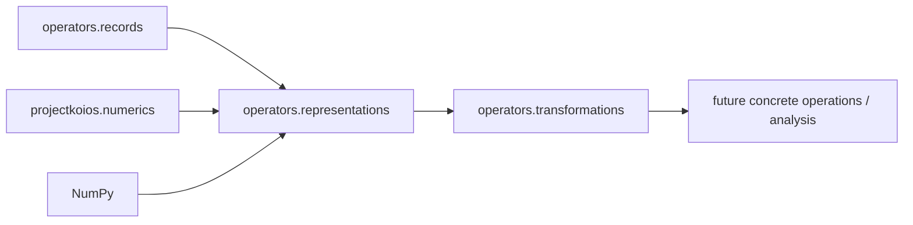
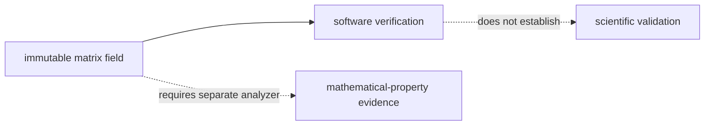

# Schematics

## Source modules

```mermaid
flowchart TD
    package["operators/representations/__init__.py"]
    domains["domains.py"]
    spaces["spaces.py"]
    identities["identities.py"]
    fields["fields.py"]

    package --> domains
    package --> spaces
    package --> identities
    package --> fields
    domains --> identities
    spaces --> identities
    domains --> fields
```

## Identity composition

```mermaid
flowchart LR
    state["StateSpace"] --> space["RepresentationSpaceIdentity"]
    basis["Basis"] --> space
    geometry["Geometry"] --> space
    energy["EnergyReference"] --> space
    domain["finite carrier domain"] --> identity["RepresentationIdentity"]
    space --> identity
    role["carrier-local role enum"] --> identity
    source["source artifact identity"] --> identity
```

## Dependency direction

```mermaid
flowchart LR
    records["operators.records"] --> reps["operators.representations"]
    numerics["projectkoios.numerics"] --> reps
    numpy["NumPy"] --> reps
    reps --> transforms["operators.transformations"]
    transforms --> outward["future concrete operations / analysis"]
```

## Evidence boundary

```mermaid
flowchart LR
    field["immutable matrix field"] --> tests["software verification"]
    field -. "requires separate analyzer" .-> property["mathematical-property evidence"]
    tests -. "does not establish" .-> science["scientific validation"]
```
