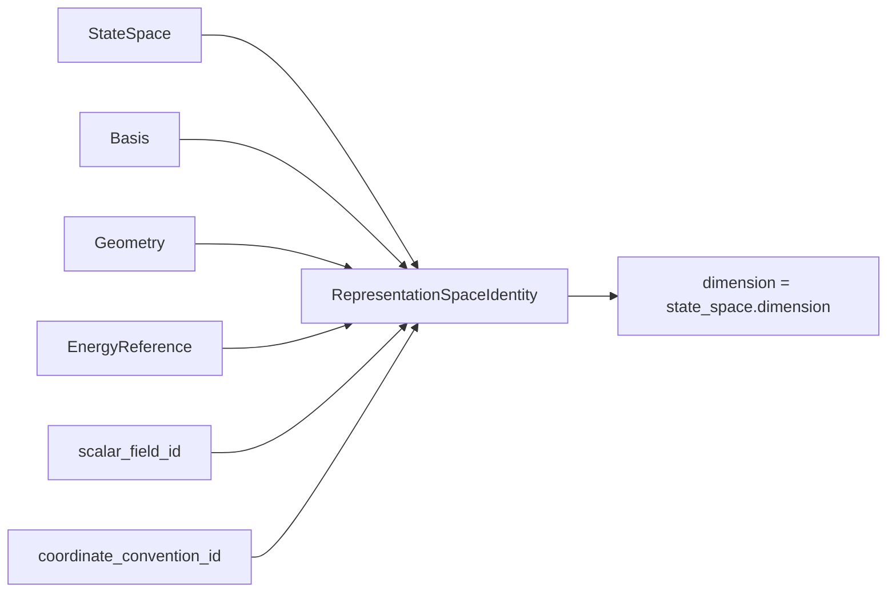

# Schematic

```mermaid
flowchart LR
    state["StateSpace"] --> space["RepresentationSpaceIdentity"]
    basis["Basis"] --> space
    geometry["Geometry"] --> space
    energy["EnergyReference"] --> space
    scalar["scalar_field_id"] --> space
    coordinates["coordinate_convention_id"] --> space
    space --> dimension["dimension = state_space.dimension"]
```
