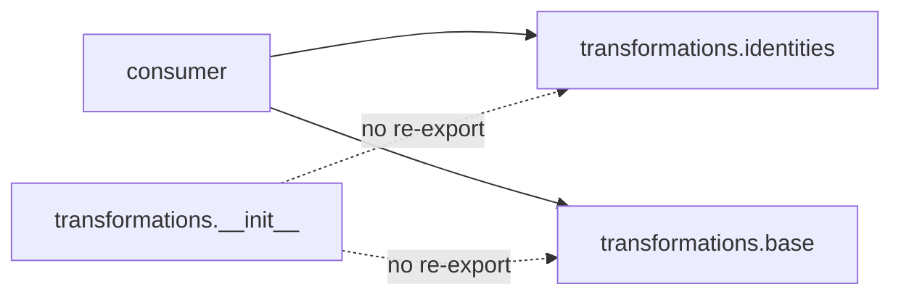

# Schematic

```mermaid
flowchart LR
    consumer["consumer"] --> identity["transformations.identities"]
    consumer --> base["transformations.base"]
    initializer["transformations.__init__"] -. "no re-export" .-> identity
    initializer -. "no re-export" .-> base
```
