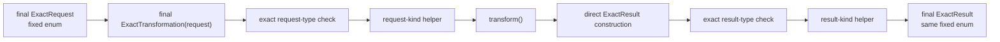

# Schematic

```mermaid
flowchart LR
    request["final ExactRequest\nfixed enum"] --> bind["final ExactTransformation(request)"]
    bind --> requestType["exact request-type check"]
    requestType --> requestKind["request-kind helper"]
    requestKind --> transform["transform()"]
    transform --> direct["direct ExactResult construction"]
    direct --> resultType["exact result-type check"]
    resultType --> resultKind["result-kind helper"]
    resultKind --> result["final ExactResult\nsame fixed enum"]
```
