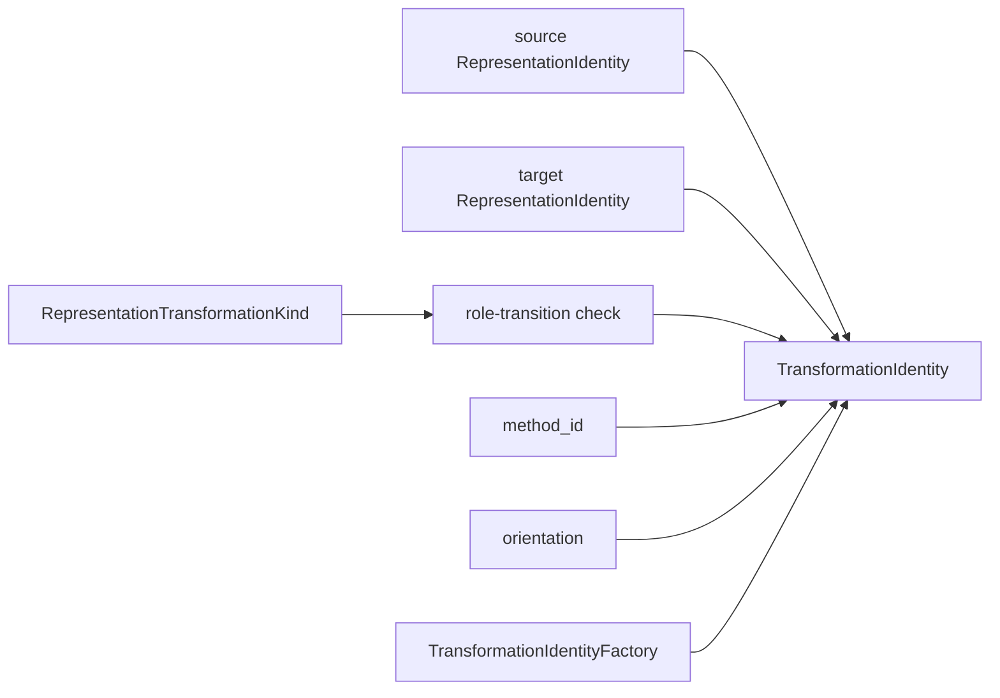

# Schematic

```mermaid
flowchart LR
    source["source RepresentationIdentity"] --> edge["TransformationIdentity"]
    target["target RepresentationIdentity"] --> edge
    kind["RepresentationTransformationKind"] --> roles["role-transition check"]
    roles --> edge
    method["method_id"] --> edge
    orientation["orientation"] --> edge
    factory["TransformationIdentityFactory"] --> edge
```
