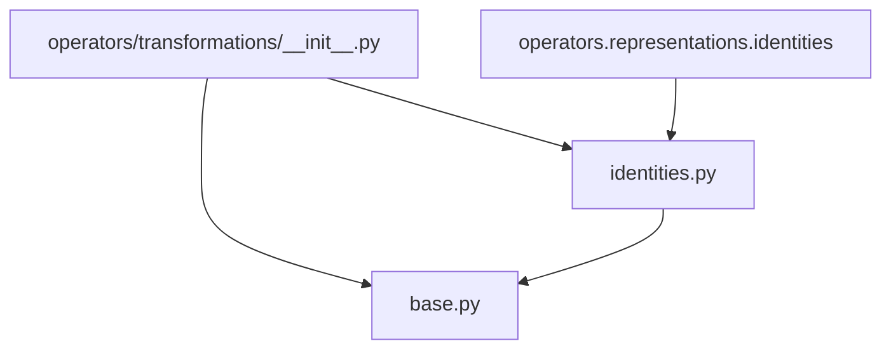
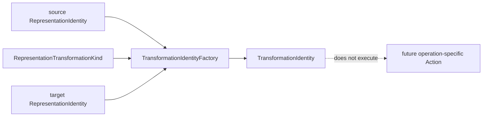
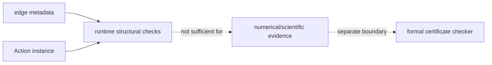

# Schematics

## Source modules

```mermaid
flowchart TD
    package["operators/transformations/__init__.py"]
    identities["identities.py"]
    base["base.py"]
    reps["operators.representations.identities"]

    package --> identities
    package --> base
    reps --> identities
    identities --> base
```

## Identity versus execution

```mermaid
flowchart LR
    source["source RepresentationIdentity"] --> factory["TransformationIdentityFactory"]
    kind["RepresentationTransformationKind"] --> factory
    target["target RepresentationIdentity"] --> factory
    factory --> edge["TransformationIdentity"]
    edge -. "does not execute" .-> action["future operation-specific Action"]
```

## Nominal concrete-triple contract

```mermaid
flowchart LR
    request["exact final Request + fixed kind"] --> bind["final Transformation(request)"]
    bind --> exactRequest["exact request-type check"]
    exactRequest --> requestKind["request-kind helper"]
    requestKind --> operation["concrete transform()"]
    operation --> direct["direct exact Result construction"]
    direct --> exactResult["exact result-type check"]
    exactResult --> resultKind["result-kind helper"]
    resultKind --> result["exact final Result + same fixed kind"]
```

## Proof boundary

```mermaid
flowchart LR
    edge["edge metadata"] --> software["runtime structural checks"]
    action["Action instance"] --> software
    software -. "not sufficient for" .-> evidence["numerical/scientific evidence"]
    evidence -. "separate boundary" .-> formal["formal certificate checker"]
```
