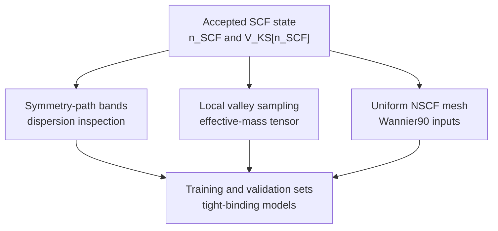

# Bulk-Silicon Downstream Sampling Plan

**Status:** Accepted tutorial-to-production handoff. The SCF and matching bands
Tasks are closed as human-accepted tutorial reproductions under bounded claims.
This page does not activate a Task, authorize execution, select production
parameters, or establish numerical verification or scientific validation.

The complete inactive production program is maintained in the
[bulk-silicon production program](bulk-silicon-production-program.md).

## Accepted tutorial parent and completed band child

The accepted tutorial parent is the Quantum ESPRESSO 7.2 `pw.x` silicon SCF
state documented in
[`calculations/bulk-silicon/qe-example01-si-scf-davidson/`](../../calculations/bulk-silicon/qe-example01-si-scf-davidson/).
It fixed the tutorial density and potential using the identified legacy
`Si.pz-vbc.UPF` pseudopotential. Its ten irreducible wavevectors and four bands
were adequate for execution, artifact, and extraction verification only.

The matching bounded silicon Davidson bands Task,
[`bulk-silicon.simulation.qe.band-reference`](../../harness/tasks/bulk-silicon.simulation.qe.band-reference.json),
is also closed as `closed_human_accepted_pass`. It consumed an isolated,
identity-verified copy of the accepted SCF state exactly once, retained 28
ordered tutorial points with eight bands each, complete compact provenance and
artifact inventory, and left the accepted SCF source unchanged. No numerical
comparison tolerance, production path, effective-mass validity, Wannier
suitability, or tight-binding suitability was accepted.

```text
accepted tutorial SCF state
→ accepted tutorial symmetry-path band calculation
→ retained band-output artifact inspection
→ inactive production design
```

The production program now owns the separate pseudopotential, convergence,
lattice, SCF, modern-path, local-valley, uniform-Wannier, DOS, analysis,
visualization, and acceptance boundaries.

## Information flow



The diagram expresses information flow, not automatic Task activation or a
claim that every later calculation has a strict mathematical dependency on the
previous tutorial.

## Four distinct downstream objectives

### Symmetry-path band dispersion

A symmetry-path calculation evaluates Kohn–Sham eigenvalues at ordered points
along selected high-symmetry lines. It is useful to visualize dispersion,
inspect the indirect-gap topology, identify approximate valley locations, and
check band ordering and continuity.

It is not a Brillouin-zone integration mesh, is not by itself suitable for
Wannierization, is generally insufficient for robust effective-mass fitting,
and is not automatically a tight-binding training set. The proposed QE
example01 path is specifically a legacy tutorial path; it does not select the
project's eventual production path.

### Local conduction-valley sampling

A local calculation samples $\epsilon_{n\mathbf k}$ densely around a selected
conduction-band minimum. It supports locating that minimum and estimating

$$
\left(m^{-1}\right)_{ij}
=
\frac{1}{\hbar^2}
\frac{\partial^2\epsilon_n}
     {\partial k_i\partial k_j},
$$

including longitudinal and transverse effective masses.

This requires a separately selected neighborhood, spacing, fitting model, band
tracking rule, and convergence study. A one-dimensional symmetry path does not
generally determine the full mass tensor. A local-valley calculation can be
designed directly from the accepted SCF parent after those choices are made;
the symmetry-path tutorial is pedagogically useful but not a mathematical
prerequisite.

### Uniform NSCF mesh for Wannierization

A uniform non-self-consistent calculation evaluates Kohn–Sham eigenstates on a
regular reciprocal-space mesh for the QE–Wannier90 interface, interpolation,
and Brillouin-zone-wide state extraction. Its mesh density, retained bands,
subspace, projections, and frozen and outer windows belong to the later
Wannier design.

Successful NSCF execution does not establish localization, disentanglement
quality, interpolation accuracy, or scientific validity. The accepted
[Wannier tutorial catalog](wannier/wannier-tutorial-catalog.md) identifies
useful silicon exercises, but their PBE pseudopotential, cutoffs, meshes,
prefixes, and energy zeros are incompatible with the accepted legacy LDA SCF
state and must not be mixed. After its own choices are accepted, a uniform
Wannier NSCF child may also proceed directly from a compatible SCF parent; it
does not mathematically require completion of the local-valley calculation.

### Tight-binding training and validation samples

Tight-binding datasets train and test declared model classes. They must separate
fitting points from withheld validation points and may evaluate band, valley,
effective-mass, and eventually operator-level residuals where representation
and alignment prerequisites permit them.

The final record boundary should be defined only after observed QE and Wannier
outputs show what identities, conventions, and lineage are required. One band
path must not be treated as the entire fitting and validation dataset. Direct
spectral and Wannier-derived datasets may later be developed as separate
branches from compatible accepted parent evidence and joined only after their
lineage, energy, basis, geometry, and validation conditions agree.

## Retained tutorial execution design

This section records the design that preceded the accepted one-shot tutorial
execution. It authorizes no repeat execution.

| Item | Planned value or disposition |
|---|---|
| Source | Bundled QE 7.2 `PW/examples/example01/run_example`, silicon Davidson bands block; source SHA-256 `4391ed2962a49525f86ffa16ec246412a7007da602c9eef3ae597933e6f9af28` |
| Source documentation | `PW/examples/example01/README`; SHA-256 `2f854e793b0e0646ebf7130929b694a0e4b16cf406630ae1c76ab9cd25b45e96` |
| Parent state | Accepted external `/Users/eugene/projects/q-e-qe-7.2/tempdir/silicon.save`; the execution must use an identity-verified isolated copy rather than mutate this accepted tree |
| QE mode | `calculation='bands'` |
| Executable | `/Users/eugene/projects/q-e-qe-7.2/build/bin/pw.x`, QE 7.2, SHA-256 `6e8720e74cbafa7c7f07ee61ec6f5944c15d59bffa8ee8423fae14364f21c8ca`; one local process |
| Pseudopotential | `/Users/eugene/projects/q-e-qe-7.2/pseudo/Si.pz-vbc.UPF`, norm-conserving Perdew–Zunger LDA tutorial artifact, SHA-256 `e8d933754cd51c6bb4b2a809151f89e0647e53d878bab88d26e1b5a5d68d5217` |
| Input construction | Retain the unmodified silicon Davidson bands block generated by `PW/examples/example01/run_example`, changing only operational paths as needed to address the isolated copy; commit a sanitized repository copy before execution |
| Prefix and scratch | `prefix='silicon'`; proposed scratch is a new run-specific external directory containing the verified copy as `silicon.save`, not the accepted `/Users/eugene/projects/q-e-qe-7.2/tempdir/` root |
| Fixed tutorial settings | Same cell, atoms, `ecutwfc=18.0 Ry`, and Davidson diagonalization as the accepted SCF; these remain tutorial settings, not production selections |
| Path convention | Bare `K_POINTS` card, QE default `tpiba`: Cartesian coordinates in units of $2\pi/a_{\mathrm{lat}}$ |
| Path coordinates | 28 points: $(0,0,z)$ for $z=0,0.1,\ldots,1$; repeated $\Gamma$ then $(0,t,t)$ for $t=0,0.1,\ldots,1$; repeated $\Gamma$ then $(u,u,u)$ for $u=0,0.1,\ldots,0.5$. QE describes these as delta, sigma, and lambda lines; all supplied weights are arbitrary and unused |
| Bands | `nbnd=8`: four valence and four conduction states |
| Expected outputs | Separate stdout/stderr and exit state; updated run-local `silicon.save` containing QEXSD and path wavefunctions; eigenvalue blocks in stdout; before/after artifact snapshots and inventory. Example01 does not invoke `bands.x` and does not produce a `.gnu` plot file |
| Comparison target | Bundled `PW/examples/example01/reference/si.band.david.out`, PWSCF 6.0 legacy output, SHA-256 `6e9ef8559ac533882684bdded6c04d874131aa0a2e782565d64cb573178a5c34`; structural and printed-value tutorial comparison only |
| Expected scale | 28 wavevectors and eight states at the accepted tutorial cutoff; expected local single-process runtime is seconds and run-local storage is expected to remain in the low-megabyte range. These are planning estimates and must be confirmed in the protected-execution preflight |
| Protected boundary | Any `pw.x` invocation requires explicit Task activation, identity and isolated-copy preflight, executable/input/system/scale/output/resource report, and separate human authorization for exactly one execution |

The bundled `run_example` must not be run as a whole: it reruns the SCF from
scratch and then removes `$TMP_DIR/silicon*`. Even a standalone bands calculation
updates its scratch state, so "reuse" means consuming a verified copy of the
accepted parent, not modifying the accepted artifact in place.

## Compact artifacts to retain after an authorized execution

- sanitized band input and its source identity;
- parent SCF manifest and exact copied-artifact identities;
- executable and pseudopotential identities;
- invocation, working and scratch paths, process count, start/end times, runtime,
  exit state, and separate stream identities;
- exact recurrence or absence of the accepted unresolved IEEE warning;
- before/after artifact inventory with sizes, checksums, roles, completeness, and
  retention dispositions;
- compact QEXSD and stdout structural observations, including path convention,
  coordinate sequence, band count, eigenvalue units, and unavailable energy
  reference;
- comparison-target identity and a clearly limited tutorial comparison; and
- concise human-review notes and the proposed minimum band-record fields.

Large wavefunctions and mutable restart data remain external and are not
committed to Git.

## Later sequence and independence

The tutorial-to-production learning order was

```text
accepted symmetry-path tutorial
→ production local valley sampling
→ production uniform Wannier NSCF mesh
→ production direct and Wannier-derived fitting/validation datasets
```

The detailed production order and conditional branches are now maintained in
the [bulk-silicon production program](bulk-silicon-production-program.md).
This remains a learning and evidence sequence. Once their separate scientific inputs
are accepted, local-valley and uniform-Wannier calculations can independently
consume a compatible accepted SCF parent. Direct fitting may consume accepted
band/valley datasets without waiting for Wannierization; Wannier-derived fitting
waits for an accepted Wannier representation. Their later comparison is the
join, not proof that every earlier sampling calculation depends mathematically
on every preceding one.

The production direct-fitting and comparison Tasks remain blocked and inactive:

- `bulk-silicon.tight-binding.direct-spectral.fitting`;
- `bulk-silicon.tight-binding.comparison-reduction`; and
- `bulk-silicon.workflow.extracted-model-verification` remains a blocked tutorial-workflow verification boundary.

The never-launched tutorial-only `bulk-silicon.tight-binding.wannier.bridge` and
`bulk-silicon.tight-binding.wannier.extraction` identities are superseded by the
inactive production Stage 03 Tasks `bulk-silicon.wannier-reference.interface`
and `bulk-silicon.wannier-reference.localization`, respectively. Supersession
activates nothing.

## Unresolved scientific and execution choices

This tutorial plan did not select production settings. The later accepted
physical and numerical specifications now freeze the v1 PBE/PseudoDojo ONCV,
diamond-structure, non-SOC pilot branch and numerical protocols/tolerances; the
production program must reconcile those authorities rather than treat this
historical unresolved list as current authority. Still unresolved here are:

- final converged cutoffs and SCF or child meshes, retained band counts, the
  sourced production symmetry path, and any explicitly authorized revision of
  the frozen physical or numerical specifications;
- a local valley neighborhood, spacing, valley-location method, band-tracking
  rule, Hessian model, fitting window, uncertainty method, or mass convergence
  criterion;
- Wannier projections, target subspace, uniform mesh, retained bands, frozen or
  outer energy windows, localization criteria, or interpolation tolerances;
- direct or Wannier-derived tight-binding model classes, objective functions,
  weights, training/withheld partitions, operator alignment, or acceptance
  metrics;
- a physical energy-zero convention for the tutorial band data; or
- numerical-verification, physical-validation, or uncertainty-quantification
  criteria.

The run-specific isolated scratch location and copy/snapshot procedure are also
operational inputs to be fixed and reported at protected-execution preflight.
The exact IEEE floating-point warning from the accepted SCF remains observed and
unresolved; recurrence in a later calculation requires diagnosis rather than an
assumption that it is harmless or fatal.

## Maintained relationships

This plan refines the sampled-child distinction in
[Stage 02](ksdft2Effmass.computational.02.md), preserves Stage 03 ownership of
the Wannier-compatible uniform NSCF child, and preserves Stage 04 ownership of
tight-binding dataset and model choices. The accepted SCF and plane-wave record
remain software-verification/tutorial evidence, not a production silicon
reference.
