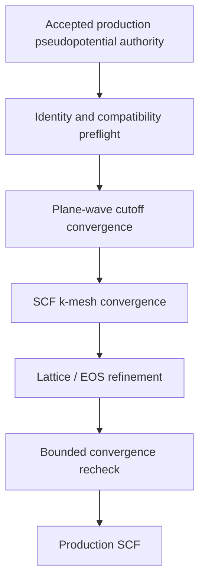

# Bulk-Silicon Production, Visualization, and Semiconductor-Property Program

**Status:** Planning with exactly
`bulk-silicon.production-reference.convergence` active in phase
`awaiting_execution_authorization`. Human Option B revised its finite candidate
design; exact pseudopotential acquisition and atomic `user_opt` publication, static
identity/metadata verification, executable identity inspection, and primary input
preparation are complete. This page authorizes no Quantum ESPRESSO, Wannier90,
post-processing, DFPT, phonon, or scientific execution and selects no final
production parameter.

## Scientific objective

Replace the accepted QE 7.2 tutorial SCF and band calculations with one
internally consistent, numerically verified bulk-silicon parent and
purpose-specific sampled children, then derive only the band-edge properties
supported by those records. The organizing relation is

```text
physical question
→ required calculation
→ retained numerical record
→ deterministic analysis
→ visualization
→ numerical verification
→ scientific claim
```

A figure is a deterministic view of a retained record, not an acceptance
artifact by itself. A successful executable invocation establishes neither
numerical verification nor physical validation.

## Authority and current accepted boundary

The production physical and numerical contracts are
[`PhysicalSpecification-v1`](../../specification/ksdft2Effmass.physical-specification.v1.md)
and
[`NumericalSpecification-v1`](../../specification/ksdft2Effmass.numerical-specification.v1.md).
They currently freeze the non-spin-polarized, scalar-relativistic, non-SOC PBE
bulk pilot, a PseudoDojo PBE standard-table ONCV Si artifact, a zero-pressure
PBE-relaxed lattice convention, and numerical protocols and tolerances. This
planning page does not revise those contracts. The older
[pseudopotential-library strategy](pseudopotential-library-strategy.md) names
SSSP as a preferred candidate; that recommendation is non-authoritative. The
active convergence Task begins with deterministic identity, license,
byte-identity, and compatibility preflight against that frozen artifact. No
family-selection lifecycle boundary remains, and contrary preflight evidence
stops production rather than selecting or substituting another artifact.

Four canonical Tasks are closed as `closed_human_accepted_pass`:

- `bulk-silicon.simulation.qe.reference` — bounded legacy-LDA SCF tutorial
  reproduction;
- `bulk-silicon.artifacts.qe.inventory` — tutorial artifact inventory;
- `bulk-silicon.records.periodic.extraction` — bounded QEXSD plane-wave record
  extraction; and
- `bulk-silicon.simulation.qe.band-reference` — one isolated 28-point,
  eight-band tutorial calculation.

The accepted band claim includes one exit-status-zero execution, 28 ordered
$k$ points, eight bands, complete compact provenance, and unchanged accepted
SCF source. Of 224 printed eigenvalues, 166 matched the bundled legacy
reference at printed precision and the largest printed difference was about
$0.0001\ \mathrm{eV}$. No numerical tolerance or comparison pass/fail rule was
accepted. The IEEE floating-point exception report remains unresolved and
unclassified. The tutorial SCF record has ten irreducible points and four
bands; its energy reference, gauge, basis identity, and retained subspace are
unavailable.

These accepted records establish tutorial execution, provenance, inventory,
and bounded software-extraction behavior only. They do not establish production
pseudopotential suitability, cutoff or mesh convergence, a modern symmetry
path, a band gap, a valley position, effective masses, Wannier suitability,
tight-binding suitability, physical validation, or uncertainty
quantification. The retained bands `result.md` and execution-provenance status
text predate the durable human closeout; canonical lifecycle state is the Task
record and controlling chain, not that stale prose.

The P91 methodology proposes a PBE/PseudoDojo non-SOC parent and a ten-orbital
Wannier target. The former agrees with the current v1 specifications. The exact
Wannier rank, projections, windows, alignment group, shell weights, truncation,
and compatibility meaning remain human-owned Stage 03/04 decisions; manuscript
prose is not evidence that those choices have passed their owning gates.

## Task lifecycle reconciliation

No accepted tutorial Task is reopened. The following hierarchy is a planning
projection of production Stages 02--04 plus the band-edge property program.
Parent Tasks are meaningful acceptance boundaries; they do not execute codes.
Visualizations remain deliverables of calculation or analysis Tasks.

```text
bulk-silicon.production-reference
├── convergence (pseudopotential preflight, cutoff, and SCF mesh)
├── lattice-reference
└── scf

bulk-silicon.band-edge-characterization
├── symmetry-path
├── conduction-valley
├── valence-edge
└── effective-mass-analysis

bulk-silicon.wannier-reference
├── uniform-nscf
├── interface
├── localization
└── interpolation-verification

bulk-silicon.semiconductor-properties
├── density-of-states
├── intrinsic-statistics
├── dielectric-screening
└── deformation-potentials
```

Current identities are reconciled as follows:

| Current Task | Disposition | Reason |
|---|---|---|
| Four accepted tutorial Tasks listed above | Reused as closed evidence only | Their accepted limitations are unchanged; none is a production parent. |
| `bulk-silicon.tight-binding.direct-spectral.fitting` | Reused and corrected | It remains the direct-fit owner, but production path/valley/mass datasets replace tutorial extraction as scientific prerequisites. |
| `bulk-silicon.tight-binding.comparison-reduction` | Reused and corrected | It joins the production direct fit with the verified production Wannier branch. |
| `bulk-silicon.tight-binding.wannier.bridge` | Superseded by `bulk-silicon.wannier-reference.interface` | The old identity is tutorial-only and misplaced under tight binding; production interface ownership is Stage 03. |
| `bulk-silicon.tight-binding.wannier.extraction` | Superseded by `bulk-silicon.wannier-reference.localization` | The old identity reproduces a tutorial; the production Task constructs candidates from the accepted parent. |
| `bulk-silicon.workflow.extracted-model-verification` | Retained blocked as tutorial workflow verification | Its software-workflow claim remains distinct from G02--G04 scientific acceptance. |

All new records require explicit activation. Exactly the convergence record is
active awaiting protected execution authorization; no scientific executable has
run. No static graph edge implies automatic activation.

## Catalog A — production calculations and analyses

Each Task below has a canonical JSON record under `harness/tasks/`. “Compact
record” excludes large wavefunctions, densities, and restart trees, which remain
external under checksummed manifests.

### A1--A3. Pseudopotential preflight and plane-wave/Brillouin-zone convergence

- **Task:** `bulk-silicon.production-reference.convergence`
- **Kind / priority:** calculation series plus numerical verification; essential.
- **Preflight:** exact-URL acquisition, atomic `user_opt` publication, both frozen
  SHA-256 identities, declared XC/type/relativity/valence metadata, ambiguous
  license evidence, and selected `pw.x` identity are complete. Runtime QE
  readability remains untested and later QE--Wannier90 interface compatibility
  remains out of scope. Any discrepancy stops execution; the bytes are neither
  committed nor authorized for redistribution.
- **Inputs:** accepted physical branch, provisional fixed geometry, exact frozen
  pseudopotential authority, frozen numerical protocols, environment, and
  declared metrics. See the active
  [convergence design](bulk-silicon-production-convergence-design.md).
- **Controls:** $E_{\mathrm{cut}}^{\psi}$; when applicable
  $E_{\mathrm{cut}}^{\rho}$ and their ratio; uniform Monkhorst--Pack size,
  offset, occupation, and fixed one-variable-at-a-time context.
- **Monitored quantities:** total energy per atom, stress/pressure, SCF
  convergence/cost, and explicitly limited fixed-point eigenvalue and gap
  diagnostics. Later path, valley, and mass Tasks own their sampling and must
  feed any cutoff/mesh sensitivity failure back before final parent acceptance.
- **Artifacts and records:** per-setting QEXSD/native outputs and restart trees;
  compact manifests, convergence tables, rejected settings, guard calculations,
  residuals, and cutoff/mesh figures.
- **Human decisions:** any revision to the frozen sequences, observables,
  tolerances, or setting disposition.
- **Completion:** every declared provisional energy, stress, SCF, and fixed-point
  diagnostic plus the bounded four-corner cutoff--mesh check passes its accepted
  numerical rule; one bounded human acceptance selects provisional settings.
  Final production-reference acceptance additionally requires later target gap,
  valley, and mass Tasks to return any material sensitivity for bounded recheck;
  cutoff, SCF mesh, path, local, DOS, and Wannier sampling remain distinct.
- **Claim limit:** convergence is relative to the selected PBE Kohn--Sham parent,
  not physical validation.

### A4. Equilibrium lattice reference

- **Task:** `bulk-silicon.production-reference.lattice-reference`
- **Kind / priority:** calculation and analysis; essential.
- **Prerequisite:** basis and SCF-mesh convergence sufficient for energy/stress.
- **Inputs and controls:** diamond primitive cell; accepted branch; symmetric
  lattice/volume grid; fit family/window; included and withheld points; stress
  convention; optional constrained variable-cell check.
- **Artifacts and records:** SCF outputs for each geometry; compact energy/stress
  table, EOS fit, uncertainty, residuals, refinement history, and frozen geometry
  manifest.
- **Human decision:** the accepted specification already makes zero-pressure
  PBE-relaxed geometry primary; any experimental-primary or dual-parent branch
  requires an explicit specification decision. Experimental geometry remains a
  separate physical-validation case.
- **Completion:** fit and independent check pass the accepted protocol and any
  geometry change triggers reassessment of affected cutoff/mesh evidence.
- **Claim limit:** numerical EOS fitting and disagreement with experiment are
  separate error classes.

### A5. Production SCF parent

- **Task:** `bulk-silicon.production-reference.scf`
- **Kind / priority:** protected calculation; essential.
- **Prerequisites:** accepted convergence and lattice records plus exact execution
  authorization.
- **Inputs:** physical/numerical branch, geometry, cutoffs, SCF mesh,
  occupations/mixing/iterative settings, executable/environment, resources, and
  external artifact root.
- **Artifacts:** density, potential/restart state, QEXSD, streams, and inventories.
- **Compact record:** immutable parent manifest; semantic plane-wave record;
  iteration history when present; code-specific residuals; resources/timing;
  warnings; and tutorial-versus-production comparison of only compatible
  quantities.
- **Human decision:** warning disposition and final SCF-parent acceptance.
- **Completion:** iterative SCF, basis, mesh, and geometry rules each pass; parent
  identity and restart lineage are complete.
- **Claim limit:** one converged SCF mesh is not adequate evidence for every
  purpose-specific child.

### A6. Production symmetry-path bands

- **Task:** `bulk-silicon.band-edge-characterization.symmetry-path`
- **Kind / priority:** calculation; essential for dispersion inspection.
- **Prerequisite:** accepted production SCF parent and approved path design.
- **Inputs and controls:** explicitly sourced modern silicon path, coordinate
  convention, labels, segment interpolation density, retained band count,
  band correspondence, and VBM plotting reference.
- **Artifacts and records:** path output/restart artifacts; ordered coordinates,
  cumulative distances, labels, eigenvalues, direct/indirect gap observations,
  parent identity, and figure-ready tables.
- **Human decisions:** path source, density, labels, band count, and comparator.
- **Completion:** reproducible coordinates/references and path-density/band-count
  checks for dispersion.
- **Claim limit:** not an integration mesh, full tensor fit, Wannier mesh, or
  complete TB dataset.

### A7. Local $\Delta$-valley sampling

- **Task:** `bulk-silicon.band-edge-characterization.conduction-valley`
- **Kind / priority:** calculation; essential for the electron EMT pilot.
- **Prerequisites:** production SCF plus separately accepted initial-valley
  location evidence and local-sampling design. A production path may supply the
  estimate, but it is not a hard mathematical prerequisite.
- **Inputs and controls:** initial valley coordinates; local coordinate basis;
  3-D geometry, radius, spacing, fit/withheld partition, retained bands, tracking
  rule, polynomial order/window, symmetry constraints, and optional
  nonparabolic extension.
- **Artifacts and records:** local wavefunctions/eigenvalues as required; compact
  ordered energy samples, valley identities, symmetry mappings, partitions,
  line/surface cuts, and sensitivity tables.
- **Human decisions:** radius, spacing, model order/window, symmetry pooling,
  nonparabolic model, uncertainty estimator, and acceptance.
- **Completion:** stable minimum and Hessian under radius/spacing/model changes;
  withheld residuals and symmetry-equivalent valley checks pass.
- **Claim limit:** a one-dimensional path cannot establish the full tensor.

### A8. Valence-band-edge sampling

- **Task:** `bulk-silicon.band-edge-characterization.valence-edge`
- **Kind / priority:** calculation/analysis; conditional for the electron pilot,
  essential for hole or final acceptor claims.
- **Prerequisites:** a compatible production SCF branch and symmetry evidence.
- **Inputs and controls:** local directions/samples, degeneracy tracking,
  subspace convention, fit model, withheld data, and scalar-relativistic or
  fully relativistic/SOC parent identity.
- **Records and outputs:** directional dispersion, curvature/multiband fit,
  anisotropy and residual plots, and split-off energy only for a compatible SOC
  branch.
- **Human decision:** scalar approximation, directional masses, or Luttinger--Kohn
  model; and whether the stated use requires SOC.
- **Completion:** degeneracy, direction, symmetry, fit sensitivity, and claim
  branch are explicit.
- **Claim limit:** one scalar hole mass does not represent silicon's warped,
  degenerate valence manifold; non-SOC data cannot support final B claims.

### A9. Uniform NSCF mesh for Wannier90

- **Task:** `bulk-silicon.wannier-reference.uniform-nscf`
- **Kind / priority:** protected calculation; essential for G03.
- **Prerequisites:** accepted SCF parent and human-approved target-subspace,
  retained-band, grid, projection, and window design.
- **Inputs and controls:** regular mesh topology/density; occupied/unoccupied
  bands; spin; target rank; prospective windows/projections; wavefunction
  retention; and interface-compatible executables.
- **Artifacts:** QEXSD, wavefunctions, restart state, streams, and mesh/band
  inventories.
- **Compact record:** parent lineage, mesh topology, band set, resource/timing,
  artifact checksums, neighbor-list compatibility, and band/mesh adequacy.
- **Human decisions:** grid, band count, rank/subspace, retention, and need for
  disentanglement. Projections and windows are not selected here.
- **Completion:** regular-grid/interface closure and observable-specific mesh and
  band adequacy pass.

### A10. DOS-oriented NSCF

- **Task:** `bulk-silicon.semiconductor-properties.density-of-states`
- **Kind / priority:** calculation/analysis; conditional-to-essential for DOS and
  intrinsic statistics, not on the shortest electron-mass path.
- **Prerequisite:** production SCF.
- **Inputs and controls:** candidate uniform meshes, band coverage,
  tetrahedron/smearing/interpolation method, energy grid, and broadening.
- **Decision:** demonstrate whether the Wannier NSCF mesh supports DOS or run a
  distinct denser mesh; no mesh is reused by convenience.
- **Artifacts/records:** NSCF/DOS output, compact energy-DOS arrays, integrated
  state counts, sensitivity data, band-edge DOS, and figures.
- **Completion:** DOS and state count converge under mesh/method sensitivity.
- **Claim limit:** no PDOS without projection authority; broadening is not a
  physical linewidth.

### A11. Wannier preprocessing, interface, localization, and verification

- **Tasks:** `bulk-silicon.wannier-reference.interface`,
  `bulk-silicon.wannier-reference.localization`, and
  `bulk-silicon.wannier-reference.interpolation-verification`.
- **Kinds / priority:** extraction/interface, protected calculation, and
  numerical verification; essential for G03.
- **Flow:** uniform NSCF $\to$ `wannier90 -pp` $\to$ `pw2wannier90.x`
  $\to$ `wannier90.x` $\to$ independent interpolation verification.
- **Inputs and controls:** approved rank, projections, frozen/outer windows,
  neighbor grid, gauge/symmetry policy, localization/disentanglement settings,
  candidate sensitivity design, independent direct-QE validation samples, band
  matching, energy reference, and retained-$\mathbf R$ convention.
- **Artifacts:** `.nnkp`, `.amn`, `.mmn`, `.eig`, approved optional interface
  files, `.wout`, `.chk`, centers/spreads, subspace data, and $H_W(\mathbf R)$.
- **Compact outputs:** interface inventory; candidate construction records;
  spread, center, hopping-decay and window diagnostics; direct QE versus Wannier
  bands; residuals; gap/valley/mass errors; and withheld-grid verification.
- **Human decisions:** rank (including P91's proposed ten-orbital target),
  projections, windows, gauge/symmetry policy, tolerances/domain, correspondence,
  and final `BulkSiWannier-v1` acceptance.
- **Completion:** interface, localization, sensitivity, independent Fourier
  reconstruction, interpolation, edge, derivative, and decay rules pass
  separately.
- **Claim limit:** interface success or small spreads alone establish neither
  interpolation validity nor physical validation.

### A12. Direct spectral fitting datasets and reduced models

- **Tasks:** reused `bulk-silicon.tight-binding.direct-spectral.fitting` and
  `bulk-silicon.tight-binding.comparison-reduction`.
- **Kinds / priority:** analysis and numerical verification; essential for G04,
  not for the shortest EMT path.
- **Prerequisites:** frozen production path/local/edge records and, for the
  operator branch, verified `BulkSiWannier-v1` plus compatible alignment.
- **Inputs and controls:** pre-frozen training and withheld coordinates, band
  correspondence, VBM energy alignment, objective weights, valley/mass
  constraints, optimizer, nested model-class order, common state space, shell
  weights, and truncation.
- **Compact outputs:** partition checksum; training/withheld tables; fit
  parameters; optimizer traces; residuals by band/$k$; gap/valley/mass errors;
  model-complexity curve; operator residuals; and direct-versus-Wannier model
  comparison.
- **Human decisions:** dataset partition, weights, model hierarchy, alignment,
  compatibility meaning, metrics/tolerances, and stopping rule.
- **Completion:** no withheld leakage; compatible-parent join; reproducible fits;
  separate spectral/operator claims; and accepted common validation.
- **Claim limit:** one symmetry path is neither complete training nor validation;
  spectral agreement does not identify a unique operator.

### Conditional production calculations

| Branch | Classification | Scientific property that can justify it | Additional boundary |
|---|---|---|---|
| Fully relativistic/SOC bulk and local-valence branch | Conditional; essential for final acceptor/hole claims | HH/LH/split-off structure, spinor host for B:Si | Compatible fully relativistic pseudopotentials, noncollinear settings, multiband convention, and separate convergence. |
| Controlled strained cells | Conditional | Hydrostatic/shear deformation potentials, strain response | Strain tensors/range, relaxation, energy alignment, withheld strains, and strain-specific convergence. |
| DFPT dielectric response | Conditional | $\epsilon_\infty$, $\epsilon_0$, or EMT screening authority | Separate electronic/ionic pieces, $k/q$ convergence, experiment comparison, and exact execution authorization. |
| Phonons | Deferred | Lattice dynamics, $\epsilon_0$ ionic contribution, or later electron--phonon work | Not required by ordinary band-edge EMT; separate DFPT/phonon program. |
| Electron--phonon coupling | Deferred | Scattering, mobility, temperature renormalization | Outside the immediate band-edge program. |
| Charged or doped supercells | Later program | Donor/acceptor impurity operators and binding | Species, charge/spin, finite-size, alignment, relaxation, and protected execution. |
| Finite electric fields | Deferred | Polarization/Stark response | Requires a separate physical model and boundary convention. |
| Magnetic field or $g$ factor | Deferred | Zeeman response/$g$ tensors | Requires SOC and response-specific methodology. |
| Hybrid-functional or quasiparticle branch | Deferred | Parent-model band-gap/band-edge correction | Separate GKS/GW profile, convergence, pseudopotential compatibility, and validation; never folded into PBE reduction error. |

## Catalog B — visualization deliverables

Every deliverable includes a machine-readable plot-data table, plot
specification, source Task/record identity, code identity, transformations, and
figure checksum. “Publication” means publication-capable after its source claim
is accepted; this plan creates no result.

### Visualization matrix

| Figure | Source Task | Diagnostic/publication | Axes and units | Energy/reference convention | Required residuals | Claim boundary |
|---|---|---|---|---|---|---|
| SCF total energy by iteration | production SCF | Diagnostic | iteration; energy in Ry or eV/cell with cell stated | Raw code energy; no arbitrary alignment | Change per iteration when recoverable | Iterative behavior only; not cutoff/mesh convergence. |
| SCF code-reported residual | production SCF | Diagnostic | iteration; exact reported quantity and unit | Code definition, not an invented density norm | Threshold line only if retained | Supports the code-specific iterative criterion only. |
| Density-mixing diagnostic | production SCF | Diagnostic/optional | iteration; retained mixing quantity | Exact code definition | Oscillation/history if available | Omit when output does not contain it. |
| SCF iteration cost | production SCF | Diagnostic | iteration; wall/CPU seconds | Resource configuration stated | Per-iteration or cumulative cost | Performance observation, not scientific convergence. |
| Tutorial versus production SCF | production SCF + tutorial SCF | Diagnostic | compatible quantity; declared units | No cross-XC energy alignment unless mathematically defined | Difference for compatible quantities | Demonstrates changed parent; not a validation of either. |
| Cutoff convergence | convergence | Diagnostic/publication | $E_{\mathrm{cut}}^{\psi}$ and applicable $E_{\mathrm{cut}}^{\rho}$; each observable/unit | Observable-specific | Difference to finer setting, threshold, guard result | Numerical stability relative to the chosen parent. |
| SCF $k$-mesh convergence | convergence | Diagnostic/publication | mesh density; observable/unit | Same physical branch/settings | Difference to finer mesh | Does not qualify path/local/Wannier/DOS meshes. |
| EOS and residual | lattice reference | Diagnostic/publication | lattice/volume; energy/atom and pressure/stress | Common cell and energy offset stated | Fit residuals, withheld/verification point, uncertainty | Numerical equilibrium; experiment is a separate comparison. |
| Tutorial eight-band raw plot | accepted tutorial band Task | Diagnostic | 28 ordered point index or cumulative tutorial distance; eV | Raw QE energies; unavailable zero stated | QE 7.2 minus bundled printed value | Tutorial comparison only; no interpolation/tolerance. |
| Tutorial eight-band VBM-shifted plot | accepted tutorial band Task | Diagnostic | same path; $\widetilde E=E-E_{\mathrm{VBM}}$ in eV | Sampled VBM plotting zero, never “Fermi level” | Same optional residual panel | Requires compact extracted band table; not production evidence. |
| Production symmetry-path bands | production symmetry path | Publication | cumulative reciprocal distance; $E-E_\mathrm{VBM}$ in eV | Accepted VBM reference | Path-density/band-matching checks | KS dispersion with sourced labels; not full BZ validation. |
| Gap and valley annotations | production path + valley analysis | Publication | band diagram/inset; eV and fractional/physical $k$ | VBM zero | Edge/valley uncertainty | Direct/indirect gaps and approximate valley topology only. |
| Brillouin-zone sampling map | production SCF/path/valley/Wannier/DOS/TB records | Diagnostic/publication | reciprocal coordinates with basis/units | Not an energy plot | None; distinguish set identities visually | Shows distinct numerical purposes; no adequacy claim alone. |
| Local $\Delta$-valley surface | valley sampling | Diagnostic/publication | physical $\Delta\mathbf k$; $E-E_c$ in meV/eV | Valley minimum zero | Fit and withheld residuals | Local PBE KS surface only. |
| Longitudinal/transverse cuts | valley sampling/mass analysis | Diagnostic/publication | $\Delta k$ in bohr$^{-1}$ or Å$^{-1}$; $E-E_c$ | Valley minimum zero | Quadratic/nonparabolic residuals | Supports declared directional curvature model. |
| Mass fit-window sensitivity | mass analysis | Diagnostic | radius/spacing/window; mass in $m_e$ | Fixed tensor convention | Estimate change and uncertainty | Numerical estimator stability, not experiment. |
| Equivalent-valley comparison | mass analysis | Diagnostic/publication | valley identity/direction; position and mass | Common reciprocal convention | Symmetry deviations | Tests symmetry/numerics under stated branch. |
| 3-D mass ellipsoid | mass analysis | Publication/optional | reciprocal directions; normalized curvature | Valley minimum zero | Uncertainty envelope | Visualizes accepted tensor, not nonparabolic global dispersion. |
| HH/LH directional bands | valence-edge | Diagnostic/publication | direction/$\Delta k$; $E-E_v$ | VBM zero | Multiband/scalar fit residuals | Requires explicit degeneracy/band convention. |
| SOC split-off plot | compatible SOC valence Task | Publication/conditional | $\Delta k$; eV | SOC VBM zero | Branch and fit residuals | No split-off claim from non-SOC data. |
| Total DOS | DOS Task | Diagnostic/publication | energy in eV; states/(eV cell) or stated normalization | VBM/CBM reference stated | Mesh/method/broadening sensitivity | Numerical DOS only; broadening is not lifetime. |
| Band-edge DOS and integrated count | DOS Task | Diagnostic/publication | edge energy; DOS and states | Edge references | Numerical versus parabolic residual; state-count error | Supports effective-DOS checks under stated degeneracy. |
| PDOS | authorized projection Task | Conditional | energy; projected states/unit | Same parent/reference | Projection sum/completeness | Omit without projection authority; projection is representation-dependent. |
| QE versus Wannier bands | interpolation verification | Diagnostic/publication | common path/dense set; eV | Explicit common energy alignment | Per-band/$k$ residual panel | Interpolation fidelity to same parent only. |
| Spread convergence | localization | Diagnostic | iteration/candidate; Å$^2$ or bohr$^2$ | Not an energy reference | Change and candidate sensitivity | Localization diagnostic, not interpolation proof. |
| Wannier centers | localization | Diagnostic/publication | real-space cell coordinates/units | Gauge and cell convention | Symmetry/center displacement | Gauge-dependent centers, not unique physical orbitals. |
| Hopping magnitude by distance | localization/interpolation verification | Diagnostic/publication | distance; block norm in eV | Basis/gauge and retained-$\mathbf R$ convention | Tail/truncation residual | Decay/truncation evidence only in the represented gauge. |
| Window/disentanglement diagnostics | localization | Diagnostic | energy/projectability/iteration; stated units | Parent bands/reference | Sensitivity and excluded-state residuals | Candidate-selection evidence, not automatic acceptance. |
| TB fitted versus QE bands | direct fit | Diagnostic/publication | training coordinates; eV | Frozen energy alignment | Per-band/$k$ residuals | Training agreement only. |
| TB withheld validation | direct fit/comparison | Publication | withheld paths/meshes; eV | Same alignment/correspondence | Gap, valley, mass, max/RMS errors | Reduction verification only on untouched data. |
| TB model complexity | comparison/reduction | Publication | parameter/shell complexity; declared errors | Common parent/metrics | Confidence/repeat variability | Supports bounded model selection, not universal validity. |
| Orbital-block/shell residuals | comparison/reduction | Diagnostic/publication | block/shell; normalized operator error | Aligned common representation | Block/shell decomposition | Invalid before basis/gauge/energy/geometry alignment. |
| Direct-fit versus Wannier-derived TB | comparison/reduction | Publication | common validation set; spectral/operator errors | Compatible parent and representation | Branch-specific and joint residuals | Does not combine incompatible error definitions. |
| Intrinsic $\mu_i(T)$ and $n_i(T)$ | intrinsic statistics | Publication/conditional | temperature K; eV and cm$^{-3}$ | Statistical chemical potential, not VBM/midgap label | Boltzmann versus Fermi--Dirac residual | Valid only for declared equilibrium model/range. |
| Dielectric comparison | dielectric Task | Publication/conditional | tensor component/source; dimensionless | Frequency/temperature regime | Numerical/literature uncertainty | Separates $\epsilon_\infty$, $\epsilon_0$, and EMT model value. |
| Deformation-potential fit | strain Task | Publication/conditional | strain; aligned edge shift in eV | Explicit strain-dependent alignment | Fit, withheld, range sensitivity | Supports only declared hydrostatic/shear convention. |

## Catalog C — semiconductor properties

### Definitions used by the program

For a nondegenerate band extremum,

$$
(m^{-1})_{ij}=\frac{1}{\hbar^2}
\frac{\partial^2 E_n(\mathbf k)}{\partial k_i\partial k_j},
\qquad
\mathbf v_n(\mathbf k)=\frac{1}{\hbar}\nabla_{\mathbf k}E_n(\mathbf k).
$$

The full tensor and its coordinate basis are primary. For one ellipsoidal valley
with longitudinal mass $m_l$ and two equal transverse masses $m_t$, the
single-valley DOS mass is $(m_lm_t^2)^{1/3}$. A six-valley DOS convention adds
the explicitly documented degeneracy factor in the DOS/effective-density
formula. For cubic, equally populated equivalent valleys, the usual
conductivity-mass relation is assessed under its population and scattering
assumptions; it is not silently substituted for a curvature mass.

### Semiconductor-property matrix

| Property | Required calculations | Mathematical extraction | Required validation | EMT relevance | Immediate/later/deferred |
|---|---|---|---|---|---|
| VBM | production path plus global/targeted edge search | maximum occupied KS edge under stated band/occupation convention | mesh/path coverage, band tracking, energy reference; optional literature comparison | Valence reference | Immediate record; final acceptor needs SOC branch. |
| CBM | production path plus local $\Delta$ search | minimum unoccupied KS edge | local refinement, symmetry-equivalent minima, withheld points | Conduction reference | Immediate. |
| Indirect KS gap | VBM and CBM records | $E_c-E_v$ | cutoff/mesh/local convergence; parent-model comparison separate | Donor/acceptor edge separation | Immediate. |
| Direct gaps | sourced path/edge calculations | same-$k$ edge differences | path density, band labels, optional independent references | Optical context only without matrix elements | Immediate where sampled; limited claim. |
| $\Delta$-valley location | local valley calculation | minimization/interpolation in declared coordinates | radius/spacing/model and symmetry sensitivity | Valley wavevectors/phases | Immediate. |
| Valley degeneracy | symmetry plus equivalent minima | symmetry orbit/count | compatible crystal/SOC branch and numerical equivalence | Multivalley EMT channel count | Immediate non-SOC pilot. |
| Band-edge symmetry labels | symmetry-path/local states | representation analysis from authorized symmetry data | code/convention and degeneracy checks | Channel classification | Later/conditional if supporting data absent. |
| Electron $m_l^*$, $m_t^*$ | local 3-D valley samples | Hessian principal values | stencil/window/order, units, withheld residuals, equivalent valleys | Core donor EMT input | Immediate. |
| Full electron inverse-mass tensor | same | Hessian divided by $\hbar^2$ in physical coordinates | tensor rotation/symmetry and synthetic software checks | Anisotropic EMT operator | Immediate. |
| Conductivity electron mass | accepted tensor and valley population model | documented cubic multivalley average | convention/population/scattering assumptions | Band-only transport input | Immediate derivation; no conductivity claim. |
| Electron DOS mass | tensor, valley degeneracy | ellipsoidal determinant plus stated degeneracy convention | numerical DOS consistency | $N_c(T)$ and carrier statistics | Immediate derivation, checked later against DOS. |
| HH/LH directional masses | compatible local valence branch | directional/multiband curvature | degeneracy, warping, direction, fit sensitivity | Acceptor/multiband EMT | Later; SOC required for final acceptor use. |
| Hole DOS/conductivity mass | accepted multiband valence model and DOS | explicitly defined band-sum/transport average | numerical DOS and model-range checks | $N_v(T)$, approximate hole transport | Later/conditional. |
| Luttinger parameters | SOC multiband local valence data | symmetry-constrained Luttinger--Kohn fit | directions, fit range, withheld points, convention | Natural acceptor EMT input | Later; SOC and human model decision required. |
| Spin--orbit split-off energy | fully relativistic SOC branch | compatible band-edge splitting | SOC convergence, labels, literature comparison | Acceptor channel structure | Later/conditional. |
| Nonparabolicity | extended local edge samples | residuals, energy-dependent mass, or justified Kane-type fit | radius/energy/model sensitivity and withheld data | EMT domain correction | Immediate assessment for electrons; parameter later if justified. |
| Group velocity | direct local samples or verified Wannier interpolation | numerical gradient or analytic Wannier derivative | differentiation/interpolation cross-check | Velocity moments/transport distribution | Immediate locally; dense later. |
| Total electronic DOS | DOS NSCF or verified interpolation | BZ integration under stated method | mesh, broadening/tetrahedron, integrated count | Carrier statistics and spectral context | Later but near-term. |
| Band-edge DOS | DOS plus edge records | local numerical DOS and parabolic approximation | mesh/edge resolution and mass consistency | Effective DOS | Later but near-term. |
| $N_c(T)$, $N_v(T)$ | accepted masses/degeneracies or numerical DOS | effective-DOS formulas or Fermi integral | numerical-DOS comparison and temperature range | Intrinsic statistics | Later after DOS/valence adequacy. |
| Intrinsic $\mu_i(T)$ | accepted edges and $N_c,N_v$ or full DOS | Boltzmann expression and full charge-neutrality integration | Boltzmann versus Fermi--Dirac residual | Equilibrium reference | Later. |
| Intrinsic $n_i(T)$ | same | carrier integrals/approximations | temperature range, gap model, units, external comparison if claimed | Background carrier scale | Later. |
| Velocity moments | verified dense bands | BZ moments with explicit occupation | mesh/interpolation convergence | Transport distribution before scattering | Later. |
| Transport distribution | dense bands and chemical potential | velocity-weighted DOS without scattering closure | mesh/energy/temperature convergence | Band contribution only | Later; no mobility/conductivity. |
| $\epsilon_\infty$ | authorized electronic DFPT or independent authority | dielectric tensor | cutoff/$k$/$q$ response convergence and physical reference | Electronic screening input | Conditional. |
| $\epsilon_0$ | ionic+electronic response or independent authority | static tensor including lattice contribution | phonon/DFPT convergence, temperature/frequency provenance | Static impurity screening candidate | Conditional/deferred. |
| EMT dielectric constant | accepted screening authority | declared tensor-to-model reduction | sensitivity and domain justification | Direct impurity EMT input | Later human decision. |
| Hydrostatic deformation potential | controlled isotropic strains | aligned edge derivative | strain range, convergence, withheld fit, literature comparison | Strain-dependent EMT | Conditional. |
| Shear/uniaxial deformation potentials | controlled symmetry strains | symmetry-resolved edge splitting derivative | same plus degeneracy tracking | Valley splitting/strain EMT | Conditional. |
| EMT host input set | accepted edges, tensors, valleys, screening, compatible Bloch/Wannier metadata | assembled versioned parameter record | cross-convention and provenance review | Donor/acceptor model parent | Later acceptance boundary. |
| Central-cell inputs | pristine Bloch/Wannier information plus doped/experimental evidence | model-specific short-range operator parameters | doped-system and experimental validation | Central-cell correction | Deferred; not obtainable from pristine bands alone. |

For intrinsic statistics, the Boltzmann approximations are

$$
n=N_c\exp\!\left[-\frac{E_c-\mu}{k_{\mathrm B}T}\right],
\qquad
p=N_v\exp\!\left[-\frac{\mu-E_v}{k_{\mathrm B}T}\right],
$$

and

$$
\mu_i(T)=\frac{E_c+E_v}{2}
+\frac{k_{\mathrm B}T}{2}\ln\!\left(\frac{N_v}{N_c}\right).
$$

The analysis must compare these with full Fermi--Dirac integration and declare
the approximation range. $E_{\mathrm{VBM}}$, the midgap energy, and a plotting
zero are not called the Fermi level without this statistical model.

### Effective-mass impurity inputs

Pristine production calculations can provide compatible mass tensors, valley
number and wavevectors, band-edge references, and Bloch/Wannier host
information. Dielectric screening requires DFPT, experiment, or another
accepted authority. Central-cell parameters, impurity binding energies, and
short-range impurity operators require doped calculations and/or experiment.
Final acceptor models additionally require compatible SOC and multiband valence
structure.

### Deferred advanced properties

Mobility, relaxation time, electron--phonon scattering, optical matrix elements,
excitons, $g$ factors, hyperfine coupling, impurity binding energies,
central-cell corrections, and quasiparticle corrections are separate programs.
Ordinary SCF/NSCF/path data do not produce them. Optical matrix elements need
wavefunction/response authority; mobility and conductivity need occupation and
scattering closure; impurity observables need doped or experimental evidence;
and quasiparticle claims need a separately qualified many-body method.

## Dependency graph



The graph is a static production-parent prerequisite view, not an executable
workflow. Downstream path, valley, Wannier, DOS, response, and reduction branches
remain as cataloged below and require their own activation after an accepted
production SCF. The local valley path estimate is useful evidence, not a
mathematical substitute for local sampling; regular Wannier and DOS meshes remain
independent unless purpose-specific verification supports reuse.

## Production calculation matrix

| Task | Essential/conditional | Parent state | Main convergence axis | External artifacts | Compact record | Human decision |
|---|---|---|---|---|---|---|
| Pseudopotential preflight, cutoff, and SCF-mesh convergence | Essential | Accepted exact v1 pseudopotential authority; no production parent yet | Exact identity/compatibility, $E_{\mathrm{cut}}^{\psi}$, explicit $E_{\mathrm{cut}}^{\rho}$, MP mesh, and bounded four-corner coupling check | Supplied local pseudopotential bytes plus later QEXSD, outputs, restart trees; no design-stage download | Identity/license/compatibility record and convergence tables/manifests | Parameter design now; provisional setting acceptance only after execution |
| Lattice reference/EOS | Essential | Converged numerical context | lattice/volume grid and fit refinement | Per-geometry outputs | EOS table, residuals, uncertainty | Primary branch already frozen; comparator disposition |
| Production SCF | Essential | Frozen geometry/settings | iterative SCF plus reproducibility | density/potential/restart/QEXSD | Parent manifest and diagnostics | warning and parent acceptance |
| Symmetry-path bands | Essential diagnostic | Accepted SCF | segment density and bands | path wavefunctions/QEXSD/output | ordered band table | sourced path/labels/count |
| Local conduction valley | Essential electron EMT | Accepted SCF | radius, spacing, fit order/window | local sampled states | sample/fit/withheld tables | estimator and acceptance |
| Local valence edge | Conditional electron pilot; essential hole/acceptor | Compatible SCF/SOC branch | direction, radius, multiband fit | local sampled states | curvature/multiband record | scalar vs multiband and SOC claim |
| Uniform Wannier NSCF | Essential G03 | Accepted SCF | regular grid, retained bands | wavefunctions/restart/QEXSD | interface-ready manifest | rank/grid/bands/windows/projections |
| DOS NSCF | Conditional-to-essential for statistics | Accepted SCF | mesh/method/broadening/bands | NSCF/DOS outputs | DOS/state-count tables | reuse or distinct mesh; method |
| Wannier interface/localization | Essential G03 | Accepted uniform NSCF | grid/windows/projections/localization | interface and Wannier native files | candidate/operator manifests | gauge/windows/projections/rank |
| Direct TB fit | Essential G04, not EMT critical path | Accepted path/valley/mass datasets | dataset/model/optimizer hierarchy | optional fit workspaces | parameters/partitions/residuals | model/weights/partition |
| Dielectric response | Conditional | Accepted SCF | response $k/q$/cutoff | DFPT outputs | dielectric tensor record | calculation/source/model convention |
| Strained cells | Conditional | Accepted parent | strain range and strained convergence | strained outputs | aligned-edge fit record | strain/relaxation/alignment |

## Immediate critical path and iteration

The shortest scientifically credible electron band-edge sequence is

```text
accepted production pseudopotential authority
→ identity and compatibility preflight
→ cutoff convergence
→ SCF k-mesh convergence
↔ lattice-reference / EOS refinement and bounded recheck
→ production SCF
→ production symmetry path
→ local Δ-valley sampling
→ electron effective-mass extraction and numerical verification
```

Cutoff, mesh, and lattice stages are not purely linear. Initial cutoff/mesh
studies require a trial geometry; the EOS requires settings sufficient for
energy and stress; the resulting equilibrium geometry can change the reciprocal
scale and downstream observables. The accepted workflow therefore permits a
bounded convergence--geometry iteration until both settings and geometry
satisfy their owning rules. It does not permit changing parameters merely to
obtain a preferred physical result.

Wannierization branches from the accepted production SCF after separate human
approval of target subspace, retained bands, regular grid, projections, and
windows. DOS also branches from SCF and reuses the Wannier mesh only after
DOS-specific verification. Direct TB fitting waits for frozen training and
withheld datasets; the Wannier-derived branch waits for a verified Wannier
operator.

## Unresolved human scientific decisions

The following decisions are not made by this plan:

1. the preliminary lattice, cutoff cases, explicit charge-density rule,
   preliminary mesh, mesh sequence, occupation and SCF controls, monitored
   observables, criteria, coupling guards, and resource ceiling listed in the
   active [convergence design](bulk-silicon-production-convergence-design.md);
2. any later revision of frozen numerical tolerances or protocols;
3. the modern path source, labels, coordinate convention, density, and band
   count;
4. local-valley geometry, radius, spacing, fit order/window, tracking,
   symmetry pooling, nonparabolic model, withheld set, and uncertainty method;
5. valence scalar versus directional versus Luttinger--Kohn model and the exact
   SOC branch required by each claim;
6. Wannier rank/subspace, including P91's proposed ten-orbital target;
   projections, windows, grid, gauge/symmetry policy, localization and
   interpolation metrics/tolerances, and retained-$\mathbf R$ domain;
7. DOS mesh reuse, integration method, broadening, band coverage, and effective
   DOS convention;
8. TB model hierarchy, dataset partition, objective/weights, optimizer,
   alignment group, shell weights, normalization, truncation, compatibility
   definition, tolerance, and stopping rule;
9. temperature/statistical range and physical-validation references for carrier
   statistics;
10. calculated versus external dielectric authority and the EMT screening
    reduction;
11. strain modes/range, relaxation, alignment, fit, and comparator; and
12. every protected-execution resource, external artifact root, transfer policy,
    and exact one-run/campaign authorization.

No checkpoint is created for parameter selection. The first decision is pending
on the active convergence Task; later decisions remain with their owning
inactive Tasks.

## Evidence classes and acceptance

| Evidence class | Required role in this program | Does not establish |
|---|---|---|
| Software verification | Schema/parser behavior, canonical records, artifact identity, coordinate/unit transforms, synthetic Hessians, independent $H_W(\mathbf R)\to H_W(\mathbf k)$ reconstruction, plotting determinism | Numerical convergence or silicon physics |
| Numerical verification | Cutoff/mesh/geometry/stencil/window convergence, withheld residuals, interpolation error, optimizer repeatability, state counts | Agreement with real silicon or removal of PBE parent error |
| Physical validation | Comparison with independently identified experiment or verified literature for a declared observable and convention | General transferability, many-body accuracy, or reduction fidelity for unrelated observables |
| Uncertainty quantification | Separately identified and justified propagation of numerical, fit, methodological, and external uncertainties | Permission to combine incompatible error definitions |

Parent-model PBE error, numerical/discretization error, Wannier/interpolation
error, fitting/model-reduction error, statistical approximation error, and
physical-validation discrepancy remain separate. No Task may claim validation
from a plot or from passing software tests.

## Completion boundary of this plan

The corrected plan has exactly the convergence Task active awaiting protected
execution authorization. It does not pass G02, G03, or G04; freeze
`BulkSiReference-v1`, `BulkSiWannier-v1`, or a semiconductor-property result;
activate a successor; create a checkpoint; or authorize scientific execution.
