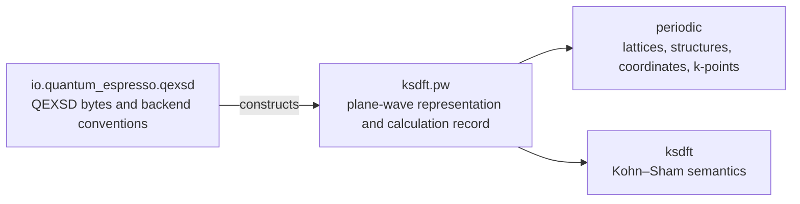

# Kohn–Sham plane-wave record architecture

## Status and scope

This maintained computational architecture records the selected implementation
for the active, not-human-accepted
[`bulk-silicon.records.periodic.extraction`](../../harness/tasks/bulk-silicon.records.periodic.extraction.json)
Task. It covers only the retained QE 7.2 QEXSD 23.03.10 silicon artifact and does
not establish numerical or scientific validation.

## Former ownership problem

The former `ksdft2effmass.periodic` package combined QEXSD parsing, periodic
geometry, Kohn–Sham spectra, plane-wave FFT metadata, complete calculation
records, and serialization. It consequently mislabeled quantity-specific values
with the global QEXSD string “Hartree atomic units” and obscured reciprocal and
$k$-point scale conventions.

## Selected package boundaries



The exact dependency direction is
`io.quantum_espresso.qexsd -> ksdft.pw -> {ksdft, periodic}`. Neither
`periodic`, `ksdft`, nor `ksdft.pw` imports a Quantum ESPRESSO or QEXSD module.

## Mechanical-to-semantic transformation

```text
explicit QEXSD bytes and source identity
→ ParseQexsdDocument
→ mechanically faithful QexsdDocument
→ ConstructQexsdKohnShamPlaneWaveRecord
→ KohnShamPlaneWaveCalculationRecord
```

`QexsdDocument` retains raw values, labels, and ordering. The QEXSD-owned
construction ActionObject applies source-backed backend conventions while the
canonical serializer remains with `ksdft.pw`.

## Public-interface relocation

| Removed public interface | Defining replacement |
|---|---|
| `periodic.QexsdSource` | `io.quantum_espresso.qexsd.QexsdSource` |
| `periodic.QexsdDocument` | `io.quantum_espresso.qexsd.QexsdDocument` |
| `periodic.ParseQexsdDocument` | `io.quantum_espresso.qexsd.ParseQexsdDocument` |
| `periodic.PeriodicCalculationRecord` | `ksdft.pw.KohnShamPlaneWaveCalculationRecord` |
| `periodic.ConstructPeriodicCalculationRecord` | `io.quantum_espresso.qexsd.ConstructQexsdKohnShamPlaneWaveRecord` |
| `periodic.PeriodicCalculationRecordJsonSerializer` | `ksdft.pw.KohnShamPlaneWaveCalculationRecordJsonSerializer` |

No aliases, deprecated modules, re-export shims, or duplicate implementations
remain because the former contract had not been human accepted.

## Units, dimensions, coordinates, and scales

The model distinguishes the QEXSD unit-system declaration from field-level
physical dimensions and concrete units. Direct vectors and Cartesian atomic
positions have length dimension and unit bohr. Raw reciprocal vectors and raw
Cartesian $k$ points are dimensionless coefficients. Their explicit scale is
`2pi_over_alat`, with `alat` in bohr and `incorporates_two_pi=true`; physical
values have inverse-length dimension and unit bohr$^{-1}$. Eigenvalues and total
energy use hartree. The retained weights are marked `sum_to_two`; unsupported
energy-reference, spin-array, basis, subspace, gauge, and phase conventions are
explicitly unavailable.

## Direct–reciprocal invariant

For source-ordered rows $A$ and $B_{\mathrm{raw}}$, the retained values satisfy
$A B_{\mathrm{raw}}^{\mathsf T}=10.2I$. QE 7.2 writes `bg` as Cartesian
coefficients in units of $2\pi/a_{\mathrm{lat}}`; therefore
$B_{\mathrm{physical}}=(2\pi/a_{\mathrm{lat}})B_{\mathrm{raw}}$ and the model
requires $A B_{\mathrm{physical}}^{\mathsf T}=2\pi I$. The deterministic
criterion is an absolute componentwise residual at most $10^{-12}$.

## Source provenance ownership

QEXSD owns exact source bytes, path identity, raw labels, and backend
translation. The target record retains generic artifact identity and a concise
auditable transformation description; it does not own QEXSD parsing.

## Explicit non-decisions

This architecture adds no unit algebra, dimensional-analysis engine, protocol,
universal electronic-structure interface, solver abstraction, backend registry,
Architecture v2, telemetry, or repository-context machinery. It does not decide
energy alignment, physical band identity, convergence, validation, or UQ.

The useful design antecedents are pypospack commit
`21cdecaf3b05c87acc532d992be2c04d85bfbc22` and physkit commit
`bd5f657348acef131efe0e1618a5eb1641dfb893`: scale separated from dimensionless
shape, distinct direct and reciprocal lattices, $B=2\pi A^{-\mathsf T}$, and
quantity-specific units. Their mutable state, implicit units, filesystem-driven
simulation state, and incompletely typed arrays are not adopted.

## Migration status and links

The pre-acceptance interface and schema were replaced directly. Maintained
consumers use the new imports and retained identities:

- [retained record](../../calculations/bulk-silicon/qe-example01-si-scf-davidson/ksdft-plane-wave-calculation-record.json)
- [schema](../../specification/ksdft-plane-wave-calculation-record/v1/ksdft-plane-wave-calculation-record.schema.json)
- [API documentation](../api/periodic-records.rst)
- [concept documentation](../concepts/periodic-calculation-records.rst)
- [computational index](ksdft2effmass.computational.00.md)
