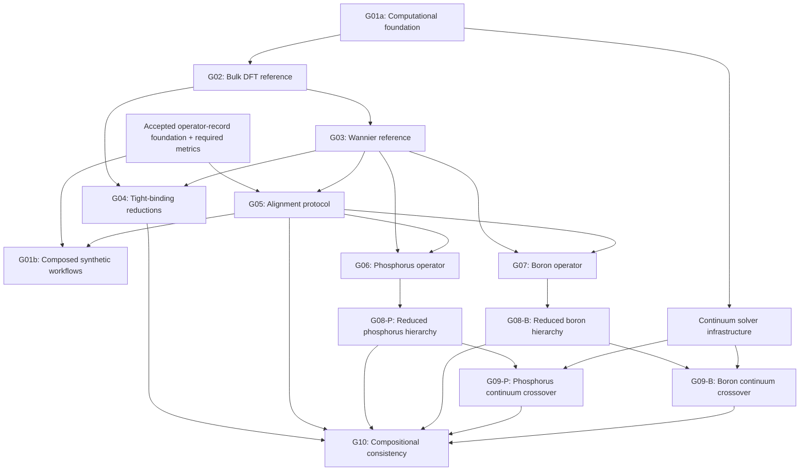

# KSDFT to Effective-Mass Theory: Computational Project Plan

back_to: [[ksdft2effmass.00]]

## Purpose

This document is the computational control plane for the research program. It decomposes the mathematical structure in [[ksdft2Effmass.01]]--[[ksdft2Effmass.10]] into executable tasks, explicit prerequisites, persistent computational artifacts, and validation gates.

The scientific and computational workflow is a stateful Colored Petri Net (CPN). Static task prerequisites below remain a planning and eligibility projection, not the authoritative runtime workflow state. The publication pipeline is maintained separately in [[ksdft2Effmass.papers.00]] and consumes accepted computational evidence.

## Numbering Convention

A computational task identifier has the form

$$
\texttt{ksdft2Effmass.computational.SS.WW.TT},
$$

where:

- `SS` identifies the computational stage;
- `WW` identifies a work package within that stage;
- `TT` identifies an executable leaf task.

For example,

```text
ksdft2Effmass.computational.03.02.01
```

denotes Stage `03`, Work Package `02`, Task `01`.

The corresponding note is

```text
ksdft2Effmass.computational.03.02.01.md
```

Stage notes use

```text
ksdft2Effmass.computational.SS.md
```

and contain the authoritative task registry for that stage. Every registered leaf task has a corresponding note constructed from [[ksdft2Effmass.computational.task-template]]. The leaf note is expanded with calculation-specific commands, parameters, and validation results when the task becomes active.

## Leaf-Task Inventory

The plan contains

$$
83
$$

materialized leaf-task notes. Each task identifier in the stage registries links directly to its corresponding file.

## Task States

| State | Meaning |
|---|---|
| `Blocked` | At least one prerequisite has not passed |
| `Ready` | All prerequisites have passed and work may begin |
| `Active` | Computation or implementation is in progress |
| `Review` | Outputs exist and are undergoing validation |
| `Passed` | Acceptance criteria have been satisfied |
| `Failed` | Acceptance criteria were not satisfied |
| `Deferred` | Removed from the active computational path |

A task is complete only when its acceptance criteria pass and its outputs have been recorded with sufficient provenance to reproduce them. In the prospective CPN, accepted, rejected, failed, and blocked are explicit typed outcome states with declared attempt/branch/gate/workflow scope; a durable marking may contain multiple attempts and branch states simultaneously. Failed attempts remain terminal history while an authorized retry creates a new attempt, and blocked branches are recoverable unless explicitly finalized.

## Computational Stages

| Stage | Computational objective | Completion gate | Status |
|---|---|---|---|
| [[ksdft2Effmass.computational.01]] | Shared specification, data structures, metrics, and regression tests | `G01a`, `G01b` | Historical G01 prospectively split; P1 closed as human-accepted `PASS` |
| [[ksdft2Effmass.computational.02]] | Converged bulk-silicon first-principles reference | `G02` | Blocked by `G01a` |
| [[ksdft2Effmass.computational.03]] | Validated bulk-silicon Wannier operator | `G03` | Blocked by `G02` |
| [[ksdft2Effmass.computational.04]] | Direct and Wannier-mediated tight-binding models | `G04` | Partly blocked by `G02`; partly by `G03` |
| [[ksdft2Effmass.computational.05]] | Common-space alignment and gauge diagnostics | `G05` | Synthetic branch contributes to `G01b` after operator-record and metric prerequisites |
| [[ksdft2Effmass.computational.06]] | Converged phosphorus impurity operator | `G06` | Blocked by `G03` and `G05` |
| [[ksdft2Effmass.computational.07]] | Converged boron impurity operator | `G07` | Blocked by `G03` and `G05` |
| [[ksdft2Effmass.computational.08]] | Nested reduced impurity operators and minimal models | `G08-P`, `G08-B` | Dopant-specific branches depend on `G06` or `G07` |
| [[ksdft2Effmass.computational.09]] | Continuum operators and crossover radii | `G09-P`, `G09-B` | Solver branch may begin after `G01a`; physical results require the corresponding `G08` gate |
| [[ksdft2Effmass.computational.10]] | Cross-path, gauge, and composition consistency tests | `G10` | Depends on the paths being compared |

## Prospective CPN implementation task registry

The accepted operator-record foundation remains complete. The never-launched
A–H workflow sequence is preserved historically and superseded prospectively by:

| Task | Scope | State |
|---|---|---|
| P0 | SNAKES Python/packaging/license/capability and MyST tooling preflight | Closed; human-accepted `CONDITIONAL_PASS` |
| P0A | Bounded SNAKES/MyST packaging, notice, and documentation configuration | Closed; human-accepted `PASS` |
| P1 | Project-owned CPN token/place/transition/marking contract | Closed as human-accepted `PASS` through `P1-HC03` Option A on 2026-08-04, after reviews and parent verification |
| P2 | Provenance and external-tool capability records | Blocked by P1 |
| P3 | SNAKES adapter and project-owned marking persistence | Blocked by P1/P2 |
| P4 | Neutral periodic electronic-structure structures, specifications, and datasets | Blocked by P1/P2 |
| P5 | QE mechanical I/O and immutable execution boundary | Blocked by P2/P4 |
| P6 | QE semantic adapter and SCF-validation subnet | Blocked by P3/P4/P5 |
| P7 | Direct spectral/TB fan-out subnet | Blocked by P3/P4/P6 |
| P8 | Wannier specification and QE-to-Wannier90 bridge | Blocked by P3/P4/P5/P6 |
| P9 | Wannier90 execution and result-adaptation subnet | Blocked by P2/P3/P8 |
| P10 | Synthetic composed workflow verification | Blocked by P6/P7/P8/P9/metrics |
| P11 | Human-authorized bulk-Si campaign | Blocked by accepted G01a marking, human-accepted P10, and accepted production checkpoint |

These task prerequisites are launch controls and a static projection only. The
future scientific workflow state is the durable CPN marking. `P1-HC01` Option A
and `P1-HC02` Option B are resolved. Final P1 acceptance was granted as Option A
through `P1-HC03` on 2026-08-04, after reviews and parent verification; P1 is
closed as human-accepted `PASS`. No successor was selected or launched, and
P2--P11 and production or scientific execution remain blocked and unauthorized.

## Static prerequisite projection



This Mermaid diagram is a derived static prerequisite view. It is not the scientific workflow model and cannot represent multiset markings, iterations, retries, failures, recovery, authorization, or independent concurrent branch states.

The G01 split is prospective and preserves the historical unsplit gate evidence.
G01a supplies the computational foundation needed by G02 and early solver
infrastructure. G01b records later composed synthetic scientific workflows,
including alignment, and is not a prerequisite of G02. This removes the former
G01/alignment cycle. Early infrastructure does not imply that a physical
crossover radius can be computed without a validated atomistic impurity
operator.

## One static priority path

One planning priority path to the first complete impurity result is

$$
G01a
\longrightarrow
G02
\longrightarrow
G03
\longrightarrow
G05
\longrightarrow
G06
\longrightarrow
G08_{\mathrm P}
\longrightarrow
G09_{\mathrm P}.
$$

This path prioritizes phosphorus as the first complete demonstration. Boron is developed as a parallel transferability branch after the shared Wannier and alignment gates pass.

## Projected work lanes

### Lane A: Parent electronic structure

$$
G01a
\longrightarrow
G02
\longrightarrow
G03.
$$

### Lane B: Reduced bulk models

$$
G02
\longrightarrow
\mathrm{DFT2TB},
\qquad
G03
\longrightarrow
\mathrm{Wannier2TB}.
$$

### Lane C: Alignment methodology

Synthetic alignment depends on the accepted operator-record foundation and its required metrics and contributes to `G01b`. It is not a prerequisite for `G01a` or G02. First-principles alignment validation begins after `G03`.

### Lane D: Continuum infrastructure

Effective-mass solvers, embedding operators, and exterior-error metrics may begin after `G01a`. Dopant-specific crossover calculations wait for `G08-P` or `G08-B`, respectively.

### Lane E: Dopant calculations

The phosphorus and boron branches may run concurrently after `G03` and `G05`, although phosphorus remains the reference implementation.

## Gate Definitions

## CPN workflow semantics

The authoritative prospective workflow model is

$$
\mathcal N=(P,T,A,\Sigma,C,G,E,I),
$$

with a marking that assigns a multiset of colored tokens to each place. A
transition is enabled only when arc expressions can bind suitable input tokens,
the guard accepts those immutable bindings, and required authorization,
capability, provenance, and validation tokens are present. Guards perform no
external I/O or execution. QE, Wannier90, scheduler/MPI, transfer, and optional
rendering operations use durable immutable request/result or failure boundaries
outside guard evaluation.

The accepted neutral `PeriodicElectronicStructureDataset` parent fans out independently to direct
spectral/TB and Wannier routes. A later join requires the same accepted parent
manifest, compatible specification versions, required representation metadata,
and verified provenance; two completed branch tokens are insufficient.

The project-owned CPN architecture and P0–P11 task sequence are recorded in
`.pi/tasks/backend-neutral-cpn-workflow-architecture.md` and
`docs/architecture/colored-petri-net-workflows.md`. SNAKES is declared only as
an optional `workflow` dependency. `P1-HC01` Option A and `P1-HC02` Option B are
resolved. Final P1 acceptance was granted as Option A through `P1-HC03` on
2026-08-04, after reviews and parent verification; P1 is closed as
human-accepted `PASS`. No successor was selected or launched, and P2--P11 and
production or scientific execution remain blocked and unauthorized.

## Gate markings

### Historical `G01` and prospective gates `G01a`/`G01b`

The original unsplit `G01` record is preserved as historical evidence. Human
architecture approval on 2026-08-03 prospectively supersedes it with:

- `G01a`, which passes when specifications, the accepted operator-record
  foundation, portable provenance/manifests, common early-validation metrics,
  neutral periodic KS/GKS electronic-structure contracts, QE mechanical rendering/parsing,
  separate semantic input/result mapping, and synthetic execution fixtures have
  completed their own acceptance gates;
- `G01b`, which passes when composed synthetic scientific workflows cover
  explicit basis/state-space alignment, composed reduction paths, later
  end-to-end evidence, and reproducibility from accepted manifests.

G01a and G01b pass only when their declared typed evidence exists in an accepted
durable marking. G02 depends only on the accepted `G01a` marking. G01b alignment
depends on the accepted operator-record foundation and required metrics; G01a
does not depend on alignment. Boolean node completion or an unmanifested note
cannot satisfy either gate.

### Implemented operator-record foundation

The accepted operator-record infrastructure currently provides:

- finite `OperatorRecord` storage with explicit state-space, basis, geometry,
  energy-reference, provenance, and matrix metadata;
- fixed-representation Hermiticity analysis;
- deterministic version-1 JSON serialization with public schema and golden
  fixtures;
- exact representation-metadata compatibility auditing;
- represented subtraction for already-compatible records;
- maximum-entry, Frobenius, and spectral residual analysis;
- a concrete comparison Workflow composing differencing and residual analysis;
- maintained software-verification evidence and documented analytical and
  floating-point numerical-verification cases.

This infrastructure does not align bases or gauges, convert units, align energy
zeros, transform geometries, decide physical equivalence, or identify a generic
represented difference as an impurity operator. Scientific validation,
uncertainty quantification, and a Rust implementation have not been performed.
The accepted closeout does not pass `G01a` or `G01b`. Their remaining
provenance, metrics, neutral periodic electronic-structure/QE infrastructure, alignment, and
composed synthetic-workflow requirements are separate bounded work.

### Accepted marking `G02`: Bulk First-Principles Reference

The G02 accepted marking requires:

- total energy, band-edge energies, valley position, and effective masses satisfy stated convergence tolerances;
- the accepted SCF parent and path/diagnostic NSCF datasets required for bulk validation are reproducible;
- the bulk reference dataset is frozen.

G02 does not predict or freeze a Wannier-compatible uniform grid. Stage 03 owns
that uniform-grid NSCF child after bands, projections, windows, and grid are
approved, and the child token references the accepted G02 SCF parent manifest.
Meeting notes or unmanifested historical calculations do not provide an accepted
G02 marking.

### Accepted marking `G03`: Wannier Reference

Requires:

- the target subspace and disentanglement protocol are documented;
- interpolation errors pass throughout the validation domain;
- centers, spreads, and real-space hopping decay are stable;
- the reference Wannier Hamiltonian is frozen.

### Accepted marking `G04`: Tight-Binding Reductions

Requires:

- direct and Wannier-mediated tight-binding models are independently fitted;
- training and withheld validation sets are separated;
- operator, spectral, and band-edge errors are reported;
- model complexity is frozen.

### Accepted marking `G05`: Alignment Protocol

Requires:

- orbital correspondence and rank compatibility are checked;
- principal-angle and overlap diagnostics pass;
- the alignment map is reproducible;
- gauge and parameter sensitivity are quantified.

### Accepted markings `G06` and `G07`: Dopant Operators

Each marking requires:

- the doped-supercell sequence is converged;
- the doped Wannier operators pass validation;
- the bulk operator is transported into the dopant comparison space;
- the extracted impurity operator is stable against supercell size, gauge, and alignment choices.

### Accepted markings `G08-P` and `G08-B`: Reduced Impurity Hierarchies

Each dopant marking requires:

- the full atomistic impurity operator has been decomposed;
- nested model classes have been constructed;
- each model has been solved using the same numerical definitions;
- the least complex model satisfying the acceptance vector has been identified.

### Accepted markings `G09-P` and `G09-B`: Continuum Crossovers

Each dopant marking requires:

- the continuum solver and atomistic embedding pass synthetic tests;
- the exterior and cross-coupling errors are computed;
- the crossover radius is determined or shown not to exist at the stated tolerances;
- atomistic and continuum bound-state observables are compared.

### Accepted marking `G10`: Compositional Consistency

Requires:

- gauge-equivariance defects are measured;
- direct and Wannier-mediated tight-binding paths are compared;
- impurity extraction before and after reduction is compared;
- an empirical or analytical error-composition rule is reported with its validity domain.

## Shared Computational Artifacts

Every branch must consume and produce versioned artifacts rather than undocumented intermediate files.

| Artifact | Minimum contents |
|---|---|
| `PhysicalSpecification` | composition, geometry, charge state, functional, pseudopotentials, spin treatment, boundary conditions |
| `NumericalSpecification` | cutoffs, meshes, convergence tolerances, eigensolver settings, software versions |
| `ArtifactReference` | content identity, logical run/campaign path, checksum, size, format, role, retention, producer manifest; no storage URI |
| `ArtifactLocation` | deployment-specific mapping from artifact identity to storage URI |
| `RunManifest` | input identities, argument vectors, sanitized environment, timestamps, outputs, dependencies, and execution state |
| `PeriodicElectronicStructureDataset` | compact periodic KS/GKS calculation ResultObject with specifications, realized crystal structure, Brillouin-zone sampling, spectra, occupations, energy convention, capabilities, manifest identity, and external artifact references |
| `OperatorRecord` | one finite square matrix with explicit state-space, basis, geometry, and energy-reference metadata |
| `SubspaceRecord` | projectors, ranks, windows, overlaps, principal angles |
| `ValidationRecord` | reference, candidate, norms, observables, tolerances, pass/fail result |
| `ModelRecord` | model class, parameters, fitting data, validation data, domain of validity |

## Reproducibility Rule

No downstream task may depend only on a figure, manually copied parameter, or undocumented notebook state. A dependency is satisfied only by a versioned artifact and a passing validation record.

## Current Task Selection

The periodic KS/GKS scientific object and adapter architecture remains approved as prospectively corrected by `docs/architecture/periodic-electronic-structure-integration.md`.
Its never-launched A–H linear workflow sequence is prospectively superseded by
the project-owned CPN architecture and P0–P11 task program in
`.pi/tasks/backend-neutral-cpn-workflow-architecture.md`. The human PI granted
final acceptance through `CPN-HC01` on 2026-08-03, and the architecture task is
closed. The human PI accepted bounded P0 as `CONDITIONAL_PASS` through resolved
`P0-HC01` on 2026-08-03 and P0A as `PASS` through resolved `P0A-HC01` on the
same date; both tasks are closed. P0A declares SNAKES only in the optional
`workflow` extra and MyST/Sphinx only in the optional `docs` extra. `P1-HC01`
Option A and `P1-HC02` Option B are resolved. Final P1 acceptance was granted as
Option A through `P1-HC03` on 2026-08-04, after reviews and parent verification;
P1 is closed as human-accepted `PASS`. No successor was selected or launched,
and P2--P11 and production or scientific execution remain blocked and
unauthorized. An explicit unitary basis/state-space alignment implementation
contributes to G01b but is not active.

## Relationship to the Mathematical Program

| Mathematical note | Primary computational realization |
|---|---|
| [[ksdft2Effmass.01]] | Stages `01` and `02` |
| [[ksdft2Effmass.02]] | Stages `02` and `03` |
| [[ksdft2Effmass.03]] | Stage `03` |
| [[ksdft2Effmass.04]] | Stage `05` |
| [[ksdft2Effmass.05]] | Stage `04` |
| [[ksdft2Effmass.06]] | Stages `06` and `07` |
| [[ksdft2Effmass.07]] | Stage `08` |
| [[ksdft2Effmass.08]] | Stages `01`, `04`, `05`, `08`, `09`, and `10` |
| [[ksdft2Effmass.09]] | Stage `09` |
| [[ksdft2Effmass.10]] | Stage `10` |
