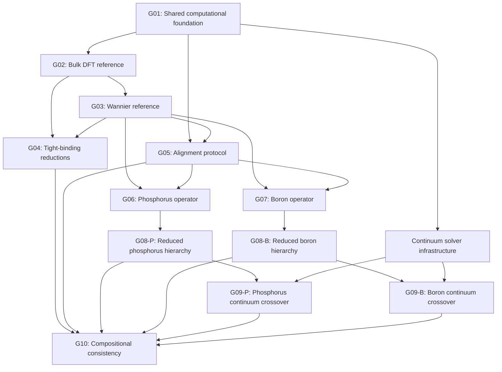

# KSDFT to Effective-Mass Theory: Computational Project Plan

back_to: [[ksdft2effmass.00]]

## Purpose

This document is the computational control plane for the research program. It decomposes the mathematical structure in [[ksdft2Effmass.01]]--[[ksdft2Effmass.10]] into executable tasks, explicit prerequisites, persistent computational artifacts, and validation gates.

The computational dependency graph determines the order of work. The publication pipeline is maintained separately in [[ksdft2Effmass.papers.00]] and consumes completed computational outputs.

## Numbering Convention

A computational task identifier has the form

$$
\texttt{ksdft2Effmass.computational.SS.WW.TT},
$$

where:

- `SS` identifies the computational stage;
- `WW` identifies a work package within that stage;
- `TT` identifies an executable leaf task.

For example,

```text
ksdft2Effmass.computational.03.02.01
```

denotes Stage `03`, Work Package `02`, Task `01`.

The corresponding note is

```text
ksdft2Effmass.computational.03.02.01.md
```

Stage notes use

```text
ksdft2Effmass.computational.SS.md
```

and contain the authoritative task registry for that stage. Every registered leaf task has a corresponding note constructed from [[ksdft2Effmass.computational.task-template]]. The leaf note is expanded with calculation-specific commands, parameters, and validation results when the task becomes active.

## Leaf-Task Inventory

The plan contains

$$
82
$$

materialized leaf-task notes. Each task identifier in the stage registries links directly to its corresponding file.

## Task States

| State | Meaning |
|---|---|
| `Blocked` | At least one prerequisite has not passed |
| `Ready` | All prerequisites have passed and work may begin |
| `Active` | Computation or implementation is in progress |
| `Review` | Outputs exist and are undergoing validation |
| `Passed` | Acceptance criteria have been satisfied |
| `Failed` | Acceptance criteria were not satisfied |
| `Deferred` | Removed from the active computational path |

A task is complete only when its acceptance criteria pass and its outputs have been recorded with sufficient provenance to reproduce them.

## Computational Stages

| Stage | Computational objective | Completion gate | Status |
|---|---|---|---|
| [[ksdft2Effmass.computational.01]] | Shared specification, data structures, metrics, and regression tests | `G01` | Incomplete; no active leaf task selected |
| [[ksdft2Effmass.computational.02]] | Converged bulk-silicon first-principles reference | `G02` | Blocked by `G01` |
| [[ksdft2Effmass.computational.03]] | Validated bulk-silicon Wannier operator | `G03` | Blocked by `G02` |
| [[ksdft2Effmass.computational.04]] | Direct and Wannier-mediated tight-binding models | `G04` | Partly blocked by `G02`; partly by `G03` |
| [[ksdft2Effmass.computational.05]] | Common-space alignment and gauge diagnostics | `G05` | Synthetic branch may begin after `G01` |
| [[ksdft2Effmass.computational.06]] | Converged phosphorus impurity operator | `G06` | Blocked by `G03` and `G05` |
| [[ksdft2Effmass.computational.07]] | Converged boron impurity operator | `G07` | Blocked by `G03` and `G05` |
| [[ksdft2Effmass.computational.08]] | Nested reduced impurity operators and minimal models | `G08-P`, `G08-B` | Dopant-specific branches depend on `G06` or `G07` |
| [[ksdft2Effmass.computational.09]] | Continuum operators and crossover radii | `G09-P`, `G09-B` | Solver branch may begin after `G01`; physical results require the corresponding `G08` gate |
| [[ksdft2Effmass.computational.10]] | Cross-path, gauge, and composition consistency tests | `G10` | Depends on the paths being compared |

## Global Dependency Graph



The arrows from `G01` to the continuum branches indicate that solver infrastructure and synthetic validation may begin early. They do not imply that a physical crossover radius can be computed without a validated atomistic impurity operator.

## Critical Path

The shortest path to the first complete impurity result is

$$
G01
\longrightarrow
G02
\longrightarrow
G03
\longrightarrow
G05
\longrightarrow
G06
\longrightarrow
G08_{\mathrm P}
\longrightarrow
G09_{\mathrm P}.
$$

This path prioritizes phosphorus as the first complete demonstration. Boron is developed as a parallel transferability branch after the shared Wannier and alignment gates pass.

## Parallel Work Lanes

### Lane A: Parent electronic structure

$$
G01
\longrightarrow
G02
\longrightarrow
G03.
$$

### Lane B: Reduced bulk models

$$
G02
\longrightarrow
\mathrm{DFT2TB},
\qquad
G03
\longrightarrow
\mathrm{Wannier2TB}.
$$

### Lane C: Alignment methodology

Synthetic alignment tests begin after `G01`. First-principles alignment validation begins after `G03`.

### Lane D: Continuum infrastructure

Effective-mass solvers, embedding operators, and exterior-error metrics begin after `G01`. Dopant-specific crossover calculations wait for `G08-P` or `G08-B`, respectively.

### Lane E: Dopant calculations

The phosphorus and boron branches may run concurrently after `G03` and `G05`, although phosphorus remains the reference implementation.

## Gate Definitions

### `G01`: Shared Computational Foundation

Passes when:

- the physical and numerical specifications are frozen and versioned;
- the operator record and run-manifest formats are implemented;
- the common error metrics are executable;
- synthetic regression tests pass.

### Implemented operator-record foundation

The accepted operator-record infrastructure currently provides:

- finite `OperatorRecord` storage with explicit state-space, basis, geometry,
  energy-reference, provenance, and matrix metadata;
- fixed-representation Hermiticity analysis;
- deterministic version-1 JSON serialization with public schema and golden
  fixtures;
- exact representation-metadata compatibility auditing;
- represented subtraction for already-compatible records;
- maximum-entry, Frobenius, and spectral residual analysis;
- a concrete comparison Workflow composing differencing and residual analysis;
- maintained software-verification evidence and documented analytical and
  floating-point numerical-verification cases.

This infrastructure does not align bases or gauges, convert units, align energy
zeros, transform geometries, decide physical equivalence, or identify a generic
represented difference as an impurity operator. Scientific validation,
uncertainty quantification, and a Rust implementation have not been performed.
The accepted closeout does not pass the broader `G01` gate, whose remaining
manifests, metrics, alignment, and synthetic-workflow requirements are separate
work.

### `G02`: Bulk First-Principles Reference

Passes when:

- total energy, band-edge energies, valley position, and effective masses satisfy stated convergence tolerances;
- production SCF and NSCF datasets are reproducible;
- the bulk reference dataset is frozen.

### `G03`: Wannier Reference

Passes when:

- the target subspace and disentanglement protocol are documented;
- interpolation errors pass throughout the validation domain;
- centers, spreads, and real-space hopping decay are stable;
- the reference Wannier Hamiltonian is frozen.

### `G04`: Tight-Binding Reductions

Passes when:

- direct and Wannier-mediated tight-binding models are independently fitted;
- training and withheld validation sets are separated;
- operator, spectral, and band-edge errors are reported;
- model complexity is frozen.

### `G05`: Alignment Protocol

Passes when:

- orbital correspondence and rank compatibility are checked;
- principal-angle and overlap diagnostics pass;
- the alignment map is reproducible;
- gauge and parameter sensitivity are quantified.

### `G06` and `G07`: Dopant Operators

Each gate passes when:

- the doped-supercell sequence is converged;
- the doped Wannier operators pass validation;
- the bulk operator is transported into the dopant comparison space;
- the extracted impurity operator is stable against supercell size, gauge, and alignment choices.

### `G08-P` and `G08-B`: Reduced Impurity Hierarchies

Passes separately for each dopant when:

- the full atomistic impurity operator has been decomposed;
- nested model classes have been constructed;
- each model has been solved using the same numerical definitions;
- the least complex model satisfying the acceptance vector has been identified.

### `G09-P` and `G09-B`: Continuum Crossovers

Passes separately for each dopant when:

- the continuum solver and atomistic embedding pass synthetic tests;
- the exterior and cross-coupling errors are computed;
- the crossover radius is determined or shown not to exist at the stated tolerances;
- atomistic and continuum bound-state observables are compared.

### `G10`: Compositional Consistency

Passes when:

- gauge-equivariance defects are measured;
- direct and Wannier-mediated tight-binding paths are compared;
- impurity extraction before and after reduction is compared;
- an empirical or analytical error-composition rule is reported with its validity domain.

## Shared Computational Artifacts

Every branch must consume and produce versioned artifacts rather than undocumented intermediate files.

| Artifact | Minimum contents |
|---|---|
| `PhysicalSpecification` | composition, geometry, charge state, functional, pseudopotentials, spin treatment, boundary conditions |
| `NumericalSpecification` | cutoffs, meshes, convergence tolerances, eigensolver settings, software versions |
| `RunManifest` | input hashes, commands, environment, timestamps, outputs, dependencies |
| `OperatorRecord` | state-space identifier, basis, matrix blocks, geometry, energy reference, gauge metadata |
| `SubspaceRecord` | projectors, ranks, windows, overlaps, principal angles |
| `ValidationRecord` | reference, candidate, norms, observables, tolerances, pass/fail result |
| `ModelRecord` | model class, parameters, fitting data, validation data, domain of validity |

## Reproducibility Rule

No downstream task may depend only on a figure, manually copied parameter, or undocumented notebook state. A dependency is satisfied only by a versioned artifact and a passing validation record.

## Current Task Selection

No computational successor task is active or launched by the operator-record
closeout. The registry contains passed, ready, and blocked tasks, but human
selection is required before another task becomes active. An explicit unitary
basis/state-space alignment contract is a candidate only; it is not approved for
implementation or in progress.

## Relationship to the Mathematical Program

| Mathematical note | Primary computational realization |
|---|---|
| [[ksdft2Effmass.01]] | Stages `01` and `02` |
| [[ksdft2Effmass.02]] | Stages `02` and `03` |
| [[ksdft2Effmass.03]] | Stage `03` |
| [[ksdft2Effmass.04]] | Stage `05` |
| [[ksdft2Effmass.05]] | Stage `04` |
| [[ksdft2Effmass.06]] | Stages `06` and `07` |
| [[ksdft2Effmass.07]] | Stage `08` |
| [[ksdft2Effmass.08]] | Stages `01`, `04`, `05`, `08`, `09`, and `10` |
| [[ksdft2Effmass.09]] | Stage `09` |
| [[ksdft2Effmass.10]] | Stage `10` |
