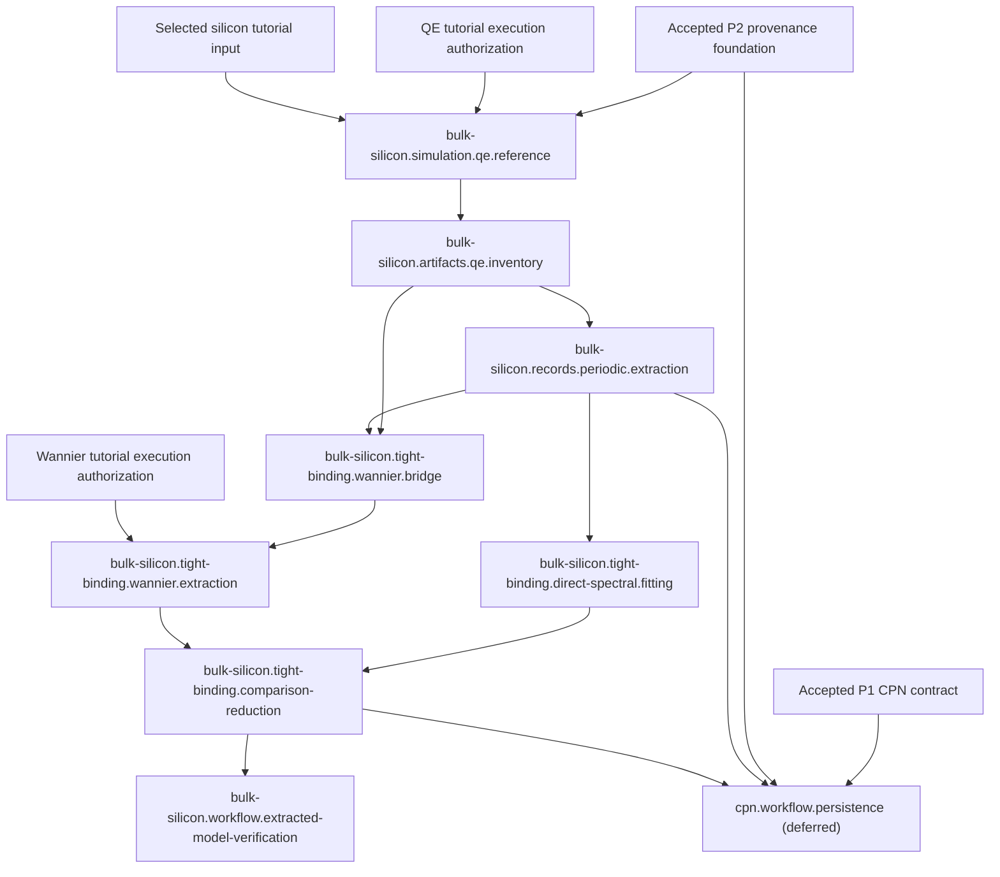

# Simulation-First Computational Bootstrap

back_to: [[ksdft2effmass.computational.00]]

task_program:
- [QE reference simulation](../../harness/tasks/bulk-silicon.simulation.qe.reference.json)
- [QE artifact inventory](../../harness/tasks/bulk-silicon.artifacts.qe.inventory.json)
- [Periodic record extraction](../../harness/tasks/bulk-silicon.records.periodic.extraction.json)
- [Symmetry-path band tutorial](../../harness/tasks/bulk-silicon.simulation.qe.band-reference.json)
- [Direct spectral TB fitting](../../harness/tasks/bulk-silicon.tight-binding.direct-spectral.fitting.json)
- [QE–Wannier90 bridge](../../harness/tasks/bulk-silicon.tight-binding.wannier.bridge.json)
- [Wannier Hamiltonian extraction](../../harness/tasks/bulk-silicon.tight-binding.wannier.extraction.json)
- [TB comparison and reduction](../../harness/tasks/bulk-silicon.tight-binding.comparison-reduction.json)
- [Extracted-model workflow verification](../../harness/tasks/bulk-silicon.workflow.extracted-model-verification.json)
- [Deferred CPN persistence](../../harness/tasks/cpn.workflow.persistence.json)

policy:
- [Pseudopotential library strategy](pseudopotential-library-strategy.md)
- [Bulk-silicon downstream sampling plan](bulk-silicon-downstream-sampling-plan.md)

downstream:
- [[ksdft2Effmass.computational.02]]
- [[ksdft2Effmass.computational.03]]
- [[ksdft2Effmass.computational.04]]

## Purpose

The bootstrap reproduces small, established silicon tutorials before the project
fixes its execution, artifact, extraction, persistence, and reduced-model
contracts. Observed native inputs, outputs, transitions, and failure states inform
the smallest useful records and actions. Tutorial observations do not override
accepted scientific specifications.

## Position in the Computational Program

The bootstrap precedes production Stage 02 and informs Stages 02--04. It is a
development and software-verification program, not an accepted bulk-silicon
reference. This page grants no Quantum ESPRESSO, Wannier90, external, scientific,
or protected execution authority. Every executable Task requires separate
activation and the applicable execution authorization.

## Development Principle

```text
observe real calculations
→ identify stable artifacts and transitions
→ define minimal records and actions
→ reproduce them with tooling
→ harden the contracts for project calculations
```

## Bootstrap Program

The canonical contracts are the ten linked Task JSON records. Nine Tasks form
the main tutorial-to-model path. `cpn.workflow.persistence` is a
deferred, nonblocking infrastructure Task. Canonical identity succession,
prerequisites, scope, exclusions, completion criteria, and status remain in the
Task JSON and `harness/task-graph.json`; this page explains their scientific and
computational rationale without duplicating mutable state.

The earlier `P3`--`P11` decomposition is superseded by this simulation-first
program. Its exact identity mapping is retained in
[`simulation-first-task-migration.md`](../../harness/reports/simulation-first-task-migration.md).
Supersession neither activates a replacement nor satisfies a prerequisite.

## Dependency Sequence



The Mermaid view is explanatory. The canonical edge set is
`harness/task-graph.json`.

## Tutorial Sequence

1. Reproduce a selected silicon Quantum ESPRESSO SCF tutorial.
2. Reproduce a silicon band-structure calculation and inventory its artifacts.
3. Extract valley and effective-mass quantities as tutorial software behavior,
   without treating them as a converged Stage 02 result.
4. Reproduce a Wannier90 silicon example from supplied artifacts.
5. Reproduce the selected QE--Wannier90 silicon interface workflow.
6. Construct a declared direct spectral tight-binding fit.
7. Compare direct and Wannier-mediated tight-binding representations only after
   their compatibility prerequisites are explicit.

The exact executable, input, pseudopotential, settings, resources, outputs, and
runtime must be reported and authorized before an executable tutorial Task runs.

## Why the bootstrap starts with SCF

An SCF calculation determines a density-dependent Kohn--Sham potential and
operator. Later NSCF or band calculations hold that converged parent fixed while
solving on a mesh or symmetry path chosen for a particular observable. The
selected QE 7.2 silicon tutorial was therefore useful first because it exercised
`pw.x`, the identified legacy tutorial pseudopotential, restart and QEXSD
artifacts, provenance capture, and semantic extraction through one bounded
calculation. Its ten sampled wavevectors and four bands were adequate for that
software-verification purpose, not for an indirect gap, valley curvature,
effective mass, Wannier subspace, or tight-binding fit.

The purpose-specific children and the proposed first bands tutorial are detailed
in the [bulk-silicon downstream sampling plan](bulk-silicon-downstream-sampling-plan.md).
That plan does not activate a Task or authorize execution.

The resulting boundary is

```text
tutorial SCF
→ observed QE artifacts
→ artifact inventory
→ QEXSD semantic extraction
→ human-accepted extraction
→ retained plane-wave KS record
→ separately designed NSCF/band calculations
```

The retained tutorial energy, $-15.84452726\ \mathrm{Ry}$ after six reported SCF
iterations, agrees with the bundled reference at printed precision. This is a
reproduced tutorial observation, not production convergence, numerical
verification, scientific validation, or uncertainty quantification. See the
[calculation record](../../calculations/bulk-silicon/qe-example01-si-scf-davidson/result.md)
and [plane-wave record architecture](ksdft-pw-record-architecture.md).

## Reference Architectures

[DCore](https://issp-center-dev.github.io/DCore/master/index.html) demonstrates a
text- and HDF5-mediated computational interface for a different scientific
domain. [AiiDA](https://aiida.readthedocs.io/projects/aiida-core/en/stable/)
demonstrates explicit process, provenance, and data-management boundaries. The
bootstrap may study their separation of inputs, execution, artifacts,
provenance, and derived results. It does not adopt either object model, workflow
engine, persistence format, dependency set, or authority convention.

## Artifact Classification

| Class | Meaning in the bootstrap |
|---|---|
| Input | Human-selected tutorial input and explicit execution settings |
| Raw output | Native backend output retained without semantic rewriting |
| Numerical interface | Backend artifacts consumed by another executable or extractor |
| Scratch or restart | Potentially large mutable state used to continue execution |
| Extracted data | Compact values copied with explicit source, unit, convention, and provenance |
| Derived result | A value computed from extracted records under a declared method |
| Provenance | Immutable identities and relationships for inputs, tools, execution, and outputs |
| Disposable intermediate | Reconstructable material with an explicit retention disposition |

This classification is conceptual. It does not define a wire schema, HDF5 group
layout, storage URI, or retention implementation.

## Minimal Tooling Boundary

Observed tutorials may justify explicit-input execution requests, artifact
inventories and checksums, mechanical parsers, semantic extractors, compact
manifests, and bounded reproduction commands. Generic records should represent
stable cross-backend meaning only when the observed source and accepted
scientific specification support it. Backend-specific artifacts remain explicit.
The bootstrap does not presume that this tooling is already implemented.

## Relationship to Existing Stages

- **Stage 02** owns the converged, accepted bulk-silicon first-principles
  reference. Bootstrap tutorial results cannot satisfy `G02`.
- **Stage 03** owns the selected subspace, projections, windows, grid,
  Wannier-compatible child calculation, validated Wannier Hamiltonian, and
  `G03` acceptance.
- **Stage 04** owns accepted direct and Wannier-mediated tight-binding models,
  withheld validation, reduction, and `G04` acceptance.

## Transition to Production Work

Before Stage 02 begins, the project must know which executables and explicit
inputs are used, which artifacts are retained externally, how their identities
and lineage are recorded, which compact values are extracted, which units and
index conventions apply, how failures and restart states are represented, and
which boundaries remain backend-specific. Stage 02 still requires its accepted
scientific settings, convergence plan, resources, production authorization, and
validation gates.

## Limitations

Tutorial reproduction establishes workflow familiarity and bounded software
behavior. It does not establish convergence, an accepted bulk-silicon reference,
scientific validation, uncertainty quantification, physical adequacy, production
readiness, or human acceptance of Stages 02--04. Kohn--Sham eigenvalues are not a
unique represented operator, and passing extraction tests does not validate a
tight-binding model.

## References

- [Quantum ESPRESSO](https://www.quantum-espresso.org/)
- [Quantum ESPRESSO input-file descriptions](https://www.quantum-espresso.org/documentation/input-data-description/)
- [Wannier90 tutorials using the pwscf interface](https://wannier90.readthedocs.io/en/latest/tutorials/with_pwscf/)
- [Wannier90 Tutorial 3: silicon disentangled MLWFs](https://wannier90.readthedocs.io/en/latest/tutorials/tutorial_3/)
- [Wannier90 Tutorial 11: silicon valence and low-lying conduction states](https://wannier90.readthedocs.io/en/latest/tutorials/tutorial_11/)
- [DCore documentation](https://issp-center-dev.github.io/DCore/master/index.html)
- [AiiDA documentation](https://aiida.readthedocs.io/projects/aiida-core/en/stable/)
