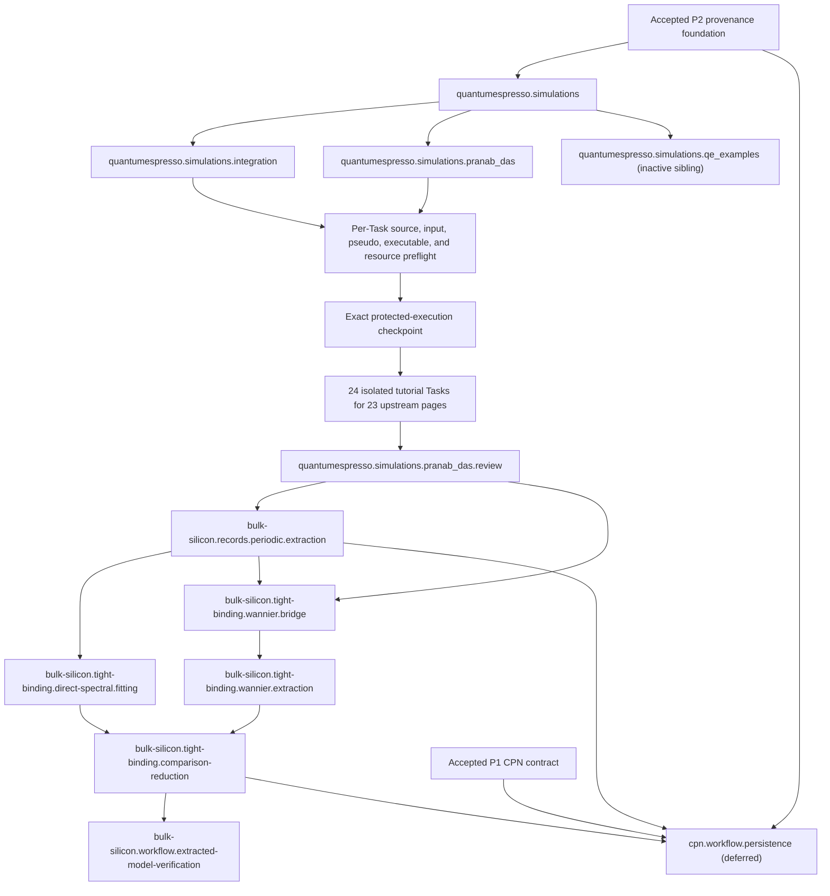

# Simulation-First Computational Bootstrap

back_to: [[ksdft2effmass.computational.00]]

task_program:
- [Quantum ESPRESSO simulation umbrella](../../tasks/simulation/quantumespresso.simulations.json)
- [Pranab Das hands-on simulation campaign](../../tasks/simulation/quantumespresso.simulations.pranab_das.json)
- [Pranab Das campaign artifact and learning review](../../tasks/simulation/quantumespresso.simulations.pranab_das.review.json)
- [Detailed Pranab Das campaign plan](quantumespresso.simulations.pranab_das.md)
- [QE 7.2 bundled-examples campaign](../../tasks/simulation/quantumespresso.simulations.qe_examples.json)
- [QE 7.2 bundled-examples inventory](quantumespresso.simulations.qe_examples.md)
- [Periodic record extraction](../../tasks/software/bulk-silicon.records.periodic.extraction.json)
- [Direct spectral TB fitting](../../tasks/research/bulk-silicon.tight-binding.direct-spectral.fitting.json)
- [QE–Wannier90 bridge](../../tasks/software/bulk-silicon.tight-binding.wannier.bridge.json)
- [Wannier Hamiltonian extraction](../../tasks/simulation/bulk-silicon.tight-binding.wannier.extraction.json)
- [TB comparison and reduction](../../tasks/research/bulk-silicon.tight-binding.comparison-reduction.json)
- [Extracted-model workflow verification](../../tasks/software/bulk-silicon.workflow.extracted-model-verification.json)
- [Deferred CPN persistence](../../tasks/software/cpn.workflow.persistence.json)

downstream:
- [[ksdft2Effmass.computational.02]]
- [[ksdft2Effmass.computational.03]]
- [[ksdft2Effmass.computational.04]]

## Purpose

The bootstrap starts from the complete selected Quantum ESPRESSO hands-on
category, while retaining silicon and the QE--Wannier90 path as the project-relevant
scientific focus. Each tutorial workflow is either reproduced under separate
execution authority or explicitly deferred after preflight. Observed native
inputs, outputs, transitions, and failure states inform the smallest useful
records and actions. Tutorial observations do not override accepted scientific
specifications or extend supported material scope.

## Position in the Computational Program

The bootstrap precedes production Stage 02 and informs Stages 02--04. It is a
development and software-verification program, not an accepted bulk-silicon
reference. This page grants no Quantum ESPRESSO, Wannier90, external, scientific,
or protected execution authority. Every executable Task requires separate
activation and the applicable execution authorization.

## Development Principle

```text
observe real calculations
→ identify stable artifacts and transitions
→ define minimal records and actions
→ reproduce them with tooling
→ harden the contracts for project calculations
```

## Bootstrap Program

The canonical contracts are the generic `quantumespresso.simulations` umbrella, the
`quantumespresso.simulations.pranab_das` campaign, the non-scientific Quantum ESPRESSO
integration prerequisite, 24 tutorial Tasks representing 23 upstream pages, the campaign review, the downstream
record/model Tasks, and the deferred nonblocking `cpn.workflow.persistence`
infrastructure Task. The detailed source selection, workspace, snapshot, stream,
preflight, and learning-disposition contract is maintained in
[`quantumespresso.simulations.pranab_das.md`](quantumespresso.simulations.pranab_das.md).
Canonical identity succession, prerequisites, scope, exclusions, completion
criteria, and status remain in the Task JSON and `harness/task-graph.json`.
The separate `quantumespresso.simulations.qe_examples` sibling campaign inventories
examples distributed with QE 7.2; it is not part of the Pranab Das tutorial sequence
and has its own per-example authorization and review boundary.

The earlier `P3`--`P11` decomposition is superseded by this simulation-first
program. Its exact identity mapping is retained in
[`simulation-first-task-migration.md`](../../harness/reports/simulation-first-task-migration.md).
Supersession neither activates a replacement nor satisfies a prerequisite.

## Dependency Sequence



The Mermaid view is explanatory. The canonical edge set is
`harness/task-graph.json`.

## Tutorial Sequence

1. Implement and verify the non-scientific
   `ksdft2effmass.integration.quantum_espresso` boundary under its own explicit
   Task and ownership.
2. Preflight all 24 tutorial Tasks representing the 23 selected hands-on pages.
3. Start with the bounded two-atom silicon SCF candidate.
4. Activate at most one isolated simulation at a time; take deterministic
   before/after snapshots and preserve separate stdout and stderr for every stage.
5. Record an executed, failed, or deliberate-deferral disposition for each
   candidate, including unrelated-material and out-of-scope learning examples.
6. Complete the campaign artifact and learning review.
7. Continue only project-relevant silicon/QE/Wannier extraction, fitting, and
   comparison work after compatibility prerequisites are explicit.

The exact executable, input, pseudopotential, settings, resources, outputs, and
runtime must be reported and authorized before any executable tutorial Task
runs. The simulation campaign is currently planned with no active Task.

## Reference Architectures

[DCore](https://issp-center-dev.github.io/DCore/master/index.html) demonstrates a
text- and HDF5-mediated computational interface for a different scientific
domain. [AiiDA](https://aiida.readthedocs.io/projects/aiida-core/en/stable/)
demonstrates explicit process, provenance, and data-management boundaries. The
bootstrap may study their separation of inputs, execution, artifacts,
provenance, and derived results. It does not adopt either object model, workflow
engine, persistence format, dependency set, or authority convention.

## Artifact Classification

| Class | Meaning in the bootstrap |
|---|---|
| Input | Human-selected tutorial input and explicit execution settings |
| Raw output | Native backend output retained without semantic rewriting |
| Numerical interface | Backend artifacts consumed by another executable or extractor |
| Scratch or restart | Potentially large mutable state used to continue execution |
| Extracted data | Compact values copied with explicit source, unit, convention, and provenance |
| Derived result | A value computed from extracted records under a declared method |
| Provenance | Immutable identities and relationships for inputs, tools, execution, and outputs |
| Disposable intermediate | Reconstructable material with an explicit retention disposition |

This classification is conceptual. It does not define a wire schema, HDF5 group
layout, storage URI, or retention implementation.

## Minimal Tooling Boundary

Observed tutorials may justify explicit-input execution requests, artifact
inventories and checksums, mechanical parsers, semantic extractors, compact
manifests, and bounded reproduction commands. Generic records should represent
stable cross-backend meaning only when the observed source and accepted
scientific specification support it. Backend-specific artifacts remain explicit.
The bootstrap does not presume that this tooling is already implemented.

## Relationship to Existing Stages

- **Stage 02** owns the converged, accepted bulk-silicon first-principles
  reference. Bootstrap tutorial results cannot satisfy `G02`.
- **Stage 03** owns the selected subspace, projections, windows, grid,
  Wannier-compatible child calculation, validated Wannier Hamiltonian, and
  `G03` acceptance.
- **Stage 04** owns accepted direct and Wannier-mediated tight-binding models,
  withheld validation, reduction, and `G04` acceptance.

## Transition to Production Work

Before Stage 02 begins, the project must know which executables and explicit
inputs are used, which artifacts are retained externally, how their identities
and lineage are recorded, which compact values are extracted, which units and
index conventions apply, how failures and restart states are represented, and
which boundaries remain backend-specific. Stage 02 still requires its accepted
scientific settings, convergence plan, resources, production authorization, and
validation gates.

## Limitations

Tutorial reproduction establishes workflow familiarity and bounded software
behavior. It does not establish convergence, an accepted bulk-silicon reference,
scientific validation, uncertainty quantification, physical adequacy, production
readiness, or human acceptance of Stages 02--04. Kohn--Sham eigenvalues are not a
unique represented operator, and passing extraction tests does not validate a
tight-binding model.

## References

- [Quantum ESPRESSO](https://www.quantum-espresso.org/)
- [Quantum ESPRESSO input-file descriptions](https://www.quantum-espresso.org/documentation/input-data-description/)
- [Wannier90 tutorials using the pwscf interface](https://wannier90.readthedocs.io/en/latest/tutorials/with_pwscf/)
- [Wannier90 Tutorial 3: silicon disentangled MLWFs](https://wannier90.readthedocs.io/en/latest/tutorials/tutorial_3/)
- [Wannier90 Tutorial 11: silicon valence and low-lying conduction states](https://wannier90.readthedocs.io/en/latest/tutorials/tutorial_11/)
- [DCore documentation](https://issp-center-dev.github.io/DCore/master/index.html)
- [AiiDA documentation](https://aiida.readthedocs.io/projects/aiida-core/en/stable/)
