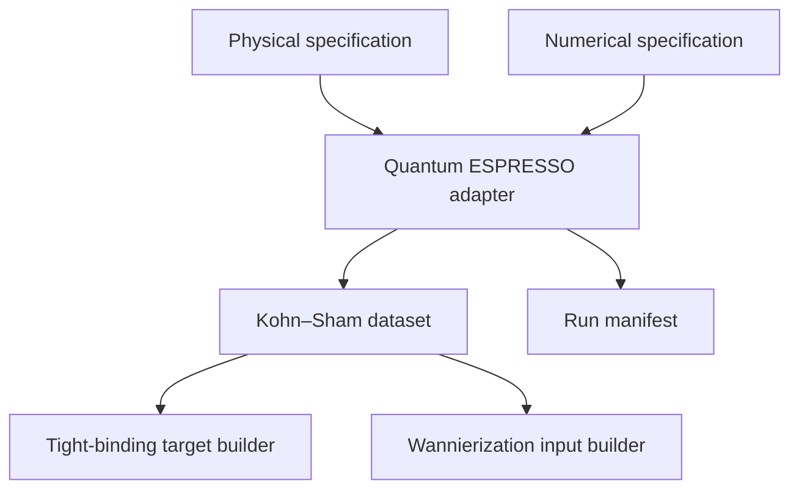

```mermaid
flowchart TD
    P["Physical specification"]
    N["Numerical specification"]
    Q["Quantum ESPRESSO adapter"]
    K["Kohn–Sham dataset"]
    T["Tight-binding target builder"]
    W["Wannierization input builder"]
    M["Run manifest"]

    P --> Q
    N --> Q
    Q --> K
    Q --> M
    K --> T
    K --> W
```
