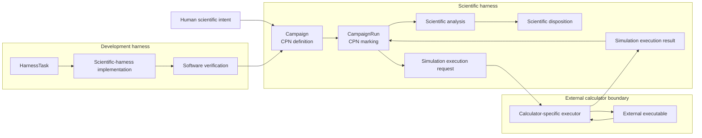

# Development and scientific control planes

> **Selected architecture boundary.** Implementation is authorized only through
> the active `harness.architecture-v2.simulation-execution` Task. The existing
> `harness.architecture-v2.plan` Task remains planning-only and inactive.

Architecture v2 separates repository development control from deterministic
scientific workflow control:

```text
Development harness
    governs repository and software changes

Scientific harness
    deterministically defines and executes scientific Campaigns

External calculators
    perform bounded numerical side effects requested by the scientific harness
```

A development Task status is not scientific Campaign state. A scientific
Campaign marking is not represented by `.pi` checkpoints or development Task
phases. Protected-execution authorization remains a human boundary, but neither
development lifecycle state nor authorization substitutes for a scientific
`CampaignRun`.

## Responsibility vocabulary

| Object | Responsibility |
|---|---|
| `HarnessTask` | Development lifecycle for repository and software changes |
| `Campaign` | Calculator-independent scientific workflow definition represented as a CPN |
| `CampaignRun` | One scientific workflow execution state, including its CPN marking |
| `Simulation` | One calculator-independent scientific operation specification |
| `QuantumEspressoSimulation` | One QE-specific simulation specification |
| `SimulationExecutionResult` | One observed calculator execution, without scientific acceptance |
| `ScientificAnalysis` | Deterministic interpretation of normalized observations |
| `ScientificDisposition` | Explicit scientific conclusion or parameter selection |

The scientific harness requests bounded external effects through a
calculator-specific executor. The executor returns mechanical observations.
Normalization and `ScientificAnalysis` are separate deterministic operations;
only an explicit `ScientificDisposition` records a scientific conclusion or
parameter selection.



## Bootstrap-execution boundary

The 18 direct `pw.x` invocations retained at observation commit
`e9c6a1453a6a9dfac8c13256d7d146f6b6ec1716` occurred through a direct bootstrap
runner governed by the development harness. They predate this deterministic
scientific Campaign architecture. Their maintained
[disposition](../../../calculations/bulk-silicon/production-convergence-preflight/bootstrap-execution-disposition.md)
classifies them as bootstrap scientific-harness development evidence. There is
no canonical scientific `CampaignRun`, no accepted production convergence
result, and no authorization for additional execution.

Those records may drive deterministic replay, parsing, receipt, artifact, and
analysis development. They cannot prove that the future scientific harness
executes correctly and must not be rewritten as if the future architecture
produced them.
