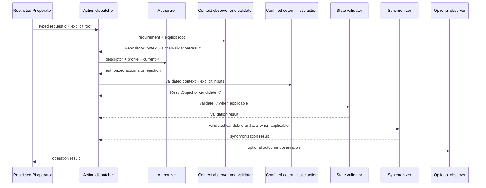

# Architecture v2 governed execution

> **Proposed architecture; inactive; not implemented; not accepted.**

This page describes an eventual operating model. It does not add Pi tools,
action code, profiles, schemas, or process isolation.

## Proposed request path

```text
restricted Pi operator
→ explicit typed request and repository root
→ operation-specific context requirement
→ repository-context observation
→ context validation
→ action authorization
→ confined deterministic ActionObject
→ ResultObject or candidate transition
→ successor-state validation when applicable
→ synchronization when applicable
→ optional operation observation
```



Context validation is a correctness boundary; optional observation is not. A
repository-sensitive Action would remain safe if participant `T` and every
telemetry store were absent. Maintained paths would be derived from and confined
beneath the explicit root, never ambient `cwd`, with root-qualified Git commands
such as `git -C <absolute-repository-root> ...`.

The proposed transition is

$$
K' = F_a(K,q).
$$

An action would receive explicit current state and a typed request, remain
deterministic for those inputs, and return candidate successor state. It would
not publish directly. Authorization, transition construction, successor
validation, synchronization, and receipt formation would remain separate.

## Candidate operational objects

The following names are planning candidates, not exact public or wire contracts:

| Candidate | Proposed responsibility |
|---|---|
| `HarnessActionDescriptor` | Stable action identity, input/result kinds, effect class, and required capabilities |
| `HarnessActionCatalog` | Immutable available descriptors for one operator profile |
| `HarnessActionContext` | Explicit current state, repository root, and bounded effect dependencies |
| `RepositoryContext` | Immutable observation of one explicitly supplied repository root |
| `RepositoryContextRequirement` | Only the repository conditions required by one operation |
| `ObserveRepositoryContext` | Read-only explicit-root observation; no ambient repository discovery |
| `ValidateRepositoryContext` | Read-only requirement/context validation returning `LocalValidationResult` with existing structured findings |
| `HarnessActionDispatcher` | Route a typed request only to a catalog action |
| `HarnessActionAuthorizer` | Decide whether current authority and profile permit the request |
| `HarnessOperationReceipt` | Deferred optional observation joining an Action result with starting and ending contexts |

The running operator would not register, replace, or enable actions dynamically.
Project-specific catalogs could compose generic actions, but generic actions
would not import project-specific composition.

## Proposed capability profiles

| Profile | Proposed capability boundary |
|---|---|
| Harness developer | Compile, validate, project to temporary state, compare, and—under explicit authority—synchronize harness artifacts |
| Bounded implementation writer | Read assigned state and modify only explicitly owned implementation paths; no control activation or catalog mutation |
| Scientific workflow operator | Perform only explicitly authorized scientific actions with protected-execution checkpoints and fixed artifact roots |
| Read-only reviewer | Load, compile, validate, compare, and inspect receipts/evidence; no synchronization or execution |

Profiles would constrain action availability, not define public software
extensibility. The same public concrete object could exist without being exposed
to every operator.

## Isolation and limitations

A Pi tool allowlist is **not** an operating-system security boundary. It can
reduce accidental capability exposure but cannot by itself prevent filesystem,
process, network, credential, or kernel-level effects available through another
allowed tool or compromised process.

A later implementation would need to distinguish:

- semantic authorization in `HarnessActionAuthorizer`;
- immutable catalog membership;
- deterministic transition validation;
- repository path confinement;
- subprocess and network policy;
- credential/data boundaries; and
- operating-system sandboxing where required.

The proposal does not claim that deterministic actions make external execution
deterministic. External execution would remain a separately authorized effect
boundary producing correlated immutable result/failure records. Harness
governance would not make scientific records depend on harness telemetry.

## Demonstrated worktree-mismatch acceptance case

The first required behavioral example comes from the recent failure:

```text
expected context: clean isolated worktree
actual commands: dirty primary checkout
reported conclusion: false control-state contradiction
```

Before any repository-state conclusion is produced, the proposed guard must
compare the expected canonical root or worktree-specific Git directory with the
observed `RepositoryContext` and return an existing structured validation result
containing a stable finding such as
`HARNESS.CONTEXT.WORKTREE_MISMATCH`. The invocation directory may explain the
mistake diagnostically but cannot authorize the actual repository. This is a
required proposed behavior, not an implemented guard.

## Receipt boundary

A later `HarnessOperationReceipt` could be formed from:

```text
Action ResultObject
+ starting RepositoryContext
+ ending RepositoryContext
→ HarnessOperationReceipt
```

It may eventually contain an opaque operation ID, optional session correlation
ID, Action identity, both contexts, outcome, existing structured findings,
diagnostic monotonic duration, and implementation version. A receipt would be
useful for traceability but would not:

- authorize the action;
- prove the action was correct;
- replace successor state;
- establish software or scientific validation;
- provide human acceptance; or
- become fallback authority after synchronization failure.

No receipt schema or persistence is frozen here. Session-event inventory,
correlation, format, query projection, retention, privacy, recurrence analysis,
and any failure-pattern catalog remain deferred until Pi's actual session
records are inspected in a separately authorized slice. No closed taxonomy,
occurrence counters, most-recent timestamps, automatic promotion, checkpoint or
Task creation, or second authoritative database is proposed.
