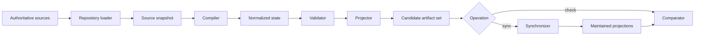

# Harness Architecture v2 planning proposal

> **Proposed architecture; inactive; not implemented; not accepted.**

This inactive proposal plans a second-generation harness architecture from
observed repository operation. It neither changes current authority nor
implements the objects, paths, commands, schemas, or tools discussed here.
`harness.architecture-v2.plan` requires separate explicit activation before any
implementation Task may be created. The active scientific Task
`bulk-silicon.records.periodic.extraction` remains unchanged.

## Why a second architecture is proposed

The accepted [control-plane cleanup](../../../harness/reports/control-plane-cleanup-slice-c-dispositions.md)
removed proven obsolete surfaces without claiming a minimal control plane. Its
accepted residuals include 112 Task records and generated Task pages, 85
completed Tasks still operationally referenced, 13 retained CLIs, 87 harness
Python modules, and coupling among current authority, history, runtime
validation, and generated projections. The preceding
[Slice B report](../../../harness/reports/control-plane-cleanup-slice-b.md) records
why many historical surfaces remained referenced. Those reports remain the
facts source; this proposal does not reproduce their inventory.

Actual scientific operation exposed the practical consequence. A
simulation-first workflow encountered substantial control-plane ceremony,
whereas the first successful Quantum ESPRESSO tutorial followed a short useful
path:

```text
human authorizes tutorial
→ bounded execution
→ compact provenance
→ artifact inventory
→ semantic extraction
→ human review
```

The tracked SQLite store also exposed WAL, SHM, journal, staging, and backup
lifecycle questions because mutable database operation and immutable projection
publication were not cleanly separated. Finally, prompt guidance could recommend
deterministic actions while unrestricted agent tools could bypass those
recommendations. Architecture v2 is proposed to address these structural
problems, not to reinterpret the completed calculation or its scientific
meaning.

## Proposed compiler model

The central proposed relation is

$$
S = C(R),
\qquad
A_i = P_i(S),
$$

where $R$ is one immutable observation of authoritative repository sources,
$C$ is deterministic compilation, $S$ is normalized harness state, $P_i$ is one
deterministic projection, and $A_i$ is a generated artifact.

```text
authoritative repository sources
→ HarnessRepositoryLoader
→ HarnessSourceSnapshot
→ HarnessCompiler
→ HarnessState
→ HarnessValidator
→ HarnessProjector
→ HarnessArtifactSet
→ HarnessSynchronizer
```

Checking would use the same loader, compiler, validator, and projector:

```text
authoritative repository sources
→ candidate artifacts
→ HarnessStateComparator
→ maintained artifacts
```

`HarnessStateComparator` would be read-only and would never publish.



## Proposed architectural planes

| Plane | Proposed responsibility |
|---|---|
| Control plane | Current authority and permitted state transitions |
| Compilation plane | Normalize authoritative sources into immutable state |
| Validation plane | Evaluate domain and cross-domain invariants |
| Projection plane | Produce SQLite, SQL, Markdown, and manifests |
| Synchronization plane | Atomically publish validated projections |
| Execution plane | Perform explicitly authorized work |
| Evidence plane | Support software, numerical, and scientific claims without becoming authority |
| Telemetry plane | Observe execution without becoming authority or evidence by itself |
| Git history | Preserve prior states and accepted decision boundaries |

No plane would become fallback authority for another. In particular, generated
SQLite would not replace source authority, telemetry would not grant permission,
receipts would not prove correctness, evidence would not activate work, and Git
history would not silently restore obsolete live control state.

## Pages

- [Principles](principles.md)
- [Information model](information-model.md)
- [Control plane](control-plane.md)
- [Compilation and projection](compilation-and-projection.md)
- [Governed execution](governed-execution.md)
- [SQLite lifecycle](sqlite-lifecycle.md)
- [Migration plan](migration-plan.md)

## Planning boundary

This proposal creates no ADR, implementation child Task, public API, schema,
plugin, action catalog, operator profile, migration, telemetry, or scientific
execution. The names used in these pages are candidates only. Human acceptance
of this planning document, if later granted, would still not activate
implementation.
