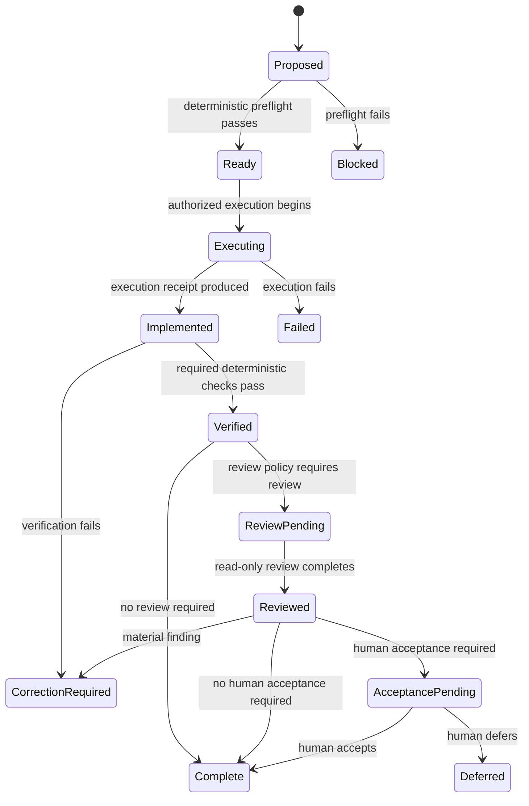

# Architecture v2 operation lifecycle

> **Proposed architecture; inactive; not implemented; not accepted.**

This page proposes a policy-selected lifecycle for one governed operation. It
creates no runtime object, dispatcher, receipt, telemetry store, Task, or
checkpoint.

## Distinct stages

```text
preflight
≠
implementation
≠
verification
≠
review
≠
human acceptance
```

A stage is not automatically a separate Task, agent, checkpoint, commit, or
human decision. Policy selects a route according to the operation's risk and
claim boundary.



The state names describe one operation lifecycle. They do not require one class
per state or imply that every route visits every state.

## Proposed stage contracts

### Preflight

```text
OperationRequest
+ RepositoryContext
+ Task authority
+ applicable capabilities
→ PreflightResult
```

Preflight checks only requirements applicable to the exact operation. Examples
include explicit repository identity, starting revision, required authoritative
inputs, execution authority, protected-operation authorization, and declared
delegation constraints. It must not become a universal replay of every harness
validator.

### Implementation

```text
authorized operation request
→ governed execution
→ candidate changes or outputs
→ ImplementationReceipt
```

An implementation receipt may bind operation identity, starting context,
authorized scope, changed paths or produced artifacts, ending context,
Action/tool outcomes, and existing structured findings. It records execution;
it does not claim correctness or acceptance.

### Verification

```text
candidate changes or outputs
+ declared deterministic requirements
→ VerificationResult
```

Verification uses deterministic owners directly and does not parse another
CLI's prose. It grants no new authority, may return correction-required
findings, and does not substitute for scientific or human acceptance.

### Review

```text
verified candidate
+ review policy
→ read-only ReviewResult
```

Review is conditional. It is not implementation ownership, mandatory for every
correction, permission to mutate, or human acceptance. A material finding may
authorize or request a bounded correction only through the applicable operation
policy.

### Human acceptance

Human acceptance is a separate decision required only when the Task's declared
claim boundary requires it. Deterministic corrections governed by accepted
authority do not require new human checkpoints.

## Policy-selected routes

### Routine deterministic correction

```text
preflight
→ implementation
→ verification
→ complete
```

### Material software implementation

```text
preflight
→ implementation
→ verification
→ read-only review
→ complete
```

### Human-mediated architecture or scientific acceptance

```text
preflight
→ implementation
→ verification
→ read-only review
→ human acceptance
→ complete
```

### Protected execution

```text
preflight
→ human authorization
→ execution
→ verification
→ review or acceptance when required
```

The protected route keeps authorization ahead of the protected effect even when
other operation authority already exists.

## Proposed information responsibilities

Architecture v2 may need representations for an operation request, repository
and execution context, preflight result, implementation receipt, verification
result, review request/result, human decision, and operation lifecycle state.
Existing DataObjects and ResultObjects should be reused where sufficient. This
proposal does not freeze names, fields, serialization, or one new class for
every lifecycle state.

## Execution topology: proposed and deferred

Current v1 can declare that delegation is unauthorized, but it does not strongly
enforce one mutating identity through restricted dispatch. Ownership manifests
are justified only for actual concurrent or delegated mutation. Architecture v2
may later distinguish `single_writer` and `delegated` at the governed-operation
boundary. Restricted dispatch, not a manifest alone, is what can enforce the
mutating identity. Read-only review remains outside mutating ownership.

This topology and enforcement work is proposed and deferred. No ownership mode,
restricted dispatcher, or manifest infrastructure is implemented here.

## Telemetry relationship

```text
operation transitions and ResultObjects
→ optional operation receipts
→ later telemetry projection
```

Telemetry observes execution. It does not authorize transitions, replace
validation, create a competing finding hierarchy, or automatically create Tasks
or checkpoints. The Pi event inventory, JSONL versus per-operation JSON, SQLite
querying, retention, privacy allowlisting, subagent correlation, recurrence
analysis, and failure-pattern catalogs remain unresolved. None is implemented
by this proposal.
