# Human review: HarnessTask contract and serial document migration

> **Revised proposal; no Task is active.** This page presents the complete
> two-stage architecture for renewed human review. It does not accept the
> proposed information model, activate either stage, implement a public object,
> prepare a file packet, migrate a file, or authorize selection-state work.

## Why the proposal was divided

The initial proposal combined information-model discovery, public implementation,
six human-mediated migrations, graph validation, and selection-state shadowing.
The human selected Option B at the activation checkpoint and required two
separately authorized stages:

1. `harness.simplification.docs-json.task-model-contract` freezes the complete
   field, wire, rendering-input, mapping, comparison, review-packet, public-API,
   and verification contract. It replaces no source authority and performs no
   implementation or migration.
2. `harness.simplification.docs-json.task-document-migration` remains blocked
   until Stage 1 is completed and explicitly human-accepted. It then implements
   the accepted contract and migrates one file at a time without changing the
   contract.

Candidate selection-state implementation is deferred to a later separately
authorized Task. The current chain remains operational authority throughout both
proposed stages. No chain cutover or deletion is authorized.

## Existing authority-merge inputs

The accepted attempt-1 inventories remain immutable. They established complete
path coverage for their revision but only seven partial mappings, zero fully
mapped paths, and residuals containing all 222 documentation paths and all 23
control paths. The one-Task JSON pilot demonstrated mechanics but did not complete
the parent migration.

Stage 1 creates a new current-revision inventory for exactly these six source
Task documents and completes all six mappings before proposing final
`HarnessTask` fields:

1. `.pi/tasks/harness.simplification.docs-json.md`
2. `.pi/tasks/harness.simplification.docs-json.publication.md`
3. `.pi/tasks/harness.simplification.docs-json.publication.triage.md`
4. `.pi/tasks/harness.simplification.docs-json.publication.hierarchy.md`
5. `.pi/tasks/harness.simplification.docs-json.authority-catalog.md`
6. `.pi/tasks/harness.simplification.docs-json.documentation-correction.md`

No exact `HarnessTask` field list is accepted or implemented before complete
source-span mappings for all six files and renewed human review.

## Explicit rendering boundary

Complete Markdown rendering has only explicit inputs:

```text
HarnessTask
+ HarnessTaskDocumentationContent
+ HarnessTaskProjectionProfile
→ HarnessTaskDocumentationRenderer
→ HarnessTaskDocumentation
```

`HarnessTask` contains canonical Task information established by the mappings.
`HarnessTaskDocumentationContent` contains documentation-owned narrative and
opaque content with exact source identity and bytes.
`HarnessTaskProjectionProfile` contains explicit rendering configuration and
exact template identity or bytes. The renderer may not use filesystem discovery,
the current working directory, repository-root discovery, hidden global
templates, or unrecorded parser state.

Maintained narrative does not move into canonical Task JSON merely to simplify
rendering. LaTeX, Mermaid, code fences, directives, tables, links, and other
opaque project content remain exact documentation-content inputs unless the
human accepts a transformation for the exact file.

## Existing objects reused

| Existing object | Reuse decision |
|---|---|
| `ArtifactIdentity` | Reused for exact SHA-256 identity of source, JSON, documentation-content, and rendered bytes |
| `HumanReviewTarget` | Reused to bind one review identity, revision, paths, evidence class, and contract references |
| `HumanReviewObservation` | Reused for explicit deterministic packet observations |
| `HumanReviewFinding` | Reused for candidate human-review issues |
| `HumanReviewPacket` | Reused as the canonical generic observations/findings/limitations component inside a migration packet |
| `HumanReviewDecision` | Reused to preserve exact human response and generic normalized review disposition |
| `HumanReviewPreparer` | Reused to canonicalize the generic review component |
| `HumanReviewDecisionRecorder` | Reused to record the generic human decision component |
| `ValidationResult` | Reused as the graph-validator structural result |
| `TaskRecordAdapter` | Retained as a temporary mixed Markdown/JSON compatibility adapter; not the canonical model |
| `TaskStateInspector` | Retained as the explicit-input consumer of mixed-format compatibility views; never Task authority |

`HumanReviewPacket` does not bind candidate Task JSON, source mappings,
documentation-content bytes, rendering profile, rendered output, or exact
comparison. `HumanReviewDecision` also lacks the migration-specific closed
file-disposition vocabulary. The proposed migration packet and file disposition
therefore compose the existing human-review objects rather than aliasing or
replacing them.

## Complete proposed information model

| Proposed class | Stereotype | Ownership |
|---|---|---|
| `HarnessTask` | DataObject | Canonical Task information; exact fields pending complete six-file mapping and human review |
| `HarnessTaskSerializer` | ActionObject | Canonical versioned JSON from one accepted `HarnessTask` |
| `HarnessTaskDeserializer` | ActionObject | Strict canonical JSON to `HarnessTask` |
| `HarnessTaskGraphValidator` | ActionObject | Parent, prerequisite, identity, and cross-Task compatibility |
| `HarnessTaskDocumentSource` | DataObject | Exact source path, revision or Git identity, bytes, byte count, and `ArtifactIdentity` |
| `HarnessTaskSourceDisposition` | enumeration | Canonical Task field, documentation-owned content, historical evidence, or proposed removal |
| `HarnessTaskSourceMapping` | DataObject | Exact byte span, source identity, disposition, target reference, and rationale |
| `HarnessTaskDocumentationContent` | DataObject | Explicit documentation-owned narrative and opaque bytes plus accepted mappings |
| `HarnessTaskProjectionProfile` | DataObject | Explicit rendering configuration, ordering, and exact template identity or bytes |
| `HarnessTaskDocumentation` | DataObject | Complete rendered Markdown bytes and `ArtifactIdentity` |
| `HarnessTaskDocumentationRenderer` | ActionObject | Pure explicit-input rendering to `HarnessTaskDocumentation` |
| `HarnessTaskDocumentationComparator` | ActionObject | Exact source/rendered comparison and mapping-coverage analysis |
| `HarnessTaskDocumentationComparisonResult` | ResultObject | Status, structured findings, exact differences, and unmapped spans |
| `HarnessTaskMigrationReviewPacketRequest` | immutable DataObject | Complete explicit runtime input boundary for preparing one packet; owns intrinsic type, immutability, tuple, nonempty, and lexical invariants but no cross-object validation |
| `HarnessTaskMigrationReviewPacketPreparer` | stateless ActionObject | Validates all cross-object identities and compatibility in one explicit request, reuses generic human-review behavior where appropriate, and deterministically produces one immutable packet |
| `HarnessTaskMigrationReviewPacket` | ResultObject | Immutable validated result produced by `HarnessTaskMigrationReviewPacketPreparer`; binds the exact request values without interpreting a human response or performing authority-changing work |
| `HarnessTaskMigrationDisposition` | enumeration | Accept file, revise contract or mapping, retain documentation ownership, or defer file |
| `HarnessTaskMigrationFileDisposition` | ResultObject | Exact migration packet, existing `HumanReviewDecision`, and migration-specific disposition |
| `HarnessTaskMigrationFileDispositionRecorder` | ActionObject | Validates packet/decision identity and records one explicit file disposition without persistence or activation |

The supporting fields above are proposed ownership categories. Stage 1 must freeze
exact names, types, ordering, invariants, and wire representation after all six
mappings. Detailed `HarnessTask` fields remain intentionally pending and are not
invented by these diagrams.

`HarnessTaskMigrationReviewPacketRequest` is runtime-only unless Stage 1 later
establishes a justified wire or persistence requirement. Its existence does not
expand the serialized-record set. Its constructor owns only intrinsic type,
immutability, tuple, nonempty, and lexical invariants. Cross-object identity and
compatibility belong to `HarnessTaskMigrationReviewPacketPreparer`.

## Overview class diagram

```mermaid
classDiagram
    class HarnessTask {
        <<DataObject>>
        field categories pending six-file mapping
    }
    class HarnessTaskSerializer {
        <<ActionObject>>
    }
    class HarnessTaskDeserializer {
        <<ActionObject>>
    }
    class HarnessTaskGraphValidator {
        <<ActionObject>>
    }
    class HarnessTaskDocumentSource {
        <<DataObject>>
    }
    class HarnessTaskSourceDisposition {
        <<enumeration>>
    }
    class HarnessTaskSourceMapping {
        <<DataObject>>
    }
    class HarnessTaskDocumentationContent {
        <<DataObject>>
    }
    class HarnessTaskProjectionProfile {
        <<DataObject>>
    }
    class HarnessTaskDocumentation {
        <<DataObject>>
    }
    class HarnessTaskDocumentationRenderer {
        <<ActionObject>>
    }
    class HarnessTaskDocumentationComparator {
        <<ActionObject>>
    }
    class HarnessTaskDocumentationComparisonResult {
        <<ResultObject>>
    }
    class HarnessTaskMigrationReviewPacketRequest {
        <<immutable DataObject>>
    }
    class HarnessTaskMigrationReviewPacketPreparer {
        <<stateless ActionObject>>
    }
    class HarnessTaskMigrationReviewPacket {
        <<ResultObject>>
    }
    class HarnessTaskMigrationDisposition {
        <<enumeration>>
    }
    class HarnessTaskMigrationFileDisposition {
        <<ResultObject>>
    }
    class HarnessTaskMigrationFileDispositionRecorder {
        <<ActionObject>>
    }
    class ArtifactIdentity {
        <<DataObject>>
    }
    class HumanReviewPacket {
        <<ResultObject>>
    }
    class HumanReviewDecision {
        <<ResultObject>>
    }
    class ValidationResult {
        <<ResultObject>>
    }
    class TaskRecordAdapter {
        <<adapter>>
    }
    class TaskStateInspector {
        <<ActionObject>>
    }

    HarnessTaskSerializer ..> HarnessTask : input
    HarnessTaskDeserializer ..> HarnessTask : output
    HarnessTaskGraphValidator ..> HarnessTask : input graph
    HarnessTaskGraphValidator ..> ValidationResult : output
    HarnessTaskDocumentSource *-- ArtifactIdentity : exact bytes
    HarnessTaskSourceMapping --> HarnessTaskSourceDisposition : classifies span
    HarnessTaskDocumentationContent *-- HarnessTaskDocumentSource : source
    HarnessTaskDocumentationContent *-- HarnessTaskSourceMapping : accepted spans
    HarnessTaskDocumentation *-- ArtifactIdentity : rendered bytes
    HarnessTaskDocumentationRenderer ..> HarnessTask : explicit input
    HarnessTaskDocumentationRenderer ..> HarnessTaskDocumentationContent : explicit input
    HarnessTaskDocumentationRenderer ..> HarnessTaskProjectionProfile : explicit input
    HarnessTaskDocumentationRenderer ..> HarnessTaskDocumentation : output
    HarnessTaskDocumentationComparator ..> HarnessTaskDocumentSource : source input
    HarnessTaskDocumentationComparator ..> HarnessTaskDocumentation : rendered input
    HarnessTaskDocumentationComparator ..> HarnessTaskSourceMapping : coverage input
    HarnessTaskDocumentationComparator ..> HarnessTaskDocumentationComparisonResult : output
    HarnessTaskMigrationReviewPacketRequest *-- HarnessTaskDocumentSource : exact source
    HarnessTaskMigrationReviewPacketRequest *-- HarnessTaskSourceMapping : complete ordered mappings
    HarnessTaskMigrationReviewPacketRequest *-- HarnessTask : candidate
    HarnessTaskMigrationReviewPacketRequest *-- HarnessTaskDocumentationContent : explicit narrative
    HarnessTaskMigrationReviewPacketRequest *-- HarnessTaskProjectionProfile : explicit profile
    HarnessTaskMigrationReviewPacketRequest *-- HarnessTaskDocumentation : rendered output
    HarnessTaskMigrationReviewPacketRequest *-- HarnessTaskDocumentationComparisonResult : comparison
    HarnessTaskMigrationReviewPacketRequest *-- HumanReviewPacket : generic review component
    HarnessTaskMigrationReviewPacketPreparer ..> HarnessTaskMigrationReviewPacketRequest : explicit input
    HarnessTaskMigrationReviewPacketPreparer ..> HarnessTaskMigrationReviewPacket : immutable output
    HarnessTaskMigrationReviewPacket *-- HarnessTaskMigrationReviewPacketRequest : validated exact values
    HarnessTaskMigrationFileDisposition *-- HarnessTaskMigrationReviewPacket : exact packet
    HarnessTaskMigrationFileDisposition *-- HumanReviewDecision : exact human response
    HarnessTaskMigrationFileDisposition --> HarnessTaskMigrationDisposition : file outcome
    HarnessTaskMigrationFileDispositionRecorder ..> HarnessTaskMigrationReviewPacket : input
    HarnessTaskMigrationFileDispositionRecorder ..> HumanReviewDecision : input
    HarnessTaskMigrationFileDispositionRecorder ..> HarnessTaskMigrationFileDisposition : output
    TaskRecordAdapter ..> HarnessTask : temporary compatibility view
    TaskStateInspector ..> TaskRecordAdapter : mixed Markdown JSON inspection
```

## Focused class diagrams

### `HarnessTask`

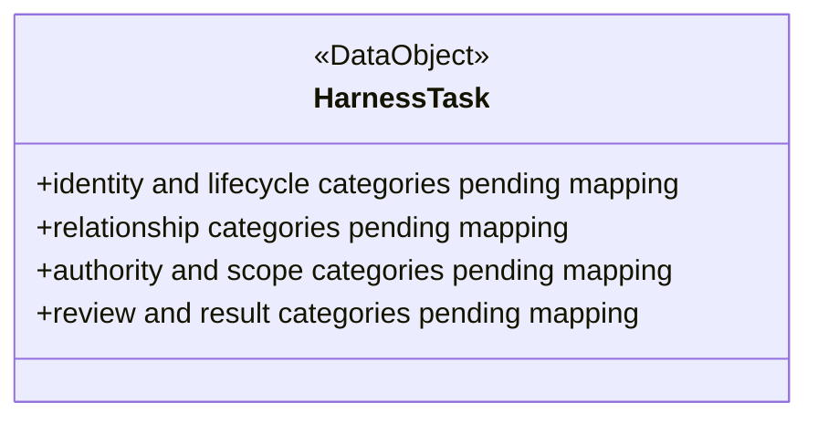

### `HarnessTaskSerializer`

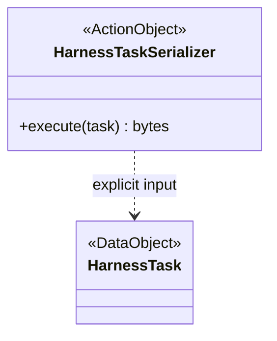

### `HarnessTaskDeserializer`

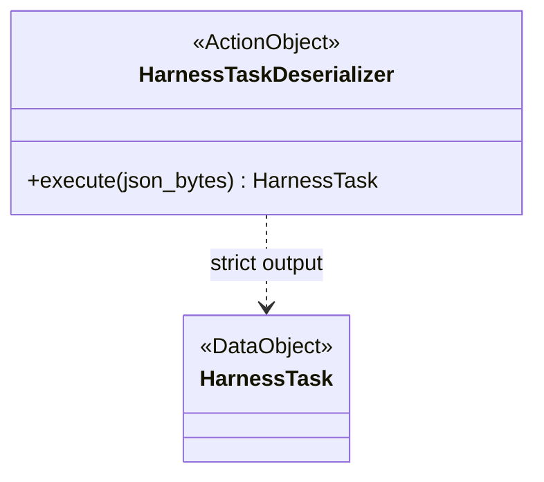

### `HarnessTaskGraphValidator`

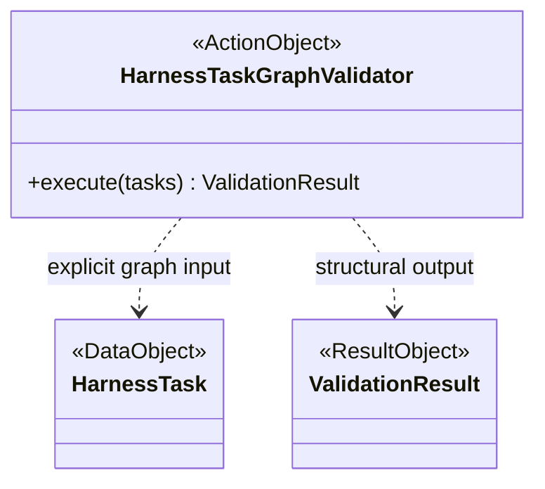

### `HarnessTaskDocumentSource`

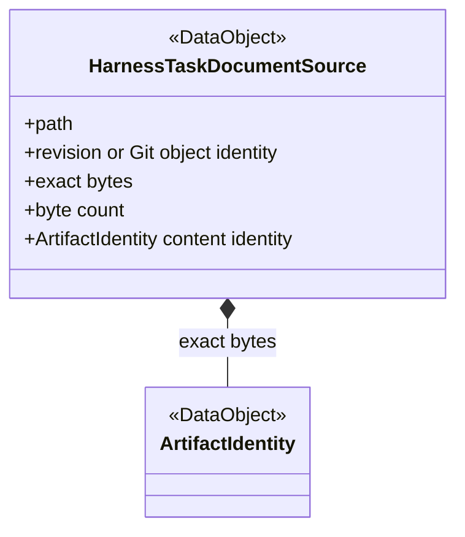

### `HarnessTaskSourceDisposition`

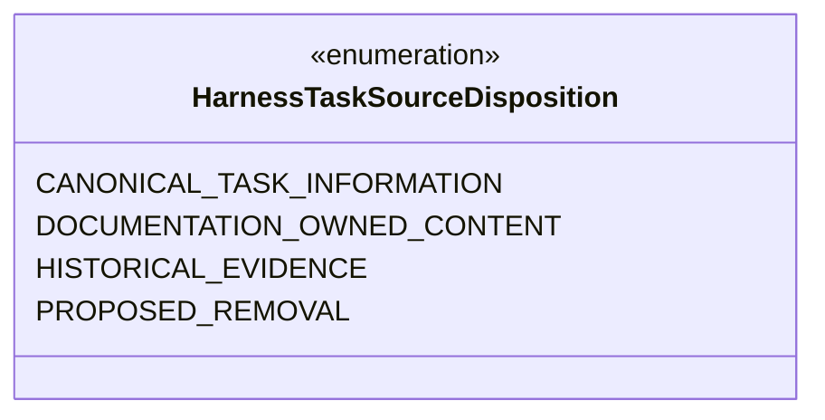

### `HarnessTaskSourceMapping`

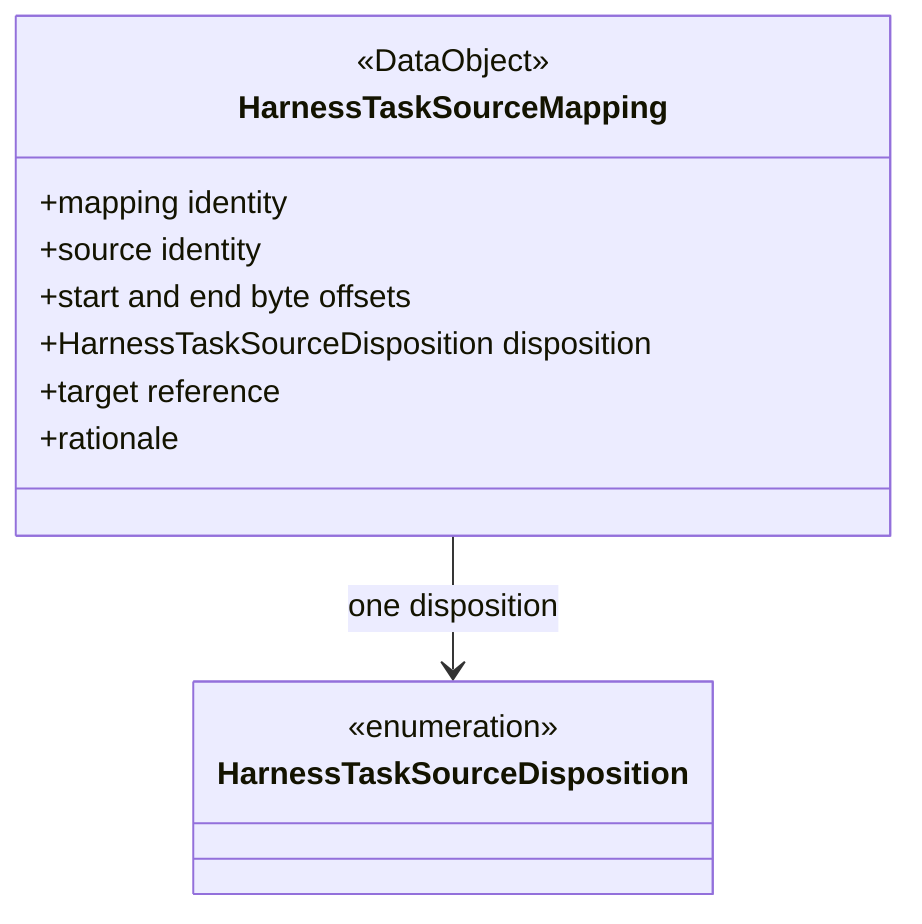

### `HarnessTaskDocumentationContent`

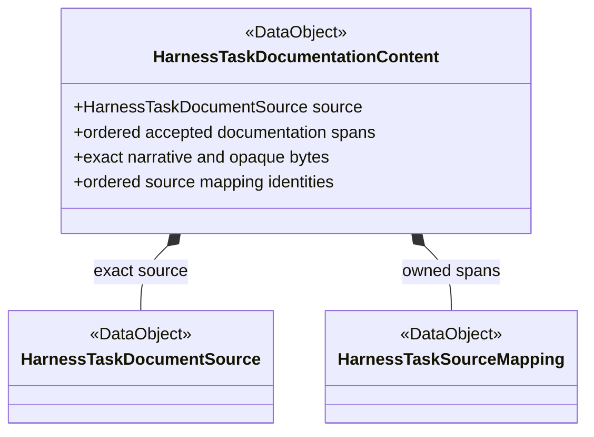

### `HarnessTaskProjectionProfile`

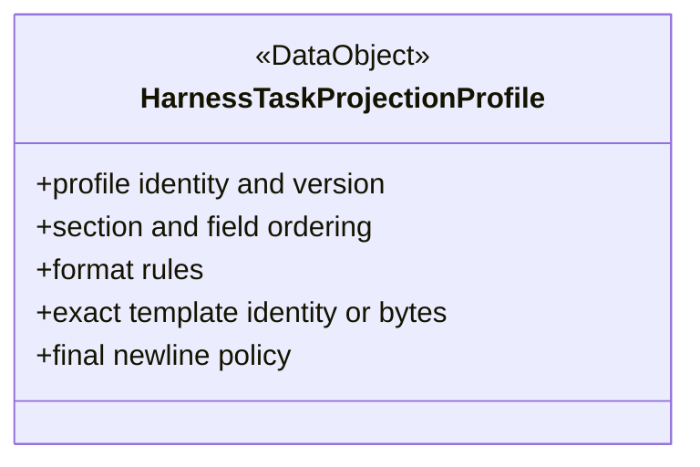

### `HarnessTaskDocumentation`

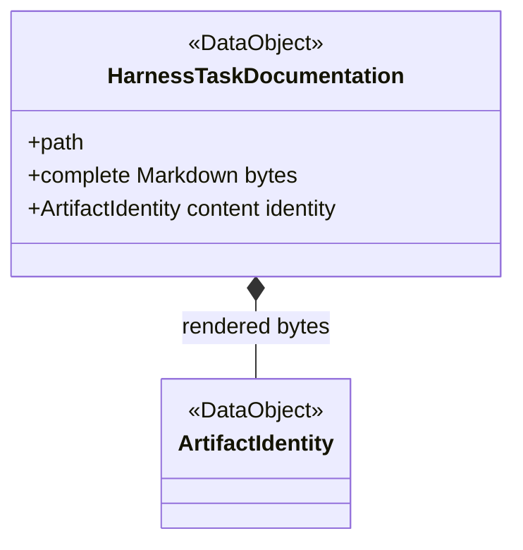

### `HarnessTaskDocumentationRenderer`

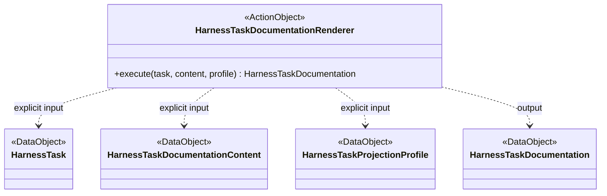

### `HarnessTaskDocumentationComparator`

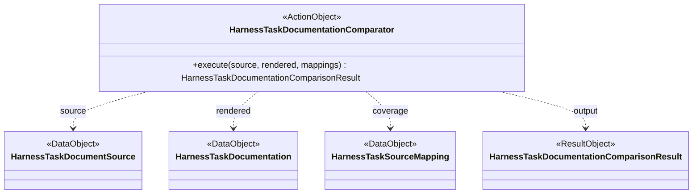

### `HarnessTaskDocumentationComparisonResult`

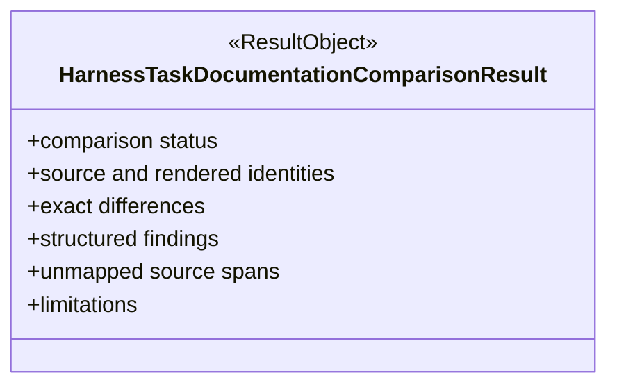

### `HarnessTaskMigrationReviewPacketRequest`

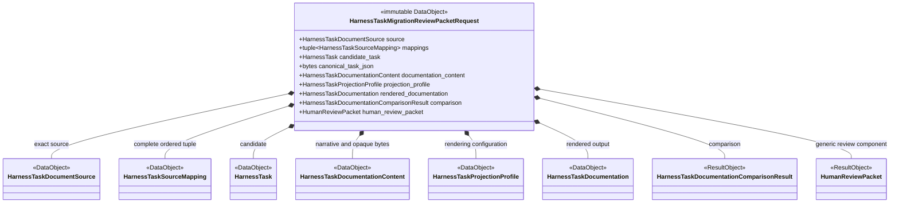

The request validates only intrinsic type, immutability, tuple, nonempty, and
lexical invariants. It does not validate compatibility among its objects. It is
runtime-only unless the frozen Stage-1 contract later justifies a wire or
persistence requirement.

### `HarnessTaskMigrationReviewPacketPreparer`

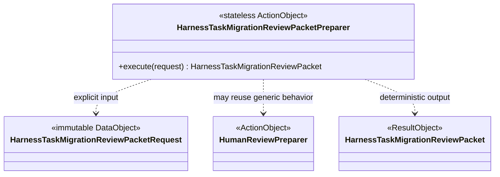

Its exact proposed action boundary is:

```text
HarnessTaskMigrationReviewPacketPreparer.execute(
    request: HarnessTaskMigrationReviewPacketRequest,
) -> HarnessTaskMigrationReviewPacket
```

The preparer owns source-identity agreement; complete, ordered, nonoverlapping
mapping coverage; mapping references to the exact source; candidate Task and
canonical JSON agreement; documentation-content and source-span agreement;
projection-profile and rendered-document agreement; rendered/source comparison
identity; consistency of comparison status, differences, findings, and unmapped
spans; generic `HumanReviewPacket` target and revision agreement; and
deterministic construction of the immutable migration packet.

It may reuse `HumanReviewPreparer` behavior but does not duplicate or replace
generic human-review semantics. It performs no filesystem or repository
discovery, current-directory or Git-root inference, Git access, persistence,
human-response interpretation, human acceptance, source replacement, Task
migration, checkpoint mutation, Task activation, or successor activation.

### `HarnessTaskMigrationReviewPacket`

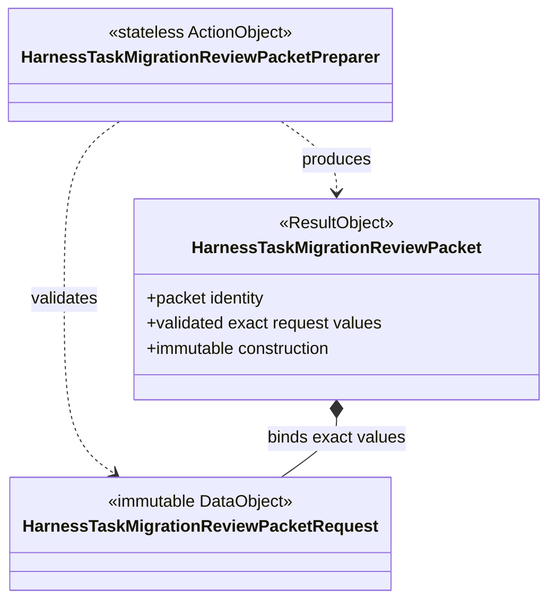

### `HarnessTaskMigrationDisposition`

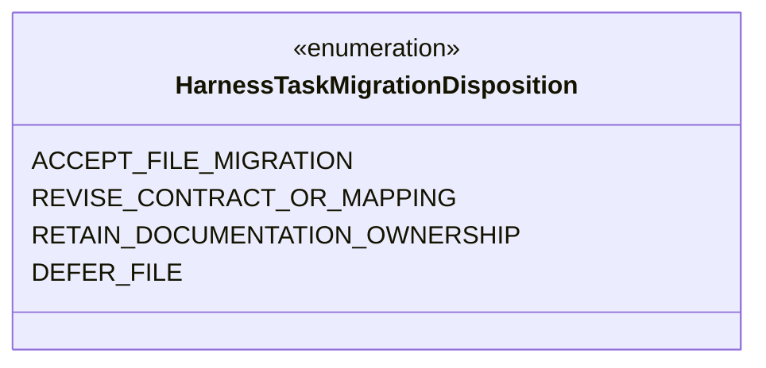

### `HarnessTaskMigrationFileDisposition`

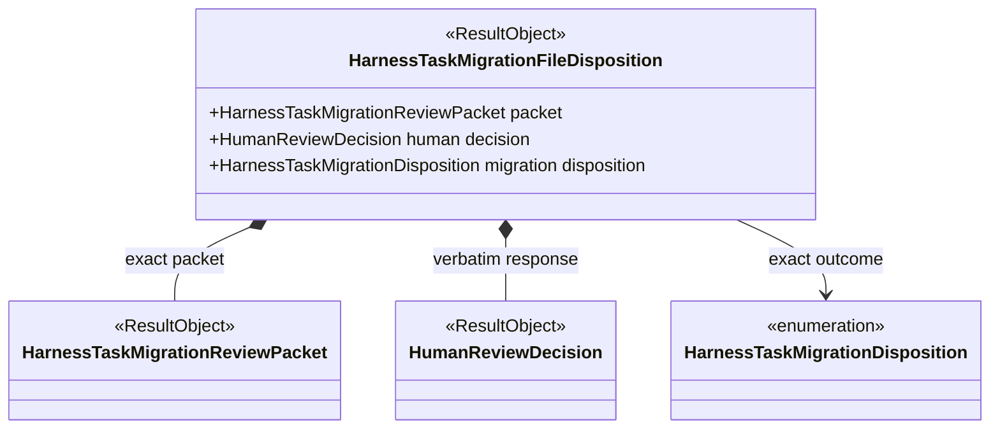

### `HarnessTaskMigrationFileDispositionRecorder`

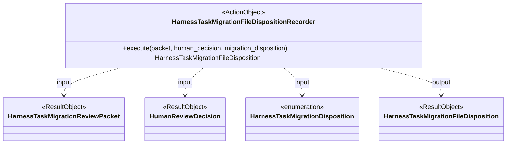

## Public-interface accounting

The proposal contains exactly 19 new interfaces: 10 DataObject or ResultObject
interfaces, seven ActionObjects, and two enumerations. The two newly explicit
interfaces are the runtime-only immutable
`HarnessTaskMigrationReviewPacketRequest` and the stateless
`HarnessTaskMigrationReviewPacketPreparer`. Reused classes in the earlier table
do not count as newly proposed interfaces.

The request does not automatically become a serialized record. Stage 1 may add a
wire or persistence contract only if its completed mappings establish a concrete
need and the renewed human review accepts it. No implementation or serialized
record is added by this proposal correction.

`HarnessTaskMigrationReviewPacket` remains the immutable ResultObject produced
by the preparer. `HumanReviewDecisionRecorder` remains the sole owner of the
generic human decision. `HarnessTaskMigrationFileDispositionRecorder` remains
the migration-domain action that validates the exact packet/decision
relationship and produces `HarnessTaskMigrationFileDisposition`. Neither action
moves human interpretation or authority into packet preparation or disposition
recording.

## Proposed verification obligations

Stage 1 must specify software-verification evidence for these boundaries without
implementing tests during the contract stage:

- request construction accepts only the exact field types and enforces
  immutability, tuple, nonempty, and lexical invariants;
- request construction does not perform cross-object identity or compatibility
  validation;
- the preparer rejects every listed source, mapping, Task/JSON, documentation,
  projection, rendering, comparison, and generic-review incompatibility;
- equivalent explicit requests produce equal immutable packet values
  deterministically;
- the preparer performs no discovery, Git access, persistence, human-response
  interpretation, authority change, mutation, migration, activation, or
  successor activation;
- any reuse of `HumanReviewPreparer` preserves generic human-review semantics;
- `HumanReviewDecisionRecorder` retains generic decision ownership; and
- `HarnessTaskMigrationFileDispositionRecorder` requires the exact packet and
  decision relationship and cannot interpret or accept a human response.

No request serialization round-trip obligation exists unless Stage 1 separately
justifies and proposes a wire contract for human acceptance.

## Stage 1: Task-model contract

Stage 1 performs current-revision inventory, complete six-file source-span
mapping, field and rendering-contract derivation, canonical schema and fixture
design, public-API accounting for all 19 proposed interfaces, verification-
obligation design for the request/preparer and remaining boundaries, and renewed
human review. It does not replace source authority, implement a class, generate
a file packet, or migrate a file.

The maintained Stage-1 Task page is
[harness.002.001.011](ksdft2effmass.harness.002.001.011.md).

## Stage 2: serial per-file migration

Stage 2 remains inactive and blocked until Stage 1 is completed and its frozen
contract is explicitly human-accepted. Stage 2 then implements exactly that
contract and processes the six files serially.

One immutable file packet is prepared, then work stops for one human disposition:

1. accept this file migration;
2. revise the contract or mapping;
3. retain documentation ownership; or
4. defer the file.

A required contract change stops Stage 2. It cannot be applied inside a file
packet and must return to a separately reviewed contract-revision decision.

## Review semantics

Both stages use the bounded rule:

```text
one independent review is completed
→ every material finding receives an explicit disposition
→ every correction receives deterministic verification
→ no material finding remains unresolved
```

A failed review remains failed. A correction disposition does not rewrite it as
passing, and no repeated-review loop is authorized.

## Selection-state boundary

Selection-state implementation is outside both proposed stages. The accepted
architecture still requires future selection state to remain separate from Task
data, but its DataObject, fields, validation, comparison, diagrams, implementation,
and cutover require a later separately authorized Task. The current chain remains
operational authority and may not be deleted or cut over here.

## Explicit exclusions

Neither proposed stage authorizes implementation or migration before its own
activation. Neither stage authorizes batch review, ambient discovery, hidden
renderer inputs, schema expansion during Stage 2, selection-state implementation,
chain cutover or deletion, SQLite, telemetry, dependencies, scientific work,
publication, external execution, protected work, release action, or automatic
successor activation.

## Renewed human review question

Should Stage 1, `harness.simplification.docs-json.task-model-contract`, be
activated to complete the six-file mappings and return the frozen model and
rendering contract for explicit human acceptance, while Stage 2 remains inactive
and blocked?

## Navigation

- **Index:** [Harness documentation](ksdft2effmass.harness.000.000.000.md)
- **Parent:** [First harness simplification round](ksdft2effmass.harness.002.001.000.md)
- **Previous:** [Incremental migration plan](ksdft2effmass.harness.002.001.009.md)
- **Next:** [HarnessTask model-contract stage](ksdft2effmass.harness.002.001.011.md)
