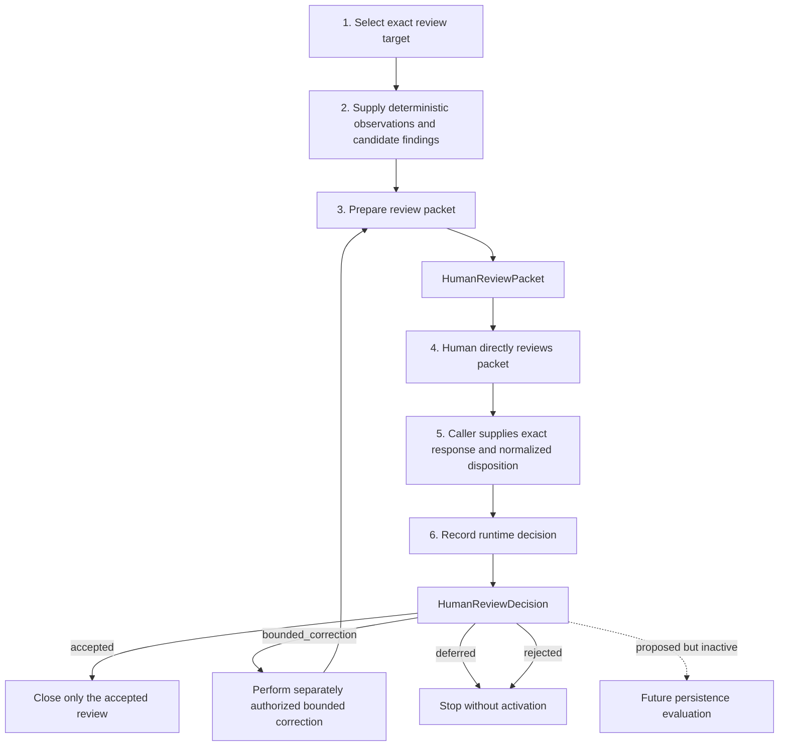

# Human review interface

> **Corrected pilot accepted; decision recording awaits review.** The explicit-input
> packet pilot is human-accepted as software-verification PASS. Pure runtime decision
> representation is implemented and awaiting direct human review. Persistence,
> automatic acceptance, checkpoints, and successor activation remain inactive.

## Problem

Human source and test audits are currently performed conversationally. That process
mixes deterministic observations with human judgment, while repeated agent reviews
can add ceremony, duplicate findings, and obscure which actor has authority. The
harness should prepare compact, reviewable evidence without replacing human
judgment or presenting tool success as acceptance.

## Authority boundary

Deterministic Actions may inspect explicitly supplied artifacts and return structured
observations. An LLM may summarize, critique, and recommend. Only the human may
accept, reject, defer, remand, waive a finding, or authorize follow-on work. Passing
deterministic checks does not imply human acceptance, and duplicate reviewer runs
are not independent evidence. The interface must not resolve a decision, activate a
successor, or authorize protected work automatically.

## End-to-end flow

The human judgment is step 4 and occurs outside the software ActionObjects. Packet
preparation organizes supplied material; decision recording stores an exact decision
already made by the human. Neither ActionObject performs the review itself.

## Decomposition

| Part | DataObjects or ResultObjects | ActionObject | Current status | Detail |
|---|---|---|---|---|
| Review subject and supplied material | `HumanReviewTarget`, `HumanReviewObservation`, `HumanReviewFinding` | None; callers supply these records | Implemented | [Initial round](ksdft2effmass.harness.003.001.000.md) |
| Packet preparation | `HumanReviewPacket` | `PrepareHumanReviewPacket` | Corrected pilot human-accepted | [Initial round](ksdft2effmass.harness.003.001.000.md) |
| Human judgment | Human response outside the API | None; the person performs the review | Human authority only | [Human decision recording](ksdft2effmass.harness.003.001.002.md) |
| Decision representation | `HumanReviewDecision` | `RecordHumanReviewDecision` | Implemented, awaiting direct human review | [Human decision recording](ksdft2effmass.harness.003.001.002.md) |
| Persistence and querying | Not defined | Not defined | Proposed and inactive | Architecture alternatives below |

The detailed decision-recording page contains separate DataObject and ActionObject
tables. There is no generic `HumanReviewObserver`, `HumanReviewFinder`, or software
`HumanReviewer` in the implemented boundary.

## Architecture alternatives

### 1. Filesystem review packets

Maintain review inputs, observations, findings, limitations, and decisions as
versioned JSON and Markdown artifacts. This has transparent repository provenance
and a low initial implementation boundary, but cross-review queries and normalized
relations become increasingly cumbersome.

### 2. SQLite-backed review state

Represent observations, findings, dispositions, and their relations in a normalized
SQLite store. This supports querying and consistency constraints, but prematurely
selecting a schema could freeze conversational assumptions before the review
contract is understood.

### 3. Hybrid filesystem summaries and SQLite observations

Retain immutable human-readable filesystem summaries while normalizing observations
and relations in SQLite. This separates durable review packets from queryable state
and is the recommended long-term direction.

The hybrid recommendation is decision support only and remains unaccepted. The
[initial round](ksdft2effmass.harness.003.001.000.md) implements a pure explicit-input
packet API, one accepted corrected Markdown pilot, and pure
[human decision recording](ksdft2effmass.harness.003.001.002.md). It selects no
persistent filesystem or SQLite contract; those alternatives remain open while the
review boundary is evaluated.

## Claim boundary

A review packet may organize software-verification observations and human findings.
It cannot manufacture oracle independence, numerical correctness, scientific
validation, uncertainty quantification, provenance truth, or human acceptance.
Those conclusions require their own applicable evidence and authority.

## Navigation

- **Index:** [Harness documentation](ksdft2effmass.harness.000.000.000.md)
- **Parent:** [Harness documentation](ksdft2effmass.harness.000.000.000.md)
- **Previous:** [Incremental migration plan](ksdft2effmass.harness.002.001.009.md)
- **Next:** [Initial human-review interface round](ksdft2effmass.harness.003.001.000.md)
- **Child:** [Initial human-review interface round](ksdft2effmass.harness.003.001.000.md)
- **Current slice:** [Human decision recording](ksdft2effmass.harness.003.001.002.md)
