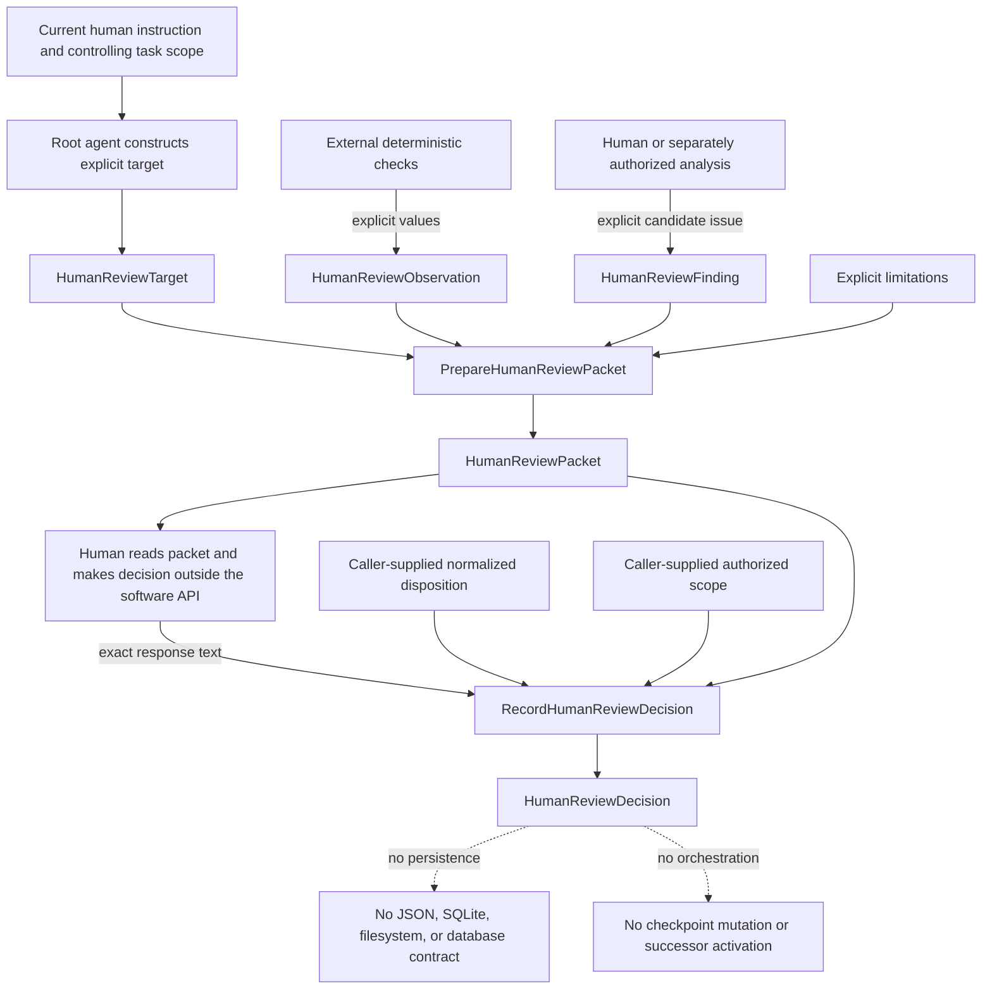

# Human decision recording

> **Implemented and awaiting direct human review.** This slice represents an explicit
> decision already made by a human. It does not perform the human review, interpret
> natural language, persist state, mutate Git or checkpoints, or activate successors.

## Process and object ownership

### DataObjects and ResultObjects

| Object | Role | How it is obtained |
|---|---|---|
| `HumanReviewTarget` | DataObject identifying the exact review subject and revision | Supplied explicitly by the caller |
| `HumanReviewObservation` | DataObject containing one deterministic observation | Supplied by an external deterministic check |
| `HumanReviewFinding` | DataObject containing one candidate issue for human judgment | Supplied by a human or separately authorized analysis |
| `HumanReviewPacket` | ResultObject, semantically a DataObject, containing prepared review material | Returned by `PrepareHumanReviewPacket.execute` |
| `HumanReviewDecision` | ResultObject, semantically a DataObject, containing an already-made human decision | Returned by `RecordHumanReviewDecision.execute` |

### ActionObjects

| Object | Explicit inputs | Result | What it does not do |
|---|---|---|---|
| `PrepareHumanReviewPacket` | Target, observations, findings, and limitations | `HumanReviewPacket` | Does not run checks, discover findings, or make a human decision |
| `RecordHumanReviewDecision` | Packet, exact human response, normalized disposition, and authorized scope | `HumanReviewDecision` | Does not interpret text, authenticate authority, persist state, or activate work |

### Target provenance

`HumanReviewTarget` is constructed explicitly by the root agent acting as the API
caller, from the current human instruction and controlling task scope. Its review identifier, exact
revision, represented subject, paths, evidence class, and contract references are all
caller-supplied. No ActionObject discovers a repository, chooses files, reads Git, or
infers what deserves review. Selecting the target remains an authority and scope
operation outside the runtime API.

`HumanReviewObservation` and `HumanReviewFinding` are explicit input records. This
slice does not introduce a generic `HumanReviewObserver` or `HumanReviewFinder`:
observation methods and finding sources are heterogeneous, and no authorized generic
operation derives either record. Likewise, there is no software `HumanReviewer`; the
human judgment occurs outside the API.

## Decision representation

`HumanReviewDecision` is an immutable concrete ResultObject and semantically a
DataObject. It stores:

- the packet review identifier;
- the packet target's exact lowercase 40-character reviewed revision;
- the exact human-response string without trimming or rewriting;
- one caller-supplied normalized disposition; and
- an ordered immutable tuple of explicit authorized-scope statements.

The closed normalized disposition vocabulary is `accepted`, `bounded_correction`,
`deferred`, and `rejected`. `bounded_correction` requires nonempty unique scope;
`accepted`, `deferred`, and `rejected` prohibit scope. These are intrinsic represented
state rules, not natural-language interpretation.

## Recording action

`RecordHumanReviewDecision` is a fieldless stateless ActionObject. Its `execute`
method receives one `HumanReviewPacket`, exact human-response text, an explicit
normalized disposition, and explicit scope. It copies packet identity and constructs
one decision. Identical inputs return equal decisions and leave the packet unchanged.

The action rejects `accepted` when the packet is
`blocked_by_invalid_observation`. A ready packet may be explicitly accepted even when
advisory findings or limitations remain. This compatibility rule does not grant the
caller human authority and does not automatically accept any packet.

## Explicit exclusions

The API performs no:

- natural-language interpretation, fuzzy matching, recommendation, or voting;
- filesystem, Git, subprocess, clock, network, or database action;
- JSON serialization, schema validation, or persistence;
- checkpoint lookup or mutation;
- reviewer spawning, replay, retry, or successor activation; or
- numerical verification, scientific validation, or uncertainty quantification.

The maintained tests are software verification only. They establish the documented
runtime contract, not review quality, authority authenticity, provenance truth, or
scientific adequacy.

## Persistence boundary

A possible persistence evaluation remains proposed and inactive. This slice chooses
no filesystem or SQLite representation and creates no public wire contract. Any later
persistence design requires separate human authorization and compatibility review.

## Navigation

- **Index:** [Harness documentation](ksdft2effmass.harness.000.000.000.md)
- **Parent:** [Initial human-review interface round](ksdft2effmass.harness.003.001.000.md)
- **Previous:** [Human Review Packet and Decision Workflow](ksdft2effmass.harness.003.001.001.md)
