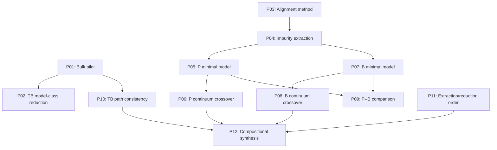

# KSDFT to Effective-Mass Theory: Publication Pipeline

back_to: [[ksdft2Effmass.00]]

## Purpose

This pipeline tracks publishable claims that consume validated computational artifacts. It does not determine the order of scientific work. Computational dependencies are maintained in [[ksdft2Effmass.computational.00]].

## Publication States

| State | Meaning |
|---|---|
| `Concept` | Scientific claim has been identified |
| `Waiting` | Required computational gates have not passed |
| `Analysis` | Required gates passed and claim is being evaluated |
| `Drafting` | Main result survived analysis and manuscript writing has begun |
| `Internal review` | Complete manuscript under collaborator review |
| `Submitted` | Submitted to a journal or proceedings |
| `Revision` | Responding to review |
| `Published` | Version of record available |
| `Retired` | Claim merged into another paper or not supported |

## Rule for Opening a Manuscript

A manuscript moves from `Waiting` to `Analysis` only when:

1. its required computational gates have passed;
2. its central figure or table can be generated from versioned artifacts;
3. its principal claim has a quantitative acceptance or falsification criterion;
4. known negative or null outcomes remain publishable and interpretable.

## Paper Registry

| ID                         | Working claim                                                    | Computational prerequisites                              | Initial state |
| -------------------------- | ---------------------------------------------------------------- | -------------------------------------------------------- | ------------- |
| `P01`                      | Bulk silicon: parallel Wannier and parameterized TB reductions   | `G02`, `G03`, `G04`                                      | Waiting       |
| [[ksdft2effmass.P02\|P02]] | Operator projection onto a restricted tight-binding model class  | `G03`, `G04`                                             | Waiting       |
| `P03`                      | Gauge-stable alignment of projected electronic subspaces         | `G05`, `10.01.01`                                        | Waiting       |
| `P04`                      | First-principles extraction of localized impurity operators      | `G05`, `G06`; strengthened by `G07`                      | Waiting       |
| `P05`                      | Minimal phosphorus impurity Hamiltonian                          | `G06`, `G08-P`                                           | Waiting       |
| `P06`                      | Phosphorus atomistic-to-continuum crossover                      | `G09-P`                                                  | Waiting       |
| `P07`                      | Orbital and nonlocal structure of the boron impurity operator    | `G07`, `G08-B`                                           | Waiting       |
| `P08`                      | Limits of continuum acceptor models for boron in silicon         | `G09-B`                                                  | Waiting       |
| `P09`                      | Donor--acceptor asymmetry in impurity-operator reduction         | `G08-P`, `G08-B`; preferably `G09-P`, `G09-B`            | Waiting       |
| `P10`                      | Consistency of direct and Wannier-mediated TB reductions         | `G04`, `10.01.02`                                        | Waiting       |
| `P11`                      | Compatibility of impurity extraction and model reduction         | `10.02.03`                                               | Waiting       |
| `P12`                      | Error-labeled compositional reduction of electronic Hamiltonians | `G10` and results from multiple physical systems         | Waiting       |
| `P13`                      | Reproducible operator-reduction software and benchmarks          | `G01` plus demonstrated use in at least two later stages | Waiting       |
| `P14`                      | Reusable first-principles and reduced-operator dataset           | `G06`, `G07`, complete provenance and licensing          | Waiting       |

## Paper Dependencies



The arrows represent logical development of claims, not mandatory publication order.

## Combination Rules

To avoid fragmentation:

- merge `P01` and `P02` if the operator-level reduction is complete when the bulk pilot is written;
- merge `P03` and `P04` if the alignment method has only been demonstrated for impurity extraction;
- merge `P05` and `P06` if the phosphorus continuum calculation follows immediately and neither result supports a complete standalone analysis;
- merge `P07` and `P08` under the same condition for boron;
- retain `P09` only if the common framework reveals a genuine donor--acceptor contrast;
- retain `P12` only if several measured diagrams support a nontrivial compositional claim.

## Minimum Publication Set

The minimum coherent set is:

1. bulk operator reduction;
2. alignment and impurity extraction;
3. phosphorus minimal model and continuum crossover;
4. boron minimal model and continuum crossover;
5. comparative or compositional synthesis.

This gives approximately five substantial papers if related claims are combined.

## Expanded Publication Set

Separating independently defensible methods and physical results gives approximately:

$$
10\text{--}12
$$

research papers, with software and data papers treated as additional outputs only when they are independently reusable.

## Manuscript Record

Each activated paper should receive a note

```text
ksdft2Effmass.papers.PNN.md
```

containing:

- central claim;
- computational gate versions;
- required figures and tables;
- null-result interpretation;
- target audience and venue class;
- authorship and contribution record;
- manuscript state.