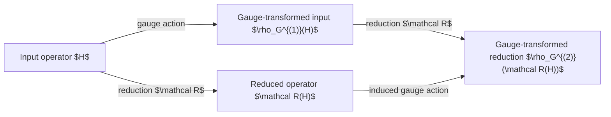

# Model-Class Expressiveness Beyond Spectral Fitting: A Gauge-Equivariant Operator Framework

Eugene Joseph M. Ragasa

#### Abstract
Current tight-binding parameterization is formulated primarily as an optimization over model parameters. The resulting discrepancy between a first-principles Hamiltonian and a reduced model is typically interpreted as either optimization error or insufficient model complexity. This interpretation neglects the fact that operator representations possess residual gauge freedom arising from basis choices within retained subspaces.

We develop a gauge-equivariant framework in which reduced Hamiltonians are compared only after quotienting out physically admissible coordinate transformations. Rather than fitting coordinate representations, we compare equivalence classes of operators under symmetry-preserving gauge actions. This separates representation error from intrinsic model-class limitations.

The resulting framework defines gauge-invariant operator residuals, establishes equivariance of projection and alignment maps, identifies the gauge dependence of locality and truncation, and formulates tight-binding reduction as the distance between constrained operator manifolds. The theory provides a mathematically well-posed criterion for determining whether disagreement between Wannier and parameterized tight-binding Hamiltonians reflects gauge choice or insufficient expressive power of the model class.

# Introduction

Reduced electronic-structure models are commonly constructed by choosing a parameterized Hamiltonian and optimizing its parameters against selected first-principles observables. In empirical and semiempirical tight-binding methods, these observables are usually band energies, band gaps, valley locations, effective masses, or other spectral quantities. In Wannier-based constructions, a first-principles Hamiltonian is instead projected onto a retained band subspace and represented in a localized basis. Both approaches produce finite-dimensional matrix Hamiltonians, but they solve different reduction problems: spectral fitting constrains selected eigenvalues, whereas Wannier projection constructs a coordinate representation of a projected operator.

Comparisons between these models often treat their matrix representations as though they were expressed in a canonical basis. This assumption is generally false. A retained $M$-dimensional Bloch subspace admits unitary changes of frame,

$$  
\mathbf V'(\mathbf k)
=
\mathbf V(\mathbf k)\mathbf Q(\mathbf k),  
\qquad  
\mathbf Q(\mathbf k)\in U(M),  
$$

under which the projector onto the retained subspace remains unchanged,

$$  
\mathbf{P}'(\mathbf k)
= \mathbf{V}'(\mathbf k)\mathbf V'(\mathbf k)^\dagger 
= \mathbf{P}(\mathbf k),  
$$

while the matrix representing an operator transforms covariantly,

$$  
\mathbf H'(\mathbf k)
=
\mathbf Q(\mathbf k)^\dagger  
\mathbf H(\mathbf k)  
\mathbf Q(\mathbf k).  
$$

The abstract projected operator is therefore unchanged, although its matrix elements, orbital blocks, and real-space hopping coefficients may differ. This residual freedom is central to the construction of localized Wannier functions and has long been recognized in Wannier theory [@marzari2012; @souza2001]. Its consequence for operator-level model reduction, however, is stronger than the statement that Wannier functions are nonunique: a discrepancy between two Hamiltonian matrices cannot be interpreted as model error until their retained spaces and admissible coordinate frames have been identified.

The central claim of this work is that **model reduction should be formulated on equivalence classes of operators rather than on individual coordinate representations**. Let $\mathfrak O(\mathcal H^{(P)})$ denote an appropriate space of operators on a retained subspace $\mathcal H^{(P)}$, and let $\mathcal G_{\mathrm{phys}}$ denote the group of physically admissible changes of frame. The relevant equivalence class of a represented Hamiltonian $\mathbf H$ is its gauge orbit,

$$  
[\mathbf{H}]_{\mathcal{G}_{\mathrm{phys}}}
=
\left\{
  \mathbf{Q}^\dagger 
  \mathbf{H}
  \mathbf{Q}  
  :  
  \mathbf{Q}\in\mathcal{G}_{\mathrm{phys}}  
\right\}.  
$$

A physically meaningful reduced Hamiltonian is then associated not with one matrix $\mathbf H$, but with a point in the quotient or orbit space

$$  
\mathfrak O(\mathcal H^{(P)})  
\big/  
\mathcal G_{\mathrm{phys}}.  
$$

The term “physically admissible” is essential. The full pointwise group $U(M)$ is generally too large for comparison with a localized tight-binding model. An arbitrary $\mathbf k$-dependent unitary transformation may preserve the fiberwise spectrum while changing Wannier localization, orbital centers, symmetry characters, and the range of the real-space Hamiltonian. For localized tight-binding comparison, the admissible group must therefore encode the structure that the reduced model is intended to preserve. Depending on the problem, this may require smoothness and periodicity in $\mathbf k$, compatibility with crystal symmetries, preservation of chosen Wannier centers and orbital identities, and consistency with the site-local or Slater–Koster structure of the model class. Symmetry adaptation restricts the gauge freedom but does not generally remove it [@sakuma2013; @koepernik2023].

This distinction exposes a limitation of purely spectral validation. At a fixed $\mathbf k$, two Hermitian matrices with identical eigenvalues are unitarily equivalent, subject to the usual treatment of degeneracies. However, pointwise spectral equivalence does not guarantee the existence of a single smooth, periodic, symmetry-compatible, and localization-preserving family $\mathbf Q(\mathbf k)$ relating the two Hamiltonians across the Brillouin zone. Consequently, agreement of band energies does not by itself establish equivalence of the corresponding localized operators. It does not determine orbital character, hopping structure, responses to local perturbations, or the form of an impurity operator obtained by subtracting two aligned Hamiltonians. Spectral fitting and operator fitting must therefore be treated as distinct constraints rather than interchangeable validation procedures.

The same reasoning clarifies the status of locality. If
$$  
\mathbf H(\mathbf R)
=
\frac{1}{|\mathrm{BZ}|}  
\int_{\mathrm{BZ}}  
e^{-i\mathbf k\cdot\mathbf R}  
\mathbf H(\mathbf k),  
\mathrm d\mathbf k  
$$

denotes the real-space Hamiltonian, then a $\mathbf k$-dependent transformation of $\mathbf H(\mathbf k)$ generally mixes its Fourier coefficients. Individual hopping amplitudes, orbital-block norms, neighbor-shell contributions, and the error produced by truncation at a prescribed range are therefore not invariants of the abstract operator. They are properties of the operator together with a chosen localized frame. Localization changes the representation; truncation changes the represented operator. A gauge-equivariant reduction framework must keep these two operations logically separate.

This observation leads naturally from parameter optimization to model-class geometry. Let
$$  
\mathcal{M}_m
=
\left\{  
\mathbf H_{\mathrm{TB}}(\theta)  
:  
\theta\in\Theta_m  
\right\}  
$$
denote a parameterized tight-binding model class of complexity $m$, and let

$$  
\mathcal O_{\mathrm{phys}}(\mathbf H_W)
=
\left\{  
\mathbf Q^\dagger\mathbf H_W\mathbf Q  
:  
\mathbf Q\in\mathcal G_{\mathrm{phys}}  
\right\}  
$$

denote the physically admissible orbit of a reference Wannier Hamiltonian. For a unitarily invariant norm $|\cdot|_{\mathcal K}$ defined over the selected $\mathbf k$ mesh or Brillouin-zone measure, the intrinsic operator discrepancy of the model class is

$$  
d_m
=
\inf_{\theta\in\Theta_m}  
\inf_{\mathbf Q\in\mathcal G_{\mathrm{phys}}}  
\left|  
\mathbf H_{\mathrm{TB}}(\theta)
-
\mathbf Q^\dagger  
\mathbf H_W  
\mathbf Q  
\right|_{\mathcal K}.  
$$

This quantity is not merely the residual of a particular parameter fit. It measures the separation between a constrained model class and the admissible orbit of the reference operator. If $d_m=0$, or is smaller than a prescribed numerical tolerance, then the model class contains a representation equivalent to the reference within the stated gauge and discretization assumptions. If $d_m>0$ after the infimum has been resolved, then no admissible change of coordinates can remove the discrepancy. The residual is therefore evidence of a limitation of the chosen model class, rather than an artifact of basis choice. Importantly, such a conclusion remains conditional on the specified retained subspace, admissible gauge group, norm, sampling measure, and model-class constraints.

This geometric formulation also extends the admissible-set view of tight-binding validation. Let $\mathcal A_{\mathrm{spec}}^{(m)}$ denote the parameter values satisfying prescribed spectral tolerances and let $\mathcal A_{\mathrm{op}}^{(m)}$ denote those satisfying a gauge-aligned operator tolerance. The relevant feasibility question is

$$  
\mathcal A_{\mathrm{spec}}^{(m)}  
\cap  
\mathcal A_{\mathrm{op}}^{(m)}  
\neq  
\varnothing.  
$$

A nonempty intersection establishes that the model class contains at least one parameterization satisfying both forms of validation. An empty intersection establishes incompatibility only for the chosen class, tolerances, and physical gauge restrictions; it does not imply the failure of all tight-binding descriptions. This separates three sources of disagreement that are otherwise easily conflated: coordinate mismatch, unsuccessful optimization, and insufficient model-class expressiveness.

Within this framework, projection, subspace identification, Wannierization, aligned subtraction, tight-binding parameterization, and continuum reduction are treated as maps between operator spaces or their coordinate representations. A reduction map is physically consistent only when it is equivariant with respect to the admissible gauge actions on its domain and codomain. Gauge equivariance does not guarantee that two different reduction paths commute, nor does it establish that a reduced model is physically adequate. It provides the prior consistency condition required for a path residual to have an invariant interpretation.

This work develops that framework in four steps. 
- First, we distinguish invariant retained subspaces and abstract operators from their gauge-covariant matrix representations and define the admissible gauge actions relevant to localized tight-binding models. 
- Second, we establish the equivariance conditions for projection, alignment, and pristine–perturbed operator subtraction and construct residuals based on unitarily invariant norms. 
- Third, we characterize how localization and finite-range truncation depend on the chosen localized gauge. 
- Fourth, we formulate model-class expressiveness as the distance between a parameterized tight-binding class and a physically constrained operator orbit, connecting this distance to joint spectral and operator admissibility.

The computational realization uses a projected Wannier Hamiltonian and an orthogonal $sp^3s^\ast$ Slater–Koster hierarchy for bulk silicon. Silicon serves as a controlled demonstration rather than as the source of the formalism: the purpose of the calculation is to determine whether apparent disagreement between first-principles and parameterized Hamiltonians can be removed by an admissible alignment or instead persists as a model-class residual. The resulting formulation provides the operator-level foundation required for subsequent bulk–dopant subtraction and atomistic-to-continuum reduction, where an inconsistent coordinate identification would otherwise be inherited by every downstream impurity operator.

# Representation-Controlled Impurity Extraction and Atomistic-to-Continuum Reduction for Doped Semiconductors

## Abstract

We develop a mathematically controlled framework for extracting impurity operators from first-principles electronic-structure calculations and for connecting those operators to effective-mass continuum models. The construction is based on TB-anchored retained subspaces, gauge-covariant operator alignment, and explicit comparison maps between atomistic and continuum representations. We prove that aligned impurity operators transform covariantly under basis changes, establish conditions for a well-defined subspace identification map, derive a crossover-radius criterion under asymptotic locality, and state error bounds linking operator residuals to spectral and wavefunction observables. The resulting framework separates representation mismatch from physical impurity content and yields a validation protocol for comparing atomistic and continuum descriptions of doped semiconductors.

## 1. Introduction

Doped semiconductors are commonly modeled at multiple levels: atomistic Kohn–Sham calculations, reduced tight-binding or Wannier representations, and effective-mass continuum theories. Each level introduces its own coordinate choices, truncations, and gauge freedoms, so naive comparison of matrix elements across models can conflate physical differences with basis mismatch.

This paper develops a representation-controlled framework for comparing pristine and doped systems. The central idea is to anchor the retained atomistic subspaces to fixed TB labels, align the reduced Hamiltonians within a common identified coordinate space, and then compare the resulting impurity operator with an effective-mass continuum model. The analysis is organized so that each reduction step has an explicit mathematical domain, codomain, and error interpretation.

Our main contributions are:

- a gauge-covariant definition of aligned impurity extraction;
- a TB-anchored identification map between pristine and doped retained subspaces;
- a well-posed spatial residual and crossover-radius criterion;
- operator-to-observable error bounds;
- excluded-space correction estimates;
- a framework for fitting continuum corrections with identifiability diagnostics.

## Bloch-fiber correspondence

Under the direct-sum structure introduced in the mathematical setting, the global operators in Definitions 1 and 2 have equivalent fiberwise representations. Assuming that $\hat H_s$ and $\hat P_s$ preserve the Bloch-fiber decomposition associated with the common translation group,

$$
\hat H_s
=
\bigoplus_{\mathbf k\in\mathcal K_L}
\hat H_s(\mathbf k),
\qquad
\hat P_s
=
\bigoplus_{\mathbf k\in\mathcal K_L}
\hat P_s(\mathbf k).
$$

The retained Hamiltonian therefore decomposes as

$$
\hat H_s^{(P)}
=
\bigoplus_{\mathbf k\in\mathcal K_L}
\hat H_s^{(P)}(\mathbf k),
$$

where

$$
\hat H_s^{(P)}(\mathbf k)
=
\left.
\hat P_s(\mathbf k)
\hat H_s(\mathbf k)
\hat P_s(\mathbf k)
\right|_{\mathcal H_s^{(P)}(\mathbf k)}.
$$

Thus, the global retained Hamiltonian $\hat H_s^{(P)}$ is uniquely determined by the family

$$
\left\{
\hat H_s^{(P)}(\mathbf k)
\right\}_{\mathbf k\in\mathcal K_L},
$$

and conversely this family defines the global operator through the direct sum. This correspondence is the Bloch-fiber form of the standard compression of a self-adjoint operator to a retained subspace [@kato1995; @reedsimon1980]. In Wannier-based model construction, the retained fiber operators are represented in a smooth Bloch gauge and subsequently transformed into a localized basis [@marzarivanderbilt1997; @souzamarzarivanderbilt2001; @mostofietal2008; @wannier90docs].

If the identification map is required to preserve the Bloch-fiber decomposition, it has the form

$$
\hat U_d
=
\bigoplus_{\mathbf k\in\mathcal K_L}
\hat U_d(\mathbf k),
$$

where

$$
\hat U_d(\mathbf k):
\mathcal H_b^{(P)}(\mathbf k)
\longrightarrow
\mathcal H_d^{(P)}(\mathbf k)
$$

is unitary for every $\mathbf k$. Such a fiberwise unitary correspondence exists if and only if

$$
M_b(\mathbf k)=M_d(\mathbf k)
\qquad
\text{for every }\mathbf k\in\mathcal K_L.
$$

The fixed-rank fiber condition is also the structure used in disentanglement procedures to construct a smooth active subspace across the sampled Brillouin zone [@souzamarzarivanderbilt2001; @mostofietal2008; @wannier90docs]. For doped systems, band shifts and impurity-derived subbands can alter which states intersect a fixed energy window, so this rank correspondence must be enforced by the retained-subspace construction rather than assumed from the energy window alone [@mazzolaetal2020; @mahan1983].

Under the fiberwise correspondence, the pullback of the doped retained Hamiltonian decomposes as

$$
\hat U_d^\dagger
\hat H_d^{(P)}
\hat U_d
=
\bigoplus_{\mathbf k\in\mathcal K_L}
\hat U_d(\mathbf k)^\dagger
\hat H_d^{(P)}(\mathbf k)
\hat U_d(\mathbf k).
$$

It follows that the aligned impurity operator in Definition 2 is equivalent to the family of fiberwise differences

$$
\Delta\hat H_d^{(P)}
=
\bigoplus_{\mathbf k\in\mathcal K_L}
\Delta\hat H_d^{(P)}(\mathbf k),
$$

with

$$
\Delta\hat H_d^{(P)}(\mathbf k)
=
\hat U_d(\mathbf k)^\dagger
\hat H_d^{(P)}(\mathbf k)
\hat U_d(\mathbf k)
-
\hat H_b^{(P)}(\mathbf k).
$$

The global and fiberwise formulations therefore describe the same aligned operator: the global formulation acts on the full retained space, while the fiberwise formulation resolves that action independently at each Bloch wavevector. Pulling both Hamiltonians into a common retained representation is the operator-level correspondence underlying downfolding and common-subspace comparisons [@georgesetal1996; @kunes2011].

## 3. Gauge covariance and TB anchoring

Let $\mathbf{X}_{s}(\mathbf k)$ denote fixed TB reference orbitals with consistent orbital labeling. Define the projected reference orbitals
$$
\mathbf Y_s(\mathbf k)=\hat P_s(\mathbf k)\mathbf X_s(\mathbf k).
$$
Assume $\mathbf Y_s(\mathbf k)$ has full column rank, so that the Löwdin-orthonormalized frames
$$
\widetilde{\mathbf V}_s(\mathbf k) =\mathbf Y_s(\mathbf k)\left[\mathbf Y_s^\dagger(\mathbf k)\mathbf Y_s(\mathbf k)\right]^{-1/2}
$$
are well defined. This construction is the standard "projection + Löwdin orthonormalization" procedure used to generate an initial gauge for Wannier-function calculations: localized trial orbitals are projected onto the Bloch subspace at each $\mathbf k$, then orthonormalized to produce a smooth, gauge-fixed Bloch-like frame [^MarzariVanderbilt1997][^SouzaMarzariVanderbilt2001][^PizziEtAl2020].

Under a $\mathbf k$-dependent unitary gauge transformation of the underlying Bloch basis, $\mathbf X_s(\mathbf k)\mapsto \mathbf X_s(\mathbf k)\mathbf W_s(\mathbf k)$ with $\mathbf W_s(\mathbf k)$ unitary, the projected orbitals transform as
$$
\mathbf Y_s(\mathbf k)\mapsto \hat P_s(\mathbf k)\mathbf X_s(\mathbf k)\mathbf W_s(\mathbf k)=\mathbf Y_s(\mathbf k)\mathbf W_s(\mathbf k),
$$
and the overlap matrix transforms covariantly:
$$
\mathbf Y_s^\dagger(\mathbf k)\mathbf Y_s(\mathbf k)\mapsto \mathbf W_s^\dagger(\mathbf k)\left[\mathbf Y_s^\dagger(\mathbf k)\mathbf Y_s(\mathbf k)\right]\mathbf W_s(\mathbf k).
$$
Consequently,
$$
\left[\mathbf Y_s^\dagger(\mathbf k)\mathbf Y_s(\mathbf k)\right]^{-1/2}
\mapsto
\mathbf W_s^\dagger(\mathbf k)\left[\mathbf Y_s^\dagger(\mathbf k)\mathbf Y_s(\mathbf k)\right]^{-1/2}\mathbf W_s(\mathbf k),
$$
and the orthonormalized frame transforms as
$$
\widetilde{\mathbf V}_s(\mathbf k)\mapsto \widetilde{\mathbf V}_s(\mathbf k)\mathbf W_s(\mathbf k).
$$
Thus $\widetilde{\mathbf V}_s(\mathbf k)$ is gauge-covariant: it tracks the gauge of the reference orbitals while remaining orthonormal by construction. This property ensures that any Hamiltonian representation built in the $\widetilde{\mathbf V}_s(\mathbf k)$ basis inherits a well-defined gauge behavior, which is essential for comparing pristine and doped systems on an equal footing [^Kunes2011][^MostofiEtAl2008].

The frames $\widetilde{\mathbf V}_s(\mathbf k)$ provide a natural tight-binding anchoring: they define a common, orthonormal, gauge-covariant basis in which to express the retained Hamiltonians $\hat H_s^{(P)}(\mathbf k)$ and, subsequently, the aligned impurity operator $\Delta\hat H_d^{(P)}(\mathbf k)$. In practice, this is analogous to choosing a set of symmetry-adapted Wannier-like orbitals as the reference basis for downfolding, ensuring that the impurity perturbation is represented in a physically transparent, orbital-resolved form [^Kunes2011][^PizziEtAl2020].

## References

[^MarzariVanderbilt1997]: N. Marzari and D. Vanderbilt, "Maximally localized generalized Wannier functions for composite energy bands," *Phys. Rev. B* **56**, 12847 (1997).

[^SouzaMarzariVanderbilt2001]: I. Souza, N. Marzari, and D. Vanderbilt, "Maximally localized Wannier functions for entangled energy bands," *Phys. Rev. B* **65**, 035109 (2001).

[^Kato1995]: T. Kato, *Perturbation Theory for Linear Operators*, Springer (1995).

[^ReedSimon1980]: M. Reed and B. Simon, *Methods of Modern Mathematical Physics, Vol. I: Functional Analysis*, Academic Press (1980).

[^Kunes2011]: A. Kuneš, "Wannier Functions and Construction of Model Hamiltonians," in *Correlated Electrons: From Models to Materials*, Forschungszentrum Jülich (2011).

[^MostofiEtAl2008]: A. A. Mostofi *et al.*, "wannier90: A tool for obtaining maximally-localised Wannier functions," *Comput. Phys. Commun.* **178**, 685–699 (2008).

[^GeorgesEtAl1996]: A. Georges, G. Kotliar, W. Krauth, and M. J. Rozenberg, "Dynamical mean-field theory of the Mott transition," *Rev. Mod. Phys.* **68**, 13 (1996).

[^Wannier90Docs]: Wannier90 collaboration, "Wannier90 User Guide and Documentation," https://wannier.org (accessed 2026).

[^MazzolaEtAl2020]: F. Mazzola *et al.*, "The sub-band structure of atomically sharp dopant profiles in silicon," *npj Quantum Mater.* **5**, 34 (2020).

[^Mahan1983]: G. D. Mahan, "Band-gap narrowing in heavily doped silicon," *Phys. Rev. B* **28**, 2286 (1983).

[^PizziEtAl2020]: G. Pizzi *et al.*, "Wannier90 as a community code: new features and applications," *J. Phys.: Condens. Matter* **32**, 165902 (2020).

### Theorem 1. Gauge covariance of impurity extraction.
If the pristine and doped retained subspaces are transformed by a common unitary gauge \(\hat G\), then the aligned impurity operator transforms covariantly:

$$
\Delta\hat H_d^{(P)}\mapsto \hat G^\dagger \Delta\hat H_d^{(P)}\hat G.
$$

### Corollary 1.
Any unitarily invariant norm of \(\Delta\hat H_d^{(P)}\) is gauge invariant.

### Proposition 1. TB-anchored identification.
If \(\widetilde{\mathbf V}_b(\mathbf k)\) and \(\widetilde{\mathbf V}_d(\mathbf k)\) are orthonormal bases of equal dimension, then

$$
\hat U_d(\mathbf k)=\widetilde{\mathbf V}_d(\mathbf k)\widetilde{\mathbf V}_b^\dagger(\mathbf k)
$$

defines a unitary identification between the corresponding retained subspaces.

## 4. Impurity extraction and spatial residuals

Let \(\hat P_{>R}\) denote an exterior projector associated with radius \(R\). Define the atomistic-minus-continuum discrepancy

$$
\hat D_d=\Delta\hat H_d-\hat V_{\mathrm{cont},d}.
$$

The exterior tail error is

$$
\eta_d(R)=\left\|\hat P_{>R}\hat D_d\hat P_{>R}\right\|.
$$

### Lemma 1. Monotonicity.
If $R_2\ge R_1$, then  $\eta_d(R_2)\le \eta_d(R_1).$

### Assumption 1. Asymptotic locality.
$$
\lim_{R\to\infty}\eta_d(R)=0.
$$

### Theorem 2. Existence of crossover radius.
For any tolerance $\tau_H>0$, define

$$
r_{c,d}(\tau_H)=\inf\{R:\eta_d(R)\le \tau_H\}.
$$
Under asymptotic locality, $r_{c,d}(\tau_H)$ exists.

## 5. Error propagation to observables

Write $\hat H_{\mathrm{atom}}=\hat H_{\mathrm{red}}+\hat E$.

### Theorem 3. Spectral stability.
For self-adjoint operators,

\[
\operatorname{dist}\bigl(\sigma(\hat H_{\mathrm{atom}}),\sigma(\hat H_{\mathrm{red}})\bigr)\le \|\hat E\|.
\]

### Corollary 2. Binding-energy bound.
If \(E_{b,d}^{\mathrm{atom}}\) and \(E_{b,d}^{\mathrm{red}}\) are correctly identified isolated impurity levels, then

\[
|E_{b,d}^{\mathrm{atom}}-E_{b,d}^{\mathrm{red}}|\le \|\hat E\|.
\]

### Theorem 4. Eigenspace stability.
If \(\gamma_d\) is the spectral gap isolating the target impurity state, then a Davis–Kahan-type bound yields

\[
\sin\theta_d\lesssim \frac{\|\hat E\|}{\gamma_d}.
\]

### Corollary 3. Fidelity bound.
For normalized nondegenerate states,

\[
1-F_d\lesssim \left(\frac{\|\hat E\|}{\gamma_d}\right)^2.
\]

## 6. Excluded-space corrections

## 4. Feshbach effective operator and relation to retained Hamiltonians

Let $\hat P+\hat Q=\hat I$ with $\hat P^2=\hat P$, $\hat Q^2=\hat Q$, and $\hat P\hat Q=\hat Q\hat P=0$. Then the exact Feshbach effective operator in the $\hat P$-space is
$$
\hat H_{\mathrm{eff}}(E)=\hat P\hat H\hat P+\hat P\hat H\hat Q\,(E-\hat Q\hat H\hat Q)^{-1}\,\hat Q\hat H\hat P.
$$

This expression is obtained by eliminating the $\hat Q$-component of the Schrödinger equation $(E-\hat H)|\Psi\rangle=0$ and yields an energy-dependent, non-Hermitian operator whose poles determine resonance positions and widths [^Feshbach1958][^Feshbach1962][^Rotter2009]. In the notation $\hat H_{PP}=\hat P\hat H\hat P$, $\hat H_{PQ}=\hat P\hat H\hat Q$, etc., one writes
$$
\hat H_{\mathrm{eff}}(E)=\hat H_{PP}+\hat H_{PQ}\,(E-\hat H_{QQ})^{-1}\,\hat H_{QP},
$$
which is the standard form used in nuclear, atomic, and mesoscopic physics to describe open quantum systems and resonance phenomena [^Rotter2009][^Mielnik2014][^HyodoNotes].

The first term, $\hat P\hat H\hat P$, coincides with the retained (compressed) Hamiltonian introduced earlier when $\hat P$ is identified with the projector onto the retained subspace. The second term encodes the dynamical feedback from the eliminated $\hat Q$-space and is responsible for level shifts, widths, and non-Hermiticity [^Feshbach1958][^Rotter2009]. In the limit where the coupling $\hat P\hat H\hat Q$ is neglected or the energy denominator is approximated by a constant, $\hat H_{\mathrm{eff}}(E)$ reduces to an energy-independent effective Hamiltonian in the $\hat P$-space, which is often used as a starting point for downfolding and model-Hamiltonian constructions [^Kunes2011][^GeorgesEtAl1996].

In the Bloch-fiber setting, one may define fiber-wise projectors $\hat P(\mathbf k)$ and $\hat Q(\mathbf k)=\hat I(\mathbf k)-\hat P(\mathbf k)$ and construct
$$
\hat H_{\mathrm{eff}}(\mathbf k;E)=\hat P(\mathbf k)\hat H(\mathbf k)\hat P(\mathbf k)
+\hat P(\mathbf k)\hat H(\mathbf k)\hat Q(\mathbf k)\,[E-\hat Q(\mathbf k)\hat H(\mathbf k)\hat Q(\mathbf k)]^{-1}\,\hat Q(\mathbf k)\hat H(\mathbf k)\hat P(\mathbf k),
$$
which provides an exact, energy-dependent effective band structure in the retained subspace. This formalism underlies rigorous treatments of impurity resonances, embedding methods, and self-energy corrections in periodic systems [^Feshbach1958][^Rotter2009][^Kunes2011].

[^Feshbach1958]: H. Feshbach, "Unified theory of nuclear reactions," *Ann. Phys.* **5**, 357 (1958).

[^Feshbach1962]: H. Feshbach, "Unified theory of nuclear reactions. II," *Ann. Phys.* **19**, 287 (1962).

[^Rotter2009]: I. Rotter, "A non-Hermitian Hamilton operator and the physics of open quantum systems," *J. Phys. A: Math. Theor.* **42**, 153001 (2009).

[^Mielnik2014]: M. Mielnik et al., "Computing resonance widths using square integrable basis," *Acta Phys. Pol. B* **45**, 113 (2014).

[^HyodoNotes]: H. Hyodo, "Theory of Feshbach resonances," lecture notes, RCNP Osaka University (2020), https://www.rcnp.osaka-u.ac.jp/~hyodo/class/2020/Tokuron/Tokuron_Note_e3.pdf.

### Theorem 5. Excluded-space bound.
If \(\Delta_Q=\operatorname{dist}(E,\sigma(\hat Q\hat H\hat Q))\), then

$$
\left\|\hat P\hat H\hat Q(E-\hat Q\hat H\hat Q)^{-1}\hat Q\hat H\hat P\right\|
\le \frac{\|\hat P\hat H\hat Q\|^2}{\Delta_Q}.
$$

This gives a criterion for when single-band reduction is sufficient and when multivalley or valence-band mixing must be retained.

## 7. Atomistic-to-envelope consistency

Assume \(a/L\ll 1\), where \(a\) is the lattice spacing and \(L\) the envelope scale. Near a band extremum \(\mathbf k_0\),

$$
E_n(\mathbf k_0+\mathbf q)=E_n(\mathbf k_0)+\frac{\hbar^2}{2}\mathbf q^{\mathsf T}\mathbf m_n^{*-1}\mathbf q+O(|\mathbf q|^3).
$$

### Theorem 6. Effective-mass consistency.
Replacing the atomistic host operator by the quadratic effective-mass operator incurs an error controlled by higher-order terms in \(a/L\), with the leading residual entering at the order dictated by the first neglected band-expansion term.

For silicon, the proof must retain multivalley conduction structure, valence-band degeneracy, anisotropic masses, and spin–orbit coupling where relevant.

## 8. Continuum fitting and identifiability

Let $\hat V_{\mathrm{cont}}(\boldsymbol\theta)$ be a parameterized continuum correction. Define

$$
J_R(\boldsymbol\theta)=\left\|\hat P_{>R}\bigl[\Delta\hat H_d-\hat V_{\mathrm{cont}}(\boldsymbol\theta)\bigr]\hat P_{>R}\right\|.
$$

### Theorem 7. Existence of best-fit continuum parameters.
If $\Theta$ is compact and $J_R$ is continuous, then for $\boldsymbol{\theta}_R^* \in \Theta$,

$$
\boldsymbol\theta_R^*\in\arg\min_{\boldsymbol\theta\in\Theta}J_R(\boldsymbol\theta)
$$
exists.

Uniqueness is a separate identifiability question and should be assessed with sensitivity analysis, covariance estimates, and profile likelihoods.

## 9. Spectral and operator compatibility

Define spectral- and operator-admissible sets:

\[
\mathcal A_{\mathrm{spec}}^{(m)}=\{\boldsymbol\theta:\epsilon_{\mathrm{spec}}(\boldsymbol\theta)\le \tau_{\mathrm{spec}}\},
\qquad
\mathcal A_{\mathrm{op}}^{(m)}=\{\boldsymbol\theta:\epsilon_{\mathrm{op}}(\boldsymbol\theta)\le \tau_{\mathrm{op}}\}.
\]

### Theorem 8. Minimum separation.
If the admissible sets are compact, then the minimum separation between them is attained. If they are disjoint, the separation is strictly positive.

A certified incompatibility result requires analytic bounds, interval methods, branch-and-bound, exhaustive certified reduction, or valid convex relaxation.

## 10. Reduction-path commutativity

Let \(\mathcal R\) be a reduction map. Define

$$
\epsilon_{\mathrm{path}}
=
\left\|
\mathcal R(\hat H_d-\hat H_b)
-
\left[\mathcal R(\hat H_d)-\mathcal R(\hat H_b)\right]
\right\|.
$$

### Theorem 9. Exact commutativity conditions.
Sufficient conditions for

\[
\mathcal R(\hat H_d-\hat H_b)=\mathcal R(\hat H_d)-\mathcal R(\hat H_b)
\]

include a common retained subspace, a common linear reduction map, consistent gauges, consistent energy references, and identical basis ordering.

## 11. Conclusions

We have presented a representation-controlled framework for impurity extraction in doped semiconductors, based on TB-anchored retained spaces, gauge-covariant alignment, and explicit comparison maps between atomistic and continuum descriptions. The framework separates physical impurity content from basis mismatch, provides a route to crossover-radius estimates, and supplies operator-to-observable error bounds needed for validation. The agentic-workflow proof track remains intentionally separate.

---

# Proof Program for `ksdft2effmass`

## 1. Purpose

Develop the mathematical results needed to support:

1. spectral–operator compatibility;
2. aligned impurity-operator extraction;
3. atomistic-to-continuum reduction;
4. error propagation from operators to physical observables;
5. validation-gated agentic workflow execution.

The physics proofs and the agentic-workflow proofs remain separate publication tracks.

---

## Mathematical Setting

### State Spaces for Atomistic-to-Continuum Reduction

#### System Labels and Comparison Setting

Let $s\in\{b,d\}$ where $b$ denotes the pristine bulk-Si reference and $d$ denotes a substitutionally doped system, such as $d=\mathrm P$ or $d=\mathrm B$.

For direct impurity extraction, the pristine and doped calculations must use compatible:
- supercell geometries;
- boundary conditions;
- Brillouin-zone sampling;
- spin conventions;
- numerical basis conventions;
- retained-subspace dimensions.

The pristine reference may originate from a primitive-cell calculation, but it must be folded or reconstructed in the doped-supercell representation before operator subtraction.

Let $\Omega_L\subset\mathbb R^3$ denote the periodic supercell used for the comparison, where $L$ collectively denotes its linear dimensions.
#### Ambient Numerical State Spaces

Let $\mathcal K_L$ be the finite set of supercell Bloch wavevectors used in the calculation. For each system $s$ and wavevector $\mathbf k\in\mathcal K_L$, let $\mathcal H_s^{\mathrm{num}}(\mathbf k) \cong \mathbb C^{D_s(\mathbf k)}$ denote the ambient numerical Bloch-fiber space.

Here, $D_s(\mathbf k)$ is the dimension of the numerical basis used to represent the Kohn–Sham problem at $\mathbf k$.

The complete finite numerical state space is

$$
\mathcal H_s^{\mathrm{num}}
=
\bigoplus_{\mathbf k\in\mathcal K_L}
\mathcal H_s^{\mathrm{num}}(\mathbf k).
$$

For vectors

$$
|\Psi_s\rangle
=
\bigoplus_{\mathbf k}
|\psi_s(\mathbf k)\rangle,
\qquad
|\Phi_s\rangle
=
\bigoplus_{\mathbf k}
|\phi_s(\mathbf k)\rangle,
$$

the numerical inner product is

$$
\langle\Psi_s|\Phi_s\rangle
=
\sum_{\mathbf k\in\mathcal K_L}
w_{\mathbf k}
\langle
\psi_s(\mathbf k)
|
\phi_s(\mathbf k)
\rangle,
$$

where $w_{\mathbf k}>0$ are the normalized Brillouin-zone weights satisfying

$$
\sum_{\mathbf k\in\mathcal K_L}w_{\mathbf k}=1.
$$

For a $\Gamma$-only supercell calculation,

$$
\mathcal K_L=\{\mathbf 0\},
$$

and the direct sum contains only one fiber.

#### Pristine Retained Space

For each $\mathbf k\in\mathcal K_L$, let $\hat P_b(\mathbf k): \mathcal H_b^{\mathrm{num}}(\mathbf k) \rightarrow \mathcal H_b^{\mathrm{num}}(\mathbf k)$ be an orthogonal projector satisfying

$$\begin{gather}
\hat P_b(\mathbf k)^2 = \hat P_b(\mathbf k) \\
\hat P_b(\mathbf k)^\dagger = \hat P_b(\mathbf k).
\end{gather}$$

Its range is the retained pristine Bloch-fiber subspace:

$$
\mathcal H_b^{(P)}(\mathbf k)
=
\operatorname{Ran}\hat P_b(\mathbf k).
$$

The complete pristine retained space is

$$
\boxed{
\mathcal H_b^{(P)}
=
\bigoplus_{\mathbf k\in\mathcal K_L}
\mathcal H_b^{(P)}(\mathbf k)
}.
$$

Equivalently, define

$$
\hat P_b
=
\bigoplus_{\mathbf k\in\mathcal K_L}
\hat P_b(\mathbf k),
$$

so that

$$
\mathcal H_b^{(P)}
=
\operatorname{Ran}\hat P_b
\subset
\mathcal H_b^{\mathrm{num}}.
$$

Let $m_b(\mathbf k)=\operatorname{rank}\hat P_b(\mathbf k)$ denote the retained dimension at $\mathbf k$. The total finite dimension is

$$
M_b
=
\sum_{\mathbf k\in\mathcal K_L}
m_b(\mathbf k).
$$

The pristine retained Hamiltonian is the operator

$$
\hat H_b^{(P)}
=
\left.
\hat P_b\hat H_b\hat P_b
\right|_{\mathcal H_b^{(P)}}:
\mathcal H_b^{(P)}
\rightarrow
\mathcal H_b^{(P)}.
$$

The ambient compression

$$
\hat P_b\hat H_b\hat P_b
$$

and the restricted operator $\hat H_b^{(P)}$ represent the same action but have different declared domains and codomains.

#### Doped Retained Space

For each $\mathbf k\in\mathcal K_L$, let

$$
\hat P_d(\mathbf k):
\mathcal H_d^{\mathrm{num}}(\mathbf k)
\rightarrow
\mathcal H_d^{\mathrm{num}}(\mathbf k)
$$

be an orthogonal projector onto the selected doped subspace.

Define

$$
\mathcal H_d^{(P)}(\mathbf k)
=
\operatorname{Ran}\hat P_d(\mathbf k).
$$

The complete doped retained space is

$$
\boxed{
\mathcal H_d^{(P)}
=
\bigoplus_{\mathbf k\in\mathcal K_L}
\mathcal H_d^{(P)}(\mathbf k)
}.
$$

Equivalently,

$$
\hat P_d
=
\bigoplus_{\mathbf k\in\mathcal K_L}
\hat P_d(\mathbf k),
$$

and

$$
\mathcal H_d^{(P)}
=
\operatorname{Ran}\hat P_d
\subset
\mathcal H_d^{\mathrm{num}}.
$$

Let

$$
m_d(\mathbf k)
=
\operatorname{rank}\hat P_d(\mathbf k),
$$

with total dimension

$$
M_d
=
\sum_{\mathbf k\in\mathcal K_L}
m_d(\mathbf k).
$$

The doped retained Hamiltonian is

$$
\hat H_d^{(P)}
=
\left.
\hat P_d\hat H_d\hat P_d
\right|_{\mathcal H_d^{(P)}}:
\mathcal H_d^{(P)}
\rightarrow
\mathcal H_d^{(P)}.
$$

#### 5. Compatibility of the Retained Atomistic Spaces

The spaces $\mathcal H_b^{(P)}$ and  $\mathcal H_d^{(P)}$ are distinct physical subspaces. Even if they have the same dimension, they are not automatically identified.

A unitary identification map $\hat U_d: \mathcal H_b^{(P)} \rightarrow\mathcal H_d^{(P)}$ can exist only if $M_b=M_d$.

For fiberwise alignment, the stronger condition is $m_b(\mathbf k)=m_d(\mathbf k)$ for every $\mathbf k\in\mathcal K_L$.

The identification map must satisfy

$$\begin{gather}
\hat U_d^\dagger\hat U_d = \hat I_{\mathcal H_b^{(P)}} \\
\hat U_d\hat U_d^\dagger = \hat I_{\mathcal H_d^{(P)}}
\end{gather}$$

The doped Hamiltonian pulled back to the pristine retained space is
$$
\hat H_{d\rightarrow b}^{(P)}
=
\hat U_d^\dagger
\hat H_d^{(P)}
\hat U_d.
$$

Both

$$
\hat H_{d\rightarrow b}^{(P)}
\qquad\text{and}\qquad
\hat H_b^{(P)}
$$

then act on the common state space $\mathcal H_b^{(P)}$.

The aligned impurity operator is therefore

$$
\boxed{
\Delta\hat H_d^{(P)}
=
\hat U_d^\dagger
\hat H_d^{(P)}
\hat U_d
-
\hat H_b^{(P)}
}
:
\mathcal H_b^{(P)}
\rightarrow
\mathcal H_b^{(P)}.
$$

If $M_b\neq M_d$, the map cannot be unitary. A partial isometry or common lower-dimensional comparison space would then have to be defined explicitly.

#### Localized Wannier-Coordinate Space

Choose an orthonormal localized basis for the doped retained space:

$$
\mathcal W_d = \{|w_{\alpha,d}\rangle\}_{\alpha=1}^{M_d},
$$
satisfying

$$
\langle
w_{\alpha,d}
|
w_{\beta,d}
\rangle
=
\delta_{\alpha\beta},
$$

and

$$
\operatorname{span}\mathcal W_d
=
\mathcal H_d^{(P)}.
$$

Define the Wannier synthesis map

$$
\hat W_d:
\mathbb C^{M_d}
\rightarrow
\mathcal H_d^{(P)}
$$

by

$$
\hat W_d\mathbf c
=
\sum_{\alpha=1}^{M_d}
c_\alpha
|w_{\alpha,d}\rangle.
$$

Because the Wannier basis is orthonormal and complete in the retained space,

$$
\hat W_d^\dagger\hat W_d
=
\mathbf I_{M_d},
$$

and

$$
\hat W_d\hat W_d^\dagger
=
\hat I_{\mathcal H_d^{(P)}}.
$$

Therefore,

$$
\boxed{
\mathbb C^{M_d}
\cong
\mathcal H_d^{(P)}
}
$$

through the unitary coordinate map $\hat W_d$.

The coordinate vector of a retained doped state $|\psi_d\rangle$ is

$$
\mathbf c_d
=
\hat W_d^\dagger|\psi_d\rangle,
$$

with components

$$
c_{\alpha,d}
=
\langle
w_{\alpha,d}
|
\psi_d
\rangle.
$$

The Wannier matrix of the doped retained Hamiltonian is

$$
\mathbf H_{W,d}
=
\hat W_d^\dagger
\hat H_d^{(P)}
\hat W_d
\in
\mathbb C^{M_d\times M_d}.
$$

The space $\mathbb C^{M_d}$ is not an additional physical approximation. It is the finite coordinate representation of the same retained atomistic state space:

$$
\mathcal H_d^{(P)}
\xleftrightarrow[\hat W_d^\dagger]{\hat W_d}
\mathbb C^{M_d}.
$$

---

## Common Wannier Coordinates for Impurity Extraction

Choose corresponding orthonormal Wannier synthesis maps

$$
\hat W_b:
\mathbb C^M
\rightarrow
\mathcal H_b^{(P)},
$$

and

$$
\hat W_d:
\mathbb C^M
\rightarrow
\mathcal H_d^{(P)},
$$

where

$$
M=M_b=M_d.
$$

Let

$$
\mathbf A_d\in\mathbb C^{M\times M}
$$

be a unitary coordinate-alignment matrix. Then the physical identification map can be written as

$$
\hat U_d
=
\hat W_d
\mathbf A_d
\hat W_b^\dagger.
$$

The pristine and doped Wannier matrices are

$$
\mathbf H_{W,b}
=
\hat W_b^\dagger
\hat H_b^{(P)}
\hat W_b,
$$

and

$$
\mathbf H_{W,d}
=
\hat W_d^\dagger
\hat H_d^{(P)}
\hat W_d.
$$

The aligned doped matrix in pristine coordinates is

$$
\mathbf H_{W,d\rightarrow b}
=
\mathbf A_d^\dagger
\mathbf H_{W,d}
\mathbf A_d.
$$

The impurity matrix in the shared coordinate space is therefore

$$
\boxed{
\Delta\mathbf H_{W,d}
=
\mathbf A_d^\dagger
\mathbf H_{W,d}
\mathbf A_d
-
\mathbf H_{W,b}
}.
$$

This subtraction is meaningful because both matrices now act on the same coordinate space $\mathbb C^M$ with the same orbital, site, spin, and lattice ordering.

#### Continuum Envelope-Function Space

Let $\mathcal V_d$ denote the finite-dimensional internal band-edge space retained by the effective-mass model:

$$
\mathcal V_d \cong \mathbb C^{g_d}.
$$

The dimension $g_d$ counts the internal envelope components required by the model. Depending on the physical approximation, these components may represent:

- conduction-band valleys;
- valence-band components;
- spin components;
- spin–orbit-coupled band-edge states.

The continuum state is a vector-valued envelope function

$$
\mathbf F_d:
\Omega
\rightarrow
\mathcal V_d.
$$

For direct comparison with a finite periodic supercell, take

$$
\Omega=\Omega_L
$$

and impose periodic boundary conditions.

The finite-supercell continuum state space is

$$
\boxed{
\mathcal H_{\mathrm{EMT},d}^{(L)}
=
L_{\mathrm{per}}^2
\left(
\Omega_L;
\mathcal V_d
\right)
}.
$$

Its inner product is

$$
\langle
\mathbf F_d,
\mathbf G_d
\rangle_{\mathrm{EMT}}
=
\int_{\Omega_L}
\mathbf F_d(\mathbf r)^\dagger
\mathbf G_d(\mathbf r)
\,\mathrm d^3r.
$$

For the isolated-impurity limit, the state space becomes

$$
\boxed{
\mathcal H_{\mathrm{EMT},d}^{(\infty)}
=
L^2
\left(
\mathbb R^3;
\mathcal V_d
\right)
}.
$$

The isolated bound-state envelopes satisfy appropriate decay conditions:

$$
\lim_{|\mathbf r|\rightarrow\infty}
\mathbf F_d(\mathbf r)
=
\mathbf 0.
$$

The distinction is therefore

$$
\mathcal H_{\mathrm{EMT},d}^{(L)}
\quad\text{for finite-supercell comparison},
$$

and

$$
\mathcal H_{\mathrm{EMT},d}^{(\infty)}
\quad\text{for the physical isolated-impurity limit}.
$$

---

## 9. Effective-Mass Operator and Its Domain

The continuum state space is $L^2$, but the differential Hamiltonian is not defined on every $L^2$ function.

For a second-order effective-mass operator, define an operator domain such as

$$
\mathcal D(
\hat H_{\mathrm{EMT},d}^{(L)}
)
\subset
H_{\mathrm{per}}^2
\left(
\Omega_L;
\mathcal V_d
\right).
$$

The effective-mass Hamiltonian is

$$
\hat H_{\mathrm{EMT},d}^{(L)}
:
\mathcal D(
\hat H_{\mathrm{EMT},d}^{(L)}
)
\rightarrow
\mathcal H_{\mathrm{EMT},d}^{(L)}.
$$

A general multicomponent form is

$$
\hat H_{\mathrm{EMT},d}
=
\hat T_d^{\mathrm{EMT}}
+
\hat V_{\mathrm{scr},d}
+
\hat V_{\mathrm{sr},d},
$$

where:

- $\hat T_d^{\mathrm{EMT}}$ is the band-edge kinetic operator;
- $\hat V_{\mathrm{scr},d}$ is the long-range screened impurity operator;
- $\hat V_{\mathrm{sr},d}$ is a short-range correction.

For a single anisotropic band,

$$
\hat T_d^{\mathrm{EMT}}
=
-\frac{\hbar^2}{2}
\nabla\cdot
\mathbf m_d^{*-1}
\nabla.
$$

For multivalley or multiband models, $\hat T_d^{\mathrm{EMT}}$ is matrix valued on $\mathcal V_d$.
#### Continuum and Wannier Spaces Are Not Automatically Identical

The spaces $\mathcal H_{\mathrm{EMT},d}$ and $\mathbb C^{M_d}$ must not be identified directly.

The continuum space is generally infinite dimensional:

$$
\dim\mathcal H_{\mathrm{EMT},d}
=
\infty,
$$

whereas

$$
\dim\mathbb C^{M_d}
=
M_d<\infty.
$$

A discretization or comparison map must therefore be introduced.

Choose a finite-dimensional continuum trial space

$$
\mathcal X_{h,d}
\subset
\mathcal H_{\mathrm{EMT},d}^{(L)},
$$

where $h$ denotes the continuum discretization scale.

Let

$$
N_{h,d}
=
\dim\mathcal X_{h,d}.
$$

A discretized continuum state then has coordinates in

$$
\mathbb C^{N_{h,d}}.
$$

To compare it with the Wannier representation, define an explicit map

$$
\mathbf J_{h,d}:
\mathbb C^{N_{h,d}}
\rightarrow
\mathbb C^{M_d}.
$$

This map may perform:

- sampling at Wannier centers;
- projection onto localized orbitals;
- interpolation between continuum and lattice coordinates;
- valley-to-orbital reconstruction;
- quadrature-weight normalization.

The continuum operator represented in Wannier coordinates is then constructed from:

1. the continuum discretization;
2. the chosen continuum basis;
3. the comparison map $\mathbf J_{h,d}$;
4. any required overlap or metric matrices.

No atomistic–continuum operator residual is meaningful until $\mathbf J_{h,d}$ has been specified.

#### State-Space Hierarchy

The atomistic side is

$$
\mathcal H_s^{\mathrm{num}}
\supset
\mathcal H_s^{(P)}
\cong
\mathbb C^{M_s}.
$$

The continuum side is

$$
\mathcal H_{\mathrm{EMT},d}
\supset
\mathcal X_{h,d}
\cong
\mathbb C^{N_{h,d}}.
$$

The two numerical coordinate spaces are related by

$$
\mathbf J_{h,d}:
\mathbb C^{N_{h,d}}
\rightarrow
\mathbb C^{M_d}.
$$

The complete comparison structure is therefore

$$
\boxed{
\begin{aligned}
\mathcal H_b^{(P)}
&\xrightarrow{\hat U_d}
\mathcal H_d^{(P)}
\xleftrightarrow{\hat W_d}
\mathbb C^{M_d},
\\[4pt]
\mathcal H_{\mathrm{EMT},d}
&\supset
\mathcal X_{h,d}
\cong
\mathbb C^{N_{h,d}}
\xrightarrow{\mathbf J_{h,d}}
\mathbb C^{M_d}.
\end{aligned}
}
$$

This structure distinguishes:

- the physical atomistic retained spaces;
- their finite Wannier coordinates;
- the infinite-dimensional continuum state space;
- the finite continuum discretization;
- the map required to compare continuum and atomistic operators.

---

## 12. Definitions

##### Definition 1: Pristine retained space
The pristine retained space is

$$
\mathcal H_b^{(P)}
=
\operatorname{Ran}\hat P_b,
$$

where $\hat P_b$ is the orthogonal projector onto the selected pristine Kohn–Sham subspace represented in the comparison supercell.

### Definition 2: Doped retained space

The doped retained space is

$$
\mathcal H_d^{(P)}
=
\operatorname{Ran}\hat P_d,
$$

where $\hat P_d$ is the orthogonal projector onto the selected doped Kohn–Sham subspace.

### Definition 3: Continuum envelope-function space

The finite-supercell continuum envelope-function space is

$$
\mathcal H_{\mathrm{EMT},d}^{(L)}
=
L_{\mathrm{per}}^2(
\Omega_L;\mathcal V_d
),
$$

where $\mathcal V_d$ contains the retained band-edge, valley, and spin components.

The isolated-impurity space is

$$
\mathcal H_{\mathrm{EMT},d}^{(\infty)}
=
L^2(
\mathbb R^3;\mathcal V_d
).
$$

### Definition 4: Localized Wannier-coordinate space

The localized Wannier-coordinate space is

$$
\mathbb C^{M_d},
$$

together with the unitary synthesis map

$$
\hat W_d:
\mathbb C^{M_d}
\rightarrow
\mathcal H_d^{(P)}.
$$

It is a coordinate representation of the retained atomistic space and is not itself a continuum approximation.
### 2.1 State spaces

Define:

- pristine retained space $\mathcal H_b^{(P)}$;
- doped retained space $\mathcal H_d^{(P)}$;
- continuum envelope-function space $\mathcal H_{\mathrm{EMT},d}$;
- localized Wannier-coordinate space $\mathbb C^{M_d}$.

### 2.2 Operators

Introduce:

$$
\hat H_b,
\qquad
\hat H_d,
\qquad
\hat U_d:
\mathcal H_b^{(P)}
\rightarrow
\mathcal H_d^{(P)}.
$$

Define the aligned impurity operator:

$$
\Delta\hat H_d
=
\hat U_d^\dagger
\hat H_d
\hat U_d
-
\hat H_b.
$$

### 2.3 Localized representation

Let $\{|w_\alpha\rangle\}$ be a localized basis. Define

$$
\Delta H_{W,d}[\alpha\beta]
=
\langle w_\alpha|
\Delta\hat H_d
|w_\beta\rangle.
$$

### 2.4 Continuum model

Define

$$
\hat H_{\mathrm{EMT},d}
=
-\frac{\hbar^2}{2}
\nabla\cdot
\mathbf m_d^{*-1}
\nabla
+
V_{\mathrm{scr},d}(\mathbf r)
+
V_{\mathrm{sr},d}(\mathbf r).
$$

Specify the map that represents the continuum operator in the retained atomistic state space.

### 2.5 Norms and geometric restrictions

Define:

- operator norm;
- Frobenius or Hilbert–Schmidt norm;
- orbital-block norms;
- neighbor-shell norms;
- exterior projector $\hat P_{>R}$.

The selected norm must be stated explicitly for every theorem and numerical metric.

---

## 3. Gauge Covariance and Representation Invariance

## Gauge and Gauge Covariance

A gauge can be understood as a **coordinate frame in electronic-state space**. Just as the same geometric vector can have different components in rotated Cartesian coordinates, the same electronic state or operator can have different numerical components in different Bloch or orbital bases.

Let $\mathbf V(\mathbf k)$ define an orthonormal coordinate frame for an $M$-dimensional retained subspace. A different frame for the same subspace is

$$
\mathbf V'(\mathbf k)
=
\mathbf V(\mathbf k)\mathbf G(\mathbf k),
\qquad
\mathbf G(\mathbf k)\in U(M).
$$

The unitary matrix $\mathbf G(\mathbf k)$ rotates the internal coordinates without changing the subspace. Consequently, the projector is gauge invariant:

$$
\mathbf P'(\mathbf k)
=
\mathbf V'(\mathbf k)\mathbf V'(\mathbf k)^\dagger
=
\mathbf P(\mathbf k).
$$

The matrix of an operator contains its components in the chosen electronic coordinate frame. When that frame changes, the components transform as

$$
\mathbf H'(\mathbf k)
=
\mathbf G(\mathbf k)^\dagger
\mathbf H(\mathbf k)
\mathbf G(\mathbf k).
$$

This consistent change of components is **gauge covariance**. The matrix entries depend on the chosen frame, while physical quantities such as the spectrum and unitary-invariant norms do not.

Computationally, separate pristine and doped DFT calculations generally return different electronic coordinate frames because Bloch-state phases and band mixing are arbitrary. Subtracting their Hamiltonian matrices before gauge alignment is like subtracting vector components expressed in differently rotated coordinate systems. The gauges must first be aligned so that the resulting impurity operator represents a physical difference rather than a mismatch of coordinates.

### 3.1 Gauge transformation

For a unitary coordinate transformation $\hat G$,

$$
\hat H_s
\mapsto
\hat G^\dagger\hat H_s\hat G.
$$

### 3.2 Theorem 1: Covariance of impurity extraction

Prove that consistent transformation of the pristine and doped representations gives

$$
\Delta\hat H_d
\mapsto
\hat G^\dagger
\Delta\hat H_d
\hat G.
$$

### 3.3 Corollary 1: Invariance of global residuals

For every unitarily invariant norm,

$$
\left\|
\hat G^\dagger
\Delta\hat H_d
\hat G
\right\|
=
\left\|
\Delta\hat H_d
\right\|.
$$

### 3.4 Spatial-locality complication

Determine whether the exterior projector satisfies

$$
[\hat P_{>R},\hat G]=0.
$$

If it does not, spatially resolved residuals are not invariant under arbitrary gauge transformations.

### 3.5 Required resolution

Either:

1. restrict the admissible gauges to transformations preserving localization centers; or
2. define the exterior restriction geometrically and transform it with the operator.

### 3.6 Publishable result

State precisely which impurity quantities are:

- gauge invariant;
- gauge covariant;
- invariant only under localization-preserving gauges;
- representation dependent.

---

## 4. Well-Posed Atomistic-to-Continuum Crossover

### 4.1 Atomistic–continuum difference

Define

$$
\hat D_d
=
\Delta\hat H_d
-
\hat V_{\mathrm{cont},d}.
$$

### 4.2 Exterior tail error

Define

$$
\eta_d(R)
=
\left\|
\hat P_{>R}
\hat D_d
\hat P_{>R}
\right\|.
$$

### 4.3 Lemma 1: Monotonicity

For nested exterior spaces,

$$
R_2\geq R_1
\quad\Longrightarrow\quad
\hat P_{>R_2}\leq\hat P_{>R_1}.
$$

Prove, for the operator norm,

$$
\eta_d(R_2)
\leq
\eta_d(R_1).
$$

### 4.4 Assumption: Asymptotic locality

Assume

$$
\lim_{R\rightarrow\infty}
\eta_d(R)
=
0.
$$

This assumption asserts that the residual atomistic structure becomes negligible after subtracting the appropriate continuum potential.

### 4.5 Theorem 2: Existence of the crossover radius

For every tolerance $\tau_H>0$, define

$$
r_{c,d}(\tau_H)
=
\inf
\left\{
R:
\eta_d(R)\leq\tau_H
\right\}.
$$

Prove that $r_{c,d}(\tau_H)$ exists under the asymptotic-locality assumption.

### 4.6 Numerical proof obligation

The calculation must test whether:

$$
\eta_d(R)\rightarrow 0
$$

before finite-supercell and periodic-image effects dominate.

### 4.7 Interpretation

The crossover radius is tolerance dependent:

$$
r_{c,d}=r_{c,d}(\tau_H).
$$

It is not automatically a unique material constant.

---

## 5. Operator Error and Physical Observables

### 5.1 Reduction error

Write

$$
\hat H_{\mathrm{atom}}
=
\hat H_{\mathrm{red}}
+
\hat E.
$$

### 5.2 Theorem 3: Spectral stability

For self-adjoint operators, establish

$$
\operatorname{dist}
\left(
\sigma(\hat H_{\mathrm{atom}}),
\sigma(\hat H_{\mathrm{red}})
\right)
\leq
\|\hat E\|.
$$

### 5.3 Corollary 2: Binding-energy error

For a correctly identified isolated impurity state,

$$
\left|
E_{b,d}^{\mathrm{atom}}
-
E_{b,d}^{\mathrm{red}}
\right|
\leq
\|\hat E\|.
$$

### 5.4 Theorem 4: Eigenspace stability

Let $\gamma_d$ be the spectral separation between the target impurity state and the remaining spectrum.

Use a Davis–Kahan-type result to establish

$$
\sin\theta_d
\lesssim
\frac{\|\hat E\|}{\gamma_d}.
$$

### 5.5 Corollary 3: Fidelity bound

For normalized nondegenerate states,

$$
F_d
=
\left|
\langle
\psi_d^{\mathrm{atom}}
|
\psi_d^{\mathrm{red}}
\rangle
\right|^2,
$$

with

$$
1-F_d
\lesssim
\left(
\frac{\|\hat E\|}{\gamma_d}
\right)^2.
$$

### 5.6 Scientific consequence

Establish the validation chain

$$
\boxed{
\text{operator residual}
\Longrightarrow
\text{binding-energy bound}
\Longrightarrow
\text{wavefunction-fidelity bound}
}.
$$

---

## 6. Controlled Elimination of Excluded States

### 6.1 Retained and excluded subspaces

Let

$$
\hat P+\hat Q=\hat I,
\qquad
\hat Q=\hat I-\hat P.
$$

### 6.2 Exact reduced operator

Derive the Feshbach or Schur-complement operator

$$
\hat H_{\mathrm{eff}}(E)
=
\hat P\hat H\hat P
+
\hat P\hat H\hat Q
\left(
E-\hat Q\hat H\hat Q
\right)^{-1}
\hat Q\hat H\hat P.
$$

### 6.3 Theorem 5: Excluded-space correction bound

Let

$$
\Delta_Q
=
\operatorname{dist}
\left(
E,\sigma(\hat Q\hat H\hat Q)
\right).
$$

Prove

$$
\left\|
\hat P\hat H\hat Q
\left(
E-\hat Q\hat H\hat Q
\right)^{-1}
\hat Q\hat H\hat P
\right\|
\leq
\frac{
\|\hat P\hat H\hat Q\|^2
}{
\Delta_Q
}.
$$

### 6.4 Physical interpretation

Use the bound to determine when:

- single-band reduction is sufficient;
- multivalley coupling must be retained;
- valence-band mixing cannot be neglected;
- excluded atomic orbitals materially affect impurity states.

---

## 7. Atomistic-to-Envelope Consistency

### 7.1 Scale-separation assumption

Let:

- $a$ be the lattice spacing;
- $L$ be the characteristic envelope length.

Assume

$$
\frac{a}{L}\ll 1.
$$

### 7.2 Band expansion

Near a band extremum $\mathbf k_0$,

$$
E_n(\mathbf k_0+\mathbf q)
=
E_n(\mathbf k_0)
+
\frac{\hbar^2}{2}
\mathbf q^{\mathsf T}
\mathbf m_n^{*-1}
\mathbf q
+
O(|\mathbf q|^3).
$$

### 7.3 Theorem 6: Effective-mass consistency

Derive an error estimate for replacing the atomistic host operator with the quadratic effective-mass operator.

Express the leading error in powers of

$$
\frac{a}{L}.
$$

### 7.4 Silicon-specific structure

The proof must retain:

- six conduction-band valleys for donor states;
- valence-band degeneracy for acceptor states;
- anisotropic effective masses;
- spin–orbit coupling where required.

A scalar single-valley derivation can be introductory but cannot be the final silicon result.

---

## 8. Continuum-Parameter Existence and Identifiability

### 8.1 Parameterized continuum model

Let

$$
\hat V_{\mathrm{cont}}
=
\hat V_{\mathrm{cont}}(\boldsymbol\theta),
\qquad
\boldsymbol\theta\in\Theta.
$$

Possible parameters include:

- dielectric screening;
- screening length;
- central-cell strength;
- short-range cutoff;
- nonlocal correction coefficients.

### 8.2 Exterior fitting objective

Define

$$
J_R(\boldsymbol\theta)
=
\left\|
\hat P_{>R}
\left[
\Delta\hat H_d-
\hat V_{\mathrm{cont}}(\boldsymbol\theta)
\right]
\hat P_{>R}
\right\|.
$$

### 8.3 Theorem 7: Existence of an optimal parameter vector

If $\Theta$ is compact and $J_R$ is continuous, prove that

$$
\boldsymbol\theta_R^*
\in
\operatorname*{arg\,min}_{\boldsymbol\theta\in\Theta}
J_R(\boldsymbol\theta)
$$

exists.

### 8.4 Identifiability question

Determine whether

$$
\boldsymbol\theta_R^*
$$

is unique.

Nonuniqueness would indicate that the available atomistic data cannot separately identify all continuum corrections.

### 8.5 Numerical requirements

Report:

- optimizer uncertainty;
- parameter covariance;
- profile likelihoods or equivalent diagnostics;
- sensitivity to $R$;
- sensitivity to the operator norm;
- sensitivity to the retained subspace.

---

## 9. Spectral–Operator Compatibility

### 9.1 Spectral admissible set

For model class $m$, define

$$
\mathcal A_{\mathrm{spec}}^{(m)}
=
\left\{
\boldsymbol\theta:
\epsilon_{\mathrm{spec}}(\boldsymbol\theta)
\leq
\tau_{\mathrm{spec}}
\right\}.
$$

### 9.2 Operator admissible set

Define

$$
\mathcal A_{\mathrm{op}}^{(m)}
=
\left\{
\boldsymbol\theta:
\epsilon_{\mathrm{op}}(\boldsymbol\theta)
\leq
\tau_{\mathrm{op}}
\right\}.
$$

### 9.3 Compatibility question

Determine whether

$$
\mathcal A_{\mathrm{spec}}^{(m)}
\cap
\mathcal A_{\mathrm{op}}^{(m)}
\neq\varnothing.
$$

### 9.4 Theorem 8: Minimum separation

For compact admissible sets, define

$$
\delta_m
=
\inf_{
\substack{
\boldsymbol\theta_s\in\mathcal A_{\mathrm{spec}}^{(m)}\\
\boldsymbol\theta_o\in\mathcal A_{\mathrm{op}}^{(m)}
}
}
d_m(
\boldsymbol\theta_s,
\boldsymbol\theta_o
).
$$

Prove that the minimum is attained.

If the sets are disjoint and compact, then

$$
\delta_m>0.
$$

### 9.5 Certified incompatibility

Failure of an ordinary optimizer to find an intersection is not a proof.

A certified incompatibility result requires one of:

- analytical parameter bounds;
- interval arithmetic;
- branch-and-bound global optimization;
- exhaustive finite reduction with certified error;
- convex relaxation with a valid separation certificate.

### 9.6 Publishable claim

The strongest result would be:

> No member of a specified Slater–Koster model class can simultaneously satisfy the declared spectral and operator tolerances.

---

## 10. Commutativity of Reduction Paths

### 10.1 Competing impurity paths

Compare:

$$
\text{full atomistic operators}
\rightarrow
\text{impurity extraction}
\rightarrow
\text{reduction}
$$

with

$$
\text{full atomistic operators}
\rightarrow
\text{separate reductions}
\rightarrow
\text{reduced impurity extraction}.
$$

### 10.2 Commutator defect

Define a path-consistency residual

$$
\epsilon_{\mathrm{path}}
=
\left\|
\mathcal R(
\hat H_d-\hat H_b
)
-
\left[
\mathcal R(\hat H_d)
-
\mathcal R(\hat H_b)
\right]
\right\|.
$$

### 10.3 Theorem 9: Exact commutativity conditions

Identify sufficient conditions under which

$$
\mathcal R(
\hat H_d-\hat H_b
)
=
\mathcal R(\hat H_d)
-
\mathcal R(\hat H_b).
$$

Possible conditions include:

- a common retained subspace;
- a common linear reduction map;
- consistent gauges;
- consistent energy references;
- identical basis ordering.

### 10.4 Approximate commutativity bound

When the two reduction maps differ, derive an upper bound on $\epsilon_{\mathrm{path}}$ in terms of:

- projector mismatch;
- gauge-alignment error;
- truncation error;
- energy-reference mismatch.

---

## 11. CPN and Agentic-Workflow Proofs

This is a separate methodological paper.

### 11.1 Authorization invariant

Prove that a production transition cannot fire without the required human-authorization token.

### 11.2 Marking validity invariant

Prove that every committed transition maps a valid marking to another valid marking.

### 11.3 Replay determinism

Under fixed:

- initial marking;
- transition request;
- tool-result records;
- capability manifest;

prove that replay produces the same terminal marking.

### 11.4 Provenance completeness

Prove that every accepted scientific result has a traceable chain of:

$$
\text{request}
\rightarrow
\text{capability}
\rightarrow
\text{execution}
\rightarrow
\text{artifact}
\rightarrow
\text{validation}.
$$

### 11.5 Failure propagation

Prove that a failed required validation cannot be transformed into an accepted terminal state merely because the replay process exits successfully.

This theorem directly addresses the H3/H4 consumer failure.

### 11.6 Scope restriction

The CPN proofs must not delay:

- bulk-Si calculations;
- Wannier/TB comparison;
- impurity extraction;
- atomistic-to-continuum analysis.

---

## 12. Priority Order

### Priority 1 — Required for the bulk-Si compatibility paper

1. Gauge covariance of aligned operators.
2. Existence of minimum spectral–operator separation.
3. Certified incompatibility method.
4. Path-consistency bounds.

### Priority 2 — Required for the impurity and crossover papers

1. Gauge-compatible spatial decomposition.
2. Well-posed crossover radius.
3. Operator-error bound on binding energy.
4. Fidelity or eigenspace-error bound.
5. Excluded-space correction bound.
6. Continuum-parameter identifiability.

### Priority 3 — Stronger mathematical-physics extension

1. Atomistic-to-envelope consistency.
2. Multivalley asymptotic reduction.
3. Representation stability of the crossover radius.
4. Transferability conditions for short-range corrections.

### Priority 4 — Separate agentic-workflow paper

1. Authorization safety.
2. Marking preservation.
3. Replay determinism.
4. Provenance completeness.
5. Correct failure propagation.

---

## 13. Claims That Should Not Be Made Prematurely

Do not claim that:

- screened Coulomb behavior follows rigorously from general Kohn–Sham DFT;
- $r_{c,d}$ is a universal material constant;
- a failed optimizer proves admissible-set incompatibility;
- a Wannier spatial decomposition is invariant under arbitrary gauges;
- small spectral errors imply small operator errors;
- a large test suite proves scientific validity;
- workflow determinism proves physical correctness.

Each of these requires either an explicit theorem, a declared assumption, or numerical validation.

---

## 14. Central Mathematical Narrative

The complete proof structure is

$$
\boxed{
\begin{aligned}
&\text{align the state spaces}
\\
&\Longrightarrow
\text{construct a covariant impurity operator}
\\
&\Longrightarrow
\text{separate short- and long-range components}
\\
&\Longrightarrow
\text{prove a well-posed crossover criterion}
\\
&\Longrightarrow
\text{bound observable errors}
\\
&\Longrightarrow
\text{validate the bounds numerically}.
\end{aligned}
}
$$

The central publishable result is not merely that an effective-mass fit can be produced. It is that the reduction is representation controlled, quantitatively bounded, and valid beyond an explicitly determined atomistic region.

---
## TB-Anchored Projector Identification
## Assumptions

- $\mathbf P_s(\mathbf k)$ is the orthogonal projector onto the retained DFT subspace at wavevector $\mathbf k$.
- $\mathbf X_s(\mathbf k)$ contains fixed TB reference orbitals with a consistent orbital labeling across the pristine and doped systems.
- $\mathbf Y_s(\mathbf k)=\mathbf P_s(\mathbf k)\mathbf X_s(\mathbf k)$ has full column rank, so $\mathbf Y_s^\dagger(\mathbf k)\mathbf Y_s(\mathbf k)$ is positive definite.
- The retained pristine and doped subspaces have the same dimension, so an identification map between them can be defined.
- Any change of basis within the retained DFT space is unitary and does not alter the underlying projector as an operator.
- The orthonormalized projected orbitals $\widetilde{\mathbf V}_s(\mathbf k)=\mathbf Y_s(\mathbf k)\left[\mathbf Y_s^\dagger(\mathbf k)\mathbf Y_s(\mathbf k)\right]^{-1/2}$ are well defined.
- $\widetilde{\mathbf V}_b(\mathbf k)$ and $\widetilde{\mathbf V}_d(\mathbf k)$ are orthonormal bases for the pristine and doped retained subspaces, respectively.
- The identification operator $\hat U_d(\mathbf k)=\widetilde{\mathbf V}_d(\mathbf k)\widetilde{\mathbf V}_b^\dagger(\mathbf k)$ is therefore unitary on the retained subspace.
- The aligned impurity operator $\Delta\hat H_d(\mathbf k)=\hat H_d^{(P)}(\mathbf k)-\hat U_d(\mathbf k)\hat H_b^{(P)}(\mathbf k)\hat U_d^\dagger(\mathbf k)$ compares Hamiltonians expressed in the same identified retained subspace.
### Proposition 1: Spectral Data Do Not Identify a Projector

The eigenvalues of a reduced Hamiltonian do not uniquely determine its embedding in the ambient DFT state space. Unitarily related operators can have identical spectra while acting on differently embedded retained subspaces.

This is standard: the spectrum is invariant under unitary equivalence, but it does not by itself determine the embedding of a reduced operator in the ambient Hilbert space; see, for example, Taylor’s treatment of the spectral theorem and Kowalski’s notes on spectral theory. \cite{TaylorSpectralTheorem,KowalskiSpectralTheory}

@misc{TaylorSpectralTheorem,
  author       = {Taylor, Michael E.},
  title        = {The Spectral Theorem for Self-Adjoint and Unitary Operators},
  howpublished = {Lecture notes},
  url          = {https://mtaylor.web.unc.edu/wp-content/uploads/sites/16915/2018/04/specthm.pdf},
  note         = {Accessed 2026-08-05}
}

@misc{KowalskiSpectralTheory,
  author       = {Kowalski, Emmanuel},
  title        = {Spectral theory in Hilbert spaces},
  howpublished = {Lecture notes, ETH Z\"urich},
  url          = {https://people.math.ethz.ch/~kowalski/spectral-theory.pdf},
  note         = {Accessed 2026-08-05}
}
### Proposition 2: Orbital-Anchored Coordinates Are Independent of the Input DFT Gauge

Let $\mathbf P_s(\mathbf k)$ be a retained-space projector and let $\mathbf X_s(\mathbf k)$ contain fixed TB reference orbitals. Define

$$
\mathbf Y_s(\mathbf k)
=
\mathbf P_s(\mathbf k)\mathbf X_s(\mathbf k)
$$

and, when $\mathbf Y_s(\mathbf k)$ has full column rank,

$$
\widetilde{\mathbf V}_s(\mathbf k)
=
\mathbf Y_s(\mathbf k)
\left[
\mathbf Y_s(\mathbf k)^\dagger
\mathbf Y_s(\mathbf k)
\right]^{-1/2}.
$$
$\blacksquare$
The orbital-anchored basis defined by symmetric orthonormalization is invariant under changes of basis within the retained subspace, since the projector is basis-independent as an operator and Löwdin orthonormalization removes the internal gauge freedom of the projected reference orbitals. \cite{Lowdin1950,HelgakerJorgensenOlsen2000}

@article{Lowdin1950,
  author  = {L{\"o}wdin, Per-Olov},
  title   = {On the Non-Orthogonality Problem Connected with the Use of Atomic Wave Functions in the Theory of Molecules and Crystals},
  journal = {The Journal of Chemical Physics},
  volume  = {18},
  number  = {3},
  pages   = {365--375},
  year    = {1950},
  doi     = {10.1063/1.1747632}
}

@book{HelgakerJorgensenOlsen2000,
  author    = {Helgaker, Trygve and J{\o}rgensen, Poul and Olsen, Jeppe},
  title     = {Molecular Electronic-Structure Theory},
  publisher = {Wiley},
  year      = {2000}
}

Then $\widetilde{\mathbf V}_s(\mathbf k)$ depends only on the projector and reference orbitals, not on the particular basis used to represent the retained DFT subspace.

### Proposition 3: Corresponding TB Coordinates Induce an Identification Map

If the pristine and doped projected reference orbitals have equal dimension and full column rank, then

$$
\hat U_d(\mathbf k)
=
\widetilde{\mathbf V}_d(\mathbf k)
\widetilde{\mathbf V}_b(\mathbf k)^\dagger
$$

defines a unitary identification between their retained subspaces. The aligned impurity operator is

$$
\Delta\hat H_d(\mathbf k)
=
\hat H_d^{(P)}(\mathbf k)
-
\hat U_d(\mathbf k)
\hat H_b^{(P)}(\mathbf k)
\hat U_d(\mathbf k)^\dagger.
$$

---

The strongest continuation is to move from **gauge covariance of individual constructions** to **gauge-equivariance of the entire reduction diagram**.

The gauge proof establishes that one operator comparison is coordinate-independent. The next question is broader:

> Do all reduction, alignment, subtraction, truncation, and continuum-limit maps commute with gauge transformations?

That turns the local bookkeeping result into a structural theorem about the complete workflow.

## 1. Define the reduction maps as maps between operator spaces

Let

$$  
\mathfrak O(\mathcal H)  
$$

denote the space of operators acting on a Hilbert space $\mathcal H$.

The computational program contains maps such as

$$  
\mathcal P:  
\hat H_{\mathrm{KS}}  
\mapsto  
\hat H^{(P)},  
$$

$$  
\mathcal W:  
\hat H^{(P)}  
\mapsto  
H_{\mathrm W},  
$$

$$  
\mathcal T:  
H_{\mathrm W}  
\mapsto  
H_{\mathrm{TB}},  
$$

$$  
\mathcal D:  
(H_d,H_b)  
\mapsto  
\Delta H_d,  
$$

and

$$  
\mathcal C:  
\Delta H_d  
\mapsto  
H_{\mathrm{EMT},d}.  
$$

Here:

- $\mathcal P$ is projection;
    
- $\mathcal W$ is transformation to a localized Wannier representation;
    
- $\mathcal T$ is reduction to a parameterized tight-binding model;
    
- $\mathcal D$ is bulk–dopant subtraction after identification;
    
- $\mathcal C$ is continuum reduction.
    

The next proof should classify which maps are:

1. gauge invariant;
    
2. gauge covariant or equivariant;
    
3. gauge fixing;
    
4. gauge dependent.
    

## 2. Formulate gauge transformations as group actions

For a retained space of dimension $M$, let

$$  
G\in U(M)  
$$

act on an operator matrix by

# $$  
\rho_G(H)

G^\dagger H G.  
$$

For $\mathbf k$-dependent gauges,

$$  
G:  
\mathbf k\mapsto G(\mathbf k)\in U(M),  
$$

the relevant group is the gauge group

# $$  
\mathcal G

\prod_{\mathbf k}U(M),  
$$

or, in the continuous Brillouin-zone setting, a suitable space of smooth maps

# $$  
\mathcal G

\operatorname{Map}(\mathrm{BZ},U(M)).  
$$

Each computational construction can then be tested against this group action.

## 3. Define equivariance of a reduction map

A map

$$  
\mathcal R:  
\mathfrak O(\mathcal H_1)  
\rightarrow  
\mathfrak O(\mathcal H_2)  
$$

is gauge equivariant when there is an induced gauge action $\rho_G^{(2)}$ on the output satisfying

# $$  
\mathcal R!\left(\rho_G^{(1)}(H)\right)

\rho_G^{(2)}!\left(\mathcal R(H)\right).  
$$

This is the coordinate-independent version of saying that the reduction behaves consistently under a basis change.

The relevant commuting diagram is

The proof obligation is

# $$  
\boxed{  
\mathcal R\circ\rho_G^{(1)}

\rho_G^{(2)}\circ\mathcal R.  
}  
$$

## 4. Prove equivariance of the elementary operations

The next theorem should be assembled from lemmas.

### Projection

For

# $$  
H^{(P)}

V^\dagger H V,  
$$

and

$$  
V'=VG,  
$$

one obtains

# $$  
H^{(P)\prime}

G^\dagger H^{(P)}G.  
$$

Thus projection to a fixed retained subspace is gauge equivariant.

### Identification and pullback

For an identification map

$$  
U_d:  
\mathcal H_b^{(P)}  
\rightarrow  
\mathcal H_d^{(P)},  
$$

define the pullback

# $$  
\mathcal A_{U_d}(H_d)

U_d^\dagger H_dU_d.  
$$

Under independent pristine and doped gauges,

# $$  
U_d'

G_d^\dagger U_dG_b,  
$$

the pullback obeys

# $$  
\mathcal A_{U_d'}(H_d')

G_b^\dagger  
\mathcal A_{U_d}(H_d)  
G_b.  
$$

Hence alignment is equivariant, provided the identification map is transformed consistently.

### Subtraction

If

# $$  
A'

# G^\dagger AG,  
\qquad  
B'

G^\dagger BG,  
$$

then

# $$  
(A-B)'

G^\dagger(A-B)G.  
$$

Therefore subtraction is equivariant only when both operands have first been represented in the same coordinate system.

This gives the formal reason that unaligned bulk–dopant subtraction is not meaningful.

## 5. Move from one path to path consistency

Suppose there are two constructions of a reduced impurity operator:

$$  
\mathcal R_1(H_b,H_d)  
$$

and

$$  
\mathcal R_2(H_b,H_d).  
$$

For example,

# $$  
\mathcal R_1

\text{Wannierize}  
\rightarrow  
\text{subtract}  
\rightarrow  
\text{truncate},  
$$

while

# $$  
\mathcal R_2

\text{fit TB}  
\rightarrow  
\text{subtract reduced models}.  
$$

The path residual is

# $$  
\mathcal E(H_b,H_d)

## \mathcal R_1(H_b,H_d)

\mathcal R_2(H_b,H_d).  
$$

If both paths are equivariant under the same output action,

# $$  
\mathcal R_j(H_b',H_d')

G^\dagger  
\mathcal R_j(H_b,H_d)  
G,  
$$

then

# $$  
\mathcal E(H_b',H_d')

G^\dagger  
\mathcal E(H_b,H_d)  
G.  
$$

Consequently,

# $$  
|\mathcal E(H_b',H_d')|

|\mathcal E(H_b,H_d)|  
$$

for every unitarily invariant norm.

This is the natural theorem underlying the entire path-consistency program.

## 6. Distinguish equivariance from commutativity

These are different claims.

Gauge equivariance asks whether

# $$  
\mathcal R\circ\rho_G

\rho_G\circ\mathcal R.  
$$

Path commutativity asks whether two physical reductions give the same result:

$$  
\mathcal R_1  
\stackrel{?}{=}  
\mathcal R_2.  
$$

The first says the result does not depend on coordinates.

The second says the result does not depend on the chosen reduction route.

Gauge equivariance must be established before a path residual can be interpreted physically. Otherwise, a nonzero residual may merely reflect incompatible coordinate choices.

The logical hierarchy should therefore be

$$  
\boxed{  
\text{gauge consistency}  
\longrightarrow  
\text{well-defined path residual}  
\longrightarrow  
\text{test of physical commutativity}.  
}  
$$

## 7. The next genuinely nontrivial issue: locality is not gauge invariant

After establishing diagram-level equivariance, the next important result concerns localization and truncation.

A real-space truncation operator might be written as

# $$  
\mathcal T_R[H](\mathbf R')

\begin{cases}  
H(\mathbf R'), & |\mathbf R'|\leq R,\  
0, & |\mathbf R'|>R.  
\end{cases}  
$$

Under a general $\mathbf k$-dependent gauge,

# $$  
H'(\mathbf k)

G^\dagger(\mathbf k)H(\mathbf k)G(\mathbf k),  
$$

the Fourier-transformed operator may mix different lattice vectors. Therefore, in general,

$$  
\mathcal T_R!\left[\rho_G(H)\right]  
\neq  
\rho_G!\left(\mathcal T_R[H]\right).  
$$

Real-space truncation is not equivariant under arbitrary $\mathbf k$-dependent gauges.

This is likely the first result in the sequence that is scientifically substantive rather than merely formal.

It implies that quantities such as

- hopping range;
    
- neighbor-shell weight;
    
- orbital-block locality;
    
- apparent decay length;
    
- truncation error;
    

are properties of an operator **together with a chosen localized gauge**, not of the abstract operator alone.

## 8. This motivates a gauge-constrained locality theorem

The next publishable proposition could take the form:

> Real-space locality diagnostics are invariant under site-local, lattice-periodic orbital rotations, but not under arbitrary $\mathbf k$-dependent gauge transformations.

For a $\mathbf k$-independent unitary $G$,

# $$  
H'(\mathbf R)

G^\dagger H(\mathbf R)G.  
$$

Then each lattice vector remains separate, and

# $$  
|H'(\mathbf R)|_F

|H(\mathbf R)|_F.  
$$

Therefore shell-resolved Frobenius weights such as

# $$  
w_n

\left(  
\sum_{\mathbf R\in\mathcal S_n}  
|H(\mathbf R)|_F^2  
\right)^{1/2}  
$$

are invariant under a global orbital rotation.

By contrast, for $\mathbf k$-dependent $G(\mathbf k)$, different $\mathbf R$ blocks mix, and $w_n$ is not invariant.

This gives a precise boundary between:

- acceptable residual diagnostics after Wannier-gauge alignment; and
    
- quantities that cannot be claimed as intrinsic operator observables.
    

## 9. The best immediate proof sequence

The most coherent continuation is:

### Proposition 1 — Gauge equivariance of aligned subtraction

Prove that projection, identification, pullback, and subtraction yield a covariant impurity operator.

### Proposition 2 — Gauge invariance of the path residual

Prove that the norm of the difference between two equivariant reduction paths is independent of the initial retained-basis gauges.

### Proposition 3 — Non-equivariance of real-space truncation

Show that arbitrary $\mathbf k$-dependent gauges generally do not commute with truncation by neighbor shell or spatial range.

### Proposition 4 — Restricted invariance under lattice-local rotations

Show that shell-resolved Frobenius diagnostics remain invariant under $\mathbf k$-independent unitary rotations of the local orbital basis.

### Theorem — Well-posed operator-path comparison

State that the operator-path consistency test is coordinate independent provided:

1. retained spaces are identified covariantly;
    
2. compared outputs are placed in a common gauge;
    
3. residuals use unitarily invariant norms;
    
4. locality diagnostics are evaluated only after fixing an admissible localized gauge.
    

## 10. The resulting scientific claim

The line of reasoning then supports a stronger claim than simply “the matrices are gauge covariant”:

> Operator-level comparisons between first-principles, Wannier, and parameterized tight-binding reductions are well posed only after separating coordinate-invariant operator discrepancies from gauge-dependent localization and truncation effects.

That is the right bridge from elementary gauge bookkeeping to the substantive issue in your program:

$$  
\boxed{  
\text{Is disagreement caused by physics/model reduction,}  
\quad  
\text{or merely by representation?}  
}  
$$

The most valuable next section is therefore **“Gauge equivariance of the reduction diagram and the gauge dependence of locality.”**