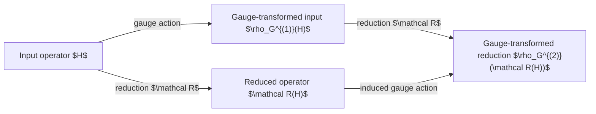

# Representation and Reduction Maps

> Status: Proposed proof material. Structural decomposition does not establish mathematical correctness, numerical verification, scientific validation, or human acceptance.

The strongest continuation is to move from **gauge covariance of individual constructions** to **gauge-equivariance of the entire reduction diagram**.

The gauge proof establishes that one operator comparison is coordinate-independent. The next question is broader:

> Do all reduction, alignment, subtraction, truncation, and continuum-limit maps commute with gauge transformations?

That turns the local bookkeeping result into a structural theorem about the complete workflow.

## 1. Define the reduction maps as maps between operator spaces

Let

$$
\mathfrak O(\mathcal H)
$$

denote the space of operators acting on a Hilbert space $\mathcal H$.

The computational program contains maps such as

$$
\mathcal P:
\hat H_{\mathrm{KS}}
\mapsto
\hat H^{(P)},
$$

$$
\mathcal W:
\hat H^{(P)}
\mapsto
H_{\mathrm W},
$$

$$
\mathcal T:
H_{\mathrm W}
\mapsto
H_{\mathrm{TB}},
$$

$$
\mathcal D:
(H_d,H_b)
\mapsto
\Delta H_d,
$$

and

$$
\mathcal C:
\Delta H_d
\mapsto
H_{\mathrm{EMT},d}.
$$

Here:

- $\mathcal P$ is projection;

- $\mathcal W$ is transformation to a localized Wannier representation;

- $\mathcal T$ is reduction to a parameterized tight-binding model;

- $\mathcal D$ is bulk–dopant subtraction after identification;

- $\mathcal C$ is continuum reduction.

The next proof should classify which maps are:

1. gauge invariant;

2. gauge covariant or equivariant;

3. gauge fixing;

4. gauge dependent.

## 2. Formulate gauge transformations as group actions

For a retained space of dimension $M$, let

$$
G\in U(M)
$$

act on an operator matrix by

$$
\rho_G(H)

G^\dagger H G.
$$

For $\mathbf k$-dependent gauges,

$$
G:
\mathbf k\mapsto G(\mathbf k)\in U(M),
$$

the relevant group is the gauge group

$$
\mathcal G

\prod_{\mathbf k}U(M),
$$

or, in the continuous Brillouin-zone setting, a suitable space of smooth maps

$$
\mathcal G

\operatorname{Map}(\mathrm{BZ},U(M)).
$$

Each computational construction can then be tested against this group action.

## 3. Define equivariance of a reduction map

A map

$$
\mathcal R:
\mathfrak O(\mathcal H_1)
\rightarrow
\mathfrak O(\mathcal H_2)
$$

is gauge equivariant when there is an induced gauge action $\rho_G^{(2)}$ on the output satisfying

$$
\mathcal R!\left(\rho_G^{(1)}(H)\right)

\rho_G^{(2)}!\left(\mathcal R(H)\right).
$$

This is the coordinate-independent version of saying that the reduction behaves consistently under a basis change.

The relevant commuting diagram is

The proof obligation is

$$
\boxed{
\mathcal R\circ\rho_G^{(1)}

\rho_G^{(2)}\circ\mathcal R.
}
$$
