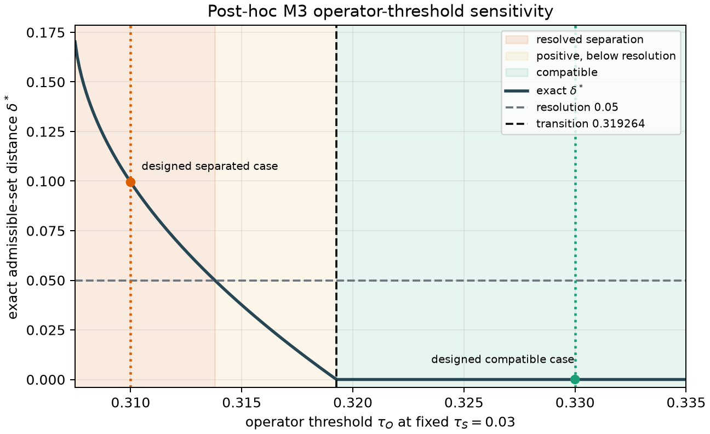
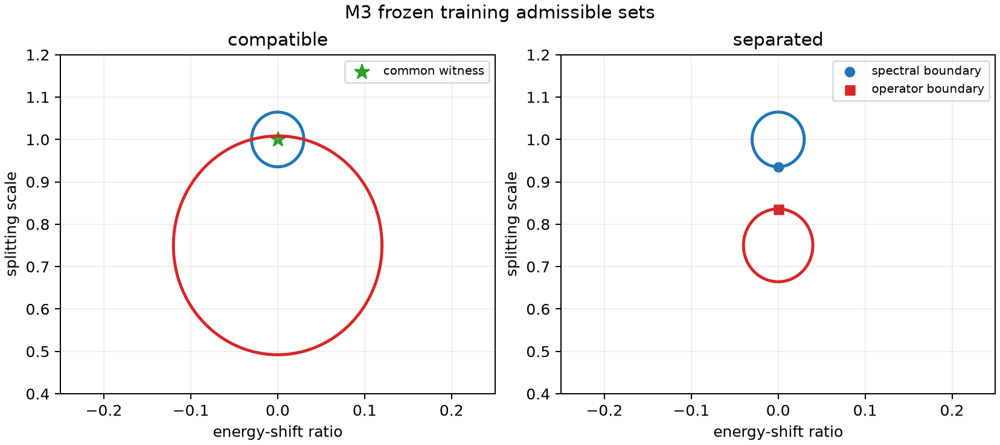

# Supplementary Appendix S5 — M3 Constrained Admissible Sets

## S5.1 The question M3 asks

M2 showed that two matrix representations can have the same band energies and
retained projector while having very different hopping coefficients. The difference
comes from a momentum-dependent rotation of the retained orbital frame. A separate
rotation at every momentum point recovers the original M2 matrices almost exactly, but
one constant rotation over the whole Brillouin zone generally cannot.

M3 asks a narrower question:

> Can one reduced Hamiltonian satisfy both the spectral and represented-operator
> requirements when the candidate family and allowed orbital alignments are fixed in
> advance?

This is a compatibility question under a declared contract. It is not a claim that the
underlying physical systems are different or that no more general alignment could
reconcile their matrices.

## S5.2 A two-knob candidate model

M3 starts from the transported M2 reference Hamiltonian `H(k)`. Let
`E_bar(k) = tr(H(k))/2` be its mean band energy. A candidate is

\[
H_{s,\lambda}(k)
=\overline E(k)I+sE_GI
+\lambda\left[H(k)-\overline E(k)I\right],
\]

where `E_G = 1` in the parent energy unit. The two parameters have simple roles:

- `s` shifts both bands together;
- `lambda` changes their splitting about the mean;
- `(s, lambda) = (0, 1)` is the original reference model.

The frozen search rectangle is

\[
-0.25\le s\le0.25,
\qquad
0.4\le\lambda\le1.2.
\]

For matrix comparison, M3 allows only nine constant real rotations, with angles from
`-1.2` to `1.2` radians. It does not allow the momentum-dependent pointwise alignment
that recovers M2 exactly.

## S5.3 Two accepted regions

Each candidate receives two normalized RMS scores:

1. **spectral loss**, measuring disagreement between ordered band energies; and
2. **operator loss**, measuring matrix disagreement after the best allowed constant
   rotation.

A threshold on each score produces a region in the `(s, lambda)` plane. The spectral
admissible set contains candidates passing the spectral threshold. The operator
admissible set is the union of the passing regions for the nine rotation angles.

The decision rule is geometric:

- a retained point belonging to both regions proves compatibility;
- failure to find such a point proves nothing by itself;
- a positive lower bound on the distance between the complete frozen regions certifies
  separation.

Only the 64 training points define these regions and their quadratic boundaries. The
257 staggered evaluation coordinates are disjoint from training and are used only after
the decision objects have been fixed.

## S5.4 How the thresholds were chosen

The thresholds are benchmark-design controls, not physical tolerances. They were chosen
from the known synthetic model and its preparatory analytic training-loss geometry to
produce two deliberately different decision regimes:

| control | design role |
|---|---|
| spectral threshold `0.03` | keeps spectral acceptance near the original splitting and places its minimum accepted splitting at approximately `0.9354687052` |
| compatible operator threshold `0.33` | lies just above the original model's constrained operator loss `0.3286318914`, so `(0, 1)` is a common witness |
| separated operator threshold `0.31` | shrinks operator acceptance until its maximum splitting is approximately `0.8360013041` |
| separation resolution `0.05` | declares the minimum parameter-space gap that this benchmark will call resolved |

Thus the separated design was required to satisfy

\[
0.9354687052-0.8360013041
=0.0994674010>0.05.
\]

The thresholds were frozen before the retained confirmatory execution, but their
selection was not blind. They were not inferred from withheld values, experimental
uncertainty, literature tolerances, or material acceptance criteria. The calculation
therefore demonstrates the decision procedure; it does not calibrate universal
thresholds.

An explicitly post-hoc analytic reanalysis varies only the operator threshold while
holding `tau_S = 0.03`. The operator set first becomes feasible at approximately
`0.307420`. Its distance from the spectral set exceeds the declared `0.05` resolution
until `tau_O = 0.313791`, remains positive but below resolution until the exact
compatibility transition at `tau_O = 0.319264`, and is compatible thereafter. The
original point `(0, 1)` itself becomes operator-admissible at `0.328632`. Thus the two
designed thresholds lie transparently on opposite sides of the transition rather than
serving as estimates of a physical tolerance. Its hardened verifier correlates the
consumed M3 result to the exact source-manifest entry and checks the zero-shift,
axis-alignment, symmetry, and positive-curvature premises used by this reduction.

## S5.5 Compatible thresholds

The first thresholds are

\[
\tau_S=0.03,
\qquad
\tau_O=0.33.
\]

The original model `(0, 1)` passes both tests when the constant rotation angle is `0.3`:

- training spectral loss: `7.59e-16`;
- training operator loss: `0.3286318914`.

Because M3 retains this explicit common witness, the distance between the two accepted
regions is exactly zero. This is stronger than reporting that a numerical search happened
to find a small loss.

## S5.6 Tightened operator threshold

The second case keeps the spectral threshold at `0.03` but tightens the operator
threshold to `0.31`. Within the frozen parameter rectangle and nine-angle alignment
family:

- every spectrally accepted candidate has approximately
  `lambda >= 0.9354687052`;
- every operator-accepted candidate has approximately
  `lambda <= 0.8360013041`.

The closest retained boundary points are therefore

\[
p_S\approx(0,0.9354687052),
\qquad
p_O=(0,0.8360013041).
\]

Their Euclidean distance is

\[
\lVert p_S-p_O\rVert_2
=0.0994674010.
\]

The analytic quadratic certificate gives the same value as both a lower and a
constructive upper bound. Because it exceeds the prospectively frozen resolution
`0.05`, the retained disposition is **certified separated**.

## S5.7 What the result does and does not mean

M3 demonstrates that spectral and matrix requirements can select nonoverlapping parts
of the same reduced-model family when the alignment family and tolerances are fixed.
The result depends on the two-parameter model, nine constant rotations, thresholds,
Euclidean metric, finite meshes, and quadratic-certificate assumptions.

It does not establish material validity, uncertainty quantification, silicon
transferability, or incompatibility under arbitrary momentum-dependent alignments. In
particular, M2 already shows that pointwise alignment can recover the constructed frame
attack almost exactly.

Before confirmatory evaluation, the editable TOML configuration, deterministic input
builder, derived input, M2 input digest, implementation sources, runner, and standalone
verifier were bound by `protocol-freeze.json`. Nine retained amendments record
post-freeze corrections and boundary hardening; amendment 6 retracts an earlier
incorrect diagnosis of a shared training/evaluation coordinate, and amendment 9 records
post-result role and tolerance verification hardening without changing scientific
controls or numerical results.

The library verifier reports maximum dimensionless defect `1.33e-15`. The standalone
verifier, which imports no producer Actions, reports `4.66e-15`, below the frozen
`1e-11` tolerance. It nevertheless shares NumPy, SciPy, eigensolvers, floating-point
behavior, and scientific conventions with the producer. SHA-256 binds recorded bytes
but does not independently establish chronology.
