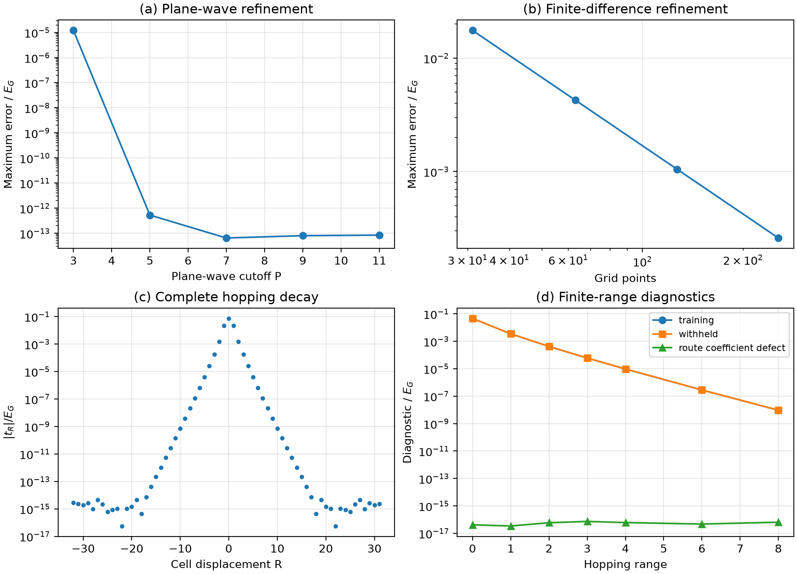
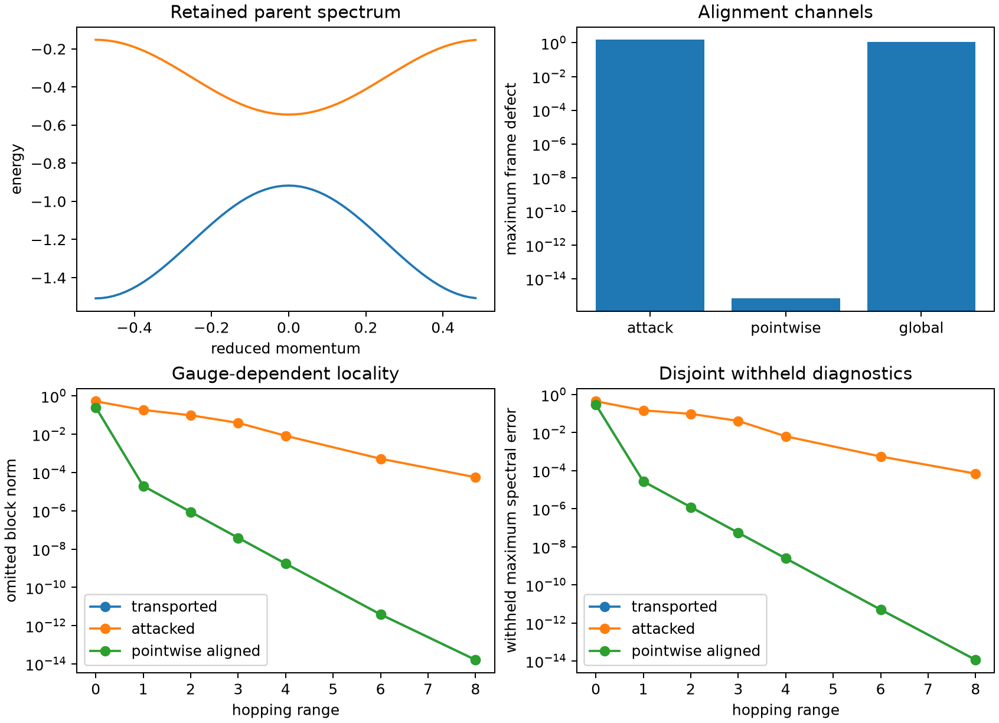

# Compatibility of spectral and operator reductions of periodic Hamiltonians: controlled one- and two-dimensional benchmarks

**Eugene Joseph M. Ragasa** 
Department of Physics, De La Salle University, Manila, Philippines 
eugene.ragasa@dlsu.edu.ph

## Abstract

Spectral agreement on selected bands does not uniquely determine a localized
Hamiltonian. This paper treats spectral and operator reductions of periodic systems as
two distinct constraints on the same reduced-model class. Spectral fitting controls
band energies and derived observables; operator fitting controls the real-space matrix
elements after a declared orbital alignment. A model that satisfies both constraints
is compatible. When no such model exists, rigorous bounds on the distance between the
two sets distinguish genuine incompatibility from an incomplete search. Errors arising
from the parent Hamiltonian, numerical discretization, observable extraction, and the
reduction itself are kept separate.

One- and two-dimensional synthetic benchmarks examine reconstruction accuracy,
sensitivity to the reduction route, hopping truncation, gauge choice, and localization.
Complete hopping reconstruction in one dimension reaches machine precision, and
different reduction routes agree to the same level. In two dimensions,
inter-directional coupling produces mixed hoppings, while different gauges leave the
spectrum unchanged yet strongly change localization and finite-range behavior. A
minimal two-parameter example shows the decision rule in exact form: one training
choice yields a common model, while a restricted choice produces a clear, certified
separation between the spectral and operator sets.

These results are controlled numerical verification on synthetic operators, not
material validation. Whether two reductions are compatible always depends on the
chosen model class, loss functions, thresholds, alignment rules, and the finite domains
used for comparison.

**Keywords:** admissible sets, model reduction, operator alignment, periodic
Hamiltonians, spectral compatibility

## I. Introduction

Localized reduced Hamiltonians support interpolation, analysis, and large-scale model
construction, but different reductions preserve different information. A spectral fit
uses eigenvalues or derived observables. An operator reduction approximates matrix
structure in a declared localized representation. These objectives are not equivalent:
a spectrum is invariant under unitary similarity and therefore does not identify
orbital coordinates, onsite blocks, hopping matrices, or locality.

This distinction matters whenever a downstream calculation depends on information that
was not constrained by a band-only objective. Similar selected bands do not by
themselves establish similar matrix elements, localization, or response to an added
operator. Conversely, a small matrix residual under one weighting does not guarantee
accurate curvature or another selected observable. Neither criterion should silently
stand in for the other.

Wannier constructions provide a localized representation of selected periodic
subspaces [1–4,9,10], while Slater–Koster and related lattice models impose a more
restrictive orbital and hopping structure [5,6]. Published calculations also show
that minimizing Wannier spread alone need not improve band-interpolation accuracy [24].
This separates localization and interpolation objectives; neither by itself establishes
adequacy for untested operator observables. The language of reduced models,
parameter identification, training data, and validation also connects this construction
to system identification and parametric model reduction [20,21]. Before such operators can be subtracted, their
state spaces must be identified. Basis order, geometry, reciprocal convention, energy
zero, units, and gauge must be explicit. Principal angles and polar decompositions are
useful alignment diagnostics [7,8], but a low numerical residual does not establish a
physically admissible alignment.

The central proposal is to compare the complete sets of reduced Hamiltonians accepted
by spectral and operator criteria. Their intersection identifies a common model. If no
intersection witness is found, a distance between admissible sets is meaningful only
when feasible upper bounds and certified lower bounds are distinguished. This avoids
turning optimization failure into a claim of mathematical incompatibility.

Controlled periodic models provide a necessary intermediate test. Their representations,
gauges, and transforms are explicit; exact or independently refined controls are
available; and failure modes can be introduced deliberately. The 1D and 2D route,
truncation, shell, and gauge-locality calculations are the paper's primary controlled
benchmarks. A separate analytically tractable two-parameter case provides a compact,
explicitly bounded illustration of the admissible-set decision logic. It is not a
surrogate for the multiband, nonidentity-gauge problem, and none of these controlled
results establishes transferability to a material.

## II. Methodology

### *2.1 Represented parents and common coordinates*

A periodic parent is a family of represented operators

$$
\mathbf H(\mathbf k):\mathcal V_{\mathbf k}\rightarrow\mathcal V_{\mathbf k},
\tag{1}
$$

with a declared representation contract. Independent numerical representations are
refined separately. The comparison begins with diagnostics that are invariant under
internal frame changes. Matrix subtraction is a separate channel and requires a
declared identification map into the same finite-dimensional state space. Different
retained ranks require an explicit projection or embedding with its error reported
separately. If no admissible identification exists, the outcome is a state-space
mismatch rather than an operator residual. Supplementary Appendix S1 formalizes the
invariant orbit loss and frame-dependent excess.

For an isolated scalar band sampled on a complete half-open uniform mesh over one
Brillouin zone, with reciprocal-boundary periodicity and centered Born–von Karman
translation representatives fixed, the complete real-space coefficients are the inverse
discrete Fourier transform [16]:

$$
t_{\mathbf R}
=
\frac{1}{N_k}\sum_{\mathbf k}
 e^{-i\mathbf k\cdot\mathbf R}E(\mathbf k),
\qquad
E(\mathbf k)=\sum_{\mathbf R}e^{i\mathbf k\cdot\mathbf R}t_{\mathbf R}.
\tag{2}
$$

For a composite subspace, $E(\mathbf k)$ is replaced by the represented matrix
$\mathbf H(\mathbf k)$ in a specified frame. On the complete mesh, forward and inverse
discrete transforms reconstruct the represented samples up to floating-point error;
this is not a claim about the unsampled continuous dispersion [16,18]. Complete
transformation is a coordinate change. Removing coefficients or restricting hopping
shells is model reduction and is evaluated separately from interpolation error [3,4].

### *2.2 Gauge and alignment contract*

Isolated eigenvectors are parallel transported with explicit reciprocal-boundary
sewing, consistent with the geometric-phase description of Bloch bands [11,12].
Composite subspaces are compared through projectors and non-Abelian links rather than
individual vectors inside degenerate clusters. A candidate alignment map must preserve
all declared state-space and symmetry semantics. Unrestricted rotations are not
accepted merely because they reduce a matrix norm. When a nontrivial $\mathcal U$
makes this alignment minimization nonconvex, multistart local optimization can improve
the best feasible upper bound but does not certify a global minimum or a positive lower
separation bound [25]. Any later material application therefore requires separate
lower-bound certification before declaring incompatibility.

For an orthonormal composite frame $\mathbf U_j$ on an ordered closed reciprocal loop,
the neighboring-frame overlap is $\mathbf M_j=\mathbf U_j^\dagger\mathbf U_{j+1}$.
After replacing each overlap by its unitary polar factor
$\widetilde{\mathbf M}_j$ and including the declared reciprocal-boundary sewing, the
discrete Wilson loop is

$$
\mathbf W=\prod_j\widetilde{\mathbf M}_j.
$$

A frame change conjugates $\mathbf W$ at the loop base point, so the unordered
eigenphase set of $\mathbf W$ is gauge invariant even though individual frame vectors
are not. Under the frozen constant-rank, gap, and nonsingular-link conditions, net
eigenphase winding across a two-dimensional family of such loops supplies a
finite-mesh Chern diagnostic [11–14]. Here Wilson loops are used only for
this gauge-consistency diagnostic; a zero value on the declared mesh is not presented
as an independent continuum classification theorem.

For material applications, an admissible unitary $\mathbf C$ is restricted to a frozen
family $\mathcal U$ by symmetry intertwiners, site mappings, orbital semantics, and
coordinate conventions, following the motivation of symmetry-adapted Wannier
constructions [15]. The controlled calculations in this paper test simpler gauge and
common-space cases; they do not claim to authenticate a material space-group
representation. In the direct scalar benchmark, $\mathcal U=\{1\}$, so no nonconvex
alignment search is performed. The composite gauge attacks use constructed frames with
known pointwise relations rather than treating Eq. (6) as a solved general alignment
problem.

### *2.3 Spectral and operator admissible sets*

For a model class $\mathfrak M_j$ with canonical parameters $\boldsymbol\theta$, a
dimensionless spectral loss is

$$
\mathcal L_E(\boldsymbol\theta)
=
\sum_{n,\mathbf k}w_{n\mathbf k}
\left|
\frac{E_{n\mathbf k}^{\mathrm{red}}(\boldsymbol\theta)
-E_{n\mathbf k}^{\mathrm{ref}}}{s_{n\mathbf k}}
\right|^2
+
\sum_m w_m
\left|
\frac{O_m^{\mathrm{red}}(\boldsymbol\theta)-O_m^{\mathrm{ref}}}{s_m}
\right|^2,
\tag{3}
$$

where weights, scales, band identities, training points, and observables are frozen
before fitting. The positive $s_{n\mathbf k}$ and $s_m$ are declared
nondimensionalization scales. Unless a separate uncertainty model is supplied, they are
not standard deviations, confidence intervals, or inferred numerical errors. An
aligned normalized operator loss over a finite translation domain $\mathcal S_H$ is

$$
\mathcal L_H(\mathbf C,\boldsymbol\theta)
=
\frac{
\displaystyle\sum_{\mathbf R\in\mathcal S_H}\omega_{\mathbf R}
\left\|\mathbf H_{\mathrm{ref}}(\mathbf R)
-\mathbf C\mathbf H_{\mathrm{red}}(\mathbf R;\boldsymbol\theta)
\mathbf C^\dagger\right\|_{\mathrm F}^{2}
}{
\displaystyle\sum_{\mathbf R\in\mathcal S_H}\omega_{\mathbf R}
\left\|\mathbf H_{\mathrm{ref}}(\mathbf R)\right\|_{\mathrm F}^{2}
}.
\tag{4}
$$

Equation (4) uses one global normalization over the frozen domain. A small global value
can conceal a weak individual block, so translation-resolved residuals, shell norms,
and the omitted-tail diagnostic are reported separately; no individual block is
normalized by a nearly vanishing reference block. The diagnostic separates the
infimum of the loss over the admissible gauge orbit from the nonnegative excess of a
selected frame. If the frozen finite-rank alignment family is nonempty and closed in
$U(r)$, it is compact and continuity of the finite loss makes this infimum an attained
minimum. An empty alignment family instead reports a state-space mismatch;
Supplementary Appendix S1 gives the definition, invariance argument, and relation to
the Wannier spread decomposition.

For a nonempty alignment family, the spectral and operator admissible sets are

$$
\mathfrak A_{E,j}
=
\{\mathbf H(\boldsymbol\theta)\in\mathfrak M_j:
\mathcal L_E(\boldsymbol\theta)\leq\tau_E\},
\tag{5}
$$

and

$$
\mathfrak A_{H,j}
=
\{\mathbf H(\boldsymbol\theta)\in\mathfrak M_j:
\inf_{\mathbf C\in\mathcal U}\mathcal L_H(\mathbf C,\boldsymbol\theta)
\leq\tau_H\}.
\tag{6}
$$

The finite comparison domain, shell weights, tail diagnostic, normalizations, and
threshold derivation are part of the contract. Omitted real-space content is not
silently absorbed into the operator tolerance. In the direct benchmark, thresholds are
frozen as the exact analytic loss floor plus a declared $10^{-4}$ excess-loss budget.
This budget is a controlled design resolution, not a probability statement or physical
uncertainty.

### *2.4 Separation and bounded decisions*

After declared parameter equivalences have been canonicalized, positive scales $s_q$
and dimensionless weights $v_q$ define

$$
d_{\mathrm{red}}(\boldsymbol\theta_1,\boldsymbol\theta_2)
=
\left[
\sum_q v_q
\left(\frac{\theta_{1,q}-\theta_{2,q}}{s_q}\right)^2
\right]^{1/2}.
\tag{7}
$$

The set separation is

$$
\delta_j^\ast
=
\inf_{\substack{
\mathbf H(\boldsymbol\theta_E)\in\mathfrak A_{E,j}\\
\mathbf H(\boldsymbol\theta_H)\in\mathfrak A_{H,j}}}
 d_{\mathrm{red}}(\boldsymbol\theta_E,\boldsymbol\theta_H).
\tag{8}
$$

Reported numerical evidence must satisfy

$$
0\leq\underline\delta_j\leq\delta_j^\ast\leq\overline\delta_j.
\tag{9}
$$

A common feasible witness $\boldsymbol\theta^\star$ belongs to both admissible sets;
the feasible pair $(\boldsymbol\theta^\star,\boldsymbol\theta^\star)$ has zero
distance and therefore proves $\delta_j^\ast=0$. More generally, any feasible pair
$(\boldsymbol\theta_E,\boldsymbol\theta_H)$ supplies the upper bound
$\delta_j^\ast\leq d_{\mathrm{red}}(\boldsymbol\theta_E,\boldsymbol\theta_H)$.
Pareto or nondominated status is not itself a certificate: the applicable threshold
memberships must be established. A positive incompatibility claim requires a lower-bound
certificate over the frozen search domain. Interval methods provide one possible
foundation [19]; the controlled quadratic example in Appendix B instead uses an exact
eigenvalue enclosure and the reverse triangle inequality. No general nonconvex-family
certificate is claimed. If neither compatibility nor separation is established, the
correct disposition is inconclusive. Compatibility, separation, and inconclusiveness
are always relative to the
frozen model class, parameter domain, losses, thresholds, alignment family, sampled
data, and finite operator domain. Intersection does not imply uniqueness or equivalence
of the two criteria.

### *2.5 Verification and error separation*

Training and withheld reciprocal points remain disjoint. Parent representation,
reciprocal sampling, gauge construction, complete transformation, hopping truncation,
and observable extraction have separate diagnostics. Four interpretation channels are
kept distinct:

1. parent-model discrepancy;
2. numerical/discretization error;
3. local observable-extraction error; and
4. reduced-model error.

A passing software verifier establishes only the declared software or controlled
numerical contract. It does not establish material adequacy, scientific validation, or
uncertainty quantification; this distinction follows the broader separation of
verification and validation in computational science [22].

### *2.6 Complementary controlled-evidence roles*

The cosine-continuum experiments are coequal controlled results. They test
reconstruction, truncation, route dependence, shell structure, gauge, and locality in
richer numerical representations than the analytic example. Their original protocols
did not freeze $\tau_E$ or $\tau_H$, however, so the paper does not retroactively turn
those diagnostics into maps of Eqs. (5) and (6). This limits the admissible-set claim,
not the importance of those benchmarks.

The direct benchmark in Sec. 3.4 has the narrower role of making the decision rule fully
explicit. It freezes the parameter box, unit scales, normalized weights, identity
alignment, operator domain, training points, withheld points, analytic threshold rule,
and separation certificate before set evaluation. Training data define the spectral
set; withheld points diagnose generalization only and cannot update either set,
threshold, witness, or certificate. The paper therefore does not claim broad
admissible-set instantiation at material-relevant complexity. M2 supplies a controlled
multiband alignment and locality bridge with a known nonidentity attack and two explicit
alignment channels, but it does not define thresholded spectral and operator admissible
sets. M3 now supplies the narrower prospectively thresholded bridge: a two-parameter
rank-two candidate family and nine finite one-global-rotation components with a common
witness in one case and certified separation in another. This is not a general
alignment solution. Appendix A records M3 as completed bounded evidence and separates
it from the remaining planned extensions.

## III. Results and Discussion

### *3.1 One-dimensional parent and complete hopping representation*

The nominal model is the dimensionless cosine Hamiltonian

$$
\hat H_{1\mathrm D}=-\frac{\mathrm{d}^2}{\mathrm{d}x^2}+0.5\cos x,
\qquad a=2\pi,\quad E_G=1.
\tag{10}
$$

This smooth cosine parent supports independent plane-wave and finite-difference
representations. With $z=x/2$, its eigenvalue equation becomes
$y''(z)+[a_{\mathrm M}-2q_{\mathrm M}\cos(2z)]y(z)=0$ with
$a_{\mathrm M}=4E$ and $q_{\mathrm M}=1$, so zone-center and zone-boundary
energies also admit periodic and antiperiodic Mathieu controls [17]. M1 does not
evaluate those external characteristic values; it uses the frozen finite plane-wave
reference defined in Supplementary Appendix S2. The model is a verification benchmark,
not a surrogate for a semiconductor.

For the lowest three sampled bands, the plane-wave error relative to the declared
$P=15$ reference is $5.31\times10^{-13}E_G$ at $P=5$. The reduced transform then
retains exactly the lowest scalar band. M1 records no gap result, so its historical
“isolated-band” identity is not evidence of band isolation. The independently
assembled centered finite-difference error decreases from
$1.753\times10^{-2}E_G$ at 31 points
to $2.598\times10^{-4}E_G$ at 255 points. Supplementary Appendix S2 records the
complete frozen sequences and their interpretation boundary.

**Figure 1.** Frozen parent-representation refinement, complete hopping decay, and
finite-range training/withheld maximum errors for the controlled 1D model.

The complete 64-point transform reconstructs the represented lowest band within
$4.17\times10^{-17}E_G$. The withheld maximum absolute error decreases from
$4.62\times10^{-2}E_G$ for the onsite-only model to $9.47\times10^{-9}E_G$ at range
$8a$. The training and withheld meshes are disjoint. No preferred range is selected
because the controlled experiment has no application-derived acceptance threshold.

### *3.2 Matched reduction routes*

Equal-weight direct least squares and Fourier-mediated truncation use the same complete
uniform mesh and Fourier model class. Under those matched conditions, their largest
coefficient defect over the frozen range sequence is $7.38\times10^{-17}E_G$, and the
largest sampled maximum defect is $1.56\times10^{-16}E_G$. This is an algebraic
control under one matched objective, not evidence that arbitrary reduction routes
commute. M1 contains no changed-weight, restricted-training, weak-potential,
gap-closure, or gauge stress attack; Supplementary Appendix S2 states these exclusions
explicitly.

### *3.3 Rank-two alignment and gauge-resolved locality*

M2 uses a four-state Hermitian block polynomial whose lowest two states form a retained
group. The minimum external gap is `1.0566`, and the minimum singular value among
neighboring and closure overlaps is `0.99998`. A known periodic nonidentity rotation
preserves the retained projector within `3.24e-16` while producing maximum frame and
projected-operator defects `1.506` and `0.997` in the attacked frame.

Pointwise Procrustes alignment recovers the known inverse attack within `6.77e-16` and
reduces the operator defect to `9.83e-16`. The separately constrained family containing
one global unitary leaves maximum frame and operator defects `1.131` and `0.744`. These
values diagnose that family rather than establishing failure of arbitrary smooth
alignment.

**Figure 2.** Frozen M2 retained spectrum, alignment channels, omitted block norms, and
disjoint withheld maximum spectral errors.

The known attack leaves spectra invariant but lengthens the block-hopping tail. At
range eight, its omitted norm and withheld maximum spectral error are `5.65e-5` and
`7.04e-5`, compared with approximately `1.6e-14` and `1.2e-14` after transport or
pointwise recovery. Independent reconstruction agrees within `7.43e-15`, below the
frozen `1e-11` tolerance. Supplementary Appendix S3 records the full contract and
evidence boundary.

### *3.4 M3 constrained admissible sets*

M3 composes the frozen M2 baseline with a two-parameter candidate family and nine
one-global-real-rotation components. Its thresholds are pedagogical benchmark controls
selected from the known synthetic training geometry, not physical or
uncertainty-calibrated tolerances. With spectral threshold `0.03` and operator threshold
`0.33`, the frozen point `(0, 1)` is a common witness, so the compatible case
has zero separation. Tightening only the operator threshold to `0.31` gives a
`certified-separated` case with equal analytic lower and constructive upper bounds
`0.0994674`, above the prospectively frozen resolution `0.05`. The training quadratics
determine the sets and certificate; 257 disjoint staggered evaluation coordinates
remain diagnostic only. Independent library and standalone reconstruction defects are
`1.33e-15` and `4.66e-15`, below the frozen `1e-11` tolerance. Supplementary Appendix
S5 records the protocol amendments, finite certificate, locality diagnostics, and
bounded evidence claim. This result is specific to the declared synthetic family,
metric, thresholds, and finite alignment components.

### *3.5 Bridge to a Wannier90-selected frame*

A separately retained synthetic two-dimensional calculation connects M2's constructed
gauge-locality mechanism to a frame selected by Wannier90 3.1.0. It is not part of M2
and is not a first-principles calculation. The direct projected and Wannier90 frames
span the same retained subspace within a maximum projector defect of `2.65e-10`;
pointwise alignment reduces their represented-operator defect to `3.57e-10 E_G`. A
bounded family of integer orbital translations followed by one constant unitary leaves
an operator defect of `1.490 E_G`, showing that the retained relation is momentum
dependent within the declared contract.

At squared radius 50, the omitted hopping norm is `2.72e-4 E_G` for the Wannier90 frame
and `5.90e-3 E_G` for the direct projected frame. A six-case sensitivity study is
nonmonotone and reaches distinct localization basins, so these observations are
finite-case bridge evidence rather than convergence or optimality claims. No external
program was rerun for this paper. Supplementary Appendix S4 records the retained
calculation, portable verification, and strict evidence boundary.

### *3.6 Minimal analytic illustration of admissible-set decisions*

This deliberately small benchmark illustrates the witness-versus-certificate decision
rule; it does not represent the dimensionality, gauge freedom, or parameter complexity
of the broader controlled models. It uses the scalar parent
$E_{\mathrm{ref}}(k)=1-\tfrac12\cos k+\tfrac15\cos 2k$ and the deliberately
restricted class $E_{\boldsymbol\theta}(k)=\theta_0+2\theta_1\cos k$. The operator
domain is $R=-2,\ldots,2$, the canonical parameter metric is Euclidean with unit
scales, and $\mathcal U=\{1\}$. Exact quadratic minima are obtained before applying
the common excess-loss budget $10^{-4}$.

For equal spectral weights on the complete six-point mesh
$\{0,\pi/3,2\pi/3,\pi,4\pi/3,5\pi/3\}$, where the represented
$R=0,\pm1,\pm2$ translations are distinct, both admissible sets contain the exact
witness $(\theta_0,\theta_1)=(1,-1/4)$, so $\delta^\ast=0$. For the restricted training set
$\{-\pi/3,0,\pi/3\}$, the spectral center moves to $(3/5,1/20)$ while the operator
center remains $(1,-1/4)$. Exact rational eigenvalue enclosures and the reverse
triangle inequality certify $0.452\leq\delta^\ast\leq0.500$. The lower bound proves
separation for this frozen contract; it is not inferred from a failed search. The
restricted spectral center has zero training residual but a withheld root-mean-square
error of $0.7211E_G$ on four disjoint points.

**Figure 3.** Direct analytic admissible sets. The complete-mesh case has an exact common
witness (left); the restricted-training case has certified positive separation (right).
Boundary samples are used only for visualization.

These two cases provide a minimal illustration of the asymmetric decision logic: a
common witness constructively supports compatibility, whereas a positive lower bound is
required for incompatibility. Changing only the spectral training domain can change the
disposition; neither result implies equivalence, universal incompatibility, or broad
instantiation of the framework.

### *3.7 Two-dimensional coupling and shell hierarchy*

The two-dimensional family is

$$
\hat H_{2\mathrm D}
=-\nabla^2+0.5\cos x+0.5\cos y+\lambda_{xy}\cos x\cos y.
\tag{11}
$$

At $\lambda_{xy}=0$, the represented Kronecker-sum defect is zero and the complete
product-spectrum defect is $3.55\times10^{-14}E_G$. A rank-two degeneracy control
preserves the cluster projector under a Hadamard rotation even though the individual-
vector overlap is only $1/\sqrt2$.

As $\lambda_{xy}$ increases from zero to 0.30, the mixed-direction hopping norm grows
from a $3.00\times10^{-15}E_G$ numerical floor to $1.94\times10^{-3}E_G$. At the
strongest coupling, the withheld root-mean-square error decreases from
$5.75\times10^{-2}E_G$ for the onsite shell to $1.70\times10^{-6}E_G$ for the full
finite transform. The full transform reconstructs its own $15\times15$ mesh within
$1.11\times10^{-15}E_G$, yet the separately evaluated $31\times31$ withheld mesh
retains the $1.70\times10^{-6}E_G$ error. This distinguishes the observed reciprocal-
mesh interpolation error from hopping truncation.

**Figure 4.** Parent refinement, coupled band surface, Wilson-loop diagnostics,
hopping map, shell convergence, and separability controls for the synthetic 2D family.

An anisotropic control gives principal masses $1.184m$ and $2.112m$ while preserving
time reversal and both reflections within $3.60\times10^{-14}E_G$. This distinguishes
tensor anisotropy from coupling-generated mixed hopping. Together with the 1D route
attacks, the shell hierarchy is central evidence that coordinate transformation,
truncation, and fitting objective must remain distinct.

### *3.8 Composite gauge and locality*

The lowest-three-band composite test compares a smooth projected frame with a
periodic rough internal gauge. Mesh spectra agree within $1.22\times10^{-15}E_G$, and
the unordered eigenphase sets of the discrete Wilson loops agree within
$2.22\times10^{-15}$. The net eigenphase winding gives zero total Chern diagnostic for
both frames on the declared mesh. The geometric-phase and topological interpretation
follows Refs. [11–14]. Locality differs: total finite-supercell spread grows from
$24.90a^2$ to $67.70a^2$, while the omitted hopping-block norm at squared-radius shell
18 grows from $1.38\times10^{-2}E_G$ to $5.25\times10^{-1}E_G$. The spread comparison
uses the gauge-dependent localization functional introduced for composite Wannier
functions [9] and studied mathematically in Ref. [10].

**Figure 5.** Gauge-invariant subspace and spectral data coexist with strongly gauge-
dependent localization and finite-range behavior.

This gauge-locality result, together with the route and truncation results, is a
principal controlled finding of the paper. Spectral equality does not determine locality
or a useful short-range representation. It also shows why alignment freedom must be
constrained before operator residuals are interpreted.

### *3.9 Evidence summary*

| Controlled component | Demonstrated property | Unsupported conclusion |
|---|---|---|
| Independent parent refinement | Numerical parent errors can be separated | Material convergence |
| Common-space alignment | Operator residuals follow a declared identification | Automatic physical equivalence |
| Complete and truncated hoppings | Coordinate transformation and reduction are distinct | Universal hopping cutoff |
| Matched construction routes | Agreement under identical frozen objectives | Generic commuting reductions |
| Rank-two gauge attack | Invariant spectra can coexist with frame-dependent locality | General alignment or material validation |
| M3 constrained admissible sets | A frozen finite alignment family can retain a common witness or certified separation as thresholds change | Unrestricted alignment or material-level compatibility |
| Direct admissible sets | Exact intersection and certified separation can both occur | Contract-independent compatibility |

The evidence has two complementary roles. The 1D and 2D route, truncation, shell, and
gauge-locality studies are the primary numerical results; they were not designed as
thresholded admissible-set maps. The direct two-parameter calculation is a minimal
analytic illustration that maps two quadratic sets, retains an exact intersection
witness, and certifies a positive lower separation bound in the changed-training case.
It does not itself exercise a nonidentity alignment or multiband candidate. M2 supplies
those controlled alignment and locality channels but not thresholded admissible sets.
M3 supplies thresholded rank-two admissible sets for a bounded two-parameter,
nine-component family, not material-relevant parameter complexity or an unrestricted
alignment search. None of these records provides a 3D material result.

## IV. Conclusions and Recommendations

Spectral and operator reductions preserve different information and should be evaluated
as separate admissible-set constraints. A valid comparison requires common coordinates,
controlled gauge freedom, explicit normalization, a finite real-space domain, withheld
checks, and bounded interpretation of optimization evidence. A shared feasible witness
supports compatibility; failure to find one does not prove incompatibility.

The principal controlled findings are the route, truncation, shell, and locality
results. Complete representation changes can be verified independently of finite-range
approximation; direct and mediated routes agree under the identical objectives frozen
in M1 without establishing a general commuting-reduction claim; and gauge-equivalent
spectra can correspond to substantially different localization and truncated operators. The minimal analytic example adds a bounded
demonstration that the same reduced class can have an exact common witness under one
frozen spectral objective and certified positive separation after the training domain
changes. These are numerical-verification results for synthetic operators, not claims
about a material or a broad multiband instantiation.

M2 bridges these roles with a rank-two candidate, a known nonidentity attack, exact
pointwise recovery, and a distinct one-global-unitary constrained family. M3 adds
prospectively thresholded spectral and operator admissible sets, a common-witness case,
and a positive analytic separation certificate in a frozen two-parameter,
nine-component family. The direct map and M3 remain separate bounded demonstrations;
neither establishes that an unrestricted alignment problem has been solved. A later
first-principles silicon application must supply its own parent convergence,
Wannier validation, symmetry alignment, thresholds, and withheld observables rather
than inheriting acceptance or incompatibility from these toy models.

## Appendices

The appendices are maintained as separate planning and evidence files:

- [Appendix A — Evidence and Provenance Boundary](appendices/A-evidence-and-provenance-boundary.md)
- [Appendix B — Direct Admissible-Set Demonstration](appendices/B-direct-admissible-set-demonstration.md)
- [Supplementary Appendix S1 — Gauge-Orbit Diagnostic Decomposition](appendices/S1-gauge-orbit-diagnostic-decomposition.md)
- [Supplementary Appendix S2 — M1 Isolated-Band Calculation](appendices/S2-M1-isolated-band-calculation.md)
- [Supplementary Appendix S3 — M2 Multiband Alignment and Locality](appendices/S3-M2-multiband-alignment-calculation.md)
- [Supplementary Appendix S4 — Wannier90 Bridge Calculation](appendices/S4-Wannier90-bridge-calculation.tex)
- [Supplementary Appendix S5 — M3 Constrained Admissible Sets](appendices/S5-M3-constrained-admissible-sets.md)

## Nomenclature

| Symbol | Description | Unit |
|---|---|---|
| $a$ | Lattice period | model length |
| $\mathfrak A_E,\mathfrak A_H$ | Spectral and operator admissible sets | — |
| $\mathbf C$ | Admissible coordinate alignment | — |
| $d_{\mathrm{red}}$ | Canonical reduced-parameter distance | — |
| $E_G$ | Controlled-model reciprocal energy scale | model energy |
| $\mathbf H(\mathbf k)$ | Represented Bloch Hamiltonian | energy |
| $\mathcal L_E,\mathcal L_H$ | Spectral and operator losses | dimensionless |
| $\mathcal L_{H,\mathrm{orb}}$ | Gauge-orbit operator loss | dimensionless |
| $\mathcal L_{H,\mathrm{frame}}$ | Frame-dependent excess loss | dimensionless |
| $\mathfrak M_j$ | Candidate reduced-model class | — |
| $m$ | Controlled-model reference mass | model mass |
| $O_m$ | Declared scalar observable | observable dependent |
| $\mathcal S_H$ | Operator-comparison translation domain | — |
| $\boldsymbol\theta$ | Canonical reduced-model parameters | mixed |
| $\tau_E,\tau_H$ | Admissibility thresholds | dimensionless |
| $\lambda_{xy}$ | Two-dimensional coupling amplitude | model energy |
| $\delta_j^\ast$ | Minimum admissible-set separation | — |
| $\underline\delta_j,\overline\delta_j$ | Lower and upper separation bounds | — |

## Data and code availability

The controlled-model protocols, retained result records, verification code, figures,
and checksum manifests are maintained under
`calculations/ICMSEP2026/conference/paper_1/isolated-band/`,
`calculations/research-monograph/periodic-2d/`, and
`calculations/ICMSEP2026/conference/paper_1/`. These working repository records are not
yet a public archival deposit or DOI.

## Acknowledgments

> **Author action before submission.** Add verified funding, computing-resource,
> institutional, and technical acknowledgments.

## References

[1] Marzari N, Mostofi AA, Yates JR, Souza I, Vanderbilt D. 2012. Maximally
localized Wannier functions: Theory and applications. Reviews of Modern Physics.
84:1419–1475. doi:10.1103/RevModPhys.84.1419.

[2] Souza I, Marzari N, Vanderbilt D. 2001. Maximally localized Wannier functions for
entangled energy bands. Physical Review B. 65:035109.
doi:10.1103/PhysRevB.65.035109.

[3] Pizzi G, Vitale V, Arita R, Blügel S, Freimuth F, Géranton G, Gibertini M,
Gresch D, Johnson C, Koretsune T, et al. 2020. Wannier90 as a community code: New
features and applications. Journal of Physics: Condensed Matter. 32(16):165902.
doi:10.1088/1361-648X/ab51ff.

[4] Yates JR, Wang X, Vanderbilt D, Souza I. 2007. Spectral and Fermi surface
properties from Wannier interpolation. Physical Review B. 75:195121.
doi:10.1103/PhysRevB.75.195121.

[5] Slater JC, Koster GF. 1954. Simplified LCAO method for the periodic potential
problem. Physical Review. 94:1498–1524. doi:10.1103/PhysRev.94.1498.

[6] Vogl P, Hjalmarson HP, Dow JD. 1983. A semi-empirical tight-binding theory of the
electronic structure of semiconductors. Journal of Physics and Chemistry of Solids.
44(5):365–378. doi:10.1016/0022-3697(83)90064-1.

[7] Björck Å, Golub GH. 1973. Numerical methods for computing angles between linear
subspaces. Mathematics of Computation. 27(123):579–594.
doi:10.1090/S0025-5718-1973-0348991-3.

[8] Higham NJ. 1986. Computing the polar decomposition—with applications. SIAM
Journal on Scientific and Statistical Computing. 7(4):1160–1174.
doi:10.1137/0907079.

[9] Marzari N, Vanderbilt D. 1997. Maximally localized generalized Wannier
functions for composite energy bands. Physical Review B. 56(20):12847–12865.
doi:10.1103/PhysRevB.56.12847.

[10] Panati G, Pisante A. 2013. Bloch bundles, Marzari–Vanderbilt functional and
maximally localized Wannier functions. Communications in Mathematical Physics.
322(3):835–875. doi:10.1007/s00220-013-1741-y.

[11] Resta R. 1994. Macroscopic polarization in crystalline dielectrics: The
geometric phase approach. Reviews of Modern Physics. 66(3):899–915.
doi:10.1103/RevModPhys.66.899.

[12] Zak J. 1989. Berry’s phase for energy bands in solids. Physical Review Letters.
62(23):2747–2750. doi:10.1103/PhysRevLett.62.2747.

[13] Thouless DJ, Kohmoto M, Nightingale MP, den Nijs M. 1982. Quantized Hall
conductance in a two-dimensional periodic potential. Physical Review Letters.
49(6):405–408. doi:10.1103/PhysRevLett.49.405.

[14] Niu Q, Thouless DJ, Wu Y-S. 1985. Quantized Hall conductance as a topological
invariant. Physical Review B. 31(6):3372–3377. doi:10.1103/PhysRevB.31.3372.

[15] Sakuma R. 2013. Symmetry-adapted Wannier functions in the maximal localization
procedure. Physical Review B. 87:235109. doi:10.1103/PhysRevB.87.235109.

[16] Trefethen LN. 2000. *Spectral Methods in MATLAB*. Philadelphia: Society for
Industrial and Applied Mathematics. doi:10.1137/1.9780898719598.

[17] NIST Digital Library of Mathematical Functions. Chapter 28: Mathieu Functions
and Hill’s Equation. Available from: https://dlmf.nist.gov/28.

[18] Higham NJ. 2002. *Accuracy and Stability of Numerical Algorithms*. 2nd ed.
Philadelphia: Society for Industrial and Applied Mathematics.
doi:10.1137/1.9780898718027.

[19] Moore RE, Kearfott RB, Cloud MJ. 2009. *Introduction to Interval Analysis*.
Philadelphia: Society for Industrial and Applied Mathematics.
doi:10.1137/1.9780898717716.

[20] Ljung L. 1999. *System Identification: Theory for the User*. 2nd ed. Upper
Saddle River: Prentice Hall.

[21] Benner P, Gugercin S, Willcox K. 2015. A survey of projection-based model
reduction methods for parametric dynamical systems. SIAM Review. 57(4):483–531.
doi:10.1137/130932715.

[22] Roache PJ. 1998. *Verification and Validation in Computational Science and
Engineering*. Albuquerque: Hermosa Publishers.

[23] Sandve GK, Nekrutenko A, Taylor J, Hovig E. 2013. Ten simple rules for
reproducible computational research. PLOS Computational Biology. 9(10):e1003285.
doi:10.1371/journal.pcbi.1003285.

[24] Damle A, Lin L. 2018. Disentanglement via entanglement: A unified method for
Wannier localization. Multiscale Modeling & Simulation. 16(3):1392–1410.
doi:10.1137/17M1129696.

[25] Nocedal J, Wright SJ. 2006. *Numerical Optimization*. 2nd ed. New York:
Springer. doi:10.1007/978-0-387-40065-5.
