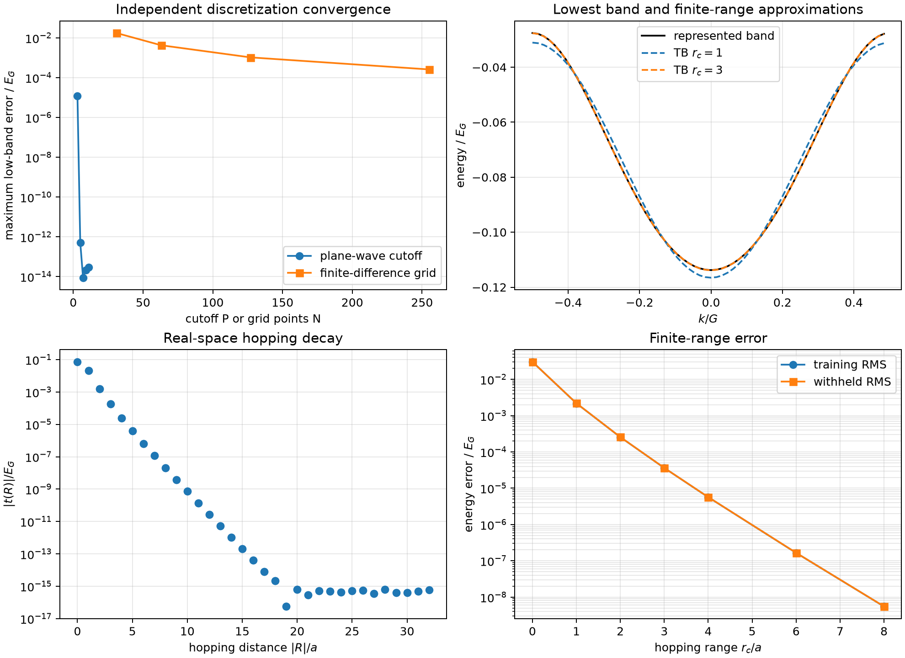
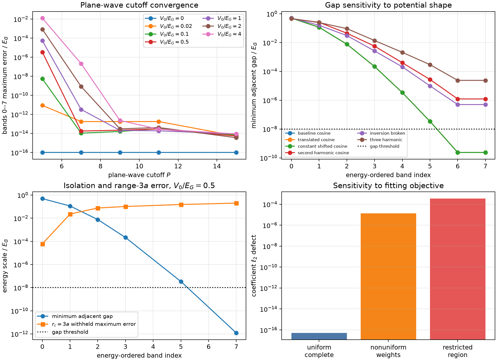
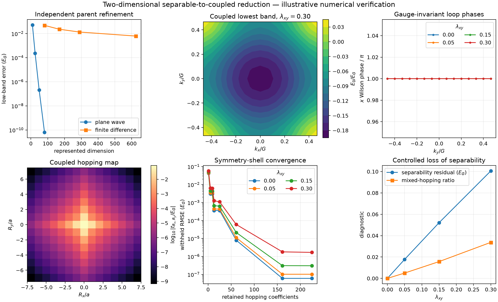
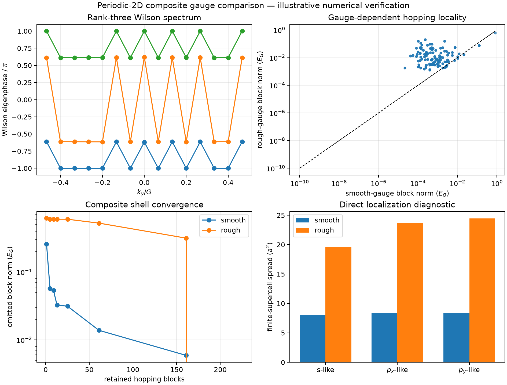

# Compatibility of spectral and operator reductions of a first-principles silicon Hamiltonian

**Eugene Joseph M. Ragasa** 
Department of Physics, De La Salle University, Manila, Philippines 
eugene.ragasa@dlsu.edu.ph

## Abstract

First-principles electronic Hamiltonians can be reduced to compact lattice models by
preserving selected spectral quantities or by approximating an aligned localized
operator. These criteria constrain different information and need not identify the
same effective Hamiltonian. This study formulates their compatibility as an admissible-
set intersection problem over a nested hierarchy of reduced models. A spectral loss
constrains training eigenvalues and declared observables, while an operator loss
compares real-space matrices after an explicit symmetry-compatible alignment. A common
feasible witness identifies a Hamiltonian satisfying both reductions. When no witness
is found, certified lower and feasible upper bounds on a dimensionless parameter-space
metric distinguish resolved separation from an inconclusive search. Parent-model,
numerical-discretization, local-extraction, and model-reduction errors remain separate.
The framework is material-neutral when the parent and reduced operators can be placed
in authenticated common coordinates and a finite candidate hierarchy is declared.
Bulk silicon and orthogonal ten-orbital $sp^3s^\ast$ Slater–Koster models provide the
planned benchmark, with withheld validation based on band energies, the indirect gap,
conduction-valley position, longitudinal and unaveraged transverse effective masses,
and shell- and orbital-resolved operator residuals. Controlled one- and two-dimensional periodic experiments verify component contracts
for common-space transport, gauge handling, hopping reconstruction, range truncation,
and matched direct/mediated reductions. Adversarial changes to isolation, gauge,
weights, and training domains expose the expected failure boundaries. These are
illustrative numerical-verification results, not a completed admissible-set map or
material validation. The silicon production plan and pending result records remain in
the appendices; no numerical silicon compatibility conclusion is claimed here.

**Keywords:** model selection, operator compatibility, silicon, tight-binding
reduction, Wannier Hamiltonian

## I. Introduction

Density-functional theory (DFT) supplies a first-principles Kohn–Sham description of
crystalline electronic structure [1,2]. Plane waves provide a systematic numerical
representation for periodic calculations, but they are inconvenient for interpolation,
large supercells, and local perturbations. Maximally localized Wannier functions
transform a selected Kohn–Sham subspace into a localized representation whose
real-space matrix elements support accurate interpolation [3–6]. Parameterized
tight-binding models impose a more restrictive orbital basis, hopping range, and
symmetry structure [7,8]. That restriction makes the model compact and interpretable,
but it also introduces model-reduction error.

Two natural reduction objectives arise. A spectral fit preserves selected eigenvalues
or derived observables. An operator fit preserves matrix information in an aligned
localized representation. The objectives are not equivalent: eigenvalues do not
uniquely determine eigenvectors, onsite terms, or hopping matrices. Band-only fitting
therefore leaves information relevant to matrix-element-dependent observables and local
perturbations unconstrained. Operator fitting retains more of that information, but it
does not by itself validate optical, defect, strain, or transport predictions.
Conversely, a small matrix residual under one weighting need not ensure accurate valley
curvature or band-edge observables.

An operator comparison is meaningful only after its state spaces have been identified.
The Wannier and tight-binding matrices must share compatible dimensions, orbital
content, lattice translations, energy units, energy reference, and coordinate order.
Their remaining orbital-coordinate freedom must be related by an explicit alignment
map. Polar decomposition and principal-angle methods provide useful numerical tools
for constructing and diagnosing such maps [9,10], but a low numerical residual alone
does not establish that an alignment is physically or symmetry compatible.

This work asks whether spectral and operator requirements admit a common reduced
Hamiltonian within a prescribed model class. Rather than comparing two independently
optimized parameter vectors, it defines the full sets of models accepted by each
criterion. Compatibility becomes a set-intersection question. If the sets are certified
to be disjoint, bounds on their minimum separation quantify the obstruction within the
chosen class; failure to locate an intersection alone does not establish disjointness.
Repeating the test over a fixed nested hierarchy identifies the smallest tested class
that can satisfy both requirements.

Before the silicon application, controlled one- and two-dimensional periodic models
exercise the framework's prerequisite operations: independent parent refinement,
common-space transport, isolated and composite subspace handling, real-space hopping
reconstruction, finite-range reduction, gauge attacks, and changed fitting objectives.
These experiments make the distinction between spectral invariance and operator
locality visible without attributing synthetic behavior to a material. They do not yet
map the complete admissible sets or certify a nonzero $\delta_j^\ast$.

The mathematical protocol is not specific to silicon. It applies to a periodic parent
and candidate hierarchy only when the state spaces, basis conventions, symmetry
actions, energy reference, and parameter coordinates can be authenticated. The planned
benchmark is pristine bulk silicon in a scalar-relativistic, non-spin-polarized,
non-SOC branch. Its errors are measured relative to the selected PBE/Wannier parent.
Experimental agreement is not an independent fitting target, and impurity operators
remain outside the benchmark. These restrictions separate parent-model discrepancy
from reduction fidelity.

## II. Methodology

### *2.1 First-principles parent and reference*

A reference parent is defined by its physical operator, state space, basis,
discretization, units, geometry, boundary conditions, and numerical settings. The
controlled experiments in Section III use dimensionless one- and two-dimensional
scalar periodic Hamiltonians with independent plane-wave and finite-difference
representations. The planned silicon branch instead uses Quantum ESPRESSO [11], the
Perdew–Burke–Ernzerhof generalized gradient approximation [12], and an optimized
norm-conserving pseudopotential from the PseudoDojo family [13,14]. Its exact
executable, pseudopotential content hash, lattice, cutoff, reciprocal mesh, convergence
tolerances, retained bands, spin treatment, and environment form the parent identity.

The self-consistent calculation determines a fixed Kohn–Sham potential from the
converged density. Subsequent non-self-consistent and band calculations solve

$$
\hat H_{\mathrm{KS}}[n_{\mathrm{SCF}}]\psi_{n\mathbf{k}}
=
\epsilon_{n\mathbf{k}}\psi_{n\mathbf{k}}
\tag{1}
$$

on wavevector sets chosen for their specific roles. Density convergence, band-path
visualization, conduction-valley location, effective-mass extraction, and Wannier
construction therefore use related but noninterchangeable sampling designs.

Numerical convergence is evaluated against the quantities needed downstream rather
than total energy alone. The retained evidence includes fixed-point band energies,
the indirect Kohn–Sham gap, conduction-valley position, longitudinal electron mass,
both transverse electron masses, and the sensitivity of those quantities to the
plane-wave cutoff, reciprocal mesh, local stencil, and other declared numerical
choices. Convergence of software execution or one total-energy value is not treated as
convergence of these observables.

### *2.2 Localized Wannier subspace and real-space support*

A ten-orbital target subspace containing the valence states and low conduction states
needed for the silicon valleys is constructed with Wannier90 [3–5]. Its real-space
Hamiltonian is

$$
[\mathbf H_{\mathrm W}(\mathbf R)]_{\alpha\beta}
=
\left\langle w_{\alpha\mathbf 0}\middle|
\hat H_{\mathrm{KS}}
\middle|w_{\beta\mathbf R}\right\rangle,
\tag{2}
$$

where $\mathbf R$ is a direct-lattice translation and $\alpha$ and $\beta$ identify
Wannier states in the reference and translated cells. The initial projections,
disentanglement windows, localization settings, reciprocal mesh, centers, spreads,
and real-space truncation inventory are retained as part of the representation.

The Wannier Hamiltonian is not accepted merely because the localization program
terminates. Its interpolated bands are compared against direct parent eigenvalues on
wavevectors excluded from construction. The validation also examines centers, spreads,
real-space decay, sensitivity to projections and to the separately declared frozen and
outer windows, and target-subspace identity. Any unresolved subspace mismatch or gauge
ambiguity stops the operator comparison rather than being absorbed into a fit residual.

The operator comparison uses a finite, predeclared translation domain $\mathcal S_H$
drawn from the complete retained Wannier real-space inventory
$\mathcal S_{\mathrm{all}}$. The excluded retained-inventory squared operator-norm
fraction is

$$
\varepsilon_{\mathrm{tail}}^2(\mathcal S_H)
=
\frac{
\displaystyle\sum_{\mathbf R\in
\mathcal S_{\mathrm{all}}\setminus\mathcal S_H}
\omega_{\mathbf R}\|\mathbf H_{\mathrm W}(\mathbf R)\|_{\mathrm F}^{2}
}{
\displaystyle\sum_{\mathbf R\in\mathcal S_{\mathrm{all}}}
\omega_{\mathbf R}\|\mathbf H_{\mathrm W}(\mathbf R)\|_{\mathrm F}^{2}
}.
\tag{3}
$$

Here $\omega_{\mathbf R}\geq0$ accounts for translation pairing and shell
multiplicity. This is not a physical energy fraction and does not prove decay beyond
the represented Wannier mesh. The domain is enlarged until the diagnostic is stable
and its square lies below a separately frozen threshold $\tau_{\mathrm{tail}}$.
Failure of that gate stops the operator comparison; the omitted contribution is not
absorbed into the fitting tolerance.

### *2.3 Orbital alignment contract and intertwining conditions*

The tight-binding operator is transformed into the Wannier coordinate system through
a unitary map $\mathbf C$ selected from a predeclared admissible family $\mathcal U$.
This family is not the unrestricted group $U(10)$. Before the search, each model class
must bind the Wannier and tight-binding orbital centers, site identities, orbital
semantics, and representations $\mathbf D_{\mathrm W}(g)$ and
$\mathbf D_{\mathrm{TB}}(g)$ of every retained symmetry operation
$g\in G_{\mathrm{bind}}$. Here $\mathbf D(g)$ is shorthand for the complete action in
the chosen convention, including fractional translations, sublattice permutations,
cell relabeling, and wavevector-dependent phases where applicable. Every admissible
alignment must satisfy the intertwining condition

$$
\mathbf C\mathbf D_{\mathrm{TB}}(g)
=
\mathbf D_{\mathrm W}(g)\mathbf C,
\qquad g\in G_{\mathrm{bind}}.
\tag{4}
$$

Equation (4) is a constraint, not by itself evidence that the matrices realize the
silicon space group. Identifying $G_{\mathrm{bind}}$ with $Fd\bar{3}m$ requires the two
space-group representations, origins, fractional translations, and induced site and
translation maps to be constructed and authenticated independently. Until then, the
alignment gate remains unqualified or inconclusive.

The frozen definition of $\mathcal U$ may contain discrete site/orbital permutations,
phases in one-dimensional blocks, and block-unitary transformations within explicitly
declared symmetry-equivalent multiplicity spaces. It prohibits mixing between
inequivalent sites, incompatible irreducible representations, or orbital-semantic
classes unless that mixing is explicitly justified and frozen as part of the model
class. This block-and-intertwiner description covers both discrete and continuous
freedom; it does not assume that a Lie-algebra parameterization alone is sufficient.
Before subtraction, both operators must also use the same lattice vectors, translation
labels, orbital ordering, units, and scalar energy reference. Principal angles,
intertwining residuals, block singular values, multiplicity-space nonuniqueness, and
stability across initial alignments are retained separately from operator approximation
error. An ambiguous or ill-conditioned alignment makes the operator criterion
inconclusive.

### *2.4 Loss formulations and admissible model sets*

Each candidate class $\mathfrak M_j$ fixes its orbital semantics, canonical parameter
vector $\boldsymbol\theta$, neighbor shells, and symmetry constraints before its
results are inspected. For the silicon benchmark, the planned hierarchy begins with an
orthogonal ten-orbital $sp^3s^\ast$ Slater–Koster class and introduces longer-range or
additional symmetry-allowed terms only in a predeclared sequence.

Training and withheld wavevectors are assigned before fitting. A dimensionless
spectral loss combines individually scaled energy and observable residuals,

$$
\mathcal L_E(\boldsymbol\theta)
=
\sum_{n,\mathbf k} w_{n\mathbf k}
\left|
\frac{\epsilon_{n\mathbf k}^{\mathrm{TB}}(\boldsymbol\theta)
-\epsilon_{n\mathbf k}^{\mathrm W}}{s_{n\mathbf k}}
\right|^2
+
\sum_m w_m
\left|
\frac{O_m^{\mathrm{TB}}(\boldsymbol\theta)-O_m^{\mathrm W}}{s_m}
\right|^2,
\tag{5}
$$

where the nonzero scales $s_{n\mathbf k}$ and $s_m$, dimensionless weights, band
identity rules, and scalar components $O_m$ are frozen before fitting. The observable
components keep longitudinal and both unaveraged transverse masses distinct. Energy,
wavevector, and mass residuals are not added without these explicit normalizations.

For the operator loss, the tight-binding matrix is defined to be zero on translations
in $\mathcal S_H$ outside the support of the candidate model. Unresolved long-range
parent terms therefore contribute to the residual rather than being silently aliased
into shorter-range parameters. The normalized operator loss is

$$
\mathcal L_H(\mathbf C,\boldsymbol\theta)
=
\frac{
\displaystyle\sum_{\mathbf R\in\mathcal S_H}\omega_{\mathbf R}
\left\|
\mathbf H_{\mathrm W}(\mathbf R)
-
\mathbf C\mathbf H_{\mathrm{TB}}(\mathbf R;\boldsymbol\theta)
\mathbf C^\dagger
\right\|_{\mathrm F}^{2}
}{
\displaystyle\sum_{\mathbf R\in\mathcal S_H}\omega_{\mathbf R}
\left\|\mathbf H_{\mathrm W}(\mathbf R)\right\|_{\mathrm F}^{2}
},
\tag{6}
$$

where $\omega_{\mathbf R}\geq0$ is the frozen translation/shell weighting and
$\|\cdot\|_{\mathrm F}$ is the Frobenius norm. The weighting rule explicitly accounts
for $\mathbf R$ and $-\mathbf R$ pairing and shell multiplicity so that equivalent
translations are not counted inconsistently. The denominator, energy reference,
comparison domain, and treatment of a zero denominator are fixed before fitting.

Within $\mathcal S_H$, the residual is decomposed by onsite and hopping contribution,
orbital block, symmetry channel, and neighbor shell. These decompositions diagnose
missing model content but do not replace the primary loss.

For class $\mathfrak M_j$, the two criteria define

$$
\mathfrak A_{E,j}(\tau_E)
=
\left\{
\mathbf H(\boldsymbol\theta)\in\mathfrak M_j:
\mathcal L_E(\boldsymbol\theta)\leq\tau_E
\right\},
\tag{7}
$$

and

$$
\mathfrak A_{H,j}(\tau_H)
=
\left\{
\mathbf H(\boldsymbol\theta)\in\mathfrak M_j:
\min_{\mathbf C\in\mathcal U}
\mathcal L_H(\mathbf C,\boldsymbol\theta)\leq\tau_H
\right\}.
\tag{8}
$$

The rules for deriving $\tau_E$, $\tau_H$, the tail threshold, and metric
normalization are declared before production evidence is inspected. Their final
numerical values may be bound only after the parent numerical and local-extraction
floors have been measured; they are then frozen before any compatibility fit or set
search. They are not retuned in response to model-class outcomes. Parameter bounds and
scaling, optimization algorithms, start designs, evaluation budgets, convergence
rules, and failure rules are frozen at the same boundary. A sampled collection of
acceptable parameter vectors is evidence about these sets, not automatically a proof
that the continuous sets have been exhausted.

### *2.5 Decision protocol, set separation, and model selection*

Canonical parameter coordinates remove declared sign, ordering, and orbital-label
equivalences before models are compared. With positive parameter scales $s_q$ and
frozen dimensionless weights $v_q$, the distance is

$$
d_{\mathrm{TB}}(\boldsymbol\theta_1,\boldsymbol\theta_2)
=
\left[
\sum_q v_q
\left(
\frac{\theta_{1,q}-\theta_{2,q}}{s_q}
\right)^2
\right]^{1/2}.
\tag{9}
$$

When both admissible sets are nonempty, their minimum separation is

$$
\delta_j^\ast
=
\inf_{\substack{
\mathbf H(\boldsymbol\theta_E)\in\mathfrak A_{E,j}\\
\mathbf H(\boldsymbol\theta_H)\in\mathfrak A_{H,j}}}
d_{\mathrm{TB}}(\boldsymbol\theta_E,\boldsymbol\theta_H).
\tag{10}
$$

A common feasible witness establishes a nonempty numerical intersection. More
generally, every reported separation is bracketed as

$$
0\leq \underline{\delta}_j
\leq \delta_j^\ast
\leq \overline{\delta}_j,
\tag{11}
$$

where $\overline{\delta}_j$ is supplied by an explicitly feasible pair and
$\underline{\delta}_j$ requires an exclusion certificate over the complete frozen
search domain. Multistart global and local searches may improve the feasible upper
bound but do not, by themselves, certify the lower bound. A common witness, or a
feasible upper bound below the predeclared map resolution, supports numerical
compatibility. A certified lower bound above that resolution supports incompatibility
only within the tested class, frozen tolerances, parameter domain, alignment family,
and numerical resolution. If neither condition is met, including when a search merely
fails to find an intersection, the disposition is inconclusive. The model-selection
rule chooses the first class in the fixed hierarchy that passes all required gates; it
does not select a larger model solely because it obtains a smaller training loss.

**Withheld validation and error separation.**

The final compatibility decision consumes evidence excluded from fitting. Spectral
checks include withheld band energies, the indirect gap, valley coordinate, and
longitudinal and two unaveraged transverse electron masses. Effective masses are
obtained from an identity-tracked, nondegenerate conduction branch with explicit
Cartesian axes, energy reference, and local-step stability. The primary and smaller-
step guard estimates must pass the separately frozen extraction gate before a mass is
admitted to the spectral loss. Stencil variation is retained as local-extraction
error; it is not hidden by enlarging $\tau_E$. Literature masses, when reported, are
cited comparison values rather than substitutes for calculated parent observations.
Operator checks use withheld translations or blocks where applicable and retain the
residual decomposition.

At least four error channels remain separate:

1. parent-model discrepancy, including the chosen functional, pseudopotential, and
   omitted spin–orbit physics;
2. numerical/discretization error in the DFT and Wannier parents;
3. local extraction error in valley and curvature estimates; and
4. model-reduction error measured by spectral, operator, and withheld-observable
   residuals within the selected tight-binding class.

No combined uncertainty is reported without an explicit combination rule. A missing,
conflicting, or ill-conditioned required channel produces an inconclusive decision,
not a pass.

## III. Results and Discussion

### *3.1 Controlled-model evidence boundary*

The retained controlled experiments use synthetic periodic Hamiltonians, not realistic
materials. The one-dimensional parent is

$$
\hat H_{1\mathrm D}
=-\frac{d^2}{dx^2}+\lambda\cos x,
\qquad a=2\pi,\quad E_G=1,
\tag{12}
$$

with $\lambda=0.5$ in the nominal case. The two-dimensional family is

$$
\hat H_{2\mathrm D}
=-\nabla^2+\lambda_x\cos x+\lambda_y\cos y
+\lambda_{xy}\cos x\cos y,
\tag{13}
$$

with $\lambda_x=\lambda_y=0.5$ and
$\lambda_{xy}\in\{0,0.05,0.15,0.30\}$. Both use explicit plane-wave parents,
independently assembled finite-difference representations, complete reciprocal meshes,
and retained real-space transforms. Their evidence class is illustrative software and
numerical verification on controlled mathematics. It is not material validation or
uncertainty quantification.

These calculations predate the full admissible-set protocol of Section II. They verify
its representation, alignment, gauge, truncation, and route-comparison components, but
they do not exhaustively map $\mathfrak A_{E,j}$ and $\mathfrak A_{H,j}$ or certify a
value of $\delta_j^\ast$.

### *3.2 One-dimensional isolated-band reduction*

Independent refinement separates parent-discretization error from reduction error. For
the lowest three sampled bands, the plane-wave error relative to the declared $P=15$
reference falls to $5.25\times10^{-13}E_G$ at $P=5$. The independent centered finite-
difference error falls from $1.75\times10^{-2}E_G$ at 31 points to
$2.60\times10^{-4}E_G$ at 255 points. Selected zone-center and zone-boundary energies
agree with independent Mathieu characteristic values within
$1.2\times10^{-16}E_G$. After transport to a common $|n|\leq3$ reciprocal sector, the
operator Frobenius discrepancy decreases from $5.39\times10^{-1}E_G$ to
$8.10\times10^{-3}E_G$ over the same finite-difference refinement.

**Figure 1.** Retained one-dimensional illustrative numerical-verification evidence.
The panels distinguish parent discretization, complete transform reconstruction,
hopping decay, and finite-range approximation. They are not silicon results.

The complete 64-point hopping transform reconstructs the represented isolated band
within $2.1\times10^{-16}E_G$. Increasing the symmetric hopping range reduces the
withheld root-mean-square error from $3.04\times10^{-2}E_G$ for the onsite-only model
to $5.55\times10^{-9}E_G$ at range $8a$. Matched equal-weight direct least squares and
Fourier-mediated truncation agree within $8.3\times10^{-17}$ in coefficient norm.
This agreement is algebraic evidence for identical objectives, not general compatibility
between arbitrary spectral and operator reductions.

### *3.3 Objective dependence in the one-dimensional stress test*

The adversarial extension varies potential strength, band index, reciprocal mesh,
gauge, potential shape, weights, and training domain. It retains complete-transform
reconstruction while exposing assumptions that fail outside the nominal isolated-band
case. At the free-particle limit, adjacent gaps close and scalar isolated-band tracking
is inapplicable. For the nominal cosine parent, higher bands show progressively smaller
adjacent gaps and worse fixed-range withheld errors, so energy ordering alone does not
supply a robust retained-state identity.

Changing only the reciprocal weights raises the direct/mediated coefficient defect
from a $5.2\times10^{-17}$ control to $1.32\times10^{-5}$. Restricting the direct-fit
training region raises it to $3.44\times10^{-4}$. Thus two routes coincide when they
implement the same projection and diverge when their objectives differ. This controlled
result motivates comparing admissible sets rather than assuming that independently
named reductions commute.

**Figure 2.** Retained one-dimensional stress evidence. Changed weights and training
domains intentionally break the matched-route equality; gap closures stop the isolated-
band interpretation rather than being hidden as fitting failures.

### *3.4 Two-dimensional coupling, shells, and tensor observables*

The two-dimensional separable limit supplies exact Kronecker-sum and product-spectrum
controls. Their represented defects are respectively zero and
$3.55\times10^{-14}E_G$. A rank-two degeneracy test leaves the complete projector
unchanged under an internal Hadamard rotation even though individual-vector overlaps
are only $1/\sqrt2$, demonstrating why subspaces rather than arbitrary degenerate
eigenvectors are the stable comparison objects.

Turning on $\lambda_{xy}$ produces information that a one-dimensional path cannot
represent. The mixed-direction hopping norm grows from a
$3.00\times10^{-15}E_G$ numerical floor at the separable point to
$1.94\times10^{-3}E_G$ at $\lambda_{xy}=0.30$. At that strongest coupling, increasing
the complete square-lattice shell reduces the withheld root-mean-square error from
$5.75\times10^{-2}E_G$ for the onsite shell to $1.70\times10^{-6}E_G$ for the full
finite transform. The nonzero full-shell withheld error remains a reciprocal-mesh
interpolation error and is not relabeled as hopping truncation.

**Figure 3.** Retained two-dimensional illustrative numerical-verification evidence.
The full reciprocal mesh controls the loop, hopping, shell, and mass diagnostics. No
two-dimensional material is represented.

The anisotropic control yields distinct principal masses, $1.184m$ and $2.112m$, while
retaining time reversal and both reflections within $3.60\times10^{-14}E_G$. This
separates tensor anisotropy from nonseparable mixed hopping and illustrates why scalar
or averaged mass targets are insufficient.

### *3.5 Composite-subspace gauge test*

A rank-three retained subspace provides a direct spectral/operator contrast. A smooth
projected frame and a deliberately rough periodic internal gauge preserve mesh spectra
within $1.22\times10^{-15}E_G$, Wilson eigenphase sets within
$2.22\times10^{-15}$, and the zero total Chern diagnostic. Their locality differs:
the finite-supercell spread increases from $24.90a^2$ to $67.70a^2$, and the omitted
hopping-block norm at squared-radius shell 18 increases from
$1.38\times10^{-2}E_G$ to $5.25\times10^{-1}E_G$.

**Figure 4.** Smooth and rough gauges represent the same retained subspace and spectra
but produce materially different localization and finite-range behavior. This is a
controlled gauge-coordinate result, not an operator comparison between independently
validated material models.

The test directly illustrates why spectral agreement alone cannot determine a useful
localized operator. It also shows why the alignment family in Eq. (4) must be frozen:
an unrestricted momentum-dependent gauge can preserve spectra while changing the
real-space representation against which a short-range model is judged.

### *3.6 What the controlled models establish*

**Table 1. Scope of the retained controlled-model evidence.**

| Verified component | Supported conclusion | Remaining gap |
|---|---|---|
| Independent parent refinement and common-space transport | Representation errors can be separated before operator comparison | No material parent |
| Complete hopping transforms and finite-range hierarchies | Coordinate reconstruction and range reduction are distinct | No application-derived range threshold |
| Matched versus changed fitting objectives | Route equality is conditional on identical mathematics | No complete admissible-set geometry |
| Degenerate and composite subspace controls | Projectors and aligned subspaces are more stable than individual eigenvectors | No authenticated silicon intertwiner |
| Smooth/rough gauge comparison | Spectra can agree while locality and truncated operators differ | No certified silicon $\delta_j^\ast$ |

The controlled results support the need for the proposed protocol, but they do not
complete it. In particular, no retained experiment yet provides exhaustive spectral
and operator admissible sets, a certified positive separation bound, or a three-
dimensional synthetic benchmark. The silicon application is therefore a planned first-
principles three-dimensional test, not an extrapolated consequence of the one- and two-
dimensional calculations.

## IV. Conclusions and Recommendations

Spectral and operator reductions should be compared as admissible model sets rather
than as isolated optimizer outputs. The resulting protocol requires an authenticated
common state space, a symmetry-constrained alignment family, independently normalized
losses, a controlled real-space domain, canonical model coordinates, withheld
validation, and a frozen nested hierarchy. A common feasible witness supports
compatibility. Certified separation bounds support a class-relative obstruction, while
an unresolved search remains inconclusive.

The operator criterion retains matrix structure that a band-only objective cannot
identify, but it does not automatically validate unmeasured response functions or
transfer to other physical settings. Similarly, $\delta_j^\ast$ diagnoses compatibility
between admissible sets; it is not a physical uncertainty and does not replace the
underlying residuals. Parent, numerical, extraction, and reduction errors must remain
separate unless an explicit combination rule is justified.

The controlled one- and two-dimensional results verify key prerequisites for this
framework. Complete hopping reconstruction reaches binary64 scale, finite-range errors
remain distinct from reciprocal sampling, matched reduction routes agree only under
matched objectives, and gauge-equivalent spectra can have sharply different locality.
These results support the need for aligned operator evidence in addition to spectral
fit quality. They do not yet constitute an exhaustive admissible-set test.

The framework can be applied beyond silicon when the required representations,
symmetry actions, common coordinates, candidate hierarchy, and validation observables
can be authenticated. For the planned silicon benchmark, a model-selection conclusion
should be stated only after the appendix gates have produced retained evidence. Until
then, the defensible contributions are the methodology, its fail-closed decision logic,
and the bounded controlled-model verification reported in Section III.

## Appendix A. Planned Silicon Benchmark Protocol

This appendix records proposed work, not completed production calculations. It is kept
outside the main argument until authenticated results exist. Nothing in this appendix
authorizes calculator execution.

### *A.1 Production prerequisites*

Before production execution, the benchmark must bind an accepted production-lattice
artifact, authenticated full-precision inputs, the exact executable and
pseudopotential identities, the physical branch, numerical settings, warning and stop
policies, stage manifests, and explicit execution authorization. A missing prerequisite
stops the sequence; tutorial values or unreviewed settings cannot replace it.

The planned parent identities span the declared cutoff and reciprocal-mesh convergence
corners. Their convergence assessment retains fixed-point band energies, the indirect
Kohn–Sham gap, conduction-valley coordinate, longitudinal mass, both unaveraged
transverse masses, and the warning disposition. Total-energy convergence alone is
insufficient.

### *A.2 Planned calculation and validation stages*

Subject to the prerequisite gates, the planned sequence is:

1. authenticate and accept the production lattice and physical branch;
2. evaluate the parent DFT convergence design;
3. construct and independently validate the ten-orbital Wannier representation;
4. freeze the derived numerical thresholds, parameter domains, alignment family,
   optimization budgets, and map resolution;
5. search the spectral and operator admissible sets for each predeclared model class;
6. construct common witnesses or separation bounds;
7. evaluate withheld band, valley, mass, and operator gates; and
8. repeat the required independent and sensitivity checks before model selection.

Threshold-derivation rules are declared before production evidence is inspected. Final
numerical values may reflect the demonstrated parent and extraction floors, but they
are frozen before compatibility fitting and are not retuned after model outcomes are
known.

## Appendix B. Pending Silicon Evidence Records

The following tables are intentionally empty. They are templates for retained evidence,
not implied results.

**Table B1. Parent and Wannier qualification record.**

| Evidence group | Required contents | Current status |
|---|---|---|
| Parent identity | Lattice, executable, pseudopotential hash, physical branch | Not evaluated |
| Numerical convergence | Cutoff, mesh, band-edge, valley, and mass studies | Not evaluated |
| Wannier identity | Projections, frozen and outer windows, centers, spreads | Not evaluated |
| Withheld interpolation | Direct-parent versus Wannier bands on excluded points | Not evaluated |
| Real-space support | $\mathcal S_H$, $\mathcal S_{\mathrm{all}}$, weights, and $\varepsilon_{\mathrm{tail}}$ | Not evaluated |
| Alignment contract | Authenticated symmetry actions and admissible $\mathcal U$ | Not evaluated |

**Table B2. Compatibility decision record.**

| Model class | Spectral-set evidence | Operator-set evidence | Common witness | Separation bounds $[\underline\delta_j,\overline\delta_j]$ | Withheld gates | Disposition |
|---|---:|---:|---:|---:|---|---|
| Nearest-neighbor orthogonal $sp^3s^\ast$ | Pending | Pending | Pending | Pending | Pending | Not evaluated |
| Second-neighbor extension | Pending | Pending | Pending | Pending | Pending | Not evaluated |
| Selected symmetry-allowed corrections | Pending | Pending | Pending | Pending | Pending | Not evaluated |

**Table B3. Residual-attribution record.**

| Diagnostic | Required breakdown | Current status |
|---|---|---|
| Spectral residual | Training/withheld point, band identity, observable | Not evaluated |
| Operator residual | Onsite/hopping, orbital block, symmetry channel, shell | Not evaluated |
| Search evidence | Starts, budgets, feasible witnesses, lower-bound certificate | Not evaluated |
| Sensitivity | Parent setting, Wannier choice, stencil, map resolution | Not evaluated |

A future revision may move authenticated results from these records into Section III.
Failed and inconclusive outcomes must be retained alongside successful ones.

## Appendix C. Non-Production Software Bootstrap

A retained single-process Quantum ESPRESSO 7.2 silicon tutorial run supplies bounded
software-execution and extraction evidence. It exited successfully, reported
self-consistent convergence after six iterations, and produced a total energy of
$-15.84452726$ Ry, matching the bundled tutorial reference at printed precision. The
retained record includes the executable, input, output, pseudopotential provenance,
and an inventory of native restart and QEXSD artifacts.

This bootstrap is not part of the production admissible sets. It uses a legacy parent
distinct from the planned PBE/PseudoDojo branch, and its sampling and retained bands do
not establish the indirect gap, valley location, effective masses, Wannier validity,
or spectral/operator compatibility. It demonstrates software behavior only.

## Appendix D. Planned Direct Admissible-Set Demonstration

Section III verifies components of the protocol but does not yet supply a direct map of
$\mathfrak A_E$ and $\mathfrak A_H$. A future controlled extension will introduce a
low-dimensional canonical parameter family for which the two loss sublevel sets can be
mapped exhaustively or bounded analytically. The one-dimensional case will test set
intersection and separation under changed spectral weights and training domains. A
two-dimensional case will compare unrestricted and symmetry-constrained alignment
families while keeping the represented parent fixed.

The extension must predeclare parameter bounds, normalizations, thresholds, map
resolution, and a lower-bound method before inspecting outcomes. Its figures may show
admissible regions and shortest feasible vectors only when those objects are directly
supported by retained data. No three-dimensional controlled admissible-set result is
currently available, and none is inferred from the one- and two-dimensional evidence.

The current controlled-model sources are retained under:

- `calculations/research-monograph/periodic-1d/`, including its protocol, result,
  report, figures, and checksum manifest; and
- `calculations/research-monograph/periodic-2d/`, including the scalar, composite,
  topology, Wannier, figures, result records, and checksum manifest.

These repository records are working provenance, not a public data deposit or DOI.

## Nomenclature

| Symbol or abbreviation | Description | Unit |
|---|---|---|
| $\mathbf C$ | Unitary orbital-coordinate alignment | — |
| DFT | Density-functional theory | — |
| $\mathbf D(g)$ | Matrix representation of retained symmetry operation $g$ | — |
| $d_{\mathrm{TB}}$ | Metric in canonical tight-binding coordinates | — |
| $G_{\mathrm{bind}}$ | Symmetry operations enforced by the alignment contract | — |
| $\mathbf H_{\mathrm{KS}}$ | Kohn–Sham Hamiltonian | energy |
| $\mathbf H_{\mathrm{TB}}(\mathbf R)$ | Tight-binding hopping matrix | energy |
| $\mathbf H_{\mathrm W}(\mathbf R)$ | Wannier hopping matrix | energy |
| $\mathcal L_E$ | Spectral loss | dimensionless |
| $\mathcal L_H$ | Aligned operator loss | dimensionless |
| $\mathfrak M_j$ | Candidate tight-binding model class | — |
| NSCF | Non-self-consistent field | — |
| $O_m$ | Declared scalar band-edge observable component | observable dependent |
| PBE | Perdew–Burke–Ernzerhof approximation | — |
| $\mathbf R$ | Direct-lattice translation | length or lattice index |
| $\mathcal S_H$ | Finite operator-comparison translation domain | — |
| $\mathcal S_{\mathrm{all}}$ | Complete retained Wannier translation inventory | — |
| SCF | Self-consistent field | — |
| SOC | Spin–orbit coupling | — |
| $s_{n\mathbf k},s_m,s_q$ | Positive residual and parameter scales | quantity dependent |
| $v_q$ | Dimensionless parameter-distance weight | — |
| $\boldsymbol\theta$ | Tight-binding parameter vector | mixed |
| $\tau_E,\tau_H,\tau_{\mathrm{tail}}$ | Spectral, operator, and tail thresholds | dimensionless |
| $\delta_j^\ast$ | Minimum admissible-set separation | — |
| $\underline\delta_j,\overline\delta_j$ | Certified lower and feasible upper separation bounds | — |
| $\varepsilon_{\mathrm{tail}}$ | Operator-norm tail diagnostic; its square is the excluded squared-norm fraction | — |
| $\mathcal U$ | Frozen symmetry-compatible alignment family | — |
| $\omega_{\mathbf R}$ | Translation or shell weight | — |

## Acknowledgments

> **Author action before submission.** Add verified funding, computing-resource,
> institutional, and technical acknowledgments. Do not infer support from repository
> metadata.

## References

[1] Hohenberg P, Kohn W. 1964. Inhomogeneous electron gas. Physical Review.
136(3B):B864–B871. doi:10.1103/PhysRev.136.B864.

[2] Kohn W, Sham LJ. 1965. Self-consistent equations including exchange and
correlation effects. Physical Review. 140(4A):A1133–A1138.
doi:10.1103/PhysRev.140.A1133.

[3] Marzari N, Mostofi AA, Yates JR, Souza I, Vanderbilt D. 2012. Maximally
localized Wannier functions: Theory and applications. Reviews of Modern Physics.
84:1419–1475. doi:10.1103/RevModPhys.84.1419.

[4] Souza I, Marzari N, Vanderbilt D. 2001. Maximally localized Wannier functions for
entangled energy bands. Physical Review B. 65:035109.
doi:10.1103/PhysRevB.65.035109.

[5] Pizzi G, Vitale V, Arita R, Blügel S, Freimuth F, Géranton G, Gibertini M,
Gresch D, Johnson C, Koretsune T, et al. 2020. Wannier90 as a community code: New
features and applications. Journal of Physics: Condensed Matter. 32(16):165902.
doi:10.1088/1361-648X/ab51ff.

[6] Yates JR, Wang X, Vanderbilt D, Souza I. 2007. Spectral and Fermi surface
properties from Wannier interpolation. Physical Review B. 75:195121.
doi:10.1103/PhysRevB.75.195121.

[7] Slater JC, Koster GF. 1954. Simplified LCAO method for the periodic potential
problem. Physical Review. 94:1498–1524. doi:10.1103/PhysRev.94.1498.

[8] Vogl P, Hjalmarson HP, Dow JD. 1983. A semi-empirical tight-binding theory of the
electronic structure of semiconductors. Journal of Physics and Chemistry of Solids.
44(5):365–378. doi:10.1016/0022-3697(83)90064-1.

[9] Björck Å, Golub GH. 1973. Numerical methods for computing angles between linear
subspaces. Mathematics of Computation. 27(123):579–594.
doi:10.1090/S0025-5718-1973-0348991-3.

[10] Higham NJ. 1986. Computing the polar decomposition—with applications. SIAM
Journal on Scientific and Statistical Computing. 7(4):1160–1174.
doi:10.1137/0907079.

[11] Giannozzi P, Baroni S, Bonini N, Calandra M, Car R, Cavazzoni C, Ceresoli D,
Chiarotti GL, Cococcioni M, Dabo I, et al. 2009. QUANTUM ESPRESSO: A modular and
open-source software project for quantum simulations of materials. Journal of
Physics: Condensed Matter. 21(39):395502.
doi:10.1088/0953-8984/21/39/395502.

[12] Perdew JP, Burke K, Ernzerhof M. 1996. Generalized gradient approximation made
simple. Physical Review Letters. 77:3865–3868. doi:10.1103/PhysRevLett.77.3865.

[13] Hamann DR. 2013. Optimized norm-conserving Vanderbilt pseudopotentials. Physical
Review B. 88:085117. doi:10.1103/PhysRevB.88.085117.

[14] van Setten MJ, Giantomassi M, Bousquet E, Verstraete MJ, Hamann DR, Gonze X,
Rignanese G-M. 2018. The PseudoDojo: Training and grading a 85 element optimized
norm-conserving pseudopotential table. Computer Physics Communications. 226:39–54.
doi:10.1016/j.cpc.2018.01.012.
