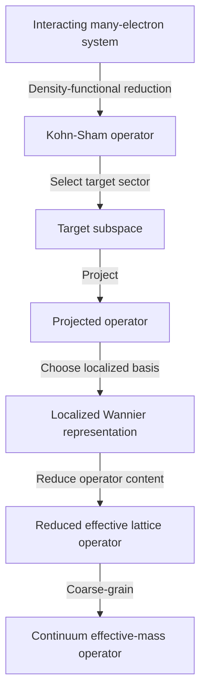
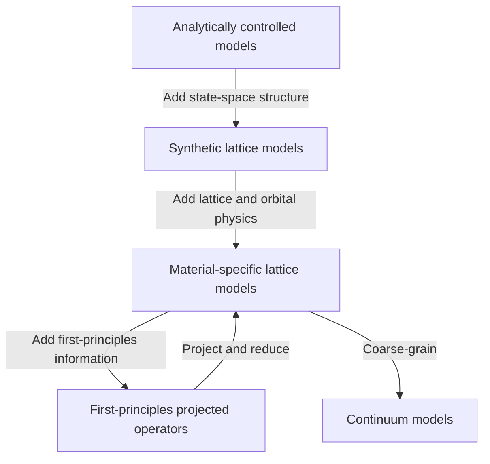
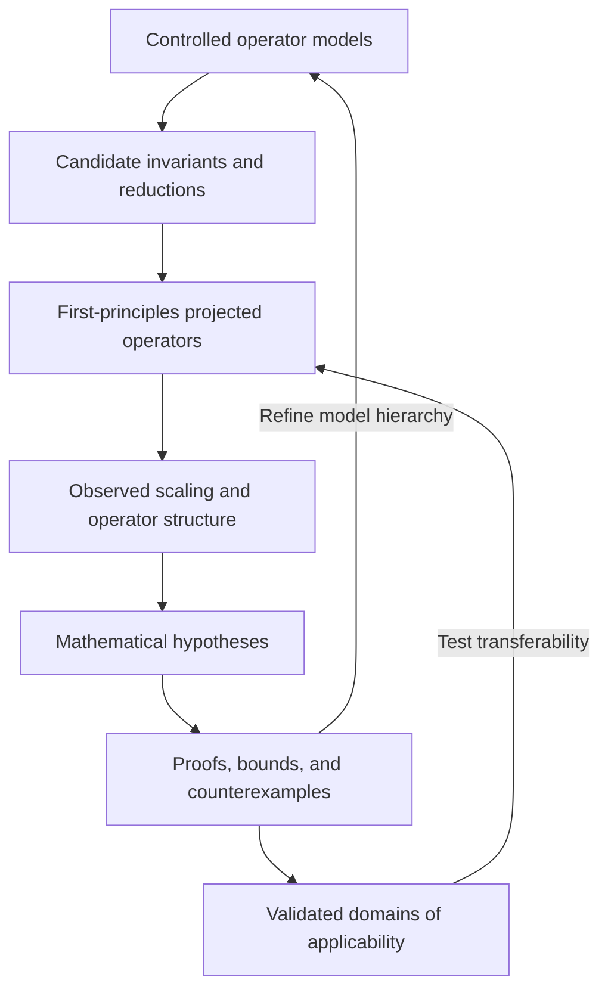

# Operator-Reduction Hierarchy

[[ksdft2Effmass.00|Index]] | [[ksdft2effmass.research_plan|Research Plan]]

## Complete Hierarchy

This research program develops theory through a hierarchy of operator models with progressively increasing physical complexity.

The purpose of the hierarchy is not merely to replace an expensive first-principles calculation with a cheaper model. Each level provides a different degree of mathematical control, physical realism, and interpretability. The research problem is to determine which operator structures, invariants, states, spectra, and observables persist under the transformations between these levels.

This mathematical hierarchy is not a runtime workflow DAG. The stateful
scientific/computational workflow is the project Colored Petri Net described in
[[ksdft2effmass.workflow-semantics]].

The complete reduction chain is

$$
\boxed{
\hat H_{\mathrm{MB}}
\longrightarrow
\hat H_{\mathrm{KS}}
\longrightarrow
\hat H^{(P)}
\longrightarrow
\mathbf H_{\mathrm W}
\longrightarrow
\mathbf H_{\mathrm{red}}
\longrightarrow
\hat H_{\mathrm{continuum}}
}.
$$

Here:

- $\hat H_{\mathrm{MB}}$ is the interacting many-electron Hamiltonian;
- $\hat H_{\mathrm{KS}}$ is the effective one-particle Kohn–Sham operator;
- $\hat H^{(P)}$ is the operator projected onto a selected target subspace;
- $\mathbf H_{\mathrm W}$ is the matrix representation of the projected operator in a localized Wannier basis;
- $\mathbf H_{\mathrm{red}}$ is a reduced lattice Hamiltonian retaining selected operator components;
- $\hat H_{\mathrm{continuum}}$ is the corresponding continuum approximation.

## Two Directions Through the Hierarchy

The hierarchy is traversed in two directions.

### Constructive Direction

Moving upward introduces progressively richer physical structure:

$$
\text{analytically controlled operator}
\longrightarrow
\text{synthetic lattice operator}
\longrightarrow
\text{material-specific lattice operator}
\longrightarrow
\text{first-principles projected operator}.
$$

This direction begins with operators whose complete content is known and introduces:

- finite-dimensional state spaces;
- lattice geometry;
- orbital degrees of freedom;
- crystalline symmetry;
- material-specific parameters;
- first-principles matrix elements.

### Reduction Direction

Moving downward removes microscopic information while attempting to preserve specified physical quantities:

$$
\text{first-principles operator}
\longrightarrow
\text{projected operator}
\longrightarrow
\text{reduced lattice operator}
\longrightarrow
\text{continuum operator}.
$$

This direction introduces:

- target-subspace selection;
- localized representations;
- truncation of operator components;
- reduction of orbital content;
- coarse-graining;
- continuum approximation.

The meeting point of the two directions is the effective lattice Hamiltonian. It may be constructed upward as a controlled model with prescribed operator content or downward as a reduced representation of a first-principles operator.

## Epistemic Role of Each Level

### Analytically Controlled Operators

Analytically controlled operators establish the mathematical behavior of the reduction procedure in systems where the complete operator is known.

They are used to determine:

- which decompositions are unique;
- which quantities are basis dependent;
- which quantities are invariant;
- how operator errors propagate into spectra and states;
- whether a proposed reduction can be identified from the available data.

### Synthetic Tight-Binding Models

Synthetic tight-binding models serve as controlled computational experiments.

For a prescribed impurity model,

$$
\hat H_d^{\mathrm{TB}}
=
\hat H_{\mathrm{bulk}}^{\mathrm{TB}}
+
\Delta\hat H_{d,\mathrm{true}}^{\mathrm{TB}},
$$

the bulk operator and the true impurity perturbation are both known. The model can therefore test:

- recovery of onsite and hopping components;
- gauge dependence of matrix decompositions;
- identification of bulk and impurity subspaces;
- operator-reconstruction metrics;
- error propagation through successive reductions;
- numerical definitions of a continuum crossover.

The purpose is not only to verify an implementation. Controlled models establish the conditions under which an operator-reduction claim is mathematically meaningful.

### Material-Specific Lattice Models

Material-specific tight-binding models introduce the lattice, orbital, symmetry, and band-structure structure of the target material while retaining an explicitly inspectable Hamiltonian.

For silicon, this level may introduce:

- the diamond lattice;
- multiple conduction-band valleys;
- anisotropic effective masses;
- valence-band degeneracy;
- spin–orbit coupling;
- donor and acceptor impurity terms.

This level determines which conclusions from controlled models survive the introduction of silicon-specific physics. It separates difficulties caused by the lattice and orbital structure from those caused by density-functional approximations, Wannier disentanglement, and finite-supercell effects.

### First-Principles Projected Operators

First-principles calculations determine which operator structures actually arise in the material.

The projected impurity operator is not assumed to possess the structure found in a controlled model. Its:

- spatial decay;
- orbital dependence;
- onsite content;
- hopping modifications;
- nonlocality;
- gauge stability

must be measured computationally.

The computational direction is therefore

$$
\text{first-principles calculation}
\longrightarrow
\text{observed operator structure}
\longrightarrow
\text{candidate mathematical statement}.
$$

### Reduced Lattice Operators

A reduced lattice operator retains only the operator components required to preserve the target low-energy physics.

For a model class $\mathfrak M_m$, the optimal reduced operator may be written as

$$
\mathbf H_m^*
=
\Pi_{\mathfrak M_m}\mathbf H_{\mathrm W},
$$

with residual

$$
\Delta\mathbf H_m
=
\left(
\mathbf I-\Pi_{\mathfrak M_m}
\right)
\mathbf H_{\mathrm W}.
$$

The scientific question is whether the discarded operator content materially changes the target:

$$
\mathcal O
=
\left\{
\text{states, spectra, subspaces, observables}
\right\}.
$$

### Continuum Operators

The continuum model is a hypothesis about which microscopic information becomes irrelevant at the target energy and length scales.

A continuum reduction is accepted only when

$$
\varepsilon_{\mathcal O}
\leq
\tau_{\mathcal O},
$$

where $\varepsilon_{\mathcal O}$ measures the error in the target quantity and $\tau_{\mathcal O}$ is its prescribed tolerance.

Failure of the continuum model is also informative. It identifies the atomistic operator components that remain relevant to the target physics.

## Hierarchy of State Spaces and Operators

Each reduction may change the state space, the operator, or only its matrix representation:

$$
(\mathcal H,\hat H)
\longmapsto
(\mathcal H',\hat H').
$$

These operations must be distinguished:

| Transformation         | State space                                  | Operator information                                       | Representation                       |
| ---------------------- | -------------------------------------------- | ---------------------------------------------------------- | ------------------------------------ |
| Kohn-Sham construction | Many-electron to one-particle                | Preserves specified ground-state information               | Changes physical description         |
| Target projection      | Full one-particle space to retained subspace | Discards the complementary sector                          | May retain eigenstate representation |
| Wannier transformation | Fixed retained subspace                      | Preserves the projected operator up to unitary equivalence | Changes to a localized basis         |
| Lattice reduction      | Usually fixed or smaller model space         | Removes or approximates operator components                | Produces a restricted Hamiltonian    |
| Continuum reduction    | Lattice space to continuum field space       | Removes microscopic spatial information                    | Produces a differential operator     |

Projection and Wannier transformation are therefore different:

$$
\boxed{
\text{projection changes the retained state space},
\qquad
\text{Wannierization changes its basis}.
}
$$

For entangled bands, disentanglement changes the target projector and therefore changes the retained operator. Localization after disentanglement changes only the basis within the selected subspace.

## Computational–Theoretical Feedback

The mathematical theory is neither imposed completely before computation nor inferred from first-principles results alone.

The roles are:

1. Controlled models determine what can be identified and tested.
2. Material-specific lattice models determine which conclusions survive realistic lattice and orbital structure.
3. First-principles calculations determine what operator structures occur in the material.
4. Mathematical analysis determines which structures are intrinsic, representation independent, and transferable.
5. Continuum validation determines the domain in which microscopic information may be discarded.

The complete epistemic cycle is

$$
\boxed{
\text{controlled models}
+
\text{material-specific models}
+
\text{first-principles computation}
+
\text{mathematical analysis}
\longrightarrow
\text{validated operator reduction}.
}
$$

## Silicon Impurity Program

The initial material problem is the reduction of substitutional phosphorus and boron impurity operators in silicon.

For dopant $d\in\{\mathrm P,\mathrm B\}$, the projected impurity operator is

$$
\Delta\hat H_d^{(P)}
=
\overline H_d^{(P)}
-
\hat U_d
\overline H_{\mathrm{bulk}}^{(P)}
\hat U_d^\dagger.
$$

The reduction hierarchy is

$$
\boxed{
\Delta\hat H_d^{(P)}
\longrightarrow
\Delta\hat H_{d,\mathrm{nonlocal}}
\longrightarrow
\Delta\hat H_{d,\mathrm{orbital}}
\longrightarrow
\Delta\hat H_{d,\mathrm{scalar}}
\longrightarrow
V_d^{\mathrm{EMT}}(\mathbf r)
}.
$$

At each stage, the reduction is evaluated through quantities such as

$$
\varepsilon_{H,d},
\qquad
\varepsilon_{\Pi,d},
\qquad
\Delta E_{b,d},
\qquad
F_d,
\qquad
r_{c,d}.
$$

The program therefore asks:

> Which operator components must be retained for the reduced lattice and continuum models to preserve the target impurity states and observables within prescribed tolerances?