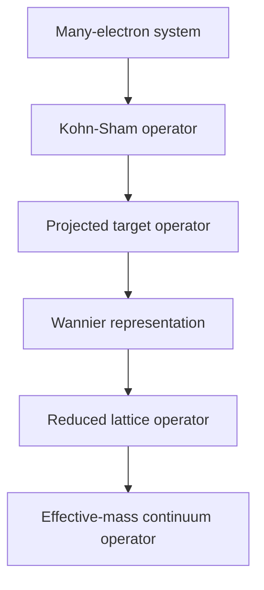

# KSDFT to Effective-Mass Theory

> [!abstract] Research Program
> Controlled reduction of first-principles Kohn-Sham operators into effective lattice and continuum electronic models, beginning with phosphorus and boron impurities in silicon.

## Central Question

> Under what conditions can continuum electronic Hamiltonians be derived as controlled reductions of first-principles electronic operators?

## Reduction Chain

$$
\boxed{
\hat H_{\mathrm{MB}}
\longrightarrow
\hat H_{\mathrm{KS}}
\longrightarrow
\hat H^{(P)}
\longrightarrow
\mathbf H_{\mathrm W}
\longrightarrow
\mathbf H_{\mathrm{red}}
\longrightarrow
\hat H_{\mathrm{continuum}}
}
$$

## Core Documents

| Note | Purpose | Status |
|---|---|---|
| [[ksdft2effmass.research_plan]] | Long-term vision, research objectives, mathematical program, and project planning | Active |
| [[ksdft2Effmass.hierarchy]] | Detailed operator hierarchy and epistemic role of each model level | Extracted |
| [[ksdft2Effmass.01]] | Starting from the Kohn–Sham operator | Extracted |
| [[ksdft2Effmass.02]] | Mathematical setting: Bloch state spaces, projectors, and projected operators | Extracted |
| [[ksdft2Effmass.03]] | Wannier construction and localized operator representations | Extracted |
| [[ksdft2Effmass.04]] | Alignment, gauge, and comparison of projected operators | Extracted |
| [[ksdft2Effmass.05]] | Compatibility of bulk-silicon spectral and aligned-operator reconstructions | Drafted |
| [[ksdft2Effmass.06]] | First-principles impurity-operator extraction | Drafted |
| [[ksdft2Effmass.07]] | Hierarchy of reduced impurity models | Drafted |
| [[ksdft2Effmass.08]] | Operator, subspace, spectral, and observable error metrics | Drafted |
| [[ksdft2Effmass.09]] | Continuum reduction and the atomistic-to-continuum crossover | Drafted |
| [[ksdft2Effmass.10]] | Category-theoretic organization of operator reductions | Drafted |

[[ksdft2Effmass.computational.00]]
[[ksdft2Effmass.computational-task.template]]

## Computational Projects
- [[ksdft2Effmass.computational.00]]: computational dependency graph and executable task decomposition;
- [[ksdft2Effmass.papers.00]]: separate publication pipeline driven by completed computational gates.

### Bulk-Silicon Operator Reduction

- [[DFT2TB.00]]
- DFT reference $\rightarrow$ Wannier operator $\rightarrow$ constrained tight-binding operator
- Immediate conference-scale project

### Impurity-Operator Reduction

- phosphorus in silicon;
- boron in silicon;
- aligned bulk and doped Wannier operators;
- scalar, orbital-dependent, and nonlocal impurity reductions.

### Controlled Operator Models

- [[HF2TB.00]]
- synthetic tight-binding impurity models;
- validation of projection, orthogonalization, truncation, and error metrics.

## Primary Quantities

For dopant $d\in\{\mathrm P,\mathrm B\}$:

| Quantity | Meaning |
|---|---|
| $r_{c,d}$ | Continuum-to-atomistic crossover radius |
| $\varepsilon_{H,d}$ | Global operator-reconstruction error |
| $\varepsilon_{\Pi,d}$ | Error in the target bound-state subspace |
| $\Delta E_{b,d}$ | Binding-energy error |
| $F_d$ | State or subspace fidelity |

## Software Infrastructure Status

Implemented and accepted software infrastructure includes finite operator-record
storage, fixed-representation Hermiticity analysis, deterministic version-1 JSON
serialization, exact representation-metadata compatibility auditing, represented
subtraction for already-compatible records, residual metrics, and comparison
composition. Maintained software-verification evidence and selected documented
numerical-verification cases cover these contracts.

This infrastructure does not perform basis/gauge alignment, unit conversion,
energy-zero alignment, geometry transformation, physical-equivalence decisions,
or impurity-operator identification. Scientific validation, uncertainty
quantification, and Rust conformance have not been performed. A generic
represented difference is not, by itself, a scientifically identified impurity
operator.

## Program Status

No successor implementation task is active or launched by the operator-record
closeout. The following lists describe planned branches and candidate future
work, not current implementation authorization.

### Planned program branches

- bulk-silicon DFT-to-Wannier construction and parallel tight-binding reconstructions;
- compatibility analysis of the spectral- and aligned-operator-admissible sets;
- decomposition of the research plan into focused notes;
- definition of common state spaces, operator residuals, and validation metrics.
### Candidate future work

- validate [[ksdft2Effmass.05]] against the bulk-silicon computational pilot;
- test identifiability of each prescribed $sp^3s^*$ model class from the retained spectral data;
- determine whether the spectral- and aligned-operator-admissible sets intersect;
- evaluate the path-consistency and gauge-equivariance defects defined in [[ksdft2Effmass.10]];
- freeze the bulk-silicon computational specification;
- construct and validate the bulk Wannier Hamiltonian;
- define the first $sp^3s^*$ tight-binding operator class.
### Deferred

- doped-supercell calculations;
- phosphorus and boron impurity extraction;
- continuum crossover calculations;
- general category-theoretic formalization;
- extensions to other defects and materials.