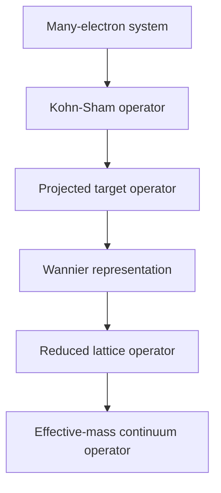

# KSDFT to Effective-Mass Theory

> [!abstract] Research Program
> Controlled reduction of first-principles Kohn-Sham operators into effective lattice and continuum electronic models, beginning with phosphorus and boron impurities in silicon.

## Central Question

> Under what conditions can continuum electronic Hamiltonians be derived as controlled reductions of first-principles electronic operators?

## Reduction Chain

$$
\boxed{
\hat H_{\mathrm{MB}}
\longrightarrow
\hat H_{\mathrm{KS}}
\longrightarrow
\hat H^{(P)}
\longrightarrow
\mathbf H_{\mathrm W}
\longrightarrow
\mathbf H_{\mathrm{red}}
\longrightarrow
\hat H_{\mathrm{continuum}}
}
$$

## Core Documents

| Note                            | Purpose                                                                           | Status          |
| ------------------------------- | --------------------------------------------------------------------------------- | --------------- |
| [[ksdft2effmass.research_plan]] | Long-term vision, research objectives, mathematical program, and project planning | Active          |
| [[ksdft2Effmass.hierarchy]]     | Detailed operator hierarchy and epistemic role of each model level                | Extracted       |
| [[ksdft2Effmass.01]]            | Starting from the Kohn-Sham operator                                              | Next extraction |
| [[ksdft2Effmass.02]]            | Mathematical setting: state spaces, projectors, and projected operators           | Planned         |
| [[ksdft2Effmass.03]]            | Wannier construction and localized operator representations                       | Planned         |
| [[ksdft2Effmass.04]]            | Alignment, gauge, and comparison of projected operators                           | Planned         |
| [[ksdft2Effmass.05]]            | Bulk-silicon Wannier-to-tight-binding operator reduction                          | Planned         |
| [[ksdft2Effmass.06]]            | First-principles impurity-operator extraction                                     | Planned         |
| [[ksdft2Effmass.07]]            | Hierarchy of reduced impurity models                                              | Planned         |
| [[ksdft2Effmass.08]]            | Operator, subspace, spectral, and observable error metrics                        | Planned         |
| [[ksdft2Effmass.09]]            | Continuum reduction and the atomistic-to-continuum crossover                      | Planned         |
| [[ksdft2Effmass.10]]            | Category-theoretic organization of operator reductions                            | Deferred        |

[[ksdft2Effmass.computational.00]]
[[ksdft2Effmass.computational-task.template]]

## Computational Projects

### Bulk-Silicon Operator Reduction

- [[DFT2TB.00]]
- DFT reference $\rightarrow$ Wannier operator $\rightarrow$ constrained tight-binding operator
- Immediate conference-scale project

### Impurity-Operator Reduction

- phosphorus in silicon;
- boron in silicon;
- aligned bulk and doped Wannier operators;
- scalar, orbital-dependent, and nonlocal impurity reductions.

### Controlled Operator Models

- [[HF2TB.00]]
- synthetic tight-binding impurity models;
- validation of projection, orthogonalization, truncation, and error metrics.

## Primary Quantities

For dopant $d\in\{\mathrm P,\mathrm B\}$:

| Quantity | Meaning |
|---|---|
| $r_{c,d}$ | Continuum-to-atomistic crossover radius |
| $\varepsilon_{H,d}$ | Global operator-reconstruction error |
| $\varepsilon_{\Pi,d}$ | Error in the target bound-state subspace |
| $\Delta E_{b,d}$ | Binding-energy error |
| $F_d$ | State or subspace fidelity |

## Program Status

### Active

- bulk-silicon DFT-to-Wannier and Wannier-to-tight-binding operator reduction;
- decomposition of the research plan into focused notes;
- definition of common state spaces, operator residuals, and validation metrics.

### Next

- extract [[ksdft2Effmass.01]];
- freeze the bulk-silicon computational specification;
- construct and validate the bulk Wannier Hamiltonian;
- define the first $sp^3s^*$ tight-binding operator class.

### Deferred

- doped-supercell calculations;
- phosphorus and boron impurity extraction;
- continuum crossover calculations;
- general category-theoretic formalization;
- extensions to other defects and materials.