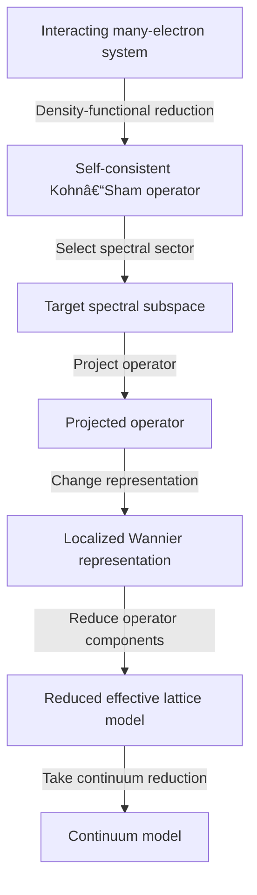
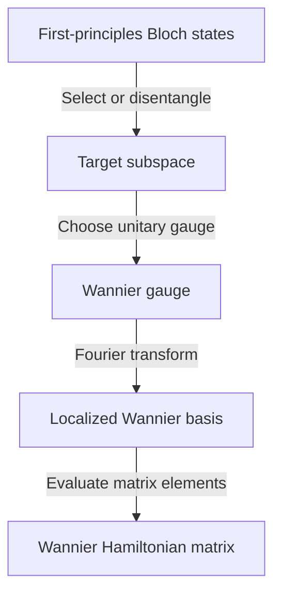
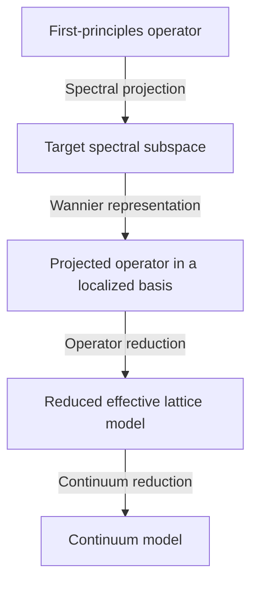
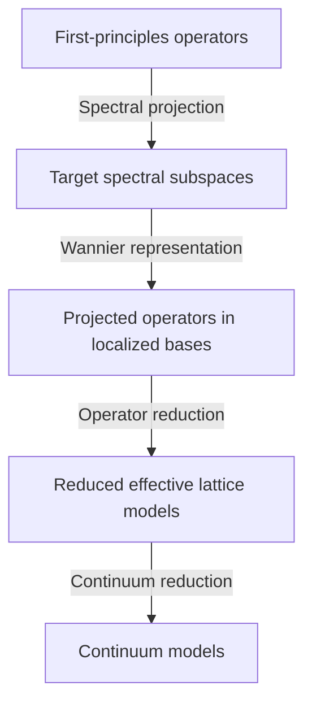
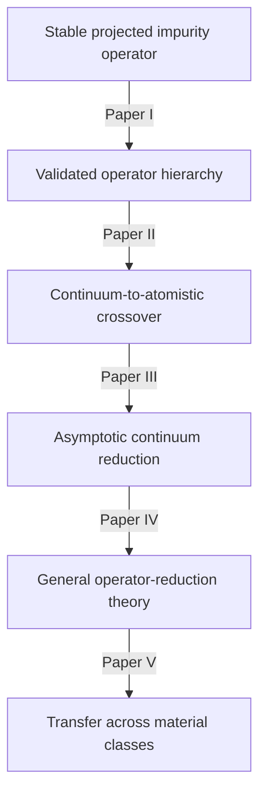
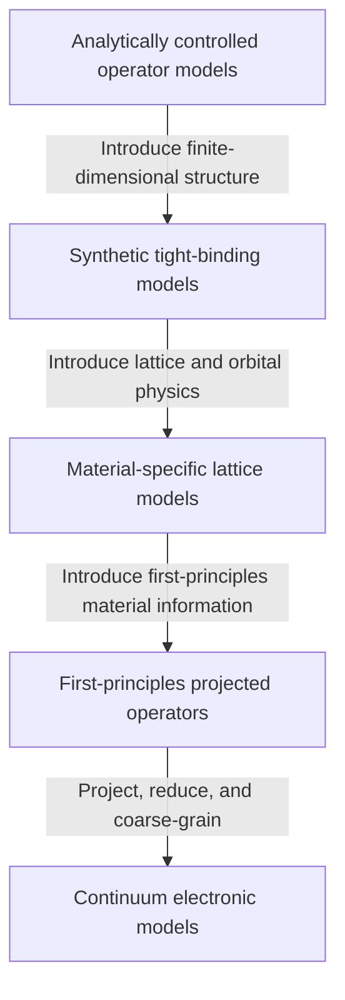
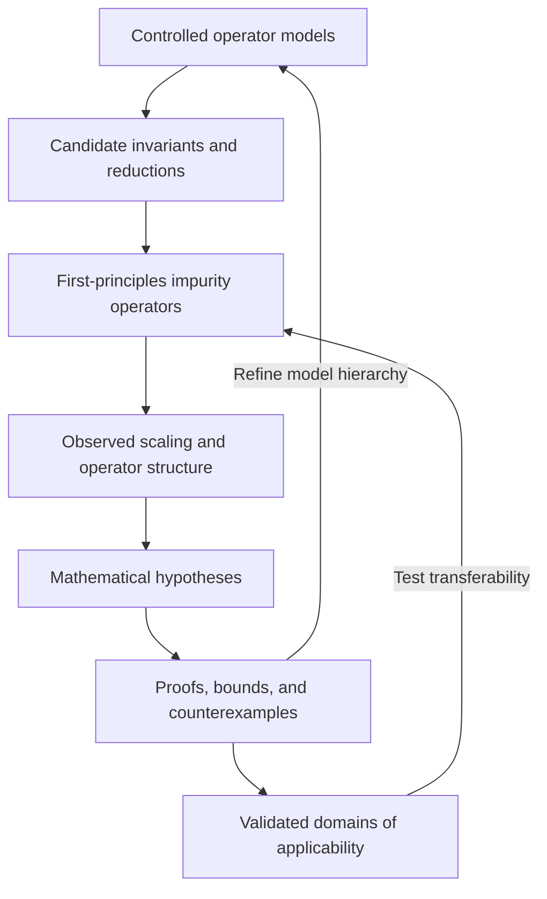
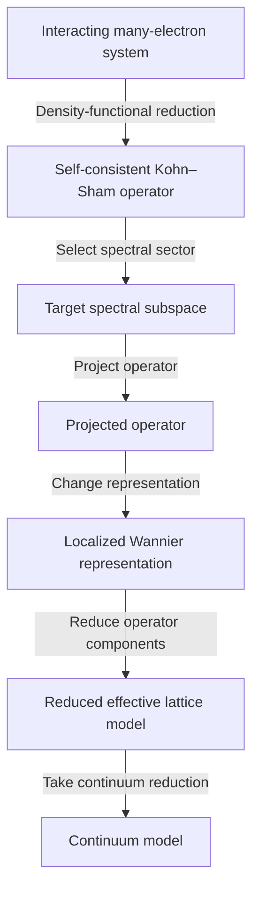
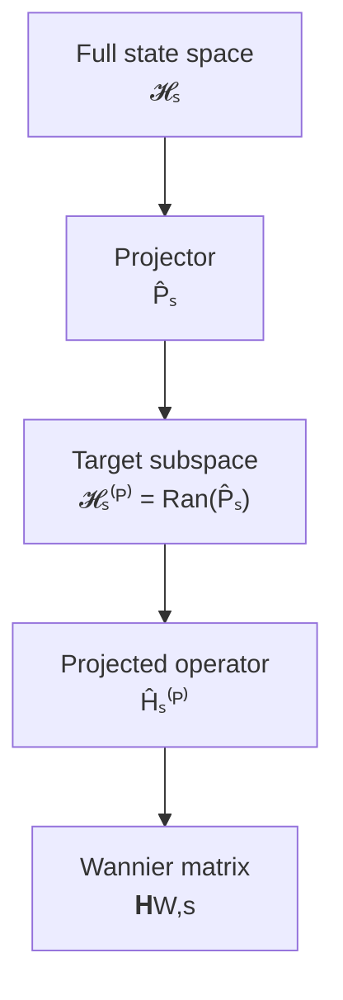

```mermaid
flowchart TD
    A["Full state space<br/>𝓗ₛ"]
    B["Projector<br/>PÌ‚â‚›"]
    C["Target subspace<br/>𝓗ₛ⁽ᴾ⁾ = Ran(P̂ₛ)"]
    D["Projected operator<br/>Ĥₛ⁽ᴾ⁾"]
    E["Wannier matrix<br/>𝐇W,s"]

    A --> B
    B --> C
    C --> D
    D --> E
```

# Emergence of Continuum Electronic Models from First-Principles Electronic Structure
## Long-Term Vision

Develop a mathematically rigorous theory describing how continuum electronic models emerge from first-principles electronic structure.

Rather than treating effective Hamiltonians only as phenomenological approximations, this research program seeks to derive them as controlled reductions of first-principles electronic operators with explicit domains of validity and quantitative error estimates.

Improved computational models are one outcome of the program. Its central objective is to establish a mathematical framework connecting atomistic quantum mechanics with continuum condensed matter theory.
### Central Philosophy
> Every continuum electronic model should be sought as a controlled reduction of an atomistic operator.
### Central Hypothesis
For specified classes of electronic systems, target state spaces, and observables, this reduction can be constructed with a stated domain of validity and controlled error:
$$
\boxed{
\hat H_{\mathrm{atomistic}}
	\rightarrow \hat H_{\mathrm{continuum}},
\qquad
\varepsilon_{\mathcal O}
\leq
\tau_{\mathcal O}.
}
$$
Here, 
- $\varepsilon_{\mathcal O}$ measures the error in the target states, spectra, or observables $\mathcal O$, and 
- $\tau_{\mathcal O}$ is the corresponding prescribed tolerance.
## Grand Question

>Under what conditions can continuum electronic Hamiltonians be derived as controlled reductions of first-principles electronic operators?

The program begins with substitutional phosphorus and boron impurities in silicon. These systems provide a concrete test of whether atomistically derived impurity operators can be reduced to the screened scalar potentials and effective-mass Hamiltonians used in continuum semiconductor theory.

The longer-term objective is to determine which parts of this reduction framework generalize to other impurities, defects, and condensed matter systems.
## Operator-Reduction Hierarchy

The program notes are indexed in [[ksdft2Effmass.00]]. The hierarchy of controlled, material-specific, first-principles, lattice, and continuum operator models is developed in [[ksdft2Effmass.hierarchy]].

## Workflow semantics

The equations and Mermaid flowcharts in this research plan describe mathematical
reductions, scientific relationships, or static planning projections. They are
not the authoritative computational workflow state. The prospective scientific
and computational workflow is the stateful Colored Petri Net defined in
[[ksdft2effmass.workflow-semantics]] and
the implemented [Architecture v1 CPN description](../architecture/v1/workflow/scientific-workflow-and-cpn-model.md).
Its durable multiset markings represent independent branches, repeated
convergence iterations, synchronization, failures, retries, provenance, and
accepted or rejected evidence.

## Starting from the Kohn-Sham Operator

The interacting electronic system is formally described by a many-electron Hamiltonian

$$
\hat H_{\mathrm{MB}}
:
\mathcal H_{\mathrm{MB}}
\longrightarrow
\mathcal H_{\mathrm{MB}},
$$

where $\mathcal H_{\mathrm{MB}}$ is the antisymmetric many-electron Hilbert space.

Kohn–Sham density-functional theory already performs a reduction of the interacting many-electron problem. It replaces the many-electron wavefunction

$$
\Psi(\mathbf r_1,\ldots,\mathbf r_N)
\in
\mathcal H_{\mathrm{MB}}
$$

with the ground-state electron density

$$
n(\mathbf r)
=
N
\int
\left|
\Psi(
\mathbf r,
\mathbf r_2,
\ldots,
\mathbf r_N
)
\right|^2
\mathrm d\mathbf r_2
\cdots
\mathrm d\mathbf r_N.
$$

Spin variables have been suppressed for clarity.

The interacting many-electron system is represented by an auxiliary noninteracting system whose ground-state density equals that of the interacting system:

$$
\hat H_{\mathrm{MB}}
\longrightarrow
n_0(\mathbf r)
\longrightarrow
v_{\mathrm s}[n_0](\mathbf r)
\longrightarrow
\hat H_{\mathrm{KS}}[n_0].
$$

With the exact density functional, the Kohn–Sham construction preserves the exact ground-state density, and the exact ground-state energy can be obtained as a functional of that density. In this sense, Kohn–Sham theory provides an exact many-body-to-one-particle reduction at the level of specified ground-state information.

In practical calculations, the exchange-correlation functional is approximated. The resulting error therefore enters before the subsequent projection and operator-reduction steps considered in this research program.

The Kohn–Sham construction is not a spectral projection or downfolding of the many-electron Hamiltonian:

$$
\hat H_{\mathrm{KS}}
\neq
\hat P
\hat H_{\mathrm{MB}}
\hat P.
$$

The two operators act on different state spaces and encode different physical information. In particular, the Kohn–Sham eigenvalue spectrum is not generally identical to the many-body excitation spectrum.

This research program therefore treats the Kohn–Sham construction as the first reduction in the hierarchy,

$$
\text{interacting many-electron system}
\longrightarrow
\text{effective one-particle Kohn–Sham system},
$$

and begins its operator-reduction analysis from the resulting one-particle operator $\hat H_{\mathrm{KS}}$.

Within conventional Kohn–Sham density-functional theory,

$$
\hat H_{\mathrm{KS}}[n]
=
\hat T
+
\hat V_{\mathrm{ion}}
+
\hat V_{\mathrm H}[n]
+
\hat V_{\mathrm{xc}}[n],
$$

where:

- $\hat T$ is the one-electron kinetic-energy operator;
- $\hat V_{\mathrm{ion}}$ is the electron–ion potential;
- $\hat V_{\mathrm H}[n]$ is the Hartree potential;
- $\hat V_{\mathrm{xc}}[n]$ is the exchange-correlation potential;
- $n(\mathbf r)$ is the self-consistent electron density.

Hybrid functionals produce generalized Kohn–Sham operators containing additional orbital-dependent or nonlocal terms. Periodic hybrid GKS integration is a planned, deferred extension requiring explicit method profiles, pseudopotential compatibility, backend implementation, convergence, and VVUQ; semilocal evidence does not qualify it. DFT+$U$ is not assigned a current integration profile by the bounded architecture correction.

The Kohn–Sham operator is adopted as the primary computational object because it is routinely constructed, represented, projected, and diagonalized in first-principles electronic-structure calculations.

The initial reduction chain is

The mathematical program investigates the sequence

$$
\hat H_{\mathrm{KS}}
\longrightarrow
\hat H_{\mathcal W}
\longrightarrow
H_{\mathrm W}
\longrightarrow
\hat H_{\mathrm{red}}
\longrightarrow
\hat H_{\mathrm{continuum}},
$$

where:

- $\hat H_{\mathcal W}$ is the operator projected onto a target spectral subspace associated with the energy window $\mathcal W$;
- $H_{\mathrm W}$ is the matrix representation of $\hat H_{\mathcal W}$ in a localized Wannier basis;
- $\hat H_{\mathrm{red}}$ is a reduced lattice Hamiltonian retaining selected operator components;
- $\hat H_{\mathrm{continuum}}$ is the corresponding continuum approximation.

Projection and Wannier transformation must be distinguished. Projection changes the retained state space and may discard information. Wannier transformation changes the basis within the retained state space and, in the absence of disentanglement or truncation errors, preserves the projected operator up to unitary equivalence.

The objective is to determine under what conditions each reduction preserves specified spectra, states, subspaces, and observables within controlled errors.
## Mathematical Setting

### First-Principles Systems

Let $s\in\{\mathrm{bulk},d\}$ label either the pristine bulk system or the system containing dopant $d$.  Each first-principles calculation produces a self-consistent one-particle operator
$$
\hat H_s
:
\mathcal H_s
\longrightarrow
\mathcal H_s,
$$
where $\mathcal H_s$ is the one-particle state space used for calculation $s$.

For the present program, $\hat H_s=\hat H_{\mathrm{KS},s}$, although the framework may later be extended to generalized Kohn–Sham or quasiparticle effective operators.

The bulk and dopant calculations need not initially act on the same state space: $\mathcal H_{\mathrm{bulk}} \neq \mathcal H_d$, as they may differ because of their supercell geometries, atomic configurations, basis dimensions, pseudopotentials, boundary conditions, or structural relaxations. Constructing a common representation is therefore part of the operator-extraction problem.
### Range of the Projector
For each system $s$, select a finite-dimensional target subspace
$$
\mathcal H_s^{(P)}
=
\operatorname{Range}(\hat P_s)
\subseteq
\mathcal H_s,
$$
where
$$
\operatorname{Range}(\hat P_s)
=
\left\{
\hat P_s\lvert\psi\rangle
:
\lvert\psi\rangle\in\mathcal H_s
\right\}.
$$
The complementary discarded subspace is the kernel
$$
\operatorname{Kernel}(\hat P_s)
=
\left\{
\lvert\psi\rangle\in\mathcal H_s
:
\hat P_s\lvert\psi\rangle=0
\right\}.
$$
Because $\hat P_s$ is an orthogonal projector,
$$
\mathcal H_s
=
\operatorname{Range}(\hat P_s)
\oplus
\operatorname{Kernel}(\hat P_s).
$$
---

### Projected Operators

The projected Hamiltonian for system $s$ is

$$
\hat H_s^{(P)}
=
\hat P_s
\hat H_s
\hat P_s
\big|_{\mathcal H_s^{(P)}},
$$

with

$$
\hat H_s^{(P)}
:
\mathcal H_s^{(P)}
\longrightarrow
\mathcal H_s^{(P)}.
$$

The restriction indicates that $\hat H_s^{(P)}$ is regarded as an operator on the retained subspace rather than as an operator on the full state space with a nontrivial null space outside that subspace.

The projected operator contains the first-principles information retained for the subsequent impurity extraction and model reduction.

### Wannier Representation

Let
$$
\left\{
\lvert w_{\alpha,s}\rangle
\right\}_{\alpha=1}^{M_s}
$$

be an orthonormal Wannier basis for $\mathcal H_s^{(P)}$, where

$$
M_s
=
\dim\mathcal H_s^{(P)}.
$$

The matrix representation of the projected Hamiltonian in this basis is

$$
\mathbf H_{\mathrm W,s}
=
\left[
\langle w_{\alpha,s}
\vert
\hat H_s^{(P)}
\vert
w_{\beta,s}
\rangle
\right]_{\alpha,\beta=1}^{M_s}.
$$

The projected operator $\hat H_s^{(P)}$ and its Wannier matrix $\mathbf H_{\mathrm W,s}$ must be distinguished:

$$
\hat H_s^{(P)}
\quad\text{is an operator},
$$

whereas

$$
\mathbf H_{\mathrm W,s}
\quad\text{is its matrix representation in a selected basis}.
$$

A unitary change of Wannier basis changes $\mathbf H_{\mathrm W,s}$ but does not change the underlying projected operator.

### Wannier Construction
Wannierization connects the target subspace selected from the first-principles calculation to a localized representation suitable for extracting and reducing impurity operators.

Conceptually, the construction is

Two operations must be distinguished:

$$
\boxed{
\text{Wannier construction}
=
\text{subspace selection}
+
\text{gauge selection and localization}.
}
$$

For an isolated collection of bands, the target subspace is already determined by the selected Bloch eigenstates. Wannierization then chooses a localized basis within that fixed subspace.

For entangled bands, a disentanglement procedure first selects an optimized finite-dimensional subspace from a larger outer energy window. Localization then chooses a Wannier gauge within that optimized subspace.

Disentanglement and localization have different mathematical effects:

- disentanglement changes the projector $\hat P_s$ and therefore changes the retained projected operator;
- localization changes the basis within $\operatorname{Ran}(\hat P_s)$ and preserves the projected operator up to unitary equivalence.

This distinction is central to the impurity-extraction problem. Stability with respect to localization gauge does not by itself establish stability with respect to the choice of disentangled subspace.

---

### Identification of the Bulk and Dopant Subspaces

The difference

$$
\hat H_d^{(P)}
-
\hat H_{\mathrm{bulk}}^{(P)}
$$

is not immediately defined because the two operators generally act on different projected subspaces.

Assume first that

$$
\dim\mathcal H_{\mathrm{bulk}}^{(P)}
=
\dim\mathcal H_d^{(P)}
=
M.
$$

A subspace-identification map is then a unitary operator

$$
\hat U_d
:
\mathcal H_{\mathrm{bulk}}^{(P)}
\longrightarrow
\mathcal H_d^{(P)}
$$

satisfying

$$
\hat U_d^\dagger\hat U_d
=
\hat I_{\mathrm{bulk}}^{(P)},
\qquad
\hat U_d\hat U_d^\dagger
=
\hat I_d^{(P)}.
$$

The transported bulk Hamiltonian acting on the dopant subspace is

$$
\hat H_{\mathrm{bulk}\rightarrow d}^{(P)}
=
\hat U_d
\hat H_{\mathrm{bulk}}^{(P)}
\hat U_d^\dagger.
$$

The map $\hat U_d$ is not determined merely by the equality of the subspace dimensions. It must encode a physically meaningful correspondence between the retained bulk and dopant states. Its construction may depend on:

- orbital character;
- Wannier centers;
- lattice-site correspondence;
- spatial overlaps;
- symmetry;
- localization;
- continuity under introduction of the impurity.

If the projected subspaces have different dimensions, a unitary identification does not exist. The target subspaces must then be revised, or the comparison must be formulated using a partial isometry together with an explicit unmatched-subspace error.

---

### Energy Alignment

Independent first-principles calculations may use different energy references. Before their projected operators can be compared, define aligned Hamiltonians

$$
\overline H_s^{(P)}
=
\hat H_s^{(P)}
-
E_{\mathrm{ref},s}
\hat I_s^{(P)},
$$

where $E_{\mathrm{ref},s}$ is a physically defined reference energy for system $s$.

Possible reference choices include:

- an aligned bulk-like electrostatic potential;
- a selected band edge;
- a deep bulk-like reference state;
- another reproducible energy-alignment convention.

The choice of reference must be stated explicitly and tested for stability.

---

### Projected Impurity Perturbation

After subspace and energy alignment, define the projected impurity perturbation for dopant $d$ by

$$
\boxed{
\Delta\hat H_d^{(P)}
=
\overline H_d^{(P)}
-
\hat U_d
\overline H_{\mathrm{bulk}}^{(P)}
\hat U_d^\dagger.
}
$$

Both terms on the right-hand side act on

$$
\mathcal H_d^{(P)},
$$

so their difference is well defined.

Equivalently,

$$
\overline H_d^{(P)}
=
\hat U_d
\overline H_{\mathrm{bulk}}^{(P)}
\hat U_d^\dagger
+
\Delta\hat H_d^{(P)}.
$$

The operator $\Delta\hat H_d^{(P)}$ represents the modification of the projected one-particle Hamiltonian associated with introducing dopant $d$, subject to the chosen:

- first-principles approximation;
- target subspaces;
- subspace-identification map;
- energy-alignment convention.

It is therefore a constructed projected impurity perturbation, not an automatically unique difference between two raw first-principles Hamiltonians.

---

### Gauge Transformations

Within each projected subspace, a change of orthonormal basis is represented by a unitary matrix

$$
\mathbf G_s\in U(M).
$$

The Wannier Hamiltonian transforms as

$$
\mathbf H_{\mathrm W,s}
\longmapsto
\mathbf G_s^\dagger
\mathbf H_{\mathrm W,s}
\mathbf G_s.
$$

This changes the matrix representation but not the underlying projected operator.

A physically meaningful impurity-extraction procedure must transform covariantly under such basis changes. Consequently, quantities claimed to characterize the impurity must either:

- remain invariant under admissible gauge transformations; or
- transform according to a stated covariance rule.

The central mathematical problem is therefore not merely to subtract two Hamiltonian matrices. It is to construct a physically meaningful identification of their projected state spaces and determine which properties of the resulting impurity perturbation are independent of arbitrary representation choices.
# Fundamental Problems

## Problem I

### Representation

How should first-principles electronic structure be represented mathematically?

---

## Problem II

### Comparison

How should projected Hamiltonians obtained from different first-principles calculations be compared?

---

## Problem III

### Reduction

How can projected operators be systematically simplified while preserving measurable physics?

---

## Problem IV

### Continuum Limit

Under what conditions do the reduced operators converge to continuum electronic models?

---

# Research Objectives

## Objective 1

### Construct a mathematical framework for projected Hamiltonians.

Represent every first-principles electronic structure calculation by a projected operator

$$
\hat H_P
=
\hat P
\hat H
\hat P.
$$

Determine which mathematical objects are intrinsic and which depend only upon a particular representation.

Questions

- What is the appropriate ambient Hilbert space?
- What determines the projected subspace?
- Which mathematical objects are intrinsic?
- Which objects depend on the choice of basis?

---

## Objective 2

### Develop a theory for comparing projected Hamiltonians.

Different first-principles calculations produce different projected subspaces.

Construct mathematically meaningful comparisons between projected operators defined on nearby subspaces of the same ambient Hilbert space.

Questions

- When should two projected subspaces be regarded as physically equivalent?
- How should nearby projected subspaces be identified?
- Does a canonical identification exist?
- Under what conditions is the comparison unique?
- What constitutes a gauge transformation?
- Which quantities are gauge independent?
- When is an operator extraction procedure gauge stable?

---

## Objective 3

### Define projected impurity operators.

Construct impurity operators only after establishing a common projected representation.

Develop mathematically meaningful definitions of

$$
\hat{\Delta H},
$$

together with the conditions under which the impurity operator is uniquely defined.

Questions

- When does a projected impurity operator exist?
- Under what assumptions is it unique?
- What information is preserved during projection?
- Which properties are invariant under changes of gauge?

---

## Objective 4

### Develop a hierarchy of operator reductions.

Construct successive reductions of the impurity operator,

$$
\hat{\Delta H}
=
\hat{\Delta H}_{\rm scalar}
+
\hat{\Delta H}_{\rm orbital}
+
\hat{\Delta H}_{\rm nonlocal}
+
\cdots
$$

with each level representing a controlled approximation.

Questions

- Which operator components dominate the low-energy physics?
- Which terms are asymptotically negligible?
- How rapidly do the different operator components decay?
- What hierarchy of reduced models naturally emerges?

---

## Objective 5

### Develop quantitative error metrics.

Construct operator norms and physically meaningful measures that quantify the error introduced by each reduction.

Questions

- Which operator norms are physically meaningful?
- How should spectral errors be measured?
- How should observable errors be quantified?
- Which approximation dominates the total uncertainty?

---

## Objective 6

### Define the continuum-to-atomistic crossover.

Develop mathematically precise definitions of the length scales at which continuum descriptions become valid.

Possible definition

$$
r_c
=
\inf
\left\{
r :
\varepsilon(r)
<
\tau
\right\},
$$

where

$$
\varepsilon(r)
$$

is an operator error measure and

$$
\tau
$$

is a prescribed tolerance.

Questions

- Does the crossover always exist?
- Is it unique?
- Is it material dependent?
- Which operator components determine its value?

---

## Objective 7

### Derive continuum electronic models.

The ultimate objective of this research program is to demonstrate that continuum electronic models arise as asymptotic reductions of projected first-principles operators.

Rather than postulating

$$
\hat H_{\rm continuum},
$$

seek to establish

$$
\hat H_{\rm continuum}
=
\lim_{R\rightarrow\infty}
\mathcal R_R
\left(
\hat H_{\rm KS}
\right),
$$

for an appropriate family of reduction operators

$$
\mathcal R_R.
$$

---

# Mathematical Program

## Problem A

### Geometry of projected Hilbert spaces

Topics

- orthogonal projectors
- Grassmann manifolds
- principal angles
- subspace perturbation theory
- canonical identification of nearby subspaces

Deliverable

A rigorous framework for comparing projected Hamiltonians.

---

## Problem B

### Gauge theory of projected operators

Topics

- unitary equivalence
- gauge transformations
- gauge-independent quantities
- gauge-stable constructions
- uniqueness of projected impurity operators

Deliverable

A rigorous definition of gauge-stable operator extraction.

---

## Problem C

### Operator decomposition

Develop mathematically meaningful decompositions into

- scalar
- orbital
- hopping
- spin-dependent
- higher-order

components.

Determine conditions for uniqueness and physical interpretation.

---

## Problem D

### Operator localization

Study the spatial decay of

$$
\left\|
\hat{\Delta H}(R)
\right\|.
$$

Determine whether different operator components exhibit

- exponential decay,
- algebraic decay,
- or other asymptotic behavior.

---

## Problem E

### Continuum limit

Develop asymptotic methods for deriving continuum operators from projected lattice Hamiltonians.

Possible mathematical tools include

- homogenization
- asymptotic analysis
- perturbation theory
- envelope-function theory
- multiscale expansions

---

## Problem F

### Error propagation

Every reduction introduces an approximation

$$
\varepsilon_i.
$$

Develop quantitative theories describing how these errors accumulate throughout the reduction hierarchy.

## Category-Theoretic Structure of Operator Reduction

While category theory is not the initial mathematical engine of this research program, category theory may nevertheless provide an organizing language once the relevant operator transformations have been defined computationally.
  
The immediate mathematical tools remain spectral theory, subspace perturbation theory, gauge geometry, operator norms, and multiscale analysis.  Category theory can describe how projection, gauge alignment, downfolding, coarse-graining, and continuum reduction compose with one another.

A first-principles calculation produces an electronic operator, such as a Kohn–Sham Hamiltonian, defined on the full computational state space. A target spectral window $\mathcal W$ is selected according to the physical problem, such as the valence bands, conduction bands, or impurity states near a semiconductor band edge.

The corresponding spectral projector is
$$
\hat P_{\mathcal W}
	= \sum_{E_n\in\mathcal W}
\lvert\psi_n\rangle
\langle\psi_n\rvert,
$$

and the projected Hamiltonian is

$$
\hat H_{\mathcal W}
=
\hat P_{\mathcal W}
\hat H_{\mathrm{KS}}
\hat P_{\mathcal W}.
$$

When the retained subspace is finite-dimensional, $\hat H_{\mathcal W}$ is a finite-rank spectral reconstruction of the first-principles operator within the selected energy window. The adjective *target* is important: the retained states are selected for their relevance to the physical problem and need not be the eigenstates with the globally lowest energies.

A Wannier transformation changes the representation of the projected operator from extended eigenstates to localized orbitals:

$$
\lvert w_\alpha\rangle
=
\sum_{n\in\mathcal I_{\mathcal W}}
U_{n\alpha}
\lvert\psi_n\rangle.
$$

The corresponding matrix elements are

$$
H_{\alpha\beta}^{(W)}
=
\langle w_\alpha
\vert
\hat H_{\mathcal W}
\vert
w_\beta\rangle.
$$

For an isolated band subspace, the spectral and Wannier representations describe the same projected operator. The Wannier representation exposes its spatial, orbital, onsite, hopping, and nonlocal structure.

Operator reduction then removes or approximates components that do not materially affect the target observables. This produces a hierarchy of effective lattice Hamiltonians with progressively fewer retained operator components.

Continuum reduction exploits scale separation between the lattice spacing $a$ and the characteristic length scale $L$ of the target electronic states,

$$
\eta
=
\frac{a}{L}
\ll 1.
$$

The discrete effective lattice Hamiltonian is then replaced by a continuum operator, such as a multivalley effective-mass Hamiltonian with a screened impurity potential.

Each arrow transforms the state space, the Hamiltonian, or its representation:

$$
(\mathcal H,\hat H)
\longmapsto
(\mathcal H',\hat H').
$$

The central research problem is to determine whether each transformation preserves the relevant spectra, states, subspaces, and observables within controlled errors.

---

  

### Operator Models as Objects

An electronic model may be represented by an object

  

$$

\mathsf M

=

\left(

\mathcal H,

\hat H,

\hat P,

\mathcal O

\right),

$$

  

where:

  

- $\mathcal H$ is the state space;

- $\hat H$ is the Hamiltonian;

- $\hat P$ identifies the retained subspace;

- $\mathcal O$ is a selected collection of target observables.

  

A morphism

  

$$

\Phi:

\mathsf M_1

\longrightarrow

\mathsf M_2

$$

  

represents a physically admissible transformation between operator models. Examples include:

  

- a unitary change of basis;

- identification of nearby projected subspaces;

- projection onto a low-energy sector;

- Löwdin or Schrieffer–Wolff downfolding;

- coarse-graining;

- continuum embedding.

  

These transformations do not all have the same information content. A gauge transformation is reversible,

  

$$

\hat H'

=

\hat U^\dagger

\hat H

\hat U,

$$

  

whereas projection and reduction generally discard information,

  

$$

\hat H

\longmapsto

\hat P

\hat H

\hat P.

$$

  

The mathematical framework must therefore distinguish invertible representation changes from irreversible model reductions.

  

---

  

## Gauge Transformations as a Groupoid

  

The collection of Wannier representations and admissible gauge transformations naturally forms a groupoid.

  

Each Wannier representation is an object, and each unitary gauge transformation is an invertible morphism,

  

$$

\mathsf W_\alpha

\xrightarrow{\hat U_{\beta\alpha}}

\mathsf W_\beta.

$$

  

The inverse transformation satisfies

  

$$

\hat U_{\alpha\beta}

=

\hat U_{\beta\alpha}^{-1}.

$$

  

The physical projected Hamiltonian should therefore be associated with the gauge-equivalence class

  

$$

[\hat H_P]

=

\left\{

\hat U^\dagger

\hat H_P

\hat U

:

\hat U\in\mathcal G

\right\},

$$

  

rather than with one particular matrix representation.

  

This viewpoint is directly relevant to the construction of impurity operators. A physically meaningful extracted operator should depend on the projected subspaces and their physical correspondence, rather than on arbitrary Wannier gauges.

  

---

  

## Reduction Procedures as Functors

  

Let $\mathbf{FP}$ denote a category of first-principles operator models and let $\mathbf{Eff}$ denote a category of reduced effective models.

  

A reduction procedure may be represented as a functor

  

$$

\mathcal R:

\mathbf{FP}

\longrightarrow

\mathbf{Eff}.

$$

  

On objects,

  

$$

\mathcal R:

(\mathcal H,\hat H,\hat P,\mathcal O)

\longmapsto

(\mathcal H_{\mathrm{eff}},\hat H_{\mathrm{eff}},\hat P_{\mathrm{eff}},\mathcal O_{\mathrm{eff}}).

$$

  

On morphisms, $\mathcal R$ maps admissible transformations between first-principles models to corresponding transformations between effective models.

  

Functoriality requires

  

$$

\mathcal R(\Psi\circ\Phi)

=

\mathcal R(\Psi)

\circ

\mathcal R(\Phi).

$$

  

Physically, compatible transformations performed before reduction should induce compatible transformations after reduction.

  

For example, reducing a gauge-transformed Hamiltonian should produce a gauge-equivalent reduced Hamiltonian:

  

$$

\mathcal R

\left(

\hat U^\dagger

\hat H

\hat U

\right)

\sim

\widetilde U^\dagger

\mathcal R(\hat H)

\widetilde U,

$$

  

where $\widetilde U$ is the induced transformation on the reduced state space.

  

If this relation fails strongly, the reduction procedure depends on the arbitrary representation and is not gauge stable.

  

---

  

## Consistency of Impurity Extraction and Reduction

  

Suppose the aligned projected impurity operator is

  

$$

\hat{\Delta H}_d

=

\hat H_d^{(P)}

-

\hat U_d

\hat H_{\mathrm{bulk}}^{(P)}

\hat U_d^\dagger,

$$

  

where $\hat U_d$ identifies the projected bulk and doped subspaces.

  

Two possible computational paths are then available:

  

1. align the projected operators, extract $\hat{\Delta H}_d$, and reduce the result;

2. reduce the bulk and doped Hamiltonians separately, align the reduced models, and then extract the reduced impurity operator.

  

These paths should agree within a controlled error:

  

$$

\mathcal R

\left(

\hat H_d^{(P)}

-

\hat U_d

\hat H_{\mathrm{bulk}}^{(P)}

\hat U_d^\dagger

\right)

\approx

\mathcal R

\left(

\hat H_d^{(P)}

\right)

-

\widetilde U_d

\mathcal R

\left(

\hat H_{\mathrm{bulk}}^{(P)}

\right)

\widetilde U_d^\dagger.

$$

  

The failure of this diagram to commute defines a measurable consistency error:

  

$$

\begin{aligned}

\varepsilon_{\mathrm{comm},d}

=

\Bigl\|

&

\mathcal R

\left(

\hat H_d^{(P)}

-

\hat U_d

\hat H_{\mathrm{bulk}}^{(P)}

\hat U_d^\dagger

\right)

\\

&

-

\left[

\mathcal R

\left(

\hat H_d^{(P)}

\right)

-

\widetilde U_d

\mathcal R

\left(

\hat H_{\mathrm{bulk}}^{(P)}

\right)

\widetilde U_d^\dagger

\right]

\Bigr\|.

\end{aligned}

$$

  

Thus, commutativity is not merely a formal property. It can be tested numerically and included in the validation of a reduction procedure.

  

---

  

## Natural Transformations Between Reduction Schemes

  

Consider two systematic reduction procedures,

  

$$

\mathcal R_{\mathrm{nonlocal}}

\qquad\text{and}\qquad

\mathcal R_{\mathrm{scalar}}.

$$

  

A consistent simplification from the nonlocal model to the scalar model may be represented by a natural transformation

  

$$

\eta:

\mathcal R_{\mathrm{nonlocal}}

\Rightarrow

\mathcal R_{\mathrm{scalar}}.

$$

  

For every first-principles model $\mathsf M$, the component

  

$$

\eta_{\mathsf M}:

\mathcal R_{\mathrm{nonlocal}}(\mathsf M)

\longrightarrow

\mathcal R_{\mathrm{scalar}}(\mathsf M)

$$

  

performs the corresponding model simplification.

  

Naturality requires this simplification to remain compatible with admissible transformations between physical systems. This provides a possible future language for expressing the transferability of a reduction hierarchy across:

  

- different dopants;

- supercell sizes;

- crystal structures;

- material families.

  

Such naturality should not be assumed in advance. It must be inferred from computational evidence showing that the same reduction procedure behaves consistently across the relevant systems.

  

---

  

## Approximate Commutativity and Error-Enriched Reductions

  

The reductions in this program will generally not commute exactly. Instead, they are expected to satisfy estimates of the form

  

$$

\left\|

\mathcal R_2\circ\mathcal R_1(\hat H)

-

\mathcal R_{21}(\hat H)

\right\|

\leq

\varepsilon.

$$

  

Two effective Hamiltonians may also be equivalent only within a target low-energy subspace:

  

$$

\left\|

\hat\Pi

\left(

\hat H_{\mathrm{eff}}^{(1)}

-

\hat U^\dagger

\hat H_{\mathrm{eff}}^{(2)}

\hat U

\right)

\hat\Pi

\right\|

\leq

\varepsilon_\Pi,

$$

  

where $\hat\Pi$ projects onto the target spectral subspace.

  

The appropriate categorical structure may therefore be an approximate or error-enriched category in which every reduction morphism carries:

  

- an operator error;

- a target-subspace error;

- observable-specific errors;

- a stated domain of validity.

  

Composition must then include an error-propagation rule. Schematically,

  

$$

\varepsilon(\Psi\circ\Phi)

\leq

C_\Psi

\varepsilon(\Phi)

+

\varepsilon(\Psi),

$$

  

where $C_\Psi$ measures how strongly the second reduction amplifies errors introduced by the first.

  

This structure connects category-theoretic composition directly to the quantitative error hierarchy of the research program.

  

---

  

## Computational Discovery of the Categorical Structure

  

The category-theoretic structure should emerge from the computational work rather than be imposed before the relevant transformations are understood.

  

The computational program must first determine:

  

- which projected subspaces can be identified reliably;

- which gauge transformations preserve the extracted impurity physics;

- which reduction maps are numerically stable;

- which diagrams commute within controlled tolerances;

- which reduction procedures transfer across dopants and materials;

- how errors accumulate under successive reductions.

  

The resulting research cycle is

  

$$

\hat H_{\mathrm{KS}}

\longrightarrow

\hat H_{\mathrm{projected}}

\longrightarrow

\text{numerical invariants}

\longrightarrow

\text{candidate reduction maps}

\longrightarrow

\text{categorical structure}

\longrightarrow

\text{testable consistency conditions}.

$$

  

Category theory therefore does not determine the physical content of the reduced models. It organizes the relationships among models after those relationships have been discovered and quantified.

  

---

  

## Role Within the Research Program

  

Category theory may eventually provide a language for:

  

- equivalence among different Wannier representations;

- composability of projection, downfolding, and continuum reduction;

- path independence of alternative reduction workflows;

- preservation of physical observables under model transformations;

- transferability of reduction procedures across material systems;

- propagation of approximation errors through a reduction hierarchy.

  

It does not by itself determine:

  

- the spatial decay of an impurity operator;

- the continuum-to-atomistic crossover radius $r_{c,d}$;

- whether a scalar potential reproduces the impurity binding energy;

- which orbitals must be retained;

- how phosphorus and boron differ physically.

  

Those questions must be answered using first-principles calculations, spectral analysis, operator decomposition, and multiscale modeling.

  

The immediate mathematical foundation of the program is therefore

  

$$

\boxed{

\text{spectral theory}

+

\text{subspace perturbation}

+

\text{gauge geometry}

+

\text{operator norms}

+

\text{multiscale analysis}.

}

$$

  

Category theory becomes useful at a later stage, when several concrete reductions have been constructed and the research problem is to determine whether they compose consistently, remain representation independent, and transfer between physical systems.

  

Accordingly, category theory should be treated as the possible organizing language of the mature theory of operator reduction, rather than as a prerequisite for the initial silicon impurity calculations.
## Computational Program

|               |                       |                                                                                                                                                                                                                             |
| ------------- | --------------------- | --------------------------------------------------------------------------------------------------------------------------------------------------------------------------------------------------------------------------- |
| Stage I       | Bulk Silicon          | - DFT convergence - Wannier construction - projected Hamiltonians - projector analysis                                                                                                                             |
| Stage II      | Phosphorus in Silicon | - projected impurity operator - gauge analysis - operator decomposition - reduced Hamiltonian hierarchy                                                                                                         |
| Stage III  | Boron in Silicon   | - Repeat the complete workflow. - Determine whether the reduction framework transfers across fundamentally different impurity physics.                                                                                |
| Stage IV      | Generalization        | Extend the framework to - additional dopants - vacancies - defect complexes - III–V semiconductors - wide-bandgap materials  to determine whether a universal theory of operator reduction exists.  |
|               |                       |                                                                                                                                                                                                                             |
## Literature Review

## Literature Review 
### Kohn–Sham Electronic Structure 
### Wannier Functions and Localized Representations 
### Hamiltonian Downfolding and Operator Reduction 
### Semiconductor Impurity Models 
### Envelope-Function and Effective-Mass Theory 
### Mathematical Homogenization and Continuum Limits
## Proposed Paper Sequence

### Publication Strategy
The papers in this sequence should be published when each reduction stage produces a complete, independently defensible result. Completion of the entire research program is not required before publication of its component results.

Each paper must satisfy four conditions:

#### Operator Definition
The principal mathematical object must be defined unambiguously. For the first paper, this object is the projected impurity operator
$$
\hat{\Delta H}_d
=
\hat H_d^{(P)}
-
\hat U_d
\hat H_{\mathrm{bulk}}^{(P)}
\hat U_d^\dagger,
$$
where $\hat U_d$ identifies the projected bulk and impurity subspaces.

#### Numerical Stability
The result must remain stable under reasonable variations in the computational construction, including:
- first-principles convergence parameters;
- supercell size;
- target energy window;
- Wannier initialization;
- disentanglement procedure;
- gauge alignment;
- energy-reference alignment.

#### Physical Validation
The extracted or reduced operator must reproduce at least one target physical quantity, such as:
- an impurity binding energy;
- a low-energy spectrum;
- a target bound-state subspace;
- a real-space probability density;
- a state or subspace fidelity.

#### Distinct Scientific Claim

The result must support a claim that is not already established by the existing first-principles, Wannier, impurity, or effective-Hamiltonian literature.

The research program therefore advances through independently publishable operator constructions:

## Paper I

### Projected Hamiltonians and Gauge-Stable Impurity Operators from First-Principles Electronic Structure

#### Central Question
Can bulk and impurity first-principles calculations be placed in a common projected representation from which a stable impurity operator can be extracted?

#### Principal Construction
For dopant $d$, construct the projected impurity perturbation
$$
\boxed{
\Delta\hat H_d^{(P)}
=
\hat H_d^{(P)}
-
\hat U_d
\hat H_{\mathrm{bulk}}^{(P)}
\hat U_d^\dagger
}
$$
where
- $\hat{U}_d:\mathcal H_{\mathrm{bulk}}^{(P)}\longrightarrow\mathcal{H}_d^{(P)}$ 
- $\mathcal{H}_{\mathrm{bulk}}^{(P)}$ is the projected bulk subspace 
- $\mathcal{H}_d^{(P)}$ with the projected dopant subspace. 
Consequently, both terms on the right-hand side act on $\mathcal H_d^{(P)}$, and their difference is well defined.
#### Required Results
- construct compatible projected bulk and impurity Hamiltonians;
- define the subspace-identification map $\hat U_d$;
- demonstrate stability under admissible gauge transformations;
- quantify sensitivity to the projection and disentanglement procedure;
- establish convergence with respect to the first-principles calculation;
- validate the extracted operator against selected low-energy observables.
#### Publication Gate
Paper I becomes ready for publication when $\hat{\Delta H}_d$ is:

1. mathematically well defined;
2. computationally reproducible;
3. numerically stable;
4. physically validated.

The complete continuum reduction is not required for Paper I. Its contribution is the construction and validation of the operator from which the subsequent reduction hierarchy will be developed.

---

## Paper II

**Hierarchical Reduction of First-Principles Impurity Operators**

Contribution

Develop systematic operator decompositions and reduced Hamiltonian hierarchies.

---

## Paper III

**The Continuum-to-Atomistic Crossover in Semiconductor Impurity Hamiltonians**

Contribution

Develop quantitative error measures and define the continuum crossover.

---

## Paper IV

**Emergence of Continuum Electronic Models from First-Principles Electronic Structure**

Contribution

Demonstrate the asymptotic emergence of continuum electronic models from projected first-principles operators.

---

## Paper V

**Toward a General Theory of First-Principles Operator Reduction**

Contribution

Generalize the mathematical framework beyond semiconductor impurities to broader classes of condensed matter systems.

---
## Theoretical Minimum
### Stage I — Quantum Mechanics
Establish a rigorous operator-theoretic understanding of quantum mechanics.

|                         |                             |
| ----------------------- | --------------------------- |
| Quantum Mechanics       | [[SakuraiNapolitano3Ed.00]] |
| Mathematical Supplement | [[Hall2013.00]]             |
|                         |                             |

### Advanced

- Reed & Simon, Volume I
  *Methods of Modern Mathematical Physics*

Read carefully—not cover to cover.

Topics

- Hilbert spaces
- self-adjoint operators
- spectra
- operator topology

## Stage II — Functional Analysis
### Goal
Understand operators independently of physics.
### Primary

|          |                                                                                                                                            |
| -------- | ------------------------------------------------------------------------------------------------------------------------------------------ |
| primary  | Erwin Kreyszig. _Introductory Functional Analysis with Applications._ 1978. [[Kreyszig_IntroFuncAnal.pdf\|src]] [[Kreyszig1978.00\|notes]] |
| advanced | John B. Conway. _A Course in Functional Analysis._ 2nd Ed. Springer. 1990 [[Conway2Ed.pdf\|src]]  [[Conway2Ed.00\|notes]]                  |
|          | - Reed & Simon [[ReedSimonVol1.pdf]]                                                                                                    |

- Banach spaces
- Hilbert spaces
- bounded operators
- compact operators
- spectral theorem

---

# Stage III — Linear Operator Theory

## Goal

Develop the mathematical language of Hamiltonians.

### Primary

- Tosio Kato.  _Perturbation Theory for Linear Operators._ 2nd Edition (corrected).  Springer-Verlag.  Berlin. 1980.[[Kato2Ed.pdf|src]] [[Kato2Ed.00|notes]] 
This is probably one of the most important books for the long-term program.

Topics

- perturbation theory
- invariance
	- A linear manifold $\mathsf{M}$ is invariant under operator $\hat{T} \in \mathscr{B}(\mathsf{X})$ if $\hat{T}\mathsf{M} \subset \mathsf{M}$
	- [[Kato2Ed.pdf#page=46]]
- invariant subspaces
	- [[Kato2Ed.pdf#page=64]]
- projectors
- spectral projections

---

# Stage IV — Numerical Linear Algebra

## Goal

Understand projector construction computationally.

### Primary

- Trefethen & Bau
  *Numerical Linear Algebra*

Topics

- SVD
- QR
- eigenvalue problems
- principal angles
- subspace iteration

---

# Stage V — Geometry of Subspaces

## Goal

Compare projected Hilbert spaces.

### Primary

- Stewart & Sun
  *Matrix Perturbation Theory*

Topics

- Grassmann manifolds
- principal angles
- Davis–Kahan theorem
- projector perturbations

Later

- Absil, Mahony & Sepulchre

*Optimization Algorithms on Matrix Manifolds*

Useful for Grassmann geometry.

---

# Stage VI — Solid State Physics

## Goal

Understand the physics.

### Primary

Ashcroft & Mermin

This remains the gold standard.

Topics

- Bloch theorem
- effective mass
- semiconductors
- impurities

### Supplement

Kittel

Useful reference.

---

# Stage VII — Electronic Structure

## Goal

Understand Kohn–Sham theory.

### Primary

Richard Martin

*Electronic Structure*

Probably the single most important book for this project.

Topics

- Hohenberg–Kohn
- Kohn–Sham
- pseudopotentials
- Wannier functions

Supplement

Sholl & Steckel

*Density Functional Theory*

Very practical.

---

# Stage VIII — Wannier Functions

## Goal

Understand projected Hamiltonians.

### Primary

- Marzari et al. _Maximally Localized Wannier Functions._

Review article.

Read every section.

Also

Wannier90 documentation.

---

# Stage IX — Mathematical Condensed Matter

## Goal

Bridge mathematics and electronic structure.

### Primary

- Giuliani & Vignale

  *Quantum Theory of the Electron Liquid*

- Fröhlich (papers)

- Panati (papers)

- Brouder et al.

  Exponential localization of Wannier functions.

These are papers rather than textbooks.

---

# Stage X — Homogenization

## Goal

Derive continuum limits.

### Primary

Bensoussan, Lions & Papanicolaou

*Asymptotic Analysis for Periodic Structures*

Classic.

Later

Pavliotis & Stuart

*Multiscale Methods*

Topics

- homogenization
- multiscale asymptotics
- periodic media

---

# Stage XI — Mathematical Physics

## Goal

Understand rigorous emergence.

### Primary

Reed & Simon II–IV

Read as needed.

Topics

- Schrödinger operators
- scattering
- spectral theory

Emily Riehl's _Category Theory in Context_ [[Riehl.pdf]]
Seven Sketches in Compositionality

Fong, Brendan, and David I. Spivak. "Seven sketches in compositionality: An invitation to applied category theory." _arXiv preprint arXiv:1803.05316_ (2018).Seven Sketches in Compositionality [[FongSpivak.pdf]]

---

# Stage XII — Research Literature

After the books, begin reading papers in

- Wannier localization
- Effective Hamiltonians
- Envelope-function theory
- Impurity theory
- Kohn perturbation theory
- Mathematical homogenization
- Spectral convergence

- Functional analysis
- Operator theory
- Spectral theory
- Perturbation theory
- Numerical linear algebra
- Differential geometry of Grassmann manifolds
- Homogenization
- Asymptotic analysis
- Wannier theory
- Electronic structure theory

---

# Long-Term Impact

If successful, this research program would establish a mathematically rigorous bridge between first-principles electronic structure and continuum condensed matter theory.

Rather than viewing effective Hamiltonians as phenomenological models, they would be understood as mathematically controlled reductions of first-principles electronic operators with explicit domains of validity, quantitative error estimates, and reproducible construction procedures.

The broader objective is to establish a general theory describing how continuum physical models emerge from atomistic quantum mechanics.
---

# Emergence of Continuum Electronic Models from First-Principles Electronic Structure
## Long-Term Vision

Develop a mathematically rigorous theory describing how continuum electronic models emerge from first-principles electronic structure.

Rather than treating effective Hamiltonians only as phenomenological approximations, this research program seeks to derive them as controlled reductions of first-principles electronic operators with explicit domains of validity and quantitative error estimates.

Improved computational models are one outcome of the program. Its central objective is to establish a mathematical framework connecting atomistic quantum mechanics with continuum condensed matter theory.
### Central Philosophy
> Every continuum electronic model should be sought as a controlled reduction of an atomistic operator.
### Central Hypothesis
For specified classes of electronic systems, target state spaces, and observables, this reduction can be constructed with a stated domain of validity and controlled error:
$$
\boxed{
\hat H_{\mathrm{atomistic}}
	\rightarrow \hat H_{\mathrm{continuum}},
\qquad
\varepsilon_{\mathcal O}
\leq
\tau_{\mathcal O}.
}
$$
Here, 
- $\varepsilon_{\mathcal O}$ measures the error in the target states, spectra, or observables $\mathcal O$, and 
- $\tau_{\mathcal O}$ is the corresponding prescribed tolerance.
## Grand Question

>Under what conditions can continuum electronic Hamiltonians be derived as controlled reductions of first-principles electronic operators?

The program begins with substitutional phosphorus and boron impurities in silicon. These systems provide a concrete test of whether atomistically derived impurity operators can be reduced to the screened scalar potentials and effective-mass Hamiltonians used in continuum semiconductor theory.

The longer-term objective is to determine which parts of this reduction framework generalize to other impurities, defects, and condensed matter systems.

## Workflow semantics

This duplicated historical planning section is preserved rather than deleted.
Its equations and flowcharts describe mathematical relationships or static
planning projections, not authoritative runtime state. The stateful
scientific/computational workflow is the Colored Petri Net in
[[ksdft2effmass.workflow-semantics]], with durable multiset markings for
branches, iterations, failures, retries, provenance, and accepted/rejected
evidence.

## Epistemic Structure
[[DFT2TB.00]]

## Epistemic Structure

This research program develops theory through a hierarchy of operator models with progressively increasing physical complexity.

The purpose of this hierarchy is not merely to approximate an expensive first-principles calculation with cheaper models. Each level provides a different degree of mathematical control, physical realism, and interpretability. Knowledge is obtained by determining which operator structures, invariants, and reduction principles persist as the description moves between these levels.

The hierarchy is traversed in both directions.

Moving upward introduces progressively richer physical structure:

$$
\text{analytic model}
\longrightarrow
\text{synthetic lattice model}
\longrightarrow
\text{material lattice model}
\longrightarrow
\text{first-principles operator}.
$$

Moving downward removes microscopic information while attempting to preserve specified physical quantities:

$$
\text{first-principles operator}
\longrightarrow
\text{projected operator}
\longrightarrow
\text{reduced lattice operator}
\longrightarrow
\text{continuum operator}.
$$

The meeting point of these two directions is the effective lattice Hamiltonian. It can be constructed upward as a controlled model with known operator content or downward as a projected representation of first-principles electronic structure.

This dual construction makes it possible to ask whether the same mathematical structures appear from both directions.

### Epistemic Role of Controlled Models

Controlled tight-binding models serve as experimental systems for mathematical physics.

In a synthetic model, the bulk Hamiltonian and impurity perturbation are prescribed:

$$
\hat H_d^{\mathrm{TB}}
=
\hat H_{\mathrm{bulk}}^{\mathrm{TB}}
+
\Delta\hat H_{d,\mathrm{true}}^{\mathrm{TB}}.
$$

Because $\Delta\hat H_{d,\mathrm{true}}^{\mathrm{TB}}$ is known, the model can be used to determine:

- which operator components are identifiable;
- which decompositions are gauge dependent;
- which subspace-identification maps are unique;
- which error metrics correlate with target observables;
- how reduction errors propagate;
- whether a continuum crossover can be defined unambiguously.

The purpose is not only to verify an implementation. Controlled models reveal the mathematical conditions under which an operator-reduction claim is meaningful.

### Epistemic Role of Material-Specific Lattice Models

Material-specific tight-binding models introduce the lattice, orbital, symmetry, and band-structure features of the target material while retaining explicit control over the Hamiltonian.

For silicon, this level may introduce:

- the diamond lattice;
- conduction-band valleys;
- valence-band degeneracy;
- anisotropic effective masses;
- spin–orbit coupling;
- donor and acceptor impurity terms.

This level determines which conclusions obtained from simpler models survive the introduction of silicon-specific physics.

It also separates difficulties caused by lattice and orbital structure from those caused by density-functional approximations, Wannier disentanglement, and finite-supercell effects.

### Epistemic Role of First-Principles Operators

First-principles calculations determine which operator structures actually arise in the material.

The projected first-principles impurity operator is not assumed to possess the hierarchy found in a controlled model. Instead, its spatial decay, orbital structure, nonlocality, and gauge stability are measured computationally.

These observations determine which mathematical hypotheses remain plausible:

$$
\text{first-principles computation}
\longrightarrow
\text{observed operator structure}
\longrightarrow
\text{candidate mathematical statement}.
$$

### Epistemic Role of Continuum Models

The continuum model is not introduced only as a final approximation. It is a hypothesis about which microscopic information becomes irrelevant at the target length and energy scales.

A continuum reduction is accepted only when it preserves specified states, spectra, subspaces, or observables within prescribed tolerances:

$$
\varepsilon_{\mathcal O}
\leq
\tau_{\mathcal O}.
$$

Failure of a continuum model is also informative. It identifies the atomistic operator components that remain relevant to the target physics.

### Computational–Theoretical Feedback

The complete epistemic cycle is

The mathematical theory is therefore neither imposed before computation nor inferred from first-principles results alone.

Controlled models determine what can be identified and tested. First-principles calculations determine what occurs in physical materials. Mathematical analysis determines which observed structures are intrinsic, representation independent, and transferable.

The program advances by identifying structures that persist across the model hierarchy:
$$
\boxed{
\text{controlled models}
+
\text{first-principles computation}
+
\text{mathematical analysis}
\longrightarrow
\text{validated operator reduction}.
}
$$
## Starting from the Kohn–Sham Operator

The interacting electronic system is formally described by a many-electron Hamiltonian

$$
\hat H_{\mathrm{MB}}
:
\mathcal H_{\mathrm{MB}}
\longrightarrow
\mathcal H_{\mathrm{MB}},
$$

where $\mathcal H_{\mathrm{MB}}$ is the antisymmetric many-electron Hilbert space.

Kohn–Sham density-functional theory already performs a reduction of the interacting many-electron problem. It replaces the many-electron wavefunction

$$
\Psi(\mathbf r_1,\ldots,\mathbf r_N)
\in
\mathcal H_{\mathrm{MB}}
$$

with the ground-state electron density

$$
n(\mathbf r)
=
N
\int
\left|
\Psi(
\mathbf r,
\mathbf r_2,
\ldots,
\mathbf r_N
)
\right|^2
\mathrm d\mathbf r_2
\cdots
\mathrm d\mathbf r_N.
$$

Spin variables have been suppressed for clarity.

The interacting many-electron system is represented by an auxiliary noninteracting system whose ground-state density equals that of the interacting system:

$$
\hat H_{\mathrm{MB}}
\longrightarrow
n_0(\mathbf r)
\longrightarrow
v_{\mathrm s}[n_0](\mathbf r)
\longrightarrow
\hat H_{\mathrm{KS}}[n_0].
$$

With the exact density functional, the Kohn–Sham construction preserves the exact ground-state density, and the exact ground-state energy can be obtained as a functional of that density. In this sense, Kohn–Sham theory provides an exact many-body-to-one-particle reduction at the level of specified ground-state information.

In practical calculations, the exchange-correlation functional is approximated. The resulting error therefore enters before the subsequent projection and operator-reduction steps considered in this research program.

The Kohn–Sham construction is not a spectral projection or downfolding of the many-electron Hamiltonian:

$$
\hat H_{\mathrm{KS}}
\neq
\hat P
\hat H_{\mathrm{MB}}
\hat P.
$$

The two operators act on different state spaces and encode different physical information. In particular, the Kohn–Sham eigenvalue spectrum is not generally identical to the many-body excitation spectrum.

This research program therefore treats the Kohn–Sham construction as the first reduction in the hierarchy,

$$
\text{interacting many-electron system}
\longrightarrow
\text{effective one-particle Kohn–Sham system},
$$

and begins its operator-reduction analysis from the resulting one-particle operator $\hat H_{\mathrm{KS}}$.

Within conventional Kohn–Sham density-functional theory,

$$
\hat H_{\mathrm{KS}}[n]
=
\hat T
+
\hat V_{\mathrm{ion}}
+
\hat V_{\mathrm H}[n]
+
\hat V_{\mathrm{xc}}[n],
$$

where:

- $\hat T$ is the one-electron kinetic-energy operator;
- $\hat V_{\mathrm{ion}}$ is the electron–ion potential;
- $\hat V_{\mathrm H}[n]$ is the Hartree potential;
- $\hat V_{\mathrm{xc}}[n]$ is the exchange-correlation potential;
- $n(\mathbf r)$ is the self-consistent electron density.

Hybrid functionals produce generalized Kohn–Sham operators containing additional orbital-dependent or nonlocal terms. Periodic hybrid GKS integration is a planned, deferred extension requiring explicit method profiles, pseudopotential compatibility, backend implementation, convergence, and VVUQ; semilocal evidence does not qualify it. DFT+$U$ is not assigned a current integration profile by the bounded architecture correction.

The Kohn–Sham operator is adopted as the primary computational object because it is routinely constructed, represented, projected, and diagonalized in first-principles electronic-structure calculations.

The initial reduction chain is

The mathematical program investigates the sequence

$$
\hat H_{\mathrm{KS}}
\longrightarrow
\hat H_{\mathcal W}
\longrightarrow
H_{\mathrm W}
\longrightarrow
\hat H_{\mathrm{red}}
\longrightarrow
\hat H_{\mathrm{continuum}},
$$

where:

- $\hat H_{\mathcal W}$ is the operator projected onto a target spectral subspace associated with the energy window $\mathcal W$;
- $H_{\mathrm W}$ is the matrix representation of $\hat H_{\mathcal W}$ in a localized Wannier basis;
- $\hat H_{\mathrm{red}}$ is a reduced lattice Hamiltonian retaining selected operator components;
- $\hat H_{\mathrm{continuum}}$ is the corresponding continuum approximation.

Projection and Wannier transformation must be distinguished. Projection changes the retained state space and may discard information. Wannier transformation changes the basis within the retained state space and, in the absence of disentanglement or truncation errors, preserves the projected operator up to unitary equivalence.

The objective is to determine under what conditions each reduction preserves specified spectra, states, subspaces, and observables within controlled errors.
## Mathematical Setting

### First-Principles Systems

Let $s\in\{\mathrm{bulk},d\}$ label either the pristine bulk system or the system containing dopant $d$.  Each first-principles calculation produces a self-consistent one-particle operator
$$
\hat H_s
:
\mathcal H_s
\longrightarrow
\mathcal H_s,
$$
where $\mathcal H_s$ is the one-particle state space used for calculation $s$.

For the present program, $\hat H_s=\hat H_{\mathrm{KS},s}$, although the framework may later be extended to generalized Kohn–Sham or quasiparticle effective operators.

The bulk and dopant calculations need not initially act on the same state space: $\mathcal H_{\mathrm{bulk}} \neq \mathcal H_d$, as they may differ because of their supercell geometries, atomic configurations, basis dimensions, pseudopotentials, boundary conditions, or structural relaxations. Constructing a common representation is therefore part of the operator-extraction problem.
### Range of the Projector
For each system $s$, select a finite-dimensional target subspace
$$
\mathcal H_s^{(P)}
=
\operatorname{Range}(\hat P_s)
\subseteq
\mathcal H_s,
$$
where
$$
\operatorname{Range}(\hat P_s)
=
\left\{
\hat P_s\lvert\psi\rangle
:
\lvert\psi\rangle\in\mathcal H_s
\right\}.
$$
The complementary discarded subspace is the kernel
$$
\operatorname{Kernel}(\hat P_s)
=
\left\{
\lvert\psi\rangle\in\mathcal H_s
:
\hat P_s\lvert\psi\rangle=0
\right\}.
$$
Because $\hat P_s$ is an orthogonal projector,
$$
\mathcal H_s
=
\operatorname{Range}(\hat P_s)
\oplus
\operatorname{Kernel}(\hat P_s).
$$
---

### Projected Operators

The projected Hamiltonian for system $s$ is

$$
\hat H_s^{(P)}
=
\hat P_s
\hat H_s
\hat P_s
\big|_{\mathcal H_s^{(P)}},
$$

with

$$
\hat H_s^{(P)}
:
\mathcal H_s^{(P)}
\longrightarrow
\mathcal H_s^{(P)}.
$$

The restriction indicates that $\hat H_s^{(P)}$ is regarded as an operator on the retained subspace rather than as an operator on the full state space with a nontrivial null space outside that subspace.

The projected operator contains the first-principles information retained for the subsequent impurity extraction and model reduction.

### Wannier Representation

Let
$$
\left\{
\lvert w_{\alpha,s}\rangle
\right\}_{\alpha=1}^{M_s}
$$

be an orthonormal Wannier basis for $\mathcal H_s^{(P)}$, where

$$
M_s
=
\dim\mathcal H_s^{(P)}.
$$

The matrix representation of the projected Hamiltonian in this basis is

$$
\mathbf H_{\mathrm W,s}
=
\left[
\langle w_{\alpha,s}
\vert
\hat H_s^{(P)}
\vert
w_{\beta,s}
\rangle
\right]_{\alpha,\beta=1}^{M_s}.
$$

The projected operator $\hat H_s^{(P)}$ and its Wannier matrix $\mathbf H_{\mathrm W,s}$ must be distinguished:

$$
\hat H_s^{(P)}
\quad\text{is an operator},
$$

whereas

$$
\mathbf H_{\mathrm W,s}
\quad\text{is its matrix representation in a selected basis}.
$$

A unitary change of Wannier basis changes $\mathbf H_{\mathrm W,s}$ but does not change the underlying projected operator.

### Wannier Construction
Wannierization connects the target subspace selected from the first-principles calculation to a localized representation suitable for extracting and reducing impurity operators.

Conceptually, the construction is

Two operations must be distinguished:

$$
\boxed{
\text{Wannier construction}
=
\text{subspace selection}
+
\text{gauge selection and localization}.
}
$$

For an isolated collection of bands, the target subspace is already determined by the selected Bloch eigenstates. Wannierization then chooses a localized basis within that fixed subspace.

For entangled bands, a disentanglement procedure first selects an optimized finite-dimensional subspace from a larger outer energy window. Localization then chooses a Wannier gauge within that optimized subspace.

Disentanglement and localization have different mathematical effects:

- disentanglement changes the projector $\hat P_s$ and therefore changes the retained projected operator;
- localization changes the basis within $\operatorname{Ran}(\hat P_s)$ and preserves the projected operator up to unitary equivalence.

This distinction is central to the impurity-extraction problem. Stability with respect to localization gauge does not by itself establish stability with respect to the choice of disentangled subspace.

---

### Identification of the Bulk and Dopant Subspaces

The difference

$$
\hat H_d^{(P)}
-
\hat H_{\mathrm{bulk}}^{(P)}
$$

is not immediately defined because the two operators generally act on different projected subspaces.

Assume first that

$$
\dim\mathcal H_{\mathrm{bulk}}^{(P)}
=
\dim\mathcal H_d^{(P)}
=
M.
$$

A subspace-identification map is then a unitary operator

$$
\hat U_d
:
\mathcal H_{\mathrm{bulk}}^{(P)}
\longrightarrow
\mathcal H_d^{(P)}
$$

satisfying

$$
\hat U_d^\dagger\hat U_d
=
\hat I_{\mathrm{bulk}}^{(P)},
\qquad
\hat U_d\hat U_d^\dagger
=
\hat I_d^{(P)}.
$$

The transported bulk Hamiltonian acting on the dopant subspace is

$$
\hat H_{\mathrm{bulk}\rightarrow d}^{(P)}
=
\hat U_d
\hat H_{\mathrm{bulk}}^{(P)}
\hat U_d^\dagger.
$$

The map $\hat U_d$ is not determined merely by the equality of the subspace dimensions. It must encode a physically meaningful correspondence between the retained bulk and dopant states. Its construction may depend on:

- orbital character;
- Wannier centers;
- lattice-site correspondence;
- spatial overlaps;
- symmetry;
- localization;
- continuity under introduction of the impurity.

If the projected subspaces have different dimensions, a unitary identification does not exist. The target subspaces must then be revised, or the comparison must be formulated using a partial isometry together with an explicit unmatched-subspace error.

---

### Energy Alignment

Independent first-principles calculations may use different energy references. Before their projected operators can be compared, define aligned Hamiltonians

$$
\overline H_s^{(P)}
=
\hat H_s^{(P)}
-
E_{\mathrm{ref},s}
\hat I_s^{(P)},
$$

where $E_{\mathrm{ref},s}$ is a physically defined reference energy for system $s$.

Possible reference choices include:

- an aligned bulk-like electrostatic potential;
- a selected band edge;
- a deep bulk-like reference state;
- another reproducible energy-alignment convention.

The choice of reference must be stated explicitly and tested for stability.

---

### Projected Impurity Perturbation

After subspace and energy alignment, define the projected impurity perturbation for dopant $d$ by

$$
\boxed{
\Delta\hat H_d^{(P)}
=
\overline H_d^{(P)}
-
\hat U_d
\overline H_{\mathrm{bulk}}^{(P)}
\hat U_d^\dagger.
}
$$

Both terms on the right-hand side act on

$$
\mathcal H_d^{(P)},
$$

so their difference is well defined.

Equivalently,

$$
\overline H_d^{(P)}
=
\hat U_d
\overline H_{\mathrm{bulk}}^{(P)}
\hat U_d^\dagger
+
\Delta\hat H_d^{(P)}.
$$

The operator $\Delta\hat H_d^{(P)}$ represents the modification of the projected one-particle Hamiltonian associated with introducing dopant $d$, subject to the chosen:

- first-principles approximation;
- target subspaces;
- subspace-identification map;
- energy-alignment convention.

It is therefore a constructed projected impurity perturbation, not an automatically unique difference between two raw first-principles Hamiltonians.

---

### Gauge Transformations

Within each projected subspace, a change of orthonormal basis is represented by a unitary matrix

$$
\mathbf G_s\in U(M).
$$

The Wannier Hamiltonian transforms as

$$
\mathbf H_{\mathrm W,s}
\longmapsto
\mathbf G_s^\dagger
\mathbf H_{\mathrm W,s}
\mathbf G_s.
$$

This changes the matrix representation but not the underlying projected operator.

A physically meaningful impurity-extraction procedure must transform covariantly under such basis changes. Consequently, quantities claimed to characterize the impurity must either:

- remain invariant under admissible gauge transformations; or
- transform according to a stated covariance rule.

The central mathematical problem is therefore not merely to subtract two Hamiltonian matrices. It is to construct a physically meaningful identification of their projected state spaces and determine which properties of the resulting impurity perturbation are independent of arbitrary representation choices.
# Fundamental Problems

## Problem I

### Representation

How should first-principles electronic structure be represented mathematically?

---

## Problem II

### Comparison

How should projected Hamiltonians obtained from different first-principles calculations be compared?

---

## Problem III

### Reduction

How can projected operators be systematically simplified while preserving measurable physics?

---

## Problem IV

### Continuum Limit

Under what conditions do the reduced operators converge to continuum electronic models?

---

# Research Objectives

## Objective 1

### Construct a mathematical framework for projected Hamiltonians.

Represent every first-principles electronic structure calculation by a projected operator

$$
\hat H_P
=
\hat P
\hat H
\hat P.
$$

Determine which mathematical objects are intrinsic and which depend only upon a particular representation.

Questions

- What is the appropriate ambient Hilbert space?
- What determines the projected subspace?
- Which mathematical objects are intrinsic?
- Which objects depend on the choice of basis?

---

## Objective 2

### Develop a theory for comparing projected Hamiltonians.

Different first-principles calculations produce different projected subspaces.

Construct mathematically meaningful comparisons between projected operators defined on nearby subspaces of the same ambient Hilbert space.

Questions

- When should two projected subspaces be regarded as physically equivalent?
- How should nearby projected subspaces be identified?
- Does a canonical identification exist?
- Under what conditions is the comparison unique?
- What constitutes a gauge transformation?
- Which quantities are gauge independent?
- When is an operator extraction procedure gauge stable?

---

## Objective 3

### Define projected impurity operators.

Construct impurity operators only after establishing a common projected representation.

Develop mathematically meaningful definitions of

$$
\hat{\Delta H},
$$

together with the conditions under which the impurity operator is uniquely defined.

Questions

- When does a projected impurity operator exist?
- Under what assumptions is it unique?
- What information is preserved during projection?
- Which properties are invariant under changes of gauge?

---

## Objective 4

### Develop a hierarchy of operator reductions.

Construct successive reductions of the impurity operator,

$$
\hat{\Delta H}
=
\hat{\Delta H}_{\rm scalar}
+
\hat{\Delta H}_{\rm orbital}
+
\hat{\Delta H}_{\rm nonlocal}
+
\cdots
$$

with each level representing a controlled approximation.

Questions

- Which operator components dominate the low-energy physics?
- Which terms are asymptotically negligible?
- How rapidly do the different operator components decay?
- What hierarchy of reduced models naturally emerges?

---

## Objective 5

### Develop quantitative error metrics.

Construct operator norms and physically meaningful measures that quantify the error introduced by each reduction.

Questions

- Which operator norms are physically meaningful?
- How should spectral errors be measured?
- How should observable errors be quantified?
- Which approximation dominates the total uncertainty?

---

## Objective 6

### Define the continuum-to-atomistic crossover.

Develop mathematically precise definitions of the length scales at which continuum descriptions become valid.

Possible definition

$$
r_c
=
\inf
\left\{
r :
\varepsilon(r)
<
\tau
\right\},
$$

where

$$
\varepsilon(r)
$$

is an operator error measure and

$$
\tau
$$

is a prescribed tolerance.

Questions

- Does the crossover always exist?
- Is it unique?
- Is it material dependent?
- Which operator components determine its value?

---

## Objective 7

### Derive continuum electronic models.

The ultimate objective of this research program is to demonstrate that continuum electronic models arise as asymptotic reductions of projected first-principles operators.

Rather than postulating

$$
\hat H_{\rm continuum},
$$

seek to establish

$$
\hat H_{\rm continuum}
=
\lim_{R\rightarrow\infty}
\mathcal R_R
\left(
\hat H_{\rm KS}
\right),
$$

for an appropriate family of reduction operators

$$
\mathcal R_R.
$$

---

# Mathematical Program

## Problem A

### Geometry of projected Hilbert spaces

Topics

- orthogonal projectors
- Grassmann manifolds
- principal angles
- subspace perturbation theory
- canonical identification of nearby subspaces

Deliverable

A rigorous framework for comparing projected Hamiltonians.

---

## Problem B

### Gauge theory of projected operators

Topics

- unitary equivalence
- gauge transformations
- gauge-independent quantities
- gauge-stable constructions
- uniqueness of projected impurity operators

Deliverable

A rigorous definition of gauge-stable operator extraction.

---

## Problem C

### Operator decomposition

Develop mathematically meaningful decompositions into

- scalar
- orbital
- hopping
- spin-dependent
- higher-order

components.

Determine conditions for uniqueness and physical interpretation.

---

## Problem D

### Operator localization

Study the spatial decay of

$$
\left\|
\hat{\Delta H}(R)
\right\|.
$$

Determine whether different operator components exhibit

- exponential decay,
- algebraic decay,
- or other asymptotic behavior.

---

## Problem E

### Continuum limit

Develop asymptotic methods for deriving continuum operators from projected lattice Hamiltonians.

Possible mathematical tools include

- homogenization
- asymptotic analysis
- perturbation theory
- envelope-function theory
- multiscale expansions

---

## Problem F

### Error propagation

Every reduction introduces an approximation

$$
\varepsilon_i.
$$

Develop quantitative theories describing how these errors accumulate throughout the reduction hierarchy.

## Category-Theoretic Structure of Operator Reduction

While category theory is not the initial mathematical engine of this research program, category theory may nevertheless provide an organizing language once the relevant operator transformations have been defined computationally.
  
The immediate mathematical tools remain spectral theory, subspace perturbation theory, gauge geometry, operator norms, and multiscale analysis.  Category theory can describe how projection, gauge alignment, downfolding, coarse-graining, and continuum reduction compose with one another.

A first-principles calculation produces an electronic operator, such as a Kohn–Sham Hamiltonian, defined on the full computational state space. A target spectral window $\mathcal W$ is selected according to the physical problem, such as the valence bands, conduction bands, or impurity states near a semiconductor band edge.

The corresponding spectral projector is
$$
\hat P_{\mathcal W}
	= \sum_{E_n\in\mathcal W}
\lvert\psi_n\rangle
\langle\psi_n\rvert,
$$

and the projected Hamiltonian is

$$
\hat H_{\mathcal W}
=
\hat P_{\mathcal W}
\hat H_{\mathrm{KS}}
\hat P_{\mathcal W}.
$$

When the retained subspace is finite-dimensional, $\hat H_{\mathcal W}$ is a finite-rank spectral reconstruction of the first-principles operator within the selected energy window. The adjective *target* is important: the retained states are selected for their relevance to the physical problem and need not be the eigenstates with the globally lowest energies.

A Wannier transformation changes the representation of the projected operator from extended eigenstates to localized orbitals:

$$
\lvert w_\alpha\rangle
=
\sum_{n\in\mathcal I_{\mathcal W}}
U_{n\alpha}
\lvert\psi_n\rangle.
$$

The corresponding matrix elements are

$$
H_{\alpha\beta}^{(W)}
=
\langle w_\alpha
\vert
\hat H_{\mathcal W}
\vert
w_\beta\rangle.
$$

For an isolated band subspace, the spectral and Wannier representations describe the same projected operator. The Wannier representation exposes its spatial, orbital, onsite, hopping, and nonlocal structure.

Operator reduction then removes or approximates components that do not materially affect the target observables. This produces a hierarchy of effective lattice Hamiltonians with progressively fewer retained operator components.

Continuum reduction exploits scale separation between the lattice spacing $a$ and the characteristic length scale $L$ of the target electronic states,

$$
\eta
=
\frac{a}{L}
\ll 1.
$$

The discrete effective lattice Hamiltonian is then replaced by a continuum operator, such as a multivalley effective-mass Hamiltonian with a screened impurity potential.

Each arrow transforms the state space, the Hamiltonian, or its representation:

$$
(\mathcal H,\hat H)
\longmapsto
(\mathcal H',\hat H').
$$

The central research problem is to determine whether each transformation preserves the relevant spectra, states, subspaces, and observables within controlled errors.

---

  

### Operator Models as Objects

An electronic model may be represented by an object

  

$$

\mathsf M

=

\left(

\mathcal H,

\hat H,

\hat P,

\mathcal O

\right),

$$

  

where:

  

- $\mathcal H$ is the state space;

- $\hat H$ is the Hamiltonian;

- $\hat P$ identifies the retained subspace;

- $\mathcal O$ is a selected collection of target observables.

  

A morphism

  

$$

\Phi:

\mathsf M_1

\longrightarrow

\mathsf M_2

$$

  

represents a physically admissible transformation between operator models. Examples include:

  

- a unitary change of basis;

- identification of nearby projected subspaces;

- projection onto a low-energy sector;

- Löwdin or Schrieffer–Wolff downfolding;

- coarse-graining;

- continuum embedding.

  

These transformations do not all have the same information content. A gauge transformation is reversible,

  

$$

\hat H'

=

\hat U^\dagger

\hat H

\hat U,

$$

  

whereas projection and reduction generally discard information,

  

$$

\hat H

\longmapsto

\hat P

\hat H

\hat P.

$$

  

The mathematical framework must therefore distinguish invertible representation changes from irreversible model reductions.

  

---

  

## Gauge Transformations as a Groupoid

  

The collection of Wannier representations and admissible gauge transformations naturally forms a groupoid.

  

Each Wannier representation is an object, and each unitary gauge transformation is an invertible morphism,

  

$$

\mathsf W_\alpha

\xrightarrow{\hat U_{\beta\alpha}}

\mathsf W_\beta.

$$

  

The inverse transformation satisfies

  

$$

\hat U_{\alpha\beta}

=

\hat U_{\beta\alpha}^{-1}.

$$

  

The physical projected Hamiltonian should therefore be associated with the gauge-equivalence class

  

$$

[\hat H_P]

=

\left\{

\hat U^\dagger

\hat H_P

\hat U

:

\hat U\in\mathcal G

\right\},

$$

  

rather than with one particular matrix representation.

  

This viewpoint is directly relevant to the construction of impurity operators. A physically meaningful extracted operator should depend on the projected subspaces and their physical correspondence, rather than on arbitrary Wannier gauges.

  

---

  

## Reduction Procedures as Functors

  

Let $\mathbf{FP}$ denote a category of first-principles operator models and let $\mathbf{Eff}$ denote a category of reduced effective models.

  

A reduction procedure may be represented as a functor

  

$$

\mathcal R:

\mathbf{FP}

\longrightarrow

\mathbf{Eff}.

$$

  

On objects,

  

$$

\mathcal R:

(\mathcal H,\hat H,\hat P,\mathcal O)

\longmapsto

(\mathcal H_{\mathrm{eff}},\hat H_{\mathrm{eff}},\hat P_{\mathrm{eff}},\mathcal O_{\mathrm{eff}}).

$$

  

On morphisms, $\mathcal R$ maps admissible transformations between first-principles models to corresponding transformations between effective models.

  

Functoriality requires

  

$$

\mathcal R(\Psi\circ\Phi)

=

\mathcal R(\Psi)

\circ

\mathcal R(\Phi).

$$

  

Physically, compatible transformations performed before reduction should induce compatible transformations after reduction.

  

For example, reducing a gauge-transformed Hamiltonian should produce a gauge-equivalent reduced Hamiltonian:

  

$$

\mathcal R

\left(

\hat U^\dagger

\hat H

\hat U

\right)

\sim

\widetilde U^\dagger

\mathcal R(\hat H)

\widetilde U,

$$

  

where $\widetilde U$ is the induced transformation on the reduced state space.

  

If this relation fails strongly, the reduction procedure depends on the arbitrary representation and is not gauge stable.

  

---

  

## Consistency of Impurity Extraction and Reduction

  

Suppose the aligned projected impurity operator is

  

$$

\hat{\Delta H}_d

=

\hat H_d^{(P)}

-

\hat U_d

\hat H_{\mathrm{bulk}}^{(P)}

\hat U_d^\dagger,

$$

  

where $\hat U_d$ identifies the projected bulk and doped subspaces.

  

Two possible computational paths are then available:

  

1. align the projected operators, extract $\hat{\Delta H}_d$, and reduce the result;

2. reduce the bulk and doped Hamiltonians separately, align the reduced models, and then extract the reduced impurity operator.

  

These paths should agree within a controlled error:

  

$$

\mathcal R

\left(

\hat H_d^{(P)}

-

\hat U_d

\hat H_{\mathrm{bulk}}^{(P)}

\hat U_d^\dagger

\right)

\approx

\mathcal R

\left(

\hat H_d^{(P)}

\right)

-

\widetilde U_d

\mathcal R

\left(

\hat H_{\mathrm{bulk}}^{(P)}

\right)

\widetilde U_d^\dagger.

$$

  

The failure of this diagram to commute defines a measurable consistency error:

  

$$

\begin{aligned}

\varepsilon_{\mathrm{comm},d}

=

\Bigl\|

&

\mathcal R

\left(

\hat H_d^{(P)}

-

\hat U_d

\hat H_{\mathrm{bulk}}^{(P)}

\hat U_d^\dagger

\right)

\\

&

-

\left[

\mathcal R

\left(

\hat H_d^{(P)}

\right)

-

\widetilde U_d

\mathcal R

\left(

\hat H_{\mathrm{bulk}}^{(P)}

\right)

\widetilde U_d^\dagger

\right]

\Bigr\|.

\end{aligned}

$$

  

Thus, commutativity is not merely a formal property. It can be tested numerically and included in the validation of a reduction procedure.

  

---

  

## Natural Transformations Between Reduction Schemes

  

Consider two systematic reduction procedures,

  

$$

\mathcal R_{\mathrm{nonlocal}}

\qquad\text{and}\qquad

\mathcal R_{\mathrm{scalar}}.

$$

  

A consistent simplification from the nonlocal model to the scalar model may be represented by a natural transformation

  

$$

\eta:

\mathcal R_{\mathrm{nonlocal}}

\Rightarrow

\mathcal R_{\mathrm{scalar}}.

$$

  

For every first-principles model $\mathsf M$, the component

  

$$

\eta_{\mathsf M}:

\mathcal R_{\mathrm{nonlocal}}(\mathsf M)

\longrightarrow

\mathcal R_{\mathrm{scalar}}(\mathsf M)

$$

  

performs the corresponding model simplification.

  

Naturality requires this simplification to remain compatible with admissible transformations between physical systems. This provides a possible future language for expressing the transferability of a reduction hierarchy across:

  

- different dopants;

- supercell sizes;

- crystal structures;

- material families.

  

Such naturality should not be assumed in advance. It must be inferred from computational evidence showing that the same reduction procedure behaves consistently across the relevant systems.

  

---

  

## Approximate Commutativity and Error-Enriched Reductions

  

The reductions in this program will generally not commute exactly. Instead, they are expected to satisfy estimates of the form

  

$$

\left\|

\mathcal R_2\circ\mathcal R_1(\hat H)

-

\mathcal R_{21}(\hat H)

\right\|

\leq

\varepsilon.

$$

  

Two effective Hamiltonians may also be equivalent only within a target low-energy subspace:

  

$$

\left\|

\hat\Pi

\left(

\hat H_{\mathrm{eff}}^{(1)}

-

\hat U^\dagger

\hat H_{\mathrm{eff}}^{(2)}

\hat U

\right)

\hat\Pi

\right\|

\leq

\varepsilon_\Pi,

$$

  

where $\hat\Pi$ projects onto the target spectral subspace.

  

The appropriate categorical structure may therefore be an approximate or error-enriched category in which every reduction morphism carries:

  

- an operator error;

- a target-subspace error;

- observable-specific errors;

- a stated domain of validity.

  

Composition must then include an error-propagation rule. Schematically,

  

$$

\varepsilon(\Psi\circ\Phi)

\leq

C_\Psi

\varepsilon(\Phi)

+

\varepsilon(\Psi),

$$

  

where $C_\Psi$ measures how strongly the second reduction amplifies errors introduced by the first.

  

This structure connects category-theoretic composition directly to the quantitative error hierarchy of the research program.

  

---

  

## Computational Discovery of the Categorical Structure

  

The category-theoretic structure should emerge from the computational work rather than be imposed before the relevant transformations are understood.

  

The computational program must first determine:

  

- which projected subspaces can be identified reliably;

- which gauge transformations preserve the extracted impurity physics;

- which reduction maps are numerically stable;

- which diagrams commute within controlled tolerances;

- which reduction procedures transfer across dopants and materials;

- how errors accumulate under successive reductions.

  

The resulting research cycle is

  

$$

\hat H_{\mathrm{KS}}

\longrightarrow

\hat H_{\mathrm{projected}}

\longrightarrow

\text{numerical invariants}

\longrightarrow

\text{candidate reduction maps}

\longrightarrow

\text{categorical structure}

\longrightarrow

\text{testable consistency conditions}.

$$

  

Category theory therefore does not determine the physical content of the reduced models. It organizes the relationships among models after those relationships have been discovered and quantified.

  

---

  

## Role Within the Research Program

  

Category theory may eventually provide a language for:

  

- equivalence among different Wannier representations;

- composability of projection, downfolding, and continuum reduction;

- path independence of alternative reduction workflows;

- preservation of physical observables under model transformations;

- transferability of reduction procedures across material systems;

- propagation of approximation errors through a reduction hierarchy.

  

It does not by itself determine:

  

- the spatial decay of an impurity operator;

- the continuum-to-atomistic crossover radius $r_{c,d}$;

- whether a scalar potential reproduces the impurity binding energy;

- which orbitals must be retained;

- how phosphorus and boron differ physically.

  

Those questions must be answered using first-principles calculations, spectral analysis, operator decomposition, and multiscale modeling.

  

The immediate mathematical foundation of the program is therefore

  

$$

\boxed{

\text{spectral theory}

+

\text{subspace perturbation}

+

\text{gauge geometry}

+

\text{operator norms}

+

\text{multiscale analysis}.

}

$$

  

Category theory becomes useful at a later stage, when several concrete reductions have been constructed and the research problem is to determine whether they compose consistently, remain representation independent, and transfer between physical systems.

  

Accordingly, category theory should be treated as the possible organizing language of the mature theory of operator reduction, rather than as a prerequisite for the initial silicon impurity calculations.
## Computational Program

|               |                       |                                                                                                                                                                                                                             |
| ------------- | --------------------- | --------------------------------------------------------------------------------------------------------------------------------------------------------------------------------------------------------------------------- |
| Stage I       | Bulk Silicon          | - DFT convergence - Wannier construction - projected Hamiltonians - projector analysis                                                                                                                             |
| Stage II      | Phosphorus in Silicon | - projected impurity operator - gauge analysis - operator decomposition - reduced Hamiltonian hierarchy                                                                                                         |
| Stage III  | Boron in Silicon   | - Repeat the complete workflow. - Determine whether the reduction framework transfers across fundamentally different impurity physics.                                                                                |
| Stage IV      | Generalization        | Extend the framework to - additional dopants - vacancies - defect complexes - III–V semiconductors - wide-bandgap materials  to determine whether a universal theory of operator reduction exists.  |
|               |                       |                                                                                                                                                                                                                             |
## Literature Review

## Literature Review 
### Kohn–Sham Electronic Structure 
### Wannier Functions and Localized Representations 
### Hamiltonian Downfolding and Operator Reduction 
### Semiconductor Impurity Models 
### Envelope-Function and Effective-Mass Theory 
### Mathematical Homogenization and Continuum Limits
## Proposed Paper Sequence

### Publication Strategy
The papers in this sequence should be published when each reduction stage produces a complete, independently defensible result. Completion of the entire research program is not required before publication of its component results.

Each paper must satisfy four conditions:

#### Operator Definition
The principal mathematical object must be defined unambiguously. For the first paper, this object is the projected impurity operator
$$
\hat{\Delta H}_d
=
\hat H_d^{(P)}
-
\hat U_d
\hat H_{\mathrm{bulk}}^{(P)}
\hat U_d^\dagger,
$$
where $\hat U_d$ identifies the projected bulk and impurity subspaces.

#### Numerical Stability
The result must remain stable under reasonable variations in the computational construction, including:
- first-principles convergence parameters;
- supercell size;
- target energy window;
- Wannier initialization;
- disentanglement procedure;
- gauge alignment;
- energy-reference alignment.

#### Physical Validation
The extracted or reduced operator must reproduce at least one target physical quantity, such as:
- an impurity binding energy;
- a low-energy spectrum;
- a target bound-state subspace;
- a real-space probability density;
- a state or subspace fidelity.

#### Distinct Scientific Claim

The result must support a claim that is not already established by the existing first-principles, Wannier, impurity, or effective-Hamiltonian literature.

The research program therefore advances through independently publishable operator constructions:

## Paper I

### Projected Hamiltonians and Gauge-Stable Impurity Operators from First-Principles Electronic Structure

#### Central Question
Can bulk and impurity first-principles calculations be placed in a common projected representation from which a stable impurity operator can be extracted?

#### Principal Construction
For dopant $d$, construct the projected impurity perturbation
$$
\boxed{
\Delta\hat H_d^{(P)}
=
\hat H_d^{(P)}
-
\hat U_d
\hat H_{\mathrm{bulk}}^{(P)}
\hat U_d^\dagger
}
$$
where
- $\hat{U}_d:\mathcal H_{\mathrm{bulk}}^{(P)}\longrightarrow\mathcal{H}_d^{(P)}$ 
- $\mathcal{H}_{\mathrm{bulk}}^{(P)}$ is the projected bulk subspace 
- $\mathcal{H}_d^{(P)}$ with the projected dopant subspace. 
Consequently, both terms on the right-hand side act on $\mathcal H_d^{(P)}$, and their difference is well defined.
#### Required Results
- construct compatible projected bulk and impurity Hamiltonians;
- define the subspace-identification map $\hat U_d$;
- demonstrate stability under admissible gauge transformations;
- quantify sensitivity to the projection and disentanglement procedure;
- establish convergence with respect to the first-principles calculation;
- validate the extracted operator against selected low-energy observables.
#### Publication Gate
Paper I becomes ready for publication when $\hat{\Delta H}_d$ is:

1. mathematically well defined;
2. computationally reproducible;
3. numerically stable;
4. physically validated.

The complete continuum reduction is not required for Paper I. Its contribution is the construction and validation of the operator from which the subsequent reduction hierarchy will be developed.

---

## Paper II

**Hierarchical Reduction of First-Principles Impurity Operators**

Contribution

Develop systematic operator decompositions and reduced Hamiltonian hierarchies.

---

## Paper III

**The Continuum-to-Atomistic Crossover in Semiconductor Impurity Hamiltonians**

Contribution

Develop quantitative error measures and define the continuum crossover.

---

## Paper IV

**Emergence of Continuum Electronic Models from First-Principles Electronic Structure**

Contribution

Demonstrate the asymptotic emergence of continuum electronic models from projected first-principles operators.

---

## Paper V

**Toward a General Theory of First-Principles Operator Reduction**

Contribution

Generalize the mathematical framework beyond semiconductor impurities to broader classes of condensed matter systems.

---
## Theoretical Minimum
### Stage I — Quantum Mechanics
Establish a rigorous operator-theoretic understanding of quantum mechanics.

|                         |                             |
| ----------------------- | --------------------------- |
| Quantum Mechanics       | [[SakuraiNapolitano3Ed.00]] |
| Mathematical Supplement | [[Hall2013.00]]             |
|                         |                             |

### Advanced

- Reed & Simon, Volume I
  *Methods of Modern Mathematical Physics*

Read carefully—not cover to cover.

Topics

- Hilbert spaces
- self-adjoint operators
- spectra
- operator topology

## Stage II — Functional Analysis
### Goal
Understand operators independently of physics.
### Primary

|          |                                                                                                                                            |
| -------- | ------------------------------------------------------------------------------------------------------------------------------------------ |
| primary  | Erwin Kreyszig. _Introductory Functional Analysis with Applications._ 1978. [[Kreyszig_IntroFuncAnal.pdf\|src]] [[Kreyszig1978.00\|notes]] |
| advanced | John B. Conway. _A Course in Functional Analysis._ 2nd Ed. Springer. 1990 [[Conway2Ed.pdf\|src]]  [[Conway2Ed.00\|notes]]                  |
|          | - Reed & Simon [[ReedSimonVol1.pdf]]                                                                                                    |

- Banach spaces
- Hilbert spaces
- bounded operators
- compact operators
- spectral theorem

---

# Stage III — Linear Operator Theory

## Goal

Develop the mathematical language of Hamiltonians.

### Primary

- Tosio Kato.  _Perturbation Theory for Linear Operators._ 2nd Edition (corrected).  Springer-Verlag.  Berlin. 1980.[[Kato2Ed.pdf|src]] [[Kato2Ed.00|notes]] 
This is probably one of the most important books for the long-term program.

Topics

- perturbation theory
- invariance
	- A linear manifold $\mathsf{M}$ is invariant under operator $\hat{T} \in \mathscr{B}(\mathsf{X})$ if $\hat{T}\mathsf{M} \subset \mathsf{M}$
	- [[Kato2Ed.pdf#page=46]]
- invariant subspaces
	- [[Kato2Ed.pdf#page=64]]
- projectors
- spectral projections

---

# Stage IV — Numerical Linear Algebra

## Goal

Understand projector construction computationally.

### Primary

- Trefethen & Bau
  *Numerical Linear Algebra*

Topics

- SVD
- QR
- eigenvalue problems
- principal angles
- subspace iteration

---

# Stage V — Geometry of Subspaces

## Goal

Compare projected Hilbert spaces.

### Primary

- Stewart & Sun
  *Matrix Perturbation Theory*

Topics

- Grassmann manifolds
- principal angles
- Davis–Kahan theorem
- projector perturbations

Later

- Absil, Mahony & Sepulchre

*Optimization Algorithms on Matrix Manifolds*

Useful for Grassmann geometry.

---

# Stage VI — Solid State Physics

## Goal

Understand the physics.

### Primary

Ashcroft & Mermin

This remains the gold standard.

Topics

- Bloch theorem
- effective mass
- semiconductors
- impurities

### Supplement

Kittel

Useful reference.

---

# Stage VII — Electronic Structure

## Goal

Understand Kohn–Sham theory.

### Primary

Richard Martin

*Electronic Structure*

Probably the single most important book for this project.

Topics

- Hohenberg–Kohn
- Kohn–Sham
- pseudopotentials
- Wannier functions

Supplement

Sholl & Steckel

*Density Functional Theory*

Very practical.

---

# Stage VIII — Wannier Functions

## Goal

Understand projected Hamiltonians.

### Primary

- Marzari et al. _Maximally Localized Wannier Functions._

Review article.

Read every section.

Also

Wannier90 documentation.

---

# Stage IX — Mathematical Condensed Matter

## Goal

Bridge mathematics and electronic structure.

### Primary

- Giuliani & Vignale

  *Quantum Theory of the Electron Liquid*

- Fröhlich (papers)

- Panati (papers)

- Brouder et al.

  Exponential localization of Wannier functions.

These are papers rather than textbooks.

---

# Stage X — Homogenization

## Goal

Derive continuum limits.

### Primary

Bensoussan, Lions & Papanicolaou

*Asymptotic Analysis for Periodic Structures*

Classic.

Later

Pavliotis & Stuart

*Multiscale Methods*

Topics

- homogenization
- multiscale asymptotics
- periodic media

---

# Stage XI — Mathematical Physics

## Goal

Understand rigorous emergence.

### Primary

Reed & Simon II–IV

Read as needed.

Topics

- Schrödinger operators
- scattering
- spectral theory

Emily Riehl's _Category Theory in Context_ [[Riehl.pdf]]
Seven Sketches in Compositionality

Fong, Brendan, and David I. Spivak. "Seven sketches in compositionality: An invitation to applied category theory." _arXiv preprint arXiv:1803.05316_ (2018).Seven Sketches in Compositionality [[FongSpivak.pdf]]

---

# Stage XII — Research Literature

After the books, begin reading papers in

- Wannier localization
- Effective Hamiltonians
- Envelope-function theory
- Impurity theory
- Kohn perturbation theory
- Mathematical homogenization
- Spectral convergence

- Functional analysis
- Operator theory
- Spectral theory
- Perturbation theory
- Numerical linear algebra
- Differential geometry of Grassmann manifolds
- Homogenization
- Asymptotic analysis
- Wannier theory
- Electronic structure theory

---

# Long-Term Impact

If successful, this research program would establish a mathematically rigorous bridge between first-principles electronic structure and continuum condensed matter theory.

Rather than viewing effective Hamiltonians as phenomenological models, they would be understood as mathematically controlled reductions of first-principles electronic operators with explicit domains of validity, quantitative error estimates, and reproducible construction procedures.

The broader objective is to establish a general theory describing how continuum physical models emerge from atomistic quantum mechanics.